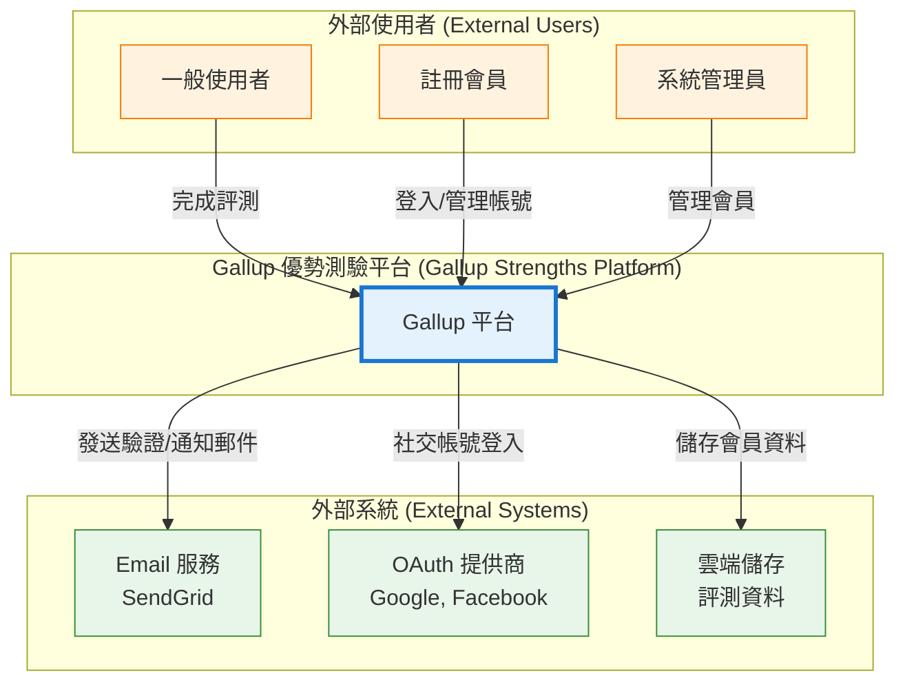
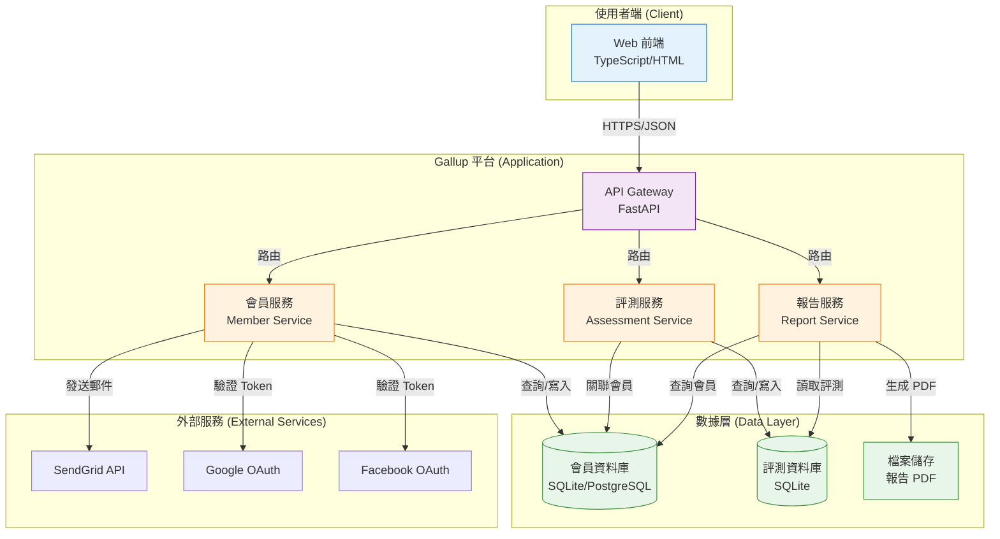
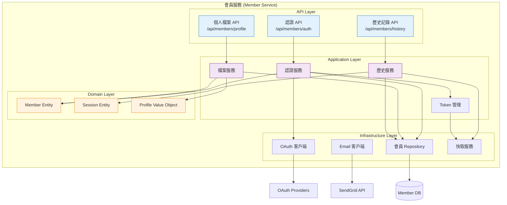
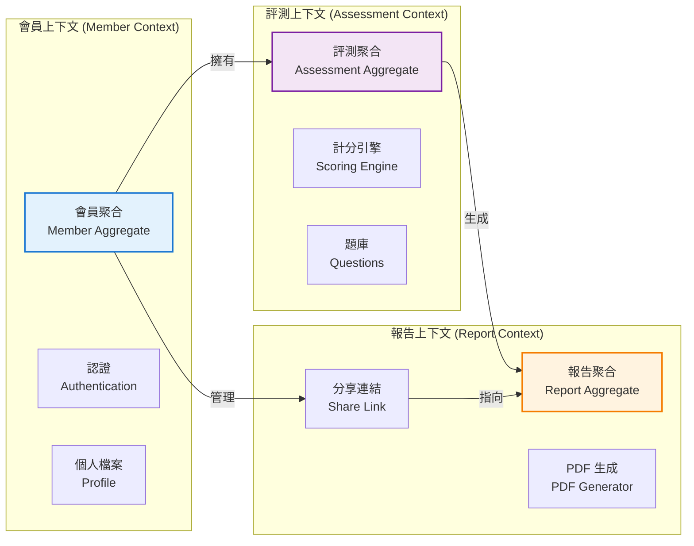
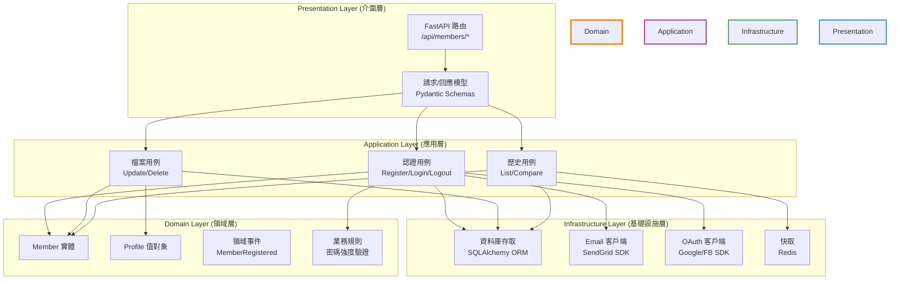
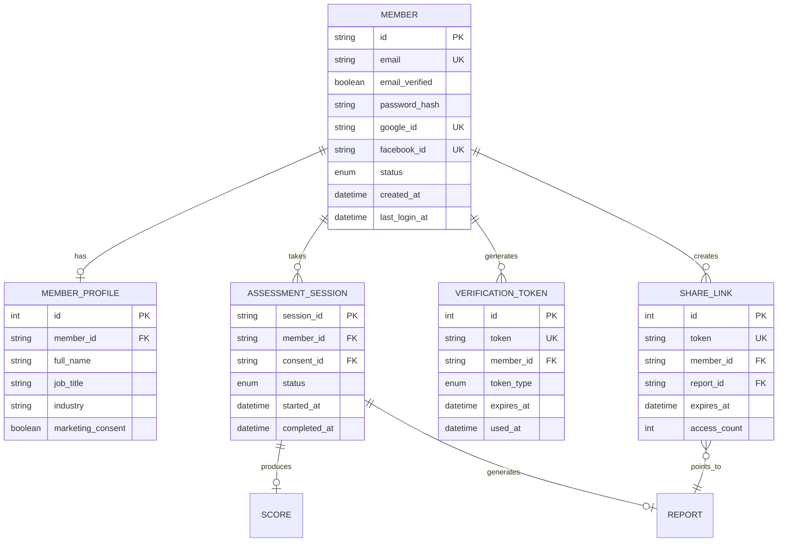
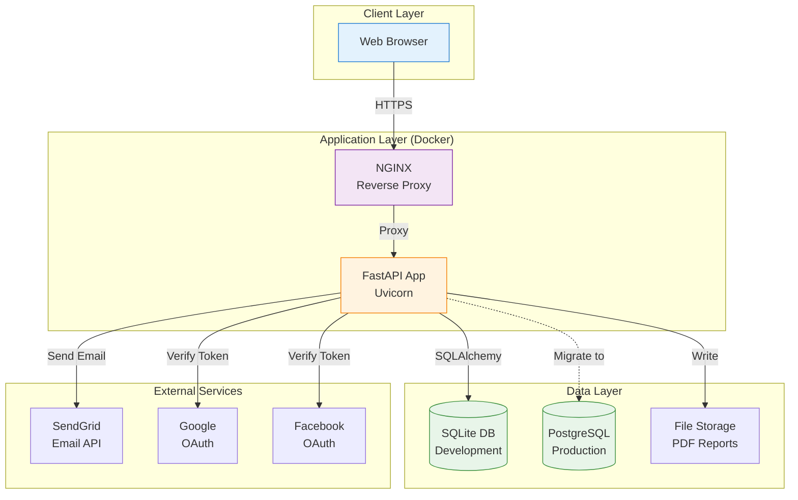

# 整合性架構與設計文件 (Unified Architecture & Design Document) - Gallup 會員系統

---

**文件版本 (Document Version):** `v1.0`
**最後更新 (Last Updated):** `2025-10-03`
**主要作者 (Lead Author):** `技術架構師`
**審核者 (Reviewers):** `架構委員會, 核心開發團隊`
**狀態 (Status):** `草稿 (Draft)`

---

## 目錄 (Table of Contents)

- [第 1 部分:架構總覽 (Architecture Overview)](#第-1-部分架構總覽-architecture-overview)
  - [1.1 C4 模型:視覺化架構](#11-c4-模型視覺化架構)
  - [1.2 DDD 戰略設計 (Strategic DDD)](#12-ddd-戰略設計-strategic-ddd)
  - [1.3 Clean Architecture 分層](#13-clean-architecture-分層)
  - [1.4 技術選型與決策](#14-技術選型與決策)
- [第 2 部分:詳細設計 (Detailed Design)](#第-2-部分詳細設計-detailed-design)
  - [2.1 MVP 與模組優先級](#21-mvp-與模組優先級-mvp--module-priority)
  - [2.2 核心功能:模組設計](#22-核心功能模組設計)
  - [2.3 非功能性需求設計](#23-非功能性需求設計-nfrs-design)
- [第 3 部分:附錄 (Appendix)](#第-3-部分附錄-appendix)

---

**目的**: 本文件旨在將會員系統業務需求轉化為一個完整、內聚的技術藍圖。它從高層次的系統架構（Structure）開始，逐步深入到具體的模組級實現細節（Design），確保系統的穩固性與可維護性。

---

## 第 1 部分:架構總覽 (Architecture Overview)

*此部分關注系統的宏觀結構與指導原則，回答「系統由什麼組成?」以及「它們之間如何互動?」。*

### 1.1 C4 模型:視覺化架構

*我們使用 [C4 模型](https://c4model.com/) 來從不同層次視覺化軟體架構。*

#### L1 - 系統情境圖 (System Context Diagram)



#### L2 - 容器圖 (Container Diagram)



#### L3 - 元件圖 (Component Diagram) - 會員服務內部



### 1.2 DDD 戰略設計 (Strategic DDD)

#### 通用語言 (Ubiquitous Language)

| 術語 | 定義 | 業務含義 |
|:---|:---|:---|
| **Member (會員)** | 註冊並驗證過的平台使用者 | 擁有帳號的使用者，可追蹤歷史評測 |
| **Anonymous User (匿名使用者)** | 未註冊或未登入的使用者 | 可完成評測但無法保存歷史 |
| **Profile (個人檔案)** | 會員的基本資料 (姓名、職稱、產業等) | 用於個人化推薦和報告 |
| **Assessment Session (評測會話)** | 一次完整的評測過程 | 包含題目回答、計分、報告生成 |
| **Assessment History (評測歷史)** | 會員的所有評測記錄 | 用於追蹤成長軌跡 |
| **Verification Token (驗證令牌)** | Email 驗證用的一次性令牌 | 確認 Email 有效性 |
| **Access Token (存取令牌)** | JWT 格式的會員身份憑證 | 用於 API 認證，有效期 7 天 |
| **Refresh Token (刷新令牌)** | 用於獲取新 Access Token 的令牌 | 有效期 30 天，安全儲存 |
| **OAuth Provider (OAuth 提供商)** | 第三方身份認證服務 (Google/Facebook) | 提供社交帳號登入 |
| **Share Link (分享連結)** | 帶時效性的報告存取連結 | 會員可分享給他人查看 |

#### 限界上下文 (Bounded Contexts)



**上下文關係說明:**

1. **會員上下文 (Member Context)**
   - **職責**: 管理會員生命週期 (註冊、登入、檔案管理)
   - **核心實體**: Member, Profile, Session
   - **關係**: 上游 (Upstream) 提供會員身份給評測和報告上下文

2. **評測上下文 (Assessment Context)** - *已存在*
   - **職責**: 管理評測流程、計分、才幹分析
   - **核心實體**: AssessmentSession, Question, Score
   - **關係**: 下游 (Downstream) 依賴會員上下文的身份資訊

3. **報告上下文 (Report Context)** - *已存在*
   - **職責**: 生成、儲存、分享評測報告
   - **核心實體**: Report, ShareLink
   - **關係**: 下游 (Downstream) 依賴會員和評測上下文

**整合策略 (Integration Strategy):**
- **防腐層 (Anti-Corruption Layer)**: 會員上下文透過 ACL 整合現有評測系統
- **共享內核 (Shared Kernel)**: 會員 ID、Session ID 作為共享識別碼

### 1.3 Clean Architecture 分層



**依賴規則 (Dependency Rule):**
- 所有依賴指向內層 (領域層)
- 領域層零外部依賴,純粹業務邏輯
- 基礎設施層實現領域層定義的介面 (依賴倒置)

### 1.4 技術選型與決策

#### 技術選型原則

1. **最小變動原則**: 優先使用現有技術棧,降低學習曲線
2. **雲原生優先**: 優先選擇可水平擴展的技術
3. **安全第一**: 採用業界標準的安全實踐
4. **測試友善**: 選擇易於單元測試的技術和架構

#### 技術棧詳情

| 分類 | 選用技術 | 選擇理由 | 備選方案 | 成熟度 | 相關 ADR |
| :--- | :--- | :--- | :--- | :--- | :--- |
| **後端框架** | Python 3.10 + FastAPI | 與現有評測系統一致,高性能異步框架,自動 API 文件生成 | Flask: 太基礎需大量手動配置<br/>Django: 過於龐大,不適合微服務 | 成熟 (Mature) | ADR-M001 |
| **ORM** | SQLAlchemy 2.0 | 現有專案已使用,強大的查詢能力,支援多種資料庫 | Tortoise ORM: 異步但生態較小<br/>Peewee: 功能較弱 | 成熟 (Mature) | ADR-M002 |
| **資料庫** | SQLite (MVP) → PostgreSQL (Production) | 開發快速,零配置,未來可無縫遷移至 PG | MySQL: 功能相似但 JSON 支援較弱<br/>MongoDB: 無事務保證,不適合財務敏感數據 | 成熟 (Mature) | ADR-M003 |
| **認證機制** | JWT (Access + Refresh Token) | 無狀態,易於水平擴展,標準化 | Session Cookie: 需要狀態儲存<br/>OAuth2 Server: 過度複雜 | 成熟 (Mature) | ADR-M004 |
| **密碼加密** | bcrypt (cost factor=12) | 業界標準,抗暴力破解,自動加鹽 | Argon2: 更安全但 Python 生態支援較少<br/>PBKDF2: 較舊 | 成熟 (Mature) | ADR-M005 |
| **Email 服務** | SendGrid API | 高到達率,交易郵件專用,詳細分析 | AWS SES: 配置複雜<br/>Mailgun: 功能相似但價格較高 | 成熟 (Mature) | ADR-M006 |
| **OAuth 提供商** | Google OAuth 2.0, Facebook Login | 使用者基數大,官方 SDK 完整 | GitHub: 技術社群導向,非主流<br/>Apple: iOS 限定 | 成熟 (Mature) | ADR-M007 |
| **快取** | Redis (可選,Post-MVP) | 高效能,支援 TTL,可作為 Session Store | Memcached: 功能較少<br/>In-Memory: 無法跨實例共享 | 成熟 (Mature) | ADR-M008 |
| **前端框架** | 原生 TypeScript + 現有 HTML/CSS | 與現有系統一致,避免引入複雜框架 | React: 學習曲線陡峭<br/>Vue: 過度複雜 | 成熟 (Mature) | - |
| **API 文件** | OpenAPI 3.0 (FastAPI 自動生成) | 自動化,與程式碼同步,互動式測試 | Swagger: FastAPI 已內建<br/>手動維護: 容易過時 | 成熟 (Mature) | - |

---

## 第 2 部分:詳細設計 (Detailed Design)

*此部分關注具體模組的實現細節，回答「每個部分如何工作?」。*

### 2.1 MVP 與模組優先級 (MVP & Module Priority)

#### Sprint 分配 (6 週計畫)

**Sprint 1 (Week 1-2): 基礎認證系統**
- 🔥 P0: 會員資料模型設計與實作
- 🔥 P0: Email 註冊/登入 API
- 🔥 P0: JWT Token 生成與驗證
- 🔥 P0: 密碼加密與驗證
- 🔴 P1: Email 驗證流程
- 🔴 P1: 密碼找回功能

**Sprint 2 (Week 3): 社交登入整合**
- 🔥 P0: Google OAuth 整合
- 🔴 P1: Facebook OAuth 整合
- 🟡 P2: OAuth 帳號綁定/解綁

**Sprint 3 (Week 4): 個人檔案管理**
- 🔥 P0: 檔案 CRUD API
- 🔥 P0: 隱私設定管理
- 🔴 P1: 帳號刪除功能 (GDPR)
- 🟡 P2: 個人化偏好設定

**Sprint 4 (Week 5): 評測歷史整合**
- 🔥 P0: 歷史評測列表 API
- 🔥 P0: 評測結果與會員關聯
- 🔥 P0: 報告下載權限控制
- 🔴 P1: 分享連結生成與管理

**Sprint 5 (Week 6): 會員儀表板與優化**
- 🔥 P0: 儀表板 API (摘要統計)
- 🔴 P1: 前端會員頁面整合
- 🔴 P1: 效能優化 (查詢/快取)
- 🟡 P2: 監控與日誌完善

**Post-MVP:**
- 🟡 P2: 評測結果對比分析
- 🟡 P2: 團隊管理功能
- 🟡 P2: 訂閱制付費系統

### 2.2 核心功能:模組設計

#### 模組 1: 認證服務 (Authentication Service)

**對應 PRD**: US-M001, US-M002, US-M003, US-M004

**職責 (Responsibility)**:
- 處理會員註冊、登入、登出
- 管理 Email 驗證流程
- 整合社交帳號登入 (OAuth)
- 密碼找回與重設
- JWT Token 生成與驗證

**API 設計**:

```
POST   /api/members/auth/register          # 註冊新會員
POST   /api/members/auth/login             # Email 登入
POST   /api/members/auth/login/google      # Google OAuth 登入
POST   /api/members/auth/login/facebook    # Facebook OAuth 登入
POST   /api/members/auth/logout            # 登出
POST   /api/members/auth/refresh           # 刷新 Token
GET    /api/members/auth/verify/{token}    # 驗證 Email
POST   /api/members/auth/password/forgot   # 忘記密碼
POST   /api/members/auth/password/reset    # 重設密碼
```

詳細規格見: [API 設計規格文件](./06_member_system_api_spec.md)

**資料模型 (Data Model)**:

```python
class Member(Base):
    """會員實體"""
    __tablename__ = "members"

    # 主鍵
    id = Column(String(36), primary_key=True, default=uuid4)

    # 認證資訊
    email = Column(String(255), unique=True, nullable=False, index=True)
    email_verified = Column(Boolean, default=False, nullable=False)
    email_verified_at = Column(DateTime, nullable=True)
    password_hash = Column(String(255), nullable=True)  # OAuth 用戶可為空

    # 社交帳號
    google_id = Column(String(100), unique=True, nullable=True, index=True)
    facebook_id = Column(String(100), unique=True, nullable=True, index=True)

    # 會員狀態
    status = Column(Enum("active", "suspended", "deleted"), default="active")

    # 時間戳記
    created_at = Column(DateTime, default=func.now(), nullable=False)
    updated_at = Column(DateTime, default=func.now(), onupdate=func.now())
    last_login_at = Column(DateTime, nullable=True)

    # 關聯
    profile = relationship("MemberProfile", back_populates="member", uselist=False)
    sessions = relationship("AssessmentSession", back_populates="member")

class MemberProfile(Base):
    """會員檔案 (Value Object)"""
    __tablename__ = "member_profiles"

    id = Column(Integer, primary_key=True, autoincrement=True)
    member_id = Column(String(36), ForeignKey("members.id"), unique=True)

    # 個人資料
    full_name = Column(String(100), nullable=True)
    display_name = Column(String(50), nullable=True)
    job_title = Column(String(100), nullable=True)
    industry = Column(String(50), nullable=True)
    company = Column(String(100), nullable=True)

    # 隱私設定
    marketing_consent = Column(Boolean, default=False)
    research_consent = Column(Boolean, default=False)

    updated_at = Column(DateTime, default=func.now(), onupdate=func.now())

    # 關聯
    member = relationship("Member", back_populates="profile")

class VerificationToken(Base):
    """驗證令牌 (Email 驗證/密碼重設)"""
    __tablename__ = "verification_tokens"

    id = Column(Integer, primary_key=True, autoincrement=True)
    token = Column(String(64), unique=True, index=True, nullable=False)
    member_id = Column(String(36), ForeignKey("members.id"), nullable=False)
    token_type = Column(Enum("email_verification", "password_reset"))

    expires_at = Column(DateTime, nullable=False)
    used_at = Column(DateTime, nullable=True)
    created_at = Column(DateTime, default=func.now())
```

**關鍵演算法/邏輯**:

1. **密碼加密 (Password Hashing)**:
```python
import bcrypt

def hash_password(plain_password: str) -> str:
    """使用 bcrypt 加密密碼 (cost factor=12)"""
    salt = bcrypt.gensalt(rounds=12)
    return bcrypt.hashpw(plain_password.encode('utf-8'), salt).decode('utf-8')

def verify_password(plain_password: str, hashed_password: str) -> bool:
    """驗證密碼"""
    return bcrypt.checkpw(
        plain_password.encode('utf-8'),
        hashed_password.encode('utf-8')
    )
```

2. **JWT Token 生成**:
```python
from jose import jwt
from datetime import datetime, timedelta

SECRET_KEY = os.getenv("JWT_SECRET_KEY")
ALGORITHM = "HS256"

def create_access_token(member_id: str, expires_delta: timedelta = None):
    """生成 Access Token (預設 7 天)"""
    if expires_delta is None:
        expires_delta = timedelta(days=7)

    expire = datetime.utcnow() + expires_delta
    payload = {
        "sub": member_id,
        "exp": expire,
        "type": "access"
    }
    return jwt.encode(payload, SECRET_KEY, algorithm=ALGORITHM)

def create_refresh_token(member_id: str):
    """生成 Refresh Token (30 天)"""
    expire = datetime.utcnow() + timedelta(days=30)
    payload = {
        "sub": member_id,
        "exp": expire,
        "type": "refresh"
    }
    return jwt.encode(payload, SECRET_KEY, algorithm=ALGORITHM)
```

3. **Email 驗證流程**:
```
[註冊] → [生成驗證 Token] → [發送驗證郵件] → [使用者點擊連結] → [驗證 Token] → [標記 Email 已驗證]
```

#### 模組 2: 個人檔案服務 (Profile Service)

**對應 PRD**: US-M005, US-M006

**職責**:
- 會員個人資料 CRUD
- 隱私偏好管理
- 帳號刪除 (GDPR 合規)

**API 設計**:
```
GET    /api/members/profile             # 查看個人檔案
PUT    /api/members/profile             # 更新個人檔案
PATCH  /api/members/profile/privacy    # 更新隱私設定
DELETE /api/members/account             # 刪除帳號
```

**資料刪除策略 (GDPR 合規)**:
- **軟刪除**: Member.status = "deleted"
- **資料匿名化**: 保留評測統計數據但移除個人識別資訊
- **硬刪除**: 30 天後永久刪除會員及相關資料

#### 模組 3: 評測歷史服務 (Assessment History Service)

**對應 PRD**: US-M007, US-M008, US-M009

**職責**:
- 查詢會員的所有評測記錄
- 生成歷史報告存取連結
- 評測結果對比分析 (Post-MVP)

**API 設計**:
```
GET    /api/members/assessments          # 評測歷史列表
GET    /api/members/assessments/{id}     # 特定評測詳情
POST   /api/members/assessments/{id}/share # 生成分享連結
DELETE /api/members/shares/{token}       # 撤銷分享連結
```

**整合現有系統**:
```python
# 現有 AssessmentSession 模型擴展
class AssessmentSession(Base):
    # ... 現有欄位 ...

    # 新增會員關聯 (可為空,支援匿名評測)
    member_id = Column(String(36), ForeignKey("members.id"), nullable=True, index=True)

    # 關聯
    member = relationship("Member", back_populates="sessions")
```

### 2.3 非功能性需求設計 (NFRs Design)

#### 性能 (Performance)

**目標**: API P95 延遲 <200ms

**實現策略**:
1. **資料庫查詢優化**:
   - 所有外鍵建立索引
   - 複合索引: `(member_id, created_at)` 用於歷史查詢
   - 使用 `SELECT` 明確欄位,避免 `SELECT *`

2. **快取策略 (Post-MVP)**:
   - 會員檔案快取 (TTL 30 分鐘)
   - 評測統計快取 (TTL 1 小時)
   - 使用 Redis 作為快取層

3. **非同步處理**:
   - Email 發送異步化 (Background Task)
   - 報告生成異步化

#### 安全性 (Security)

**目標**: 符合 OWASP Top 10 防護

**實現策略**:

1. **認證與授權**:
   - JWT Token 使用 HTTP-only Cookie 儲存
   - CSRF Token 保護
   - 所有 API 強制 HTTPS

2. **密碼安全**:
   - bcrypt (cost factor ≥12)
   - 密碼強度驗證 (≥8 字元, 含大小寫+數字)
   - 防暴力破解: 登入失敗 5 次鎖定 15 分鐘

3. **輸入驗證**:
   - Pydantic 模型自動驗證
   - SQL Injection 防護 (ORM 參數化查詢)
   - XSS 防護 (輸出編碼)

4. **隱私保護**:
   - 敏感資料加密儲存
   - 完整審計軌跡 (WHO, WHAT, WHEN)
   - GDPR 資料匯出/刪除功能

#### 可擴展性 (Scalability)

**目標**: 支援 500 並發使用者

**實現策略**:
1. **無狀態設計**: 所有服務無狀態,可水平擴展
2. **資料庫連接池**: SQLAlchemy Pool (min=5, max=20)
3. **非同步 I/O**: FastAPI 異步處理請求

---

## 第 3 部分:附錄 (Appendix)

### 資料庫 ER 圖 (Entity-Relationship Diagram)



### 部署架構圖 (Deployment Architecture)



---

**文件審核記錄 (Review History):**

| 日期 | 審核人 | 版本 | 變更摘要/主要反饋 |
| :--- | :--- | :--- | :--- |
| 2025-10-03 | 技術架構師 | v1.0 | 初稿完成,待架構委員會審核 |

---

**下一步行動**:
1. 審核本架構設計文件
2. 制定 API 設計規範 (OpenAPI Specification)
3. 建立資料庫遷移腳本
4. 啟動 Sprint 1 開發

---

*本文件遵循 VibeCoding 開發流程規範與 Clean Architecture 原則,為會員系統建立了清晰的技術藍圖。*
