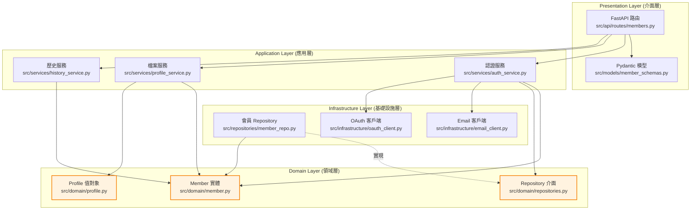
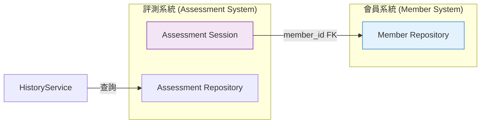

# 模組依賴關係分析 - Gallup 會員系統

---

**文件版本:** `v1.0`
**最後更新:** `2025-10-03`
**主要作者:** `技術架構師`
**狀態:** `草稿 (Draft)`

---

## 1. 概述

### 1.1 文檔目的
本文檔分析 **Gallup 會員系統** 的內部模組與外部套件依賴關係,確保:
- 遵循 Clean Architecture 依賴規則
- 避免循環依賴
- 便於單元測試與維護

### 1.2 分析範圍
- **分析層級**: 模組級 (Module-level)
- **包含範圍**: 會員系統內部依賴 + 外部套件依賴
- **排除項目**: Python 標準庫

---

## 2. 核心依賴原則

### 依賴倒置原則 (DIP)
✅ **領域層** 定義介面 (Repository Interface)
✅ **基礎設施層** 實現介面 (SQLAlchemy Repository)
✅ **應用層** 依賴介面,不依賴實現

### 無循環依賴原則 (ADP)
✅ 所有 import 形成有向無環圖 (DAG)
✅ 絕不允許 `module_a` ↔ `module_b` 雙向依賴

### 穩定依賴原則 (SDP)
✅ 領域層 (最穩定) ← 應用層 ← 基礎設施層 (最不穩定)

---

## 3. 高層級模組依賴

### 3.1 分層架構依賴圖



---

## 4. 模組職責定義

| 層級/模組 | 主要職責 | 程式碼路徑 |
|:---|:---|:---|
| **API 路由** | 處理 HTTP 請求,路由至服務層 | `src/main/python/api/routes/members.py` |
| **Pydantic 模型** | 請求/回應驗證與序列化 | `src/main/python/models/member_schemas.py` |
| **認證服務** | 註冊/登入/Token 管理 | `src/main/python/services/auth_service.py` |
| **檔案服務** | 個人檔案 CRUD | `src/main/python/services/profile_service.py` |
| **歷史服務** | 評測歷史查詢與整合 | `src/main/python/services/history_service.py` |
| **Member 實體** | 會員核心業務邏輯 | `src/main/python/domain/member.py` |
| **Profile 值對象** | 個人檔案不可變值 | `src/main/python/domain/profile.py` |
| **Repository 介面** | 資料存取抽象介面 | `src/main/python/domain/repositories.py` |
| **會員 Repository** | SQLAlchemy 實現 | `src/main/python/repositories/member_repo.py` |
| **Email 客戶端** | SendGrid 封裝 | `src/main/python/infrastructure/email_client.py` |
| **OAuth 客戶端** | Google/Facebook OAuth | `src/main/python/infrastructure/oauth_client.py` |

---

## 5. 詳細依賴分析

### 5.1 認證服務依賴路徑

**場景**: 使用者註冊流程

```
API 路由 (/api/members/auth/register)
  ↓ 調用
認證服務 (AuthService.register)
  ↓ 使用
Member 實體 (創建新會員)
  ↓ 透過介面
Member Repository (儲存至資料庫)
  ↓ 發送
Email 客戶端 (發送驗證郵件)
```

**Python Import 關係**:
```python
# src/api/routes/members.py
from src.services.auth_service import AuthService
from src.models.member_schemas import RegisterRequest

# src/services/auth_service.py
from src.domain.member import Member
from src.domain.repositories import MemberRepository  # 介面
from src.infrastructure.email_client import EmailClient

# src/repositories/member_repo.py
from src.domain.member import Member
from src.domain.repositories import MemberRepository  # 實現介面
```

**驗證**: ✅ 符合單向依賴,無循環

---

### 5.2 個人檔案服務依賴路徑

**場景**: 更新個人檔案

```
API 路由 (/api/members/profile)
  ↓ 調用
檔案服務 (ProfileService.update)
  ↓ 使用
Member 實體 (更新檔案)
  ↓ 透過介面
Member Repository (儲存變更)
```

**驗證**: ✅ 符合單向依賴

---

### 5.3 整合現有評測系統

**會員系統與評測系統整合**:



**整合策略**:
- **防腐層 (ACL)**: 歷史服務透過 ACL 整合評測系統
- **共享鍵**: `member_id` 作為外鍵關聯

---

## 6. 依賴風險管理

### 6.1 潛在循環依賴檢查

**檢測工具**: `pydeps` (定期掃描)

```bash
# 安裝工具
pip install pydeps

# 檢查循環依賴
pydeps src/main/python/services/ --show-cycles
```

**預防措施**:
1. Code Review 嚴格檢查 import
2. CI/CD 整合 `pydeps` 自動檢測
3. 使用依賴倒置避免雙向依賴

### 6.2 不穩定依賴管理

**識別**: OAuth SDK (經常更新)

**隔離策略**:
```python
# 封裝 Google OAuth SDK
class GoogleOAuthClient:
    """適配器模式封裝 Google SDK"""
    def verify_token(self, id_token: str) -> dict:
        # 內部使用 google-auth 套件
        # 外部僅暴露穩定介面
        pass
```

**優點**:
- SDK 變更僅影響適配器內部
- 服務層依賴穩定介面,不受 SDK 影響

---

## 7. 外部依賴管理

### 7.1 生產依賴清單

| 套件 | 版本 | 用途 | 風險 | 更新策略 |
|:---|:---|:---|:---|:---|
| `fastapi` | ^0.104.0 | Web 框架 | 低 (穩定) | 次版本自動更新 |
| `sqlalchemy` | ^2.0.22 | ORM | 低 (成熟) | 手動更新 |
| `pydantic` | ^2.5.0 | 資料驗證 | 低 (穩定) | 次版本自動更新 |
| `python-jose` | ^3.3.0 | JWT Token | 中 (安全相關) | 每月檢查更新 |
| `bcrypt` | ^4.1.1 | 密碼加密 | 中 (安全相關) | 每月檢查更新 |
| `sendgrid` | ^6.11.0 | Email 服務 | 中 (外部 API) | 季度更新 |
| `google-auth` | ^2.25.0 | Google OAuth | 中 (外部 API) | 季度更新 |

### 7.2 開發依賴清單

| 套件 | 版本 | 用途 | 備註 |
|:---|:---|:---|:---|
| `pytest` | ^7.4.3 | 測試框架 | 自動更新 |
| `pytest-cov` | ^4.1.0 | 測試覆蓋率 | 自動更新 |
| `black` | ^23.12.0 | 程式碼格式化 | 自動更新 |
| `mypy` | ^1.7.1 | 型別檢查 | 自動更新 |
| `pip-audit` | ^2.6.1 | 安全掃描 | 每週執行 |

### 7.3 依賴更新策略

**工具**: Dependabot (GitHub) + pip-audit

**流程**:
1. **Dependabot** 每週檢查更新
2. **pip-audit** CI/CD 自動掃描漏洞
3. **高危漏洞**: 24 小時內修復
4. **中危漏洞**: 7 天內修復
5. **次版本更新**: 測試通過自動合併

---

## 8. 檔案結構與依賴關係

### 8.1 專案檔案樹

```
src/main/python/
├── api/
│   └── routes/
│       └── members.py         # FastAPI 路由
├── models/
│   ├── database.py            # SQLAlchemy 模型 (擴展現有)
│   └── member_schemas.py      # Pydantic 請求/回應模型
├── services/
│   ├── auth_service.py        # 認證服務
│   ├── profile_service.py     # 檔案服務
│   └── history_service.py     # 歷史服務
├── domain/
│   ├── member.py              # Member 實體
│   ├── profile.py             # Profile 值對象
│   └── repositories.py        # Repository 介面
├── repositories/
│   └── member_repo.py         # SQLAlchemy Repository 實現
├── infrastructure/
│   ├── email_client.py        # SendGrid 客戶端
│   └── oauth_client.py        # OAuth 客戶端
└── utils/
    ├── token.py               # JWT Token 工具
    └── password.py            # bcrypt 工具
```

### 8.2 Import 規則

**嚴格遵守**:
```python
# ✅ 允許 (向內層依賴)
from src.domain.member import Member  # 應用層 → 領域層
from src.services.auth_service import AuthService  # API 層 → 應用層

# ❌ 禁止 (向外層依賴)
from src.api.routes.members import *  # 領域層不可依賴 API 層
from src.services.auth_service import *  # 領域層不可依賴應用層
```

---

## 9. 測試策略與依賴

### 9.1 單元測試依賴

**Mock 外部依賴**:
```python
# 測試認證服務時 Mock Repository 與 Email Client
def test_register():
    mock_repo = Mock(spec=MemberRepository)
    mock_email = Mock(spec=EmailClient)

    service = AuthService(repo=mock_repo, email=mock_email)
    result = service.register(email="test@example.com", password="Pass123")

    assert result.success
    mock_repo.save.assert_called_once()
    mock_email.send_verification.assert_called_once()
```

**優點**: 領域層與應用層可獨立測試,不依賴資料庫與外部服務

---

## 10. 使用指南

### 10.1 新增模組時

**檢查清單**:
1. 確認模組屬於哪一層 (領域/應用/基礎設施)
2. 檢查 import 是否符合依賴規則
3. 執行 `pydeps` 確認無循環依賴
4. 撰寫單元測試,使用 Mock 隔離外部依賴

### 10.2 重構時

1. 先畫出現有依賴圖
2. 識別循環依賴與不當依賴
3. 使用依賴倒置 (介面) 打破循環
4. 逐步重構,每步確保測試通過

---

**文件審核記錄**:

| 日期 | 審核人 | 版本 | 變更摘要 |
|:---|:---|:---|:---|
| 2025-10-03 | 技術架構師 | v1.0 | 初稿完成 |

---

*本文件遵循 Clean Architecture 與依賴管理最佳實踐,確保系統可維護性。*
