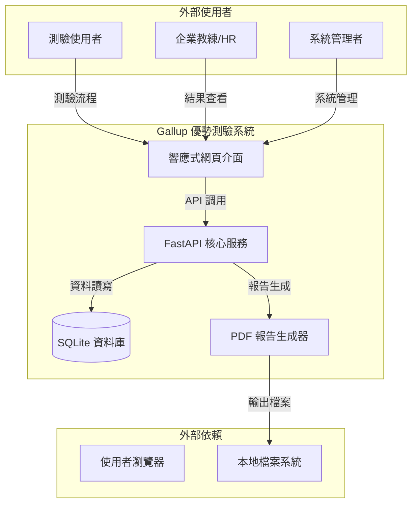
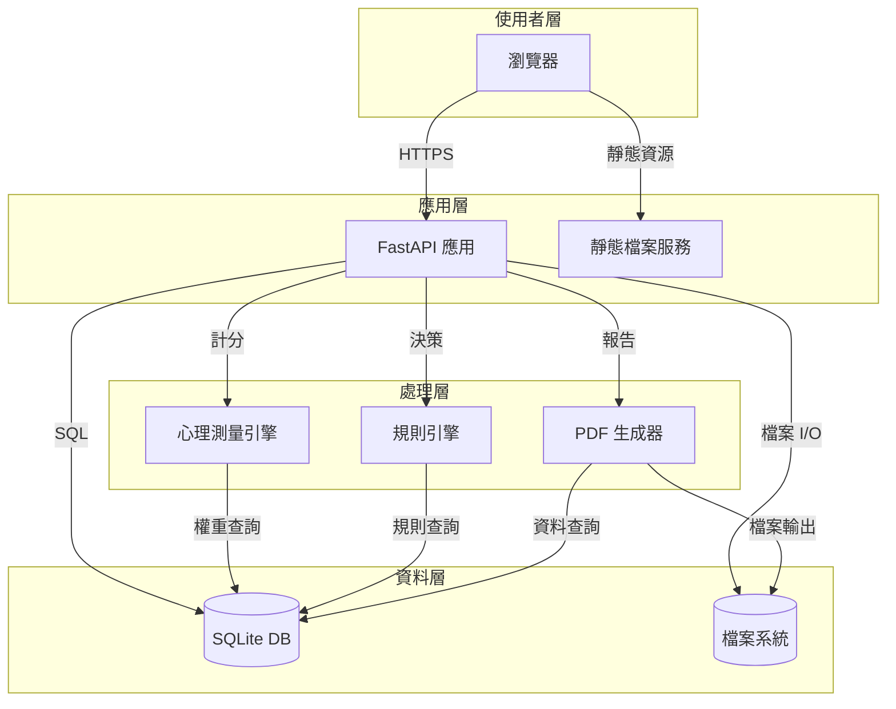
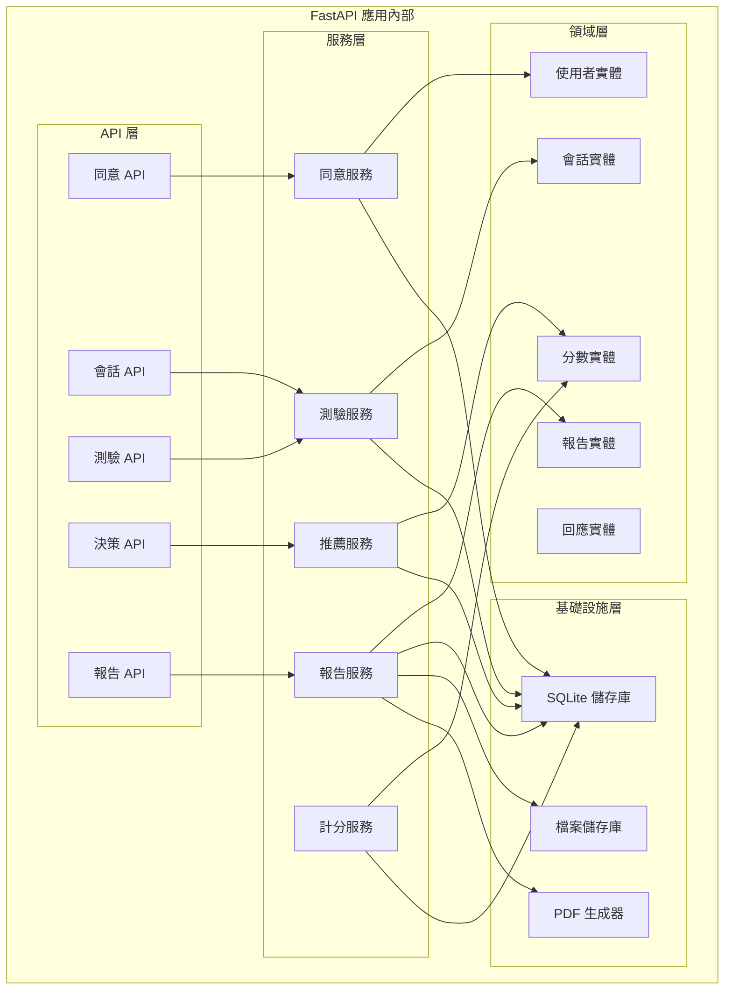
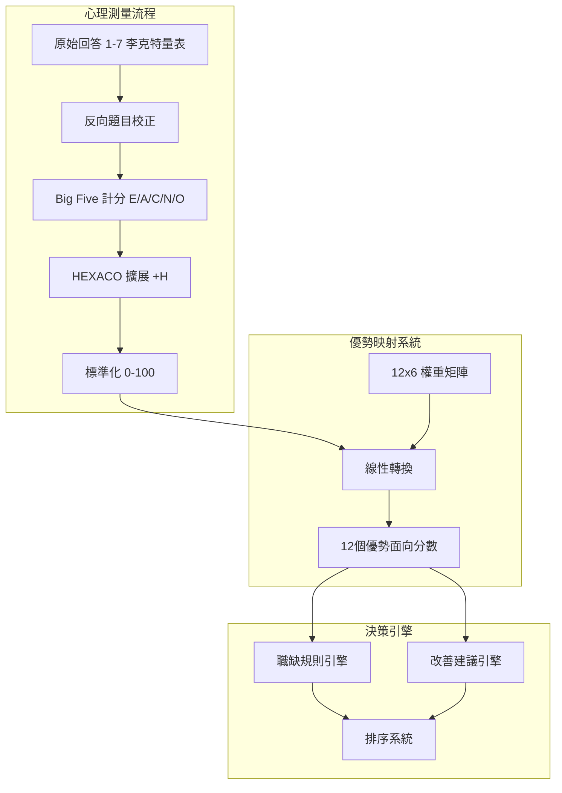
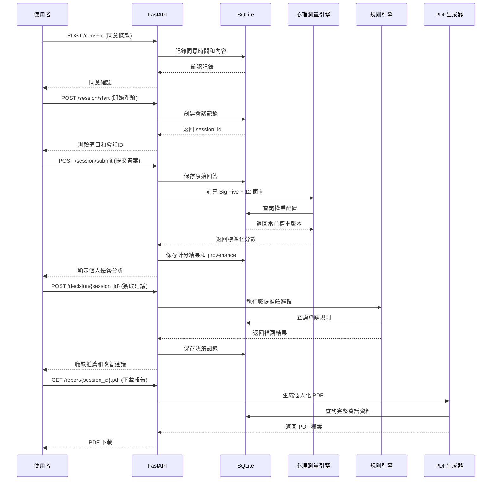

# 整合性架構與設計文件 - Gallup 優勢測驗

---

**文件版本 (Document Version):** `v1.0`
**最後更新 (Last Updated):** `2025-09-25`
**主要作者 (Lead Author):** `TaskMaster Hub (AI Architecture Analyst)`
**審核者 (Reviewers):** `Sunny (Project Lead), Claude Code AI`
**狀態 (Status):** `草稿 (Draft) - Phase 2 文檔生成`

---

## 目錄 (Table of Contents)

- [第 1 部分：架構總覽](#第-1-部分架構總覽-architecture-overview)
  - [1.1 系統情境與目標](#11-系統情境與目標)
  - [1.2 架構指導原則](#12-架構指導原則)
  - [1.3 技術選型決策](#13-技術選型決策)
- [第 2 部分：系統架構設計](#第-2-部分系統架構設計)
  - [2.1 C4 模型：分層架構視圖](#21-c4-模型分層架構視圖)
  - [2.2 心理測量系統核心](#22-心理測量系統核心)
  - [2.3 資料流與狀態管理](#23-資料流與狀態管理)
- [第 3 部分：詳細設計](#第-3-部分詳細設計)
  - [3.1 MVP 模組優先級](#31-mvp-模組優先級)
  - [3.2 核心模組設計](#32-核心模組設計)
  - [3.3 非功能性需求實現](#33-非功能性需求實現)

---

**目的**: 本文件將 Gallup 優勢測驗的業務需求轉化為完整的技術架構藍圖，重點關注心理測量學的準確性、系統的可解釋性，以及 4 週 MVP 的可實現性。

---

## 第 1 部分：架構總覽 (Architecture Overview)

### 1.1 系統情境與目標

**系統類型**: 心理測量與決策支援系統
**核心價值**: 將公領域人格量表轉化為可執行的決策建議



### 1.2 架構指導原則

**1. 心理測量學優先 (Psychometrics First)**
- 所有計分演算法必須可追蹤和可解釋
- 權重系統可配置和版本控制
- 測驗信效度可驗證

**2. MVP 務實主義 (MVP Pragmatism)**
- 單機部署，SQLite 滿足初期需求
- 同步處理，避免複雜的異步架構
- 簡單可靠，優於過度設計

**3. 可解釋性設計 (Explainability by Design)**
- 每個建議都可回溯到具體分數和規則
- 完整 Provenance 追蹤
- 審計軌跡完整記錄

**4. 隱私與合規 (Privacy & Compliance)**
- 資料最小化原則
- 明確同意機制
- 限時分享和自動清理

### 1.3 技術選型決策

| 技術領域 | 選用技術 | 選擇理由 | 風險與緩解 |
|----------|----------|----------|------------|
| **後端框架** | FastAPI (Python 3.11+) | • 快速開發和自動文檔<br>• 豐富的科學計算生態<br>• 類型安全和異步支援 | • 風險: Python GIL 限制<br>• 緩解: 單機 MVP 足夠 |
| **資料庫** | SQLite (WAL 模式) | • 零配置部署<br>• 事務 ACID 保證<br>• 檔案級備份簡單 | • 風險: 並發限制<br>• 緩解: 適合 MVP 規模 |
| **前端** | 響應式 HTML + 原生 JS | • 簡單可靠<br>• 無複雜 build 過程<br>• 跨瀏覽器相容 | • 風險: 開發效率<br>• 緩解: MVP 功能簡單 |
| **PDF 生成** | ReportLab (Python) | • 強大的 PDF 生成能力<br>• Python 生態整合<br>• 中文支援良好 | • 風險: 記憶體消耗<br>• 緩解: 同步生成可控 |

---

## 第 2 部分：系統架構設計

### 2.1 C4 模型：分層架構視圖

**Level 2 - 容器圖 (Container Diagram)**



**Level 3 - 元件圖 (Component Diagram)**



### 2.2 心理測量系統核心

**計分引擎架構**



**12 個優勢面向權重系統**

```python
# 權重矩陣範例 (簡化)
STRENGTH_WEIGHTS = {
    "結構化執行": {"C": +0.50, "N": -0.30, "A": +0.10, "E": 0, "O": 0, "H": 0},
    "品質與完備": {"C": +0.40, "A": +0.30, "N": -0.25, "E": 0, "O": +0.05, "H": 0},
    "探索與創新": {"O": +0.55, "E": +0.25, "N": -0.10, "C": -0.05, "A": 0, "H": 0},
    "分析與洞察": {"O": +0.50, "N": -0.20, "C": +0.15, "E": 0, "A": 0, "H": +0.05},
    "影響與倡議": {"E": +0.55, "N": -0.25, "O": +0.10, "C": 0, "A": 0, "H": 0},
    "協作與共好": {"A": +0.45, "H": +0.30, "E": +0.15, "N": -0.10, "C": 0, "O": 0},
    # ... 其餘 6 個面向
}
```

### 2.3 資料流與狀態管理

**核心資料流程**



---

## 第 3 部分：詳細設計 (Detailed Design)

### 3.1 MVP 模組優先級

**Week 1: 基礎架構模組 (P0 - 必須)**
- `ConsentModule`: 隱私同意和資料治理
- `SessionModule`: 測驗會話管理
- `AssessmentModule`: Mini-IPIP 測驗引擎
- `DatabaseModule`: SQLite 資料存取層

**Week 2: 計分引擎模組 (P0 - 必須)**
- `ScoringModule`: Big Five/HEXACO 計分
- `StrengthModule`: 12 面向優勢映射
- `ProvenanceModule`: 可解釋性追蹤
- `ValidationModule`: 資料驗證和清理

**Week 3: 決策系統模組 (P0 - 必須)**
- `RuleEngineModule`: 職缺推薦規則
- `RecommendationModule`: 改善建議系統
- `ReportModule`: PDF 報告生成
- `SharingModule`: 一次性分享機制

**Week 4: 品質保證模組 (P1 - 重要)**
- `AuditModule`: 審計軌跡
- `MonitoringModule`: 系統監控
- `TestModule`: 端到端測試
- `DeploymentModule`: 部署自動化

### 3.2 核心模組設計

#### 模組: ScoringModule (計分引擎)

**職責**: 將使用者的 Mini-IPIP 回答轉換為標準化的優勢面向分數

**核心演算法流程**:
```python
def calculate_strength_scores(responses: List[int], instrument_version: str) -> Dict[str, Any]:
    """
    計算優勢面向分數的核心演算法

    Args:
        responses: 1-7 李克特量表回答 (20題)
        instrument_version: 使用的量表版本

    Returns:
        包含分數、權重版本、計算時間的完整結果
    """
    # Step 1: 反向題目校正
    corrected_responses = apply_reverse_scoring(responses, REVERSE_ITEMS)

    # Step 2: 計算 Big Five 原始分數
    big_five_raw = calculate_big_five_raw(corrected_responses)

    # Step 3: 標準化到 0-100 範圍
    big_five_normalized = normalize_scores(big_five_raw, NORMALIZATION_PARAMS)

    # Step 4: 擴展到 HEXACO (添加 Honesty-Humility)
    hexaco_scores = extend_to_hexaco(big_five_normalized)

    # Step 5: 應用權重矩陣得到 12 個優勢面向
    strength_scores = apply_weight_matrix(hexaco_scores, CURRENT_WEIGHTS)

    # Step 6: 記錄 Provenance
    provenance = {
        "instrument_version": instrument_version,
        "weights_version": WEIGHTS_VERSION,
        "algorithm_version": ALGORITHM_VERSION,
        "calculation_timestamp": datetime.utcnow(),
        "raw_responses": corrected_responses,
        "intermediate_scores": {
            "big_five": big_five_normalized,
            "hexaco": hexaco_scores
        }
    }

    return {
        "strength_scores": strength_scores,
        "provenance": provenance,
        "confidence_intervals": calculate_confidence_intervals(strength_scores)
    }
```

**資料模型設計**:
```sql
-- 計分結果表
CREATE TABLE scores (
    id INTEGER PRIMARY KEY,
    session_id INTEGER REFERENCES sessions(id),

    -- Big Five 分數 (0-100)
    extraversion INTEGER CHECK(extraversion >= 0 AND extraversion <= 100),
    agreeableness INTEGER CHECK(agreeableness >= 0 AND agreeableness <= 100),
    conscientiousness INTEGER CHECK(conscientiousness >= 0 AND conscientiousness <= 100),
    neuroticism INTEGER CHECK(neuroticism >= 0 AND neuroticism <= 100),
    openness INTEGER CHECK(openness >= 0 AND openness <= 100),
    honesty_humility INTEGER CHECK(honesty_humility >= 0 AND honesty_humility <= 100),

    -- 12 個優勢面向分數 (JSON)
    strength_scores JSON NOT NULL,

    -- 可解釋性追蹤 (JSON)
    provenance JSON NOT NULL,

    -- 系統欄位
    created_at DATETIME DEFAULT CURRENT_TIMESTAMP,
    algorithm_version VARCHAR(10) NOT NULL,
    weights_version VARCHAR(10) NOT NULL
);
```

#### 模組: RuleEngineModule (規則引擎)

**職責**: 基於優勢面向分數推薦職缺和改善建議

**規則定義架構**:
```python
@dataclass
class JobRecommendationRule:
    """職缺推薦規則"""
    rule_id: str
    job_category: str
    required_strengths: Dict[str, int]  # 面向名稱 -> 最低分數
    bonus_strengths: Dict[str, float]   # 面向名稱 -> 加權係數
    description: str
    confidence_threshold: float = 0.7

# 範例規則配置
JOB_RULES = [
    JobRecommendationRule(
        rule_id="PM_EXPLORER",
        job_category="產品策略/PM",
        required_strengths={
            "探索與創新": 70,
            "分析與洞察": 60,
            "影響與倡議": 60
        },
        bonus_strengths={
            "學習與成長": 1.2,
            "客戶導向": 1.1
        },
        description="適合探索型產品經理，需要創新思維和影響力"
    ),
    # ... 更多規則
]
```

### 3.3 非功能性需求實現

**性能需求 (Performance)**
- **目標**: 測驗完成 ≤5分鐘，PDF生成 <1秒
- **實現**:
  - SQLite WAL 模式提升並發性能
  - 權重矩陣預載入記憶體
  - PDF 模板預編譯
  - 計分演算法向量化計算

**安全性 (Security)**
- **目標**: 資料最小化、同意記錄、審計軌跡
- **實現**:
  - 所有 API 端點輸入驗證
  - SQL 注入防護 (參數化查詢)
  - 敏感資料欄位加密存儲
  - 完整操作日誌記錄

**可解釋性 (Explainability)**
- **目標**: 所有建議可回溯到分數權重和規則
- **實現**:
  - 完整 Provenance 鏈追蹤
  - 權重和規則版本控制
  - 決策過程 JSON 記錄
  - 圖形化解釋介面

**可擴展性準備 (Scalability Readiness)**
- **目標**: 架構支援未來水平擴展
- **實現**:
  - 無狀態 API 設計
  - 資料庫抽象層 (Repository Pattern)
  - 配置外部化
  - 容器化部署準備

---

## 風險評估與緩解策略

| 風險類別 | 具體風險 | 可能性 | 影響 | 緩解措施 |
|----------|----------|--------|------|----------|
| **技術風險** | SQLite 並發限制影響多用戶 | 中 | 中 | WAL 模式 + 連接池管理 |
| **業務風險** | 12 面向權重缺乏心理學驗證 | 高 | 高 | 文獻調研 + A/B 測試 |
| **時程風險** | 4週時程過於緊湊 | 中 | 高 | MVP 範圍嚴格控制 |
| **合規風險** | 隱私條款不符合 GDPR | 低 | 高 | 法務顧問審查 |

---

**架構審查檢查清單**:
- [ ] 心理測量學演算法是否可驗證？
- [ ] 系統可解釋性是否完整？
- [ ] 4週 MVP 範圍是否可行？
- [ ] 非功能性需求是否有明確實現方案？
- [ ] 風險緩解措施是否充分？

**由 TaskMaster Phase 2 架構生成系統產生** 🏗️🤖