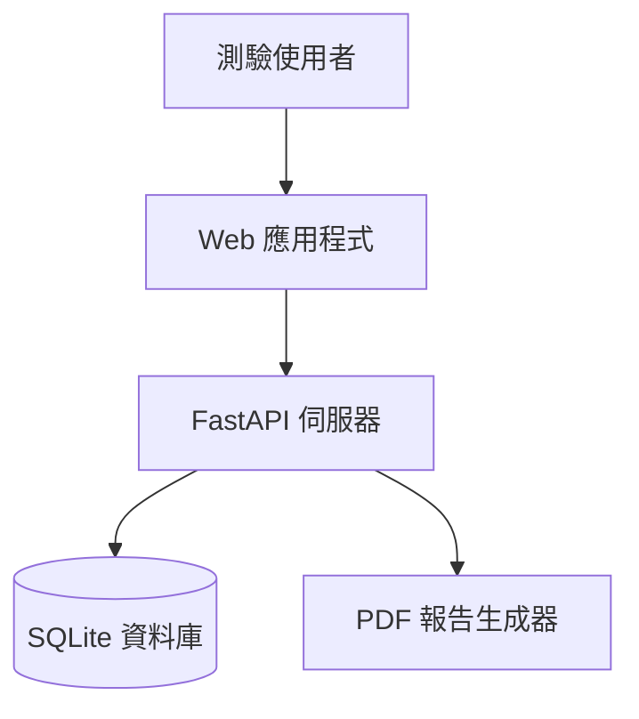
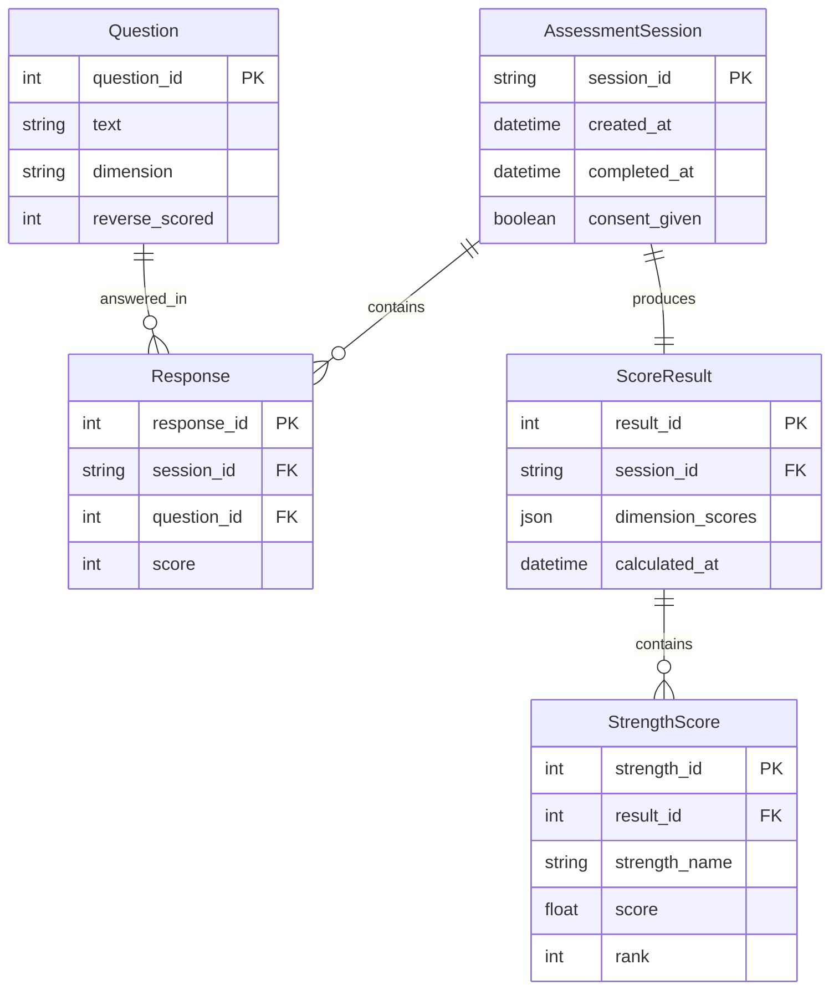

# Gallup 優勢測驗 - 架構與設計文件

---

**文件版本:** v1.0
**最後更新:** 2025-09-30
**主要作者:** 技術架構師
**狀態:** 審核中 (In Review)

---

## 目錄

1. [架構總覽](#1-架構總覽)
2. [需求摘要](#2-需求摘要)
3. [技術選型](#3-技術選型)
4. [數據架構](#4-數據架構)
5. [部署架構](#5-部署架構)

---

## 1. 架構總覽

### 1.1 系統情境

Gallup 優勢測驗系統是一個基於人格評估的職涯建議工具，協助用戶透過標準化問卷發現自身優勢面向。

### 1.2 架構模式

**選定模式:** 模組化單體架構 (Modular Monolith)

**選擇理由:**
- MVP 階段需要快速迭代
- 團隊規模小，微服務維運成本過高
- 業務邏輯清晰，適合模組化設計
- 未來可拆分為微服務

### 1.3 C4 模型 - 系統情境圖



### 1.4 Clean Architecture 分層

```
┌─────────────────────────────────────┐
│  Infrastructure Layer               │
│  (API Routes, Database, PDF)       │
├─────────────────────────────────────┤
│  Application Layer                  │
│  (Use Cases, Services)             │
├─────────────────────────────────────┤
│  Domain Layer                       │
│  (Entities, Business Rules)        │
└─────────────────────────────────────┘
```

---

## 2. 需求摘要

### 2.1 功能性需求

| ID | 需求描述 | 優先級 |
|:---|:---------|:------|
| FR-1 | 用戶同意與隱私合規 | P0 |
| FR-2 | Mini-IPIP 人格量表測驗 (20題) | P0 |
| FR-3 | 五大人格向度計分 | P0 |
| FR-4 | 12 個 Gallup 優勢面向映射 | P0 |
| FR-5 | 職缺推薦引擎 | P1 |
| FR-6 | 改善建議生成 | P1 |
| FR-7 | PDF 報告生成與分享 | P0 |

### 2.2 非功能性需求

| NFR 分類 | 具體需求 | 目標值 |
|:---------|:---------|:-------|
| **性能** | 測驗完成到報告生成時間 | < 5 秒 |
| **可用性** | 系統可用性 | > 99% |
| **可擴展性** | 支援用戶數 | 1000+ 並發 |
| **安全性** | 資料傳輸加密 | HTTPS/TLS 1.3 |
| **合規性** | 個人資料保護 | GDPR 基本合規 |

---

## 3. 技術選型

### 3.1 技術選型原則

1. **優先 Python 生態:** 團隊熟悉，開發效率高
2. **選用成熟工具:** 降低技術風險
3. **本地優先:** MVP 階段避免雲端依賴
4. **輕量部署:** 單一可執行檔，易於分發

### 3.2 技術棧

| 分類 | 技術 | 選擇理由 | 備選方案 |
|:-----|:-----|:---------|:---------|
| **後端框架** | FastAPI | 高性能異步、自動文檔 | Flask (功能較弱) |
| **資料庫** | SQLite | 零配置、檔案式、嵌入式 | PostgreSQL (過度設計) |
| **ORM** | SQLAlchemy 2.0 | 成熟、類型安全 | Peewee (社群較小) |
| **PDF 生成** | ReportLab | 功能完整、中文支援 | WeasyPrint (CSS 佈局複雜) |
| **驗證** | Pydantic v2 | 自動驗證、FastAPI 原生 | Marshmallow (較舊) |
| **測試** | Pytest | 標準工具、fixture 強大 | Unittest (功能較弱) |

---

## 4. 數據架構

### 4.1 核心實體關係圖



### 4.2 資料一致性策略

- **強一致性:** 測驗結果計算使用 ACID 事務
- **最終一致性:** PDF 報告異步生成（未來優化）

### 4.3 資料生命週期

| 資料類型 | 分類 | 保留期限 | 加密策略 |
|:---------|:-----|:---------|:---------|
| 問卷回答 | 個人資料 | 30天 | SQLite encryption extension |
| 分析結果 | 匿名統計 | 永久 | N/A |
| 分享連結 | 暫時性 | 7天 | Token-based |

---

## 5. 部署架構

### 5.1 部署視圖

```
┌─────────────────────────────────┐
│  Local Development              │
│  • uvicorn --reload             │
│  • SQLite file-based DB         │
└─────────────────────────────────┘
         ↓ (Docker build)
┌─────────────────────────────────┐
│  Production Container           │
│  • Gunicorn + Uvicorn workers   │
│  • Volume-mounted SQLite        │
│  • Nginx reverse proxy          │
└─────────────────────────────────┘
```

### 5.2 環境策略

| 環境 | 用途 | 資料庫 | 配置 |
|:-----|:-----|:-------|:-----|
| Development | 本地開發 | `dev.db` | `.env.dev` |
| Testing | CI/CD | In-memory | `.env.test` |
| Production | 正式環境 | `prod.db` (backup) | `.env.prod` |

### 5.3 成本效益分析

**MVP 階段成本（月）:**
- 雲端虛擬機: $5-10 (Digital Ocean Droplet)
- 網域 + SSL: $1-2
- 總計: < $15/月

**優化策略:**
- 使用 SQLite 避免資料庫託管費用
- 靜態資源 CDN 化（未來）
- 容器化部署，易於遷移

---

## 6. 風險與緩解

| 風險 | 可能性 | 影響 | 緩解策略 |
|:-----|:-------|:-----|:---------|
| SQLite 並發限制 | 中 | 中 | 使用 WAL 模式，考慮 PostgreSQL 遷移路徑 |
| 單點故障 | 高 | 高 | 定期備份，實作健康檢查 |
| PDF 生成阻塞 | 中 | 低 | 異步任務隊列（Phase 2） |

---

## 7. 架構演進路線圖

### Phase 1: MVP (當前)
- ✅ 基礎架構建立
- 🔄 核心功能開發
- ⏳ 測試與文檔

### Phase 2: 優化 (3-6個月)
- 異步報告生成
- Redis 快取層
- 監控與告警

### Phase 3: 擴展 (6-12個月)
- PostgreSQL 遷移
- 微服務拆分（選擇性）
- 多租戶支援

---

**架構審核:** 待團隊 review
**相關文檔:** [專案結構指南](../structure_guide.md), [API 規格](../api/api_specification.md)