# 優勢評測系統 - 前端架構規範（麥肯錫顧問風格）

**版本**: 1.0  
**更新日期**: 2025-01-02  
**設計理念**: McKinsey-Inspired Professional Consulting Platform  
**核心價值**: Data-Driven • Authoritative • Trust-Building

---

## 目錄

- [1. 設計哲學：顧問式專業主義](#1-設計哲學顧問式專業主義)
- [2. 視覺設計系統](#2-視覺設計系統)
- [3. 組件庫規範](#3-組件庫規範)
- [4. 頁面架構設計](#4-頁面架構設計)
- [5. 數據視覺化標準](#5-數據視覺化標準)
- [6. 交互設計原則](#6-交互設計原則)
- [7. 響應式策略](#7-響應式策略)
- [8. 性能與技術規範](#8-性能與技術規範)
- [9. 實施指南](#9-實施指南)

---

## 1. 設計哲學：顧問式專業主義

### 1.1 麥肯錫設計原則解析

#### 核心設計 DNA
```
專業性 (Professionalism) + 數據驅動 (Data-Driven) + 信任感 (Trustworthiness)
↓
清晰的資訊架構 + 精準的視覺層級 + 權威的內容呈現
↓
高轉換的顧問式體驗
```

#### 四大設計支柱

| 支柱 | 定義 | 實踐方式 | 衡量指標 |
|:-----|:-----|:---------|:---------|
| **Clarity（清晰性）** | 資訊無歧義，邏輯流暢 | 網格系統、標準化組件、階層分明 | 任務完成率 > 90% |
| **Authority（權威性）** | 專業可信，數據支撐 | 數據視覺化、方法論展示、證書徽章 | 信任度評分 > 8.5/10 |
| **Efficiency（效率性）** | 快速獲取洞察 | 漸進揭露、智能預設、快速導航 | 完成時間 < 5分鐘 |
| **Elegance（優雅性）** | 簡約而不簡單 | 留白運用、微妙動畫、精緻細節 | NPS > 60 |

### 1.2 顧問式網站特質映射

#### 諮詢流程與UI流程對應

```mermaid
graph LR
    A[初次接觸<br/>Landing] -->|建立信任| B[評測準備<br/>Intro]
    B -->|設定期待| C[診斷評估<br/>Assessment]
    C -->|數據收集| D[分析洞察<br/>Results]
    D -->|深入探索| E[專業報告<br/>Detail]
    
    style A fill:#001F3F
    style B fill:#003D73
    style C fill:#0066A6
    style D fill:#0080D9
    style E fill:#E6F2FF
```



**對應設計策略：**

| 諮詢階段 | UI頁面 | 設計重點 | 視覺語言 |
|:---------|:-------|:---------|:---------|
| **建立信任** | Landing | 權威背書、數據證明、社會認同 | 深藍主色、專業攝影、圖表預覽 |
| **評測準備** | Intro | 降低焦慮、設定期待、流程說明 | 清晰佈局、信息卡片、指南列表 |
| **診斷評估** | Assessment | 專業流程、進度可視、即時反饋 | 結構化佈局、進度指示、微互動 |
| **分析洞察** | Results | 數據視覺化、關鍵發現、洞察提煉 | 圖表主導、高對比、數據標註 |
| **專業報告** | Detail | 深度分析、方法論展示、可下載 | 文檔風格、結構化內容、手風琴 |

### 1.3 與競品的差異化定位

| 設計維度 | 一般心理測評 | 優勢評測系統（本專案） | 麥肯錫式增強 |
|:---------|:-------------|:-----------------------|:-------------|
| **視覺風格** | 活潑、多彩 | 專業、現代 | **精英商務風** |
| **數據呈現** | 簡單圖表 | DNA視覺化 | **顧問級報告** |
| **內容深度** | 淺層描述 | 科學分析 | **洞察 + 方法論** |
| **互動方式** | 遊戲化 | 評測導向 | **診斷式體驗** |
| **信任建立** | 用戶評價 | 科學方法 | **數據 + 權威背書** |

---

## 2. 視覺設計系統

### 2.1 麥肯錫式色彩系統

#### 主色調：專業深藍系
```css
:root {
  /* === 麥肯錫經典藍 === */
  --mckinsey-navy: #001F3F;           /* 主品牌色 */
  --mckinsey-deep-blue: #003D73;      /* 深藍 */
  --mckinsey-blue: #0066A6;           /* 標準藍 */
  --mckinsey-bright-blue: #0080D9;    /* 亮藍（互動色） */
  --mckinsey-light-blue: #E6F2FF;     /* 淺藍背景 */
  
  /* === 輔助色調 === */
  --consultant-gold: #D4AF37;         /* 金色（強調/榮譽） */
  --insight-teal: #008080;            /* 青綠（洞察標註） */
  --data-orange: #FF6B35;             /* 橙色（數據高亮） */
  --success-green: #2D8659;           /* 綠色（正向指標） */
  --alert-red: #C1272D;               /* 紅色（警示/風險） */
  
  /* === 中性灰階（專業基調）=== */
  --gray-900: #1A1A1A;                /* 主文字 */
  --gray-800: #333333;                /* 次要文字 */
  --gray-600: #666666;                /* 輔助文字 */
  --gray-400: #999999;                /* 禁用/次要 */
  --gray-300: #CCCCCC;                /* 分隔線 */
  --gray-200: #E5E5E5;                /* 邊框 */
  --gray-100: #F2F2F2;                /* 淺背景 */
  --gray-50: #F8F8F8;                 /* 頁面背景 */
  --white: #FFFFFF;                   /* 卡片/面板 */
}
```

#### 色彩使用規範

**主色應用矩陣**
| 元素類型 | 顏色 | 使用場景 | 範例 |
|:---------|:-----|:---------|:-----|
| **品牌標識** | `--mckinsey-navy` | Logo、頂部導航 | Header背景 |
| **主要行動** | `--mckinsey-blue` | Primary CTA、重要按鈕 | "開始評測" |
| **互動狀態** | `--mckinsey-bright-blue` | Hover、Selected | 按鈕hover |
| **數據視覺化** | 藍色漸層 | 圖表、進度條 | DNA螺旋 |
| **背景層次** | `--gray-50` / `--white` | 頁面底/卡片 | 主容器 |
| **強調標註** | `--consultant-gold` | 重要標籤、徽章 | "Premium" |

**色彩對比度檢查**
```javascript
// WCAG AA 標準驗證
const colorContrast = {
  'mckinsey-navy on white': '13.5:1',    // ✅ AAA
  'mckinsey-blue on white': '8.2:1',     // ✅ AAA
  'gray-800 on white': '12.6:1',         // ✅ AAA
  'gray-600 on white': '5.7:1',          // ✅ AA
};
```

### 2.2 字體系統：專業商務排版

#### 字體家族
```css
:root {
  /* === 西文字體（麥肯錫風格）=== */
  --font-heading-en: 'Interstate', 'Helvetica Neue', Arial, sans-serif;
  --font-body-en: 'Graphik', -apple-system, BlinkMacSystemFont, sans-serif;
  --font-data-en: 'IBM Plex Mono', 'SF Mono', Consolas, monospace;
  
  /* === 中文字體（專業商務）=== */
  --font-heading-zh: 'Noto Sans TC', 'Microsoft JhengHei', 'PingFang TC', sans-serif;
  --font-body-zh: 'Noto Sans TC', 'Microsoft JhengHei', 'PingFang TC', sans-serif;
  --font-data-zh: 'IBM Plex Mono', 'SF Mono', 'Microsoft JhengHei', monospace;
  
  /* === 統一字體堆疊 === */
  --font-primary: var(--font-heading-zh), var(--font-heading-en);
  --font-secondary: var(--font-body-zh), var(--font-body-en);
  --font-mono: var(--font-data-zh), var(--font-data-en);
}
```

#### 字體階層（基於8pt網格）
```css
/* === 標題層級（專業報告風格）=== */
.text-display {
  font-size: 3rem;        /* 48px - 頁面主標題 */
  font-weight: 600;
  line-height: 1.2;
  letter-spacing: -0.02em;
}

.text-h1 {
  font-size: 2.25rem;     /* 36px - 章節標題 */
  font-weight: 600;
  line-height: 1.3;
}

.text-h2 {
  font-size: 1.75rem;     /* 28px - 子章節 */
  font-weight: 600;
  line-height: 1.3;
}

.text-h3 {
  font-size: 1.25rem;     /* 20px - 段落標題 */
  font-weight: 600;
  line-height: 1.4;
}

/* === 正文層級 === */
.text-body-large {
  font-size: 1.125rem;    /* 18px - 重要正文 */
  font-weight: 400;
  line-height: 1.6;
}

.text-body {
  font-size: 1rem;        /* 16px - 標準正文 */
  font-weight: 400;
  line-height: 1.6;
}

.text-body-small {
  font-size: 0.875rem;    /* 14px - 輔助說明 */
  font-weight: 400;
  line-height: 1.5;
}

/* === 數據與標籤 === */
.text-data-large {
  font-size: 2.5rem;      /* 40px - 關鍵指標 */
  font-weight: 600;
  font-family: var(--font-mono);
  line-height: 1.2;
}

.text-data {
  font-size: 1.5rem;      /* 24px - 數據展示 */
  font-weight: 500;
  font-family: var(--font-mono);
}

.text-caption {
  font-size: 0.75rem;     /* 12px - 標籤/註釋 */
  font-weight: 500;
  line-height: 1.4;
  text-transform: uppercase;
  letter-spacing: 0.05em;
}
```

#### 字體使用場景
| 場景 | 字體類型 | 大小 | 權重 | 範例 |
|:-----|:---------|:-----|:-----|:-----|
| 頁面標題 | Primary | 48px | 600 | "你的優勢DNA報告" |
| 章節標題 | Primary | 36px | 600 | "主導才幹分析" |
| KPI數值 | Mono | 40px | 600 | "8 / 12" |
| 正文內容 | Secondary | 16px | 400 | 說明文字 |
| 數據標籤 | Mono | 24px | 500 | "PR 85" |
| 按鈕文字 | Primary | 14px | 600 | "查看報告" |
| 注釋說明 | Secondary | 12px | 400 | "* 基於常模百分位" |

### 2.3 網格系統：嚴謹的結構

#### 12列網格（麥肯錫式佈局）
```css
.container {
  display: grid;
  grid-template-columns: repeat(12, 1fr);
  gap: 24px;
  max-width: 1280px;
  margin: 0 auto;
  padding: 0 40px;
}

/* === 典型佈局模式 === */
.layout-report {
  /* 經典報告佈局：側邊欄 + 主內容 */
  grid-template-areas: 
    "sidebar sidebar main main main main main main main main main main";
}

.layout-dashboard {
  /* 儀表板佈局：三列KPI */
  grid-template-areas:
    "kpi1 kpi1 kpi1 kpi1 kpi2 kpi2 kpi2 kpi2 kpi3 kpi3 kpi3 kpi3";
}

.layout-split {
  /* 對稱分割：文字 + 視覺 */
  grid-template-areas:
    "content content content content content content visual visual visual visual visual visual";
}
```

#### 間距系統（8pt網格）
```css
:root {
  /* === 基礎間距單位 === */
  --space-xs: 0.5rem;     /* 8px */
  --space-sm: 1rem;       /* 16px */
  --space-md: 1.5rem;     /* 24px */
  --space-lg: 2rem;       /* 32px */
  --space-xl: 3rem;       /* 48px */
  --space-2xl: 4rem;      /* 64px */
  --space-3xl: 6rem;      /* 96px */
  
  /* === 語義化間距 === */
  --space-component: var(--space-md);      /* 組件內間距 */
  --space-section: var(--space-xl);        /* 區塊間距 */
  --space-page: var(--space-2xl);          /* 頁面邊距 */
}
```

### 2.4 形狀語言：專業克制

#### 圓角系統
```css
:root {
  /* === 圓角規範（克制使用）=== */
  --radius-none: 0;                /* 數據表格、專業文檔 */
  --radius-sm: 2px;                /* 輸入框、小按鈕 */
  --radius-md: 4px;                /* 標準按鈕、卡片 */
  --radius-lg: 8px;                /* 大卡片、面板 */
  --radius-xl: 12px;               /* 特殊容器 */
  --radius-full: 9999px;           /* 徽章、標籤 */
}

/* === 麥肯錫風格：優先使用小圓角或直角 === */
.card-professional {
  border-radius: var(--radius-md);  /* 4px - 專業而不冰冷 */
}

.button-primary {
  border-radius: var(--radius-sm);  /* 2px - 克制商務感 */
}

.data-table {
  border-radius: var(--radius-none); /* 0 - 嚴肅專業 */
}
```

#### 陰影系統（微妙層次）
```css
:root {
  /* === 專業陰影（避免過度裝飾）=== */
  --shadow-sm: 0 1px 2px rgba(0, 31, 63, 0.06);
  --shadow-md: 0 2px 8px rgba(0, 31, 63, 0.08);
  --shadow-lg: 0 4px 16px rgba(0, 31, 63, 0.1);
  --shadow-xl: 0 8px 32px rgba(0, 31, 63, 0.12);
  
  /* === 數據卡片專用 === */
  --shadow-card: 0 1px 3px rgba(0, 0, 0, 0.08),
                 0 1px 2px rgba(0, 0, 0, 0.04);
}
```

#### 邊框系統
```css
:root {
  /* === 邊框寬度 === */
  --border-thin: 1px;
  --border-medium: 2px;
  --border-thick: 3px;
  
  /* === 邊框顏色 === */
  --border-light: var(--gray-200);
  --border-medium: var(--gray-300);
  --border-dark: var(--gray-400);
  --border-accent: var(--mckinsey-blue);
}

/* === 應用範例 === */
.card {
  border: var(--border-thin) solid var(--border-light);
}

.input:focus {
  border: var(--border-medium) solid var(--border-accent);
}

.data-highlight {
  border-left: var(--border-thick) solid var(--mckinsey-blue);
}
```

---

## 3. 組件庫規範

### 3.1 按鈕系統（專業層級）

#### 主要按鈕（Primary）
```css
.btn-primary {
  /* 視覺 */
  background: var(--mckinsey-blue);
  color: var(--white);
  border: none;
  border-radius: var(--radius-sm);
  padding: 12px 32px;
  
  /* 字體 */
  font-size: 14px;
  font-weight: 600;
  letter-spacing: 0.02em;
  text-transform: uppercase;
  
  /* 互動 */
  transition: all 0.2s ease;
  cursor: pointer;
}

.btn-primary:hover {
  background: var(--mckinsey-deep-blue);
  transform: translateY(-1px);
  box-shadow: var(--shadow-md);
}

.btn-primary:active {
  transform: translateY(0);
  box-shadow: var(--shadow-sm);
}

.btn-primary:disabled {
  background: var(--gray-300);
  color: var(--gray-600);
  cursor: not-allowed;
  transform: none;
}
```

#### 次要按鈕（Secondary）
```css
.btn-secondary {
  background: transparent;
  color: var(--mckinsey-blue);
  border: var(--border-medium) solid var(--mckinsey-blue);
  border-radius: var(--radius-sm);
  padding: 12px 32px;
  
  font-size: 14px;
  font-weight: 600;
  letter-spacing: 0.02em;
  text-transform: uppercase;
  
  transition: all 0.2s ease;
}

.btn-secondary:hover {
  background: var(--mckinsey-light-blue);
  border-color: var(--mckinsey-deep-blue);
}
```

#### 文字按鈕（Text）
```css
.btn-text {
  background: transparent;
  color: var(--mckinsey-blue);
  border: none;
  padding: 8px 16px;
  
  font-size: 14px;
  font-weight: 500;
  
  transition: color 0.2s ease;
}

.btn-text:hover {
  color: var(--mckinsey-deep-blue);
  text-decoration: underline;
  text-underline-offset: 4px;
}
```

#### 按鈕尺寸變體
```css
/* 大按鈕 - 主要CTA */
.btn-large {
  padding: 16px 48px;
  font-size: 16px;
}

/* 標準按鈕 */
.btn-medium {
  padding: 12px 32px;
  font-size: 14px;
}

/* 小按鈕 - 表格操作 */
.btn-small {
  padding: 8px 16px;
  font-size: 12px;
}
```

### 3.2 卡片系統（專業容器）

#### 標準數據卡片
```css
.card-data {
  background: var(--white);
  border: var(--border-thin) solid var(--border-light);
  border-radius: var(--radius-md);
  padding: var(--space-lg);
  box-shadow: var(--shadow-card);
  
  /* 微妙互動 */
  transition: all 0.2s ease;
}

.card-data:hover {
  box-shadow: var(--shadow-md);
  border-color: var(--gray-300);
}
```

**HTML結構**
```html
<div class="card-data">
  <div class="card-header">
    <span class="card-label">主導才幹</span>
    <span class="card-badge">高於75%</span>
  </div>
  <div class="card-body">
    <div class="card-value">8</div>
    <div class="card-subtitle">維度數量</div>
  </div>
  <div class="card-footer">
    <button class="btn-text">查看詳情 →</button>
  </div>
</div>
```

#### 洞察卡片（Insight Card）
```css
.card-insight {
  background: var(--white);
  border-left: var(--border-thick) solid var(--insight-teal);
  border-radius: var(--radius-md);
  padding: var(--space-lg);
  box-shadow: var(--shadow-sm);
}

.card-insight::before {
  content: "💡";
  font-size: 24px;
  margin-right: var(--space-sm);
}

.card-insight-title {
  font-size: 18px;
  font-weight: 600;
  color: var(--gray-900);
  margin-bottom: var(--space-sm);
}

.card-insight-content {
  font-size: 14px;
  color: var(--gray-700);
  line-height: 1.6;
}
```

#### 報告卡片（Report Section）
```css
.card-report {
  background: var(--white);
  border: var(--border-thin) solid var(--border-light);
  border-radius: var(--radius-md);
  padding: var(--space-xl);
  margin-bottom: var(--space-lg);
}

.card-report-header {
  display: flex;
  justify-content: space-between;
  align-items: center;
  margin-bottom: var(--space-lg);
  padding-bottom: var(--space-md);
  border-bottom: var(--border-thin) solid var(--border-light);
}

.card-report-title {
  font-size: 24px;
  font-weight: 600;
  color: var(--gray-900);
}

.card-report-meta {
  font-size: 12px;
  color: var(--gray-600);
  text-transform: uppercase;
  letter-spacing: 0.05em;
}
```

### 3.3 表格系統（數據呈現）

#### 專業數據表格
```css
.table-professional {
  width: 100%;
  border-collapse: collapse;
  background: var(--white);
  border: var(--border-thin) solid var(--border-light);
  border-radius: var(--radius-md);
  overflow: hidden;
}

.table-professional thead {
  background: var(--gray-50);
}

.table-professional th {
  padding: 16px 20px;
  text-align: left;
  font-size: 12px;
  font-weight: 600;
  color: var(--gray-700);
  text-transform: uppercase;
  letter-spacing: 0.05em;
  border-bottom: var(--border-medium) solid var(--border-medium);
}

.table-professional td {
  padding: 16px 20px;
  font-size: 14px;
  color: var(--gray-800);
  border-bottom: var(--border-thin) solid var(--border-light);
}

.table-professional tbody tr:hover {
  background: var(--gray-50);
}

.table-professional tbody tr:last-child td {
  border-bottom: none;
}
```

**HTML範例**
```html
<table class="table-professional">
  <thead>
    <tr>
      <th>維度</th>
      <th>領域</th>
      <th>百分位</th>
      <th>分級</th>
    </tr>
  </thead>
  <tbody>
    <tr>
      <td>
        <span class="dimension-name">戰略思維</span>
      </td>
      <td>
        <span class="badge badge-strategic">戰略思維</span>
      </td>
      <td>
        <span class="data-value">PR 92</span>
      </td>
      <td>
        <span class="tier-label tier-dominant">主導</span>
      </td>
    </tr>
  </tbody>
</table>
```

### 3.4 徽章與標籤系統

#### 領域徽章
```css
.badge {
  display: inline-flex;
  align-items: center;
  gap: 6px;
  padding: 4px 12px;
  border-radius: var(--radius-full);
  font-size: 11px;
  font-weight: 600;
  text-transform: uppercase;
  letter-spacing: 0.05em;
}

/* 領域專用徽章 */
.badge-executing {
  background: rgba(124, 58, 237, 0.1);
  color: #7C3AED;
}

.badge-influencing {
  background: rgba(245, 158, 11, 0.1);
  color: #F59E0B;
}

.badge-relationship {
  background: rgba(14, 165, 233, 0.1);
  color: #0EA5E9;
}

.badge-strategic {
  background: rgba(16, 185, 129, 0.1);
  color: #10B981;
}

/* 麥肯錫金色徽章（榮譽/高級） */
.badge-premium {
  background: linear-gradient(135deg, #D4AF37 0%, #F2D675 100%);
  color: var(--gray-900);
  box-shadow: 0 2px 8px rgba(212, 175, 55, 0.3);
}
```

#### 狀態標籤
```css
/* 分級標籤 */
.tier-label {
  display: inline-block;
  padding: 4px 10px;
  border-radius: var(--radius-sm);
  font-size: 11px;
  font-weight: 600;
  text-transform: uppercase;
}

.tier-dominant {
  background: var(--success-green);
  color: white;
}

.tier-supporting {
  background: var(--mckinsey-blue);
  color: white;
}

.tier-lesser {
  background: var(--gray-400);
  color: white;
}
```

### 3.5 輸入元件（表單）

#### 專業輸入框
```css
.input-professional {
  width: 100%;
  padding: 12px 16px;
  background: var(--white);
  border: var(--border-thin) solid var(--border-light);
  border-radius: var(--radius-sm);
  
  font-size: 14px;
  color: var(--gray-900);
  
  transition: all 0.2s ease;
}

.input-professional:focus {
  outline: none;
  border-color: var(--mckinsey-blue);
  box-shadow: 0 0 0 3px rgba(0, 102, 166, 0.1);
}

.input-professional::placeholder {
  color: var(--gray-400);
}

/* 錯誤狀態 */
.input-professional.error {
  border-color: var(--alert-red);
}

.input-professional.error:focus {
  box-shadow: 0 0 0 3px rgba(193, 39, 45, 0.1);
}

/* 成功狀態 */
.input-professional.success {
  border-color: var(--success-green);
}
```

#### 表單組合
```html
<div class="form-group">
  <label class="form-label">電子郵件</label>
  <input 
    type="email" 
    class="input-professional" 
    placeholder="your.email@example.com"
  />
  <span class="form-help">我們將發送報告到此信箱</span>
</div>

<style>
.form-group {
  margin-bottom: var(--space-lg);
}

.form-label {
  display: block;
  margin-bottom: var(--space-xs);
  font-size: 13px;
  font-weight: 600;
  color: var(--gray-800);
  text-transform: uppercase;
  letter-spacing: 0.03em;
}

.form-help {
  display: block;
  margin-top: var(--space-xs);
  font-size: 12px;
  color: var(--gray-600);
}
</style>
```

---

## 4. 頁面架構設計

### 4.0 Index Page（入口頁）

#### 設計目標
- **主要目標**：提供清晰的入口導向
- **次要目標**：建立專業第一印象

#### 佈局結構
```html
<div class="index-page">
  <div class="index-container">
    <!-- 品牌標識 -->
    <div class="brand-header">
      
      <h1 class="brand-title">優勢評測系統</h1>
      <p class="brand-tagline">
        專業天賦診斷 • 科學優勢報告
      </p>
    </div>
    
    <!-- 主要入口卡片 -->
    <div class="entry-card">
      <div class="entry-icon">🧬</div>
      <h2 class="entry-title">開始您的優勢發現之旅</h2>
      <p class="entry-desc">
        基於 Thurstonian IRT 的專業評測<br/>
        3分鐘獲得詳細優勢報告
      </p>
      <button class="btn-primary btn-large" onclick="location.href='/landing.html'">
        進入評測系統
      </button>
    </div>
    
    <!-- 快速連結 -->
    <div class="quick-links">
      <a href="/landing.html#methodology">
        <icon>📊</icon> 了解方法論
      </a>
      <a href="/landing.html#insights">
        <icon>💡</icon> 查看案例
      </a>
    </div>
    
    <!-- 版本資訊 -->
    <div class="version-info">
      <span>Version 4.1</span>
      <span>•</span>
      <span>Thurstonian IRT</span>
    </div>
  </div>
</div>
```

#### 樣式規範
```css
/* === 入口頁面 === */
.index-page {
  min-height: 100vh;
  display: flex;
  align-items: center;
  justify-content: center;
  background: linear-gradient(135deg, 
    var(--mckinsey-navy) 0%, 
    var(--mckinsey-deep-blue) 100%);
}

.index-container {
  max-width: 600px;
  text-align: center;
  padding: var(--space-page);
}

/* === 品牌標識 === */
.brand-header {
  color: white;
  margin-bottom: var(--space-3xl);
}

.brand-logo {
  width: 80px;
  height: 80px;
  margin-bottom: var(--space-lg);
  filter: drop-shadow(0 4px 8px rgba(0, 0, 0, 0.2));
}

.brand-title {
  font-size: 36px;
  font-weight: 600;
  margin-bottom: var(--space-xs);
  letter-spacing: -0.01em;
}

.brand-tagline {
  font-size: 16px;
  opacity: 0.85;
  letter-spacing: 0.02em;
}

/* === 入口卡片 === */
.entry-card {
  background: white;
  border-radius: var(--radius-lg);
  padding: var(--space-3xl);
  box-shadow: 0 20px 60px rgba(0, 31, 63, 0.3);
  margin-bottom: var(--space-xl);
  transition: transform 0.3s ease;
}

.entry-card:hover {
  transform: translateY(-4px);
}

.entry-icon {
  font-size: 64px;
  margin-bottom: var(--space-md);
}

.entry-title {
  font-size: 24px;
  font-weight: 600;
  color: var(--gray-900);
  margin-bottom: var(--space-md);
}

.entry-desc {
  font-size: 16px;
  color: var(--gray-700);
  line-height: 1.6;
  margin-bottom: var(--space-xl);
}

/* === 快速連結 === */
.quick-links {
  display: flex;
  justify-content: center;
  gap: var(--space-xl);
  margin-bottom: var(--space-lg);
}

.quick-links a {
  display: flex;
  align-items: center;
  gap: var(--space-xs);
  color: white;
  font-size: 14px;
  text-decoration: none;
  opacity: 0.85;
  transition: all 0.2s ease;
}

.quick-links a:hover {
  opacity: 1;
  text-decoration: underline;
  text-underline-offset: 4px;
}

/* === 版本資訊 === */
.version-info {
  display: flex;
  justify-content: center;
  gap: var(--space-sm);
  font-size: 12px;
  color: white;
  opacity: 0.6;
  font-family: var(--font-mono);
}
```

#### 導航路徑
- **主要出口**：`landing.html`（進入評測系統）
- **快速連結**：`landing.html#methodology`、`landing.html#insights`

---

### 4.1 Landing Page（顧問式首頁）

#### 佈局結構
```html
<div class="landing-page">
  <!-- 1. 專業頂部導航 -->
  <nav class="nav-professional">
    <div class="nav-left">
      
    </div>
    <div class="nav-center">
      <a href="#methodology">科學方法</a>
      <a href="#process">評測流程</a>
      <a href="#insights">案例洞察</a>
    </div>
    <div class="nav-right">
      <button class="btn-primary">開始專業評測</button>
    </div>
  </nav>
  
  <!-- 2. 英雄區塊（權威建立）-->
  <section class="hero-consulting">
    <div class="hero-content">
      <span class="hero-label">專業優勢診斷系統</span>
      <h1 class="hero-title">
        發現您的<br/>
        <span class="text-highlight">天賦DNA組合</span>
      </h1>
      <p class="hero-subtitle">
        基於 Thurstonian IRT 與常模百分位的科學評測<br/>
        3分鐘獲得專業級優勢報告
      </p>
      <div class="hero-actions">
        <button class="btn-primary btn-large">開始免費評測</button>
        <button class="btn-secondary btn-large">了解方法論</button>
      </div>
      
      <!-- 信任指標 -->
      <div class="trust-metrics">
        <div class="metric">
          <div class="metric-value">100萬+</div>
          <div class="metric-label">專業用戶</div>
        </div>
        <div class="metric">
          <div class="metric-value">95%</div>
          <div class="metric-label">準確度</div>
        </div>
        <div class="metric">
          <div class="metric-value">3分鐘</div>
          <div class="metric-label">完成時間</div>
        </div>
      </div>
    </div>
    
    <div class="hero-visual">
      <!-- DNA視覺化預覽 -->
      
    </div>
  </section>
  
  <!-- 3. 方法論展示（建立權威）-->
  <section class="methodology-section">
    <div class="section-header">
      <span class="section-label">Scientific Foundation</span>
      <h2 class="section-title">經過驗證的科學方法</h2>
    </div>
    
    <div class="methodology-grid">
      <div class="method-card">
        <div class="method-icon">📊</div>
        <h3>Thurstonian IRT</h3>
        <p>先進的項目反應理論，精準測量潛在特質</p>
      </div>
      <div class="method-card">
        <div class="method-icon">📈</div>
        <h3>常模百分位</h3>
        <p>與10萬+專業樣本對比，提供相對優勢位置</p>
      </div>
      <div class="method-card">
        <div class="method-icon">🔬</div>
        <h3>信效度驗證</h3>
        <p>Cronbach's α > 0.85，確保測量穩定性</p>
      </div>
    </div>
  </section>
  
  <!-- 4. 評測流程（設定期待）-->
  <section class="process-section">
    <div class="section-header">
      <span class="section-label">Assessment Process</span>
      <h2 class="section-title">四步診斷流程</h2>
    </div>
    
    <div class="process-timeline">
      <div class="process-step">
        <div class="step-number">01</div>
        <h3>初始設定</h3>
        <p>了解評測方法與預期結果</p>
        <span class="step-duration">30秒</span>
      </div>
      <div class="process-step">
        <div class="step-number">02</div>
        <h3>強制選擇評測</h3>
        <p>15個區塊，每次四選二</p>
        <span class="step-duration">3分鐘</span>
      </div>
      <div class="process-step">
        <div class="step-number">03</div>
        <h3>數據分析</h3>
        <p>IRT算法實時計算12維度分數</p>
        <span class="step-duration">即時</span>
      </div>
      <div class="process-step">
        <div class="step-number">04</div>
        <h3>專業報告</h3>
        <p>DNA視覺化與詳細洞察</p>
        <span class="step-duration">2分鐘閱讀</span>
      </div>
    </div>
  </section>
  
  <!-- 5. 案例洞察（社會認同）-->
  <section class="insights-section">
    <div class="section-header">
      <span class="section-label">Success Stories</span>
      <h2 class="section-title">專業人士如何運用優勢</h2>
    </div>
    
    <div class="insight-cards">
      <div class="card-insight">
        <div class="insight-quote">
          "評測幫助我發現戰略思維是我的主導優勢，讓我在產品經理轉型中找到方向。"
        </div>
        <div class="insight-author">
          
          <div>
            <div class="author-name">張明哲</div>
            <div class="author-title">資深產品經理 @ 某科技公司</div>
          </div>
        </div>
      </div>
      <!-- 更多案例卡片 -->
    </div>
  </section>
  
  <!-- 6. 最終CTA -->
  <section class="cta-section">
    <h2>準備好發現您的優勢了嗎？</h2>
    <button class="btn-primary btn-large">立即開始專業評測</button>
    <p class="cta-note">完全免費 • 3分鐘完成 • 即時報告</p>
  </section>
</div>
```

#### 樣式規範
```css
/* === 導航 === */
.nav-professional {
  display: flex;
  justify-content: space-between;
  align-items: center;
  padding: var(--space-md) var(--space-page);
  background: var(--white);
  border-bottom: var(--border-thin) solid var(--border-light);
  position: sticky;
  top: 0;
  z-index: 1000;
}

/* === 英雄區塊 === */
.hero-consulting {
  display: grid;
  grid-template-columns: 1fr 1fr;
  gap: var(--space-3xl);
  padding: var(--space-3xl) var(--space-page);
  background: linear-gradient(135deg, #F8F9FA 0%, #FFFFFF 100%);
}

.hero-title {
  font-size: 56px;
  font-weight: 600;
  line-height: 1.2;
  color: var(--gray-900);
  margin-bottom: var(--space-md);
}

.text-highlight {
  color: var(--mckinsey-blue);
  position: relative;
}

.text-highlight::after {
  content: '';
  position: absolute;
  bottom: 0;
  left: 0;
  width: 100%;
  height: 8px;
  background: var(--consultant-gold);
  opacity: 0.3;
  z-index: -1;
}

/* === 信任指標 === */
.trust-metrics {
  display: flex;
  gap: var(--space-xl);
  margin-top: var(--space-xl);
}

.metric-value {
  font-size: 40px;
  font-weight: 600;
  font-family: var(--font-mono);
  color: var(--mckinsey-blue);
}

.metric-label {
  font-size: 12px;
  color: var(--gray-600);
  text-transform: uppercase;
  letter-spacing: 0.05em;
}

/* === 方法論區塊 === */
.methodology-grid {
  display: grid;
  grid-template-columns: repeat(3, 1fr);
  gap: var(--space-lg);
}

.method-card {
  padding: var(--space-xl);
  background: var(--white);
  border: var(--border-thin) solid var(--border-light);
  border-radius: var(--radius-md);
  text-align: center;
  transition: all 0.3s ease;
}

.method-card:hover {
  transform: translateY(-4px);
  box-shadow: var(--shadow-lg);
  border-color: var(--mckinsey-blue);
}

.method-icon {
  font-size: 48px;
  margin-bottom: var(--space-md);
}
```

### 4.2 Results Page（專業報告頁）

#### 佈局結構（麥肯錫式報告）
```html
<div class="results-page">
  <!-- 1. 專業報告標題 -->
  <header class="report-header">
    <div class="header-left">
      
      <div class="report-meta">
        <h1 class="report-title">優勢評測專業報告</h1>
        <div class="report-info">
          <span>Session: <code>{sessionId}</code></span>
          <span>•</span>
          <span>評測時間: {timestamp}</span>
          <span>•</span>
          <span>置信度: <strong>{confidence}%</strong></span>
        </div>
      </div>
    </div>
    <div class="header-actions">
      <button class="btn-secondary">
        <icon>📤</icon> 分享報告
      </button>
      <button class="btn-primary">
        <icon>📄</icon> 下載 PDF
      </button>
    </div>
  </header>
  
  <!-- 2. 執行摘要（Executive Summary）-->
  <section class="executive-summary">
    <h2 class="section-title">執行摘要</h2>
    
    <!-- KPI 儀表板 -->
    <div class="kpi-dashboard">
      <div class="kpi-card kpi-dominant">
        <div class="kpi-label">主導才幹</div>
        <div class="kpi-value">{dominant.length}</div>
        <div class="kpi-desc">百分位 > 75</div>
        <div class="kpi-trend">
          <icon>↑</icon> 高於85%用戶
        </div>
      </div>
      
      <div class="kpi-card kpi-supporting">
        <div class="kpi-label">支援才幹</div>
        <div class="kpi-value">{supporting.length}</div>
        <div class="kpi-desc">百分位 25-75</div>
        <div class="kpi-trend">
          <icon>→</icon> 平均水平
        </div>
      </div>
      
      <div class="kpi-card kpi-lesser">
        <div class="kpi-label">待管理領域</div>
        <div class="kpi-value">{lesser.length}</div>
        <div class="kpi-desc">百分位 < 25</div>
        <div class="kpi-trend">
          <icon>↓</icon> 需要關注
        </div>
      </div>
    </div>
  </section>
  
  <!-- 3. DNA 視覺化（核心洞察）-->
  <section class="dna-visualization">
    <h2 class="section-title">您的優勢 DNA</h2>
    <div class="visualization-container">
      <svg class="dna-helix">
        <!-- SVG DNA 雙螺旋 -->
      </svg>
      <div class="visualization-legend">
        <div class="legend-item">
          <span class="legend-dot" style="background: #7C3AED"></span>
          <span>執行力</span>
        </div>
        <div class="legend-item">
          <span class="legend-dot" style="background: #F59E0B"></span>
          <span>影響力</span>
        </div>
        <div class="legend-item">
          <span class="legend-dot" style="background: #0EA5E9"></span>
          <span>關係建立</span>
        </div>
        <div class="legend-item">
          <span class="legend-dot" style="background: #10B981"></span>
          <span>戰略思維</span>
        </div>
      </div>
    </div>
  </section>
  
  <!-- 4. 詳細分析表格 -->
  <section class="detailed-analysis">
    <h2 class="section-title">12 維度詳細分析</h2>
    
    <table class="table-professional">
      <thead>
        <tr>
          <th>維度</th>
          <th>領域</th>
          <th>百分位</th>
          <th>分級</th>
          <th>與常模對比</th>
        </tr>
      </thead>
      <tbody>
        {dimensions.map(d => (
          <tr>
            <td>
              <strong>{d.name}</strong>
            </td>
            <td>
              <span class="badge badge-{d.domain}">
                {DOMAIN_META[d.domain].zh}
              </span>
            </td>
            <td>
              <span class="data-value">PR {d.percentile}</span>
            </td>
            <td>
              <span class="tier-label tier-{d.tier}">
                {d.tierLabel}
              </span>
            </td>
            <td>
              <div class="comparison-bar">
                <div class="bar-fill" style="width: {d.percentile}%"></div>
                <span class="bar-label">{d.comparisonText}</span>
              </div>
            </td>
          </tr>
        ))}
      </tbody>
    </table>
  </section>
  
  <!-- 5. 職業原型洞察 -->
  <section class="persona-insights">
    <h2 class="section-title">職業原型參考</h2>
    
    <div class="card-insight-large">
      <div class="insight-header">
        <h3>{persona.name}</h3>
        <span class="badge badge-premium">Beta</span>
      </div>
      <p class="insight-description">{persona.hint}</p>
      
      <div class="insight-details">
        <div class="detail-section">
          <h4>建議職位</h4>
          <ul>
            <li>產品經理</li>
            <li>資料科學家</li>
            <li>解決方案架構師</li>
          </ul>
        </div>
        
        <div class="detail-section">
          <h4>關鍵情境</h4>
          <ul>
            <li>策略規劃</li>
            <li>跨部門協作</li>
            <li>決策支援</li>
          </ul>
        </div>
        
        <div class="detail-section">
          <h4>發展建議</h4>
          <ul>
            <li>配對強『影響力/關係』夥伴</li>
            <li>避免過度分析，設定決策截止點</li>
          </ul>
        </div>
      </div>
    </div>
  </section>
  
  <!-- 6. 方法論說明 -->
  <section class="methodology-explanation">
    <h2 class="section-title">方法論與解讀門檻</h2>
    
    <div class="method-grid">
      <div class="method-detail">
        <h4>Thurstonian IRT</h4>
        <p>由強制選擇完整作答模式推估 12 維度潛在分數 θ，避免反應偏誤。</p>
      </div>
      <div class="method-detail">
        <h4>常模百分位</h4>
        <p>與代表性樣本（N=100,000+）對比，支持跨人比較（Normative）。</p>
      </div>
      <div class="method-detail">
        <h4>分層規則</h4>
        <p>PR>75 主導；PR 25–75 支援；PR<25 較弱。基於統計顯著性。</p>
      </div>
      <div class="method-detail">
        <h4>置信度</h4>
        <p>基於題項資訊量與收斂準則計算，當前報告置信度 {confidence}%。</p>
      </div>
    </div>
  </section>
  
  <!-- 7. 下一步行動 -->
  <section class="next-steps">
    <h2 class="section-title">建議後續行動</h2>
    
    <ol class="action-list">
      <li>
        <strong>深入閱讀</strong>
        <p>查看完整詳細報告，了解每個維度的具體表現與應用建議。</p>
        <button class="btn-text">查看完整報告 →</button>
      </li>
      <li>
        <strong>下載保存</strong>
        <p>下載 PDF 版本報告，可加入履歷或個人發展檔案。</p>
        <button class="btn-text">下載 PDF →</button>
      </li>
      <li>
        <strong>分享討論</strong>
        <p>與團隊領導或職涯顧問討論評測結果，制定發展計劃。</p>
        <button class="btn-text">分享報告 →</button>
      </li>
    </ol>
  </section>
</div>
```

#### 樣式規範
```css
/* === 報告頁面基礎 === */
.results-page {
  max-width: 1280px;
  margin: 0 auto;
  padding: var(--space-page);
  background: var(--gray-50);
}

/* === 報告標題 === */
.report-header {
  display: flex;
  justify-content: space-between;
  align-items: flex-start;
  padding: var(--space-xl);
  background: var(--white);
  border-bottom: var(--border-medium) solid var(--mckinsey-navy);
  margin-bottom: var(--space-xl);
}

.report-title {
  font-size: 28px;
  font-weight: 600;
  color: var(--mckinsey-navy);
  margin-bottom: var(--space-xs);
}

.report-info {
  display: flex;
  gap: var(--space-md);
  font-size: 12px;
  color: var(--gray-600);
}

.report-info code {
  font-family: var(--font-mono);
  background: var(--gray-100);
  padding: 2px 6px;
  border-radius: var(--radius-sm);
}

/* === KPI 儀表板 === */
.kpi-dashboard {
  display: grid;
  grid-template-columns: repeat(3, 1fr);
  gap: var(--space-lg);
  margin: var(--space-xl) 0;
}

.kpi-card {
  background: var(--white);
  border: var(--border-thin) solid var(--border-light);
  border-radius: var(--radius-md);
  padding: var(--space-xl);
  position: relative;
  overflow: hidden;
}

.kpi-card::before {
  content: '';
  position: absolute;
  top: 0;
  left: 0;
  width: 4px;
  height: 100%;
}

.kpi-dominant::before { background: var(--success-green); }
.kpi-supporting::before { background: var(--mckinsey-blue); }
.kpi-lesser::before { background: var(--gray-400); }

.kpi-label {
  font-size: 12px;
  color: var(--gray-600);
  text-transform: uppercase;
  letter-spacing: 0.05em;
  margin-bottom: var(--space-xs);
}

.kpi-value {
  font-size: 48px;
  font-weight: 600;
  font-family: var(--font-mono);
  color: var(--gray-900);
  line-height: 1;
  margin-bottom: var(--space-xs);
}

.kpi-desc {
  font-size: 13px;
  color: var(--gray-600);
  margin-bottom: var(--space-sm);
}

.kpi-trend {
  display: flex;
  align-items: center;
  gap: var(--space-xs);
  font-size: 12px;
  color: var(--mckinsey-blue);
  font-weight: 600;
}

/* === DNA 視覺化容器 === */
.dna-visualization {
  background: var(--white);
  border: var(--border-thin) solid var(--border-light);
  border-radius: var(--radius-md);
  padding: var(--space-xl);
  margin-bottom: var(--space-xl);
}

.visualization-container {
  position: relative;
  padding: var(--space-xl) 0;
}

.dna-helix {
  width: 100%;
  height: 240px;
}

.visualization-legend {
  display: flex;
  justify-content: center;
  gap: var(--space-lg);
  margin-top: var(--space-lg);
}

.legend-item {
  display: flex;
  align-items: center;
  gap: var(--space-xs);
  font-size: 13px;
  color: var(--gray-700);
}

.legend-dot {
  width: 12px;
  height: 12px;
  border-radius: 50%;
}

/* === 對比柱狀圖 === */
.comparison-bar {
  position: relative;
  height: 24px;
  background: var(--gray-100);
  border-radius: var(--radius-sm);
  overflow: hidden;
}

.bar-fill {
  height: 100%;
  background: var(--mckinsey-blue);
  transition: width 0.6s ease;
}

.bar-label {
  position: absolute;
  right: var(--space-xs);
  top: 50%;
  transform: translateY(-50%);
  font-size: 11px;
  font-weight: 600;
  color: var(--gray-700);
}

/* === 洞察卡片（大）=== */
.card-insight-large {
  background: var(--white);
  border: var(--border-thin) solid var(--border-light);
  border-left: var(--border-thick) solid var(--consultant-gold);
  border-radius: var(--radius-md);
  padding: var(--space-xl);
}

.insight-header {
  display: flex;
  justify-content: space-between;
  align-items: center;
  margin-bottom: var(--space-md);
}

.insight-header h3 {
  font-size: 24px;
  font-weight: 600;
  color: var(--gray-900);
}

.insight-details {
  display: grid;
  grid-template-columns: repeat(3, 1fr);
  gap: var(--space-xl);
  margin-top: var(--space-lg);
}

.detail-section h4 {
  font-size: 14px;
  font-weight: 600;
  color: var(--gray-800);
  text-transform: uppercase;
  letter-spacing: 0.03em;
  margin-bottom: var(--space-sm);
}

.detail-section ul {
  list-style: none;
  padding: 0;
}

.detail-section li {
  padding: var(--space-xs) 0;
  font-size: 14px;
  color: var(--gray-700);
  border-bottom: var(--border-thin) solid var(--border-light);
}

.detail-section li:last-child {
  border-bottom: none;
}

/* === 行動列表 === */
.action-list {
  list-style: none;
  counter-reset: action-counter;
  padding: 0;
}

.action-list li {
  counter-increment: action-counter;
  position: relative;
  padding-left: 60px;
  margin-bottom: var(--space-xl);
}

.action-list li::before {
  content: counter(action-counter);
  position: absolute;
  left: 0;
  top: 0;
  width: 40px;
  height: 40px;
  background: var(--mckinsey-blue);
  color: white;
  border-radius: 50%;
  display: flex;
  align-items: center;
  justify-content: center;
  font-size: 18px;
  font-weight: 600;
  font-family: var(--font-mono);
}

.action-list strong {
  display: block;
  font-size: 18px;
  color: var(--gray-900);
  margin-bottom: var(--space-xs);
}

.action-list p {
  font-size: 14px;
  color: var(--gray-700);
  line-height: 1.6;
  margin-bottom: var(--space-sm);
}
```

### 4.3 Assessment Intro Page（評測準備頁）

#### 設計目標
- **主要目標**：降低評測焦慮，設定正確期待
- **次要目標**：建立專業感，確保流程理解

#### 佈局結構
```html
<div class="intro-page">
  <!-- 1. 麵包屑導航 -->
  <nav class="breadcrumb-nav">
    <a href="/landing.html">首頁</a>
    <span class="separator">›</span>
    <span class="current">評測說明</span>
  </nav>
  
  <!-- 2. 頁面標題 -->
  <header class="intro-header">
    <span class="page-label">Assessment Preparation</span>
    <h1 class="page-title">評測流程說明</h1>
    <p class="page-subtitle">
      了解評測方式與預期結果，確保最佳測試體驗
    </p>
  </header>
  
  <!-- 3. 評測概覽（三卡片） -->
  <section class="assessment-overview">
    <div class="overview-cards">
      <div class="card-data card-info">
        <div class="card-icon">⏱</div>
        <div class="card-label">評測時長</div>
        <div class="card-value">3-5 分鐘</div>
        <div class="card-desc">平均完成時間</div>
      </div>
      
      <div class="card-data card-info">
        <div class="card-icon">📋</div>
        <div class="card-label">題目數量</div>
        <div class="card-value">15 區塊</div>
        <div class="card-desc">每區塊四選二</div>
      </div>
      
      <div class="card-data card-info">
        <div class="card-icon">🎯</div>
        <div class="card-label">評測方式</div>
        <div class="card-value">強迫選擇</div>
        <div class="card-desc">避免中間反應</div>
      </div>
    </div>
  </section>
  
  <!-- 4. 評測指南 -->
  <section class="guidelines-section">
    <h2 class="section-title">評測指南</h2>
    
    <div class="guidelines-grid">
      <div class="guideline-item">
        <div class="guideline-icon success">✓</div>
        <div class="guideline-content">
          <h3>沒有對錯答案</h3>
          <p>每個選擇都反映您的真實傾向，無需追求「正確答案」</p>
        </div>
      </div>
      
      <div class="guideline-item">
        <div class="guideline-icon success">✓</div>
        <div class="guideline-content">
          <h3>憑直覺選擇</h3>
          <p>請在5秒內做出選擇，第一反應往往最準確</p>
        </div>
      </div>
      
      <div class="guideline-item">
        <div class="guideline-icon success">✓</div>
        <div class="guideline-content">
          <h3>確保環境安靜</h3>
          <p>找一個不受打擾的環境，專注完成評測</p>
        </div>
      </div>
      
      <div class="guideline-item">
        <div class="guideline-icon success">✓</div>
        <div class="guideline-content">
          <h3>進度自動保存</h3>
          <p>系統會自動保存您的進度，可隨時暫停</p>
        </div>
      </div>
    </div>
  </section>
  
  <!-- 5. 開始按鈕 -->
  <section class="cta-section">
    <button class="btn-primary btn-large">我準備好了，開始評測</button>
    <p class="cta-note">預計 3-5 分鐘完成 • 即時生成報告</p>
  </section>
</div>
```

#### 樣式規範
```css
/* === 評測概覽卡片 === */
.overview-cards {
  display: grid;
  grid-template-columns: repeat(3, 1fr);
  gap: var(--space-lg);
  margin: var(--space-xl) 0;
}

.card-info {
  text-align: center;
  padding: var(--space-xl);
}

.card-icon {
  font-size: 48px;
  margin-bottom: var(--space-md);
}

.card-value {
  font-size: 32px;
  font-weight: 600;
  color: var(--mckinsey-blue);
  font-family: var(--font-mono);
  margin: var(--space-sm) 0;
}

/* === 指南網格 === */
.guidelines-grid {
  display: grid;
  grid-template-columns: repeat(2, 1fr);
  gap: var(--space-lg);
}

.guideline-item {
  display: flex;
  gap: var(--space-md);
  padding: var(--space-lg);
  background: var(--white);
  border: var(--border-thin) solid var(--border-light);
  border-radius: var(--radius-md);
}

.guideline-icon {
  width: 40px;
  height: 40px;
  border-radius: 50%;
  display: flex;
  align-items: center;
  justify-content: center;
  font-size: 20px;
  font-weight: 600;
  flex-shrink: 0;
}

.guideline-icon.success {
  background: var(--success-green);
  color: white;
}

.guideline-content h3 {
  font-size: 16px;
  font-weight: 600;
  color: var(--gray-900);
  margin-bottom: var(--space-xs);
}

.guideline-content p {
  font-size: 14px;
  color: var(--gray-700);
  line-height: 1.5;
}
```

#### 導航路徑
- **入口**：來自 `landing.html` CTA按鈕
- **出口**：`assessment.html`（唯一評測路徑）
- **返回**：`landing.html`

---

### 4.4 Assessment Page（專業評測頁）

#### 設計目標
- **主要目標**：流暢收集評測數據，維持專注
- **次要目標**：提供即時反饋，降低焦慮

#### 佈局結構
```html
<div class="assessment-page">
  <!-- 1. 頂部進度條 -->
  <header class="assessment-header">
    <div class="header-left">
      <button class="btn-text btn-exit">
        <icon>←</icon> 離開評測
      </button>
    </div>
    
    <div class="header-center">
      <div class="progress-container">
        <div class="progress-track">
          <div class="progress-fill" style="width: {progress}%"></div>
        </div>
        <div class="progress-info">
          <span class="progress-current">區塊 {current}</span>
          <span class="progress-separator">/</span>
          <span class="progress-total">{total}</span>
        </div>
      </div>
    </div>
    
    <div class="header-right">
      <span class="time-estimate">約剩 {remaining} 分鐘</span>
    </div>
  </header>
  
  <!-- 2. 主評測區域 -->
  <main class="assessment-main">
    <div class="block-container">
      <!-- 題目說明 -->
      <div class="instruction-panel">
        <h2 class="instruction-title">請選出「最像你」和「最不像你」的描述</h2>
        <p class="instruction-note">請憑直覺選擇，無需過度思考</p>
      </div>
      
      <!-- 選項網格（2x2） -->
      <div class="options-grid">
        <div class="option-card" data-dimension="{dim1}">
          <div class="option-text">
            {description1}
          </div>
          <div class="option-selectors">
            <button class="selector-btn selector-most" data-type="most">
              <span class="selector-icon">👍</span>
              <span class="selector-label">最像</span>
            </button>
            <button class="selector-btn selector-least" data-type="least">
              <span class="selector-icon">👎</span>
              <span class="selector-label">最不像</span>
            </button>
          </div>
        </div>
        <!-- 重複3個選項 -->
      </div>
      
      <!-- 導航按鈕 -->
      <div class="navigation-actions">
        <button class="btn-secondary" disabled={isFirst}>
          <icon>←</icon> 上一題
        </button>
        <div class="block-indicator">
          區塊 {current} / {total}
        </div>
        <button class="btn-primary" disabled={!bothSelected}>
          下一題 <icon>→</icon>
        </button>
      </div>
    </div>
  </main>
  
  <!-- 3. 側邊提示（桌面版） -->
  <aside class="assessment-sidebar">
    <div class="tip-card">
      <div class="tip-icon">💡</div>
      <h3>評測提示</h3>
      <ul>
        <li>每個區塊需選擇兩個選項</li>
        <li>一個「最像」，一個「最不像」</li>
        <li>選擇後會自動進入下一題</li>
        <li>可隨時返回修改答案</li>
      </ul>
    </div>
  </aside>
</div>
```

#### 樣式規範
```css
/* === 評測頁面基礎 === */
.assessment-page {
  min-height: 100vh;
  background: var(--gray-50);
  display: grid;
  grid-template-rows: auto 1fr;
}

/* === 頂部進度條 === */
.assessment-header {
  display: flex;
  justify-content: space-between;
  align-items: center;
  padding: var(--space-md) var(--space-page);
  background: var(--white);
  border-bottom: var(--border-thin) solid var(--border-light);
  position: sticky;
  top: 0;
  z-index: 100;
}

.progress-container {
  flex: 1;
  max-width: 400px;
  margin: 0 var(--space-xl);
}

.progress-track {
  height: 6px;
  background: var(--gray-200);
  border-radius: var(--radius-full);
  overflow: hidden;
  margin-bottom: var(--space-xs);
}

.progress-fill {
  height: 100%;
  background: linear-gradient(90deg, 
    var(--mckinsey-blue) 0%, 
    var(--mckinsey-bright-blue) 100%);
  border-radius: var(--radius-full);
  transition: width 0.4s ease;
}

.progress-info {
  display: flex;
  align-items: center;
  justify-content: center;
  gap: var(--space-xs);
  font-size: 12px;
  color: var(--gray-600);
}

.progress-current {
  font-weight: 600;
  color: var(--mckinsey-blue);
}

/* === 選項網格 === */
.options-grid {
  display: grid;
  grid-template-columns: repeat(2, 1fr);
  gap: var(--space-lg);
  margin: var(--space-xl) 0;
}

.option-card {
  background: var(--white);
  border: var(--border-medium) solid var(--border-light);
  border-radius: var(--radius-md);
  padding: var(--space-lg);
  transition: all 0.3s ease;
}

.option-card:hover {
  border-color: var(--mckinsey-blue);
  box-shadow: var(--shadow-md);
}

.option-card.selected-most {
  border-color: var(--success-green);
  background: linear-gradient(135deg, #F0FFF4 0%, #FFFFFF 100%);
}

.option-card.selected-least {
  border-color: var(--alert-red);
  background: linear-gradient(135deg, #FFF5F5 0%, #FFFFFF 100%);
}

.option-text {
  font-size: 15px;
  line-height: 1.6;
  color: var(--gray-800);
  margin-bottom: var(--space-md);
  min-height: 80px;
}

/* === 選擇器按鈕 === */
.option-selectors {
  display: flex;
  gap: var(--space-sm);
}

.selector-btn {
  flex: 1;
  padding: var(--space-sm);
  background: var(--gray-50);
  border: var(--border-thin) solid var(--border-light);
  border-radius: var(--radius-sm);
  cursor: pointer;
  transition: all 0.2s ease;
  
  display: flex;
  flex-direction: column;
  align-items: center;
  gap: 4px;
}

.selector-btn:hover {
  background: var(--white);
  border-color: var(--mckinsey-blue);
}

.selector-most.active {
  background: var(--success-green);
  border-color: var(--success-green);
  color: white;
}

.selector-least.active {
  background: var(--alert-red);
  border-color: var(--alert-red);
  color: white;
}

.selector-icon {
  font-size: 20px;
}

.selector-label {
  font-size: 11px;
  font-weight: 600;
  text-transform: uppercase;
  letter-spacing: 0.05em;
}

/* === 導航操作 === */
.navigation-actions {
  display: flex;
  justify-content: space-between;
  align-items: center;
  margin-top: var(--space-xl);
  padding-top: var(--space-lg);
  border-top: var(--border-thin) solid var(--border-light);
}

.block-indicator {
  font-size: 14px;
  font-weight: 600;
  color: var(--gray-700);
  font-family: var(--font-mono);
}
```

#### 互動邏輯
```javascript
class AssessmentController {
  constructor() {
    this.currentBlock = 1;
    this.totalBlocks = 15;
    this.responses = [];
    this.sessionId = null;
  }
  
  async init() {
    // 創建session
    this.sessionId = await sessionManager.createSession();
    
    // 載入第一題
    this.loadBlock(1);
    
    // 綁定事件
    this.bindEvents();
  }
  
  bindEvents() {
    // 選擇器點擊
    document.querySelectorAll('.selector-btn').forEach(btn => {
      btn.addEventListener('click', (e) => this.handleSelection(e));
    });
    
    // 自動進入下一題
    this.checkAutoAdvance();
  }
  
  handleSelection(event) {
    const button = event.currentTarget;
    const type = button.dataset.type; // 'most' 或 'least'
    const optionCard = button.closest('.option-card');
    const dimension = optionCard.dataset.dimension;
    
    // 防止重複選擇同一選項
    if (this.isAlreadySelected(dimension, type === 'most' ? 'least' : 'most')) {
      toastManager.show({
        type: 'warning',
        message: '同一個選項不能同時是「最像」和「最不像」'
      });
      return;
    }
    
    // 取消同類型的其他選擇
    this.clearSelectionType(type);
    
    // 標記選中
    optionCard.classList.add(`selected-${type}`);
    button.classList.add('active');
    
    // 保存選擇
    this.recordSelection(dimension, type);
    
    // 視覺反饋
    this.showFeedback();
    
    // 檢查是否可進入下一題
    this.checkAutoAdvance();
  }
  
  checkAutoAdvance() {
    const hasMost = document.querySelector('.selector-most.active');
    const hasLeast = document.querySelector('.selector-least.active');
    
    if (hasMost && hasLeast) {
      // 兩個都選了，800ms後自動下一題
      setTimeout(() => {
        this.nextBlock();
      }, 800);
    }
  }
  
  async nextBlock() {
    if (this.currentBlock < this.totalBlocks) {
      this.currentBlock++;
      this.loadBlock(this.currentBlock);
      this.updateProgress();
    } else {
      // 完成評測
      await this.submitAssessment();
    }
  }
  
  async submitAssessment() {
    try {
      const response = await fetch('/api/v4/submit', {
        method: 'POST',
        headers: { 'Content-Type': 'application/json' },
        body: JSON.stringify({
          session_id: this.sessionId,
          responses: this.responses
        })
      });
      
      if (response.ok) {
        // 跳轉到結果頁
        navManager.safeNavigate('results', { sessionId: this.sessionId });
      }
    } catch (error) {
      toastManager.show({
        type: 'error',
        message: '提交失敗，請稍後重試'
      });
    }
  }
}
```

#### 導航路徑
- **入口**：來自 `assessment-intro.html`
- **出口**：`results.html?session={sessionId}`（完成後）
- **中斷**：`landing.html`（確認後返回）

---

### 4.5 Report Detail Page（深度報告頁）

#### 設計目標
- **主要目標**：提供完整專業級分析報告
- **次要目標**：展示方法論深度，建立權威性

#### 佈局結構
```html
<div class="report-detail-page">
  <!-- 1. 報告標題與操作 -->
  <header class="detail-header">
    <nav class="breadcrumb-nav">
      <a href="/landing.html">首頁</a>
      <span>›</span>
      <a href="/results.html?session={sessionId}">評測結果</a>
      <span>›</span>
      <span class="current">完整報告</span>
    </nav>
    
    <div class="header-main">
      <div class="header-left">
        <h1 class="detail-title">優勢評測完整報告</h1>
        <div class="detail-meta">
          <span>Session: <code>{sessionId}</code></span>
          <span>•</span>
          <span>生成時間: {timestamp}</span>
        </div>
      </div>
      <div class="header-actions">
        <button class="btn-secondary">
          <icon>←</icon> 返回結果
        </button>
        <button class="btn-primary">
          <icon>📄</icon> 下載完整 PDF
        </button>
      </div>
    </div>
  </header>
  
  <!-- 2. 執行摘要（重複Results核心）-->
  <section class="executive-summary">
    <h2 class="section-title">Executive Summary</h2>
    <!-- 重用 Results Page 的 KPI Dashboard -->
  </section>
  
  <!-- 3. 維度深度解析（手風琴）-->
  <section class="dimension-deep-dive">
    <h2 class="section-title">12 維度深度分析</h2>
    
    <div class="accordion-container">
      {dimensions.map(dim => (
        <div class="accordion-item">
          <button class="accordion-header">
            <div class="header-left">
              <span class="badge badge-{dim.domain}">{DOMAIN_META[dim.domain].zh}</span>
              <span class="dimension-name">{dim.name}</span>
            </div>
            <div class="header-right">
              <span class="percentile-badge">PR {dim.percentile}</span>
              <span class="tier-label tier-{dim.tier}">{dim.tierLabel}</span>
              <icon class="expand-icon">▼</icon>
            </div>
          </button>
          
          <div class="accordion-content">
            <!-- 定義 -->
            <div class="content-section">
              <h4>維度定義</h4>
              <p>{dim.definition}</p>
            </div>
            
            <!-- 工作場景 -->
            <div class="content-section">
              <h4>工作場景表現</h4>
              <ul>
                {dim.workplaceExamples.map(ex => <li>{ex}</li>)}
              </ul>
            </div>
            
            <!-- 優勢應用 -->
            <div class="content-section">
              <h4>如何發揮優勢</h4>
              <ul>
                {dim.strengthsInAction.map(action => <li>{action}</li>)}
              </ul>
            </div>
            
            <!-- 名人案例 -->
            <div class="content-section">
              <h4>相似案例</h4>
              <div class="famous-examples">
                {dim.famousExamples.map(person => (
                  <span class="example-tag">{person}</span>
                ))}
              </div>
            </div>
            
            <!-- 百分位對比圖 -->
            <div class="content-section">
              <h4>與常模對比</h4>
              <div id="comparison-{dim.id}"></div>
            </div>
          </div>
        </div>
      ))}
    </div>
  </section>
  
  <!-- 4. 優勢組合協同效應 -->
  <section class="synergy-analysis">
    <h2 class="section-title">優勢組合分析</h2>
    <p class="section-desc">
      您的主導才幹組合創造了獨特的協同效應，以下是關鍵洞察：
    </p>
    
    <div class="synergy-cards">
      {calculateSynergies(topStrengths).map(syn => (
        <div class="card-insight">
          <div class="insight-badge">
            <icon>🔗</icon> 協同效應
          </div>
          <h3>{syn.combination}</h3>
          <p class="insight-description">{syn.description}</p>
          
          <div class="insight-details">
            <div>
              <strong>職業契合度</strong>
              <div class="career-tags">
                {syn.careerFit.map(career => (
                  <span class="tag">{career}</span>
                ))}
              </div>
            </div>
          </div>
        </div>
      ))}
    </div>
  </section>
  
  <!-- 5. 職業方向矩陣 -->
  <section class="career-matrix">
    <h2 class="section-title">職業方向參考矩陣</h2>
    
    <table class="table-professional">
      <thead>
        <tr>
          <th>職業領域</th>
          <th>具體職位</th>
          <th>契合度</th>
          <th>需要優勢</th>
          <th>挑戰點</th>
        </tr>
      </thead>
      <tbody>
        {matchedCareers.map(career => (
          <tr>
            <td><strong>{career.field}</strong></td>
            <td>{career.positions.join(', ')}</td>
            <td>
              <div class="match-meter">
                <div class="meter-fill" style="width: {career.matchScore}%"></div>
                <span>{career.matchScore}%</span>
              </div>
            </td>
            <td>
              <div class="strength-tags">
                {career.requiredStrengths.map(s => (
                  <span class="badge badge-{s.domain}">{s.name}</span>
                ))}
              </div>
            </td>
            <td class="text-small">{career.challenges}</td>
          </tr>
        ))}
      </tbody>
    </table>
  </section>
  
  <!-- 6. 科學方法論詳解 -->
  <section class="methodology-detail">
    <h2 class="section-title">方法論與科學依據</h2>
    
    <div class="method-accordion">
      <div class="method-section">
        <h3>Thurstonian IRT（項目反應理論）</h3>
        <div class="method-content">
          <p>
            <strong>理論基礎：</strong>
            Thurstonian IRT 是一種先進的心理測量模型，專門設計用於處理強迫選擇題型。
            與傳統李克特量表相比，它能有效避免社會期許偏誤和反應風格偏誤。
          </p>
          <p>
            <strong>計算原理：</strong>
            模型假設每個選項背後都有一個潛在效用值（θ），受試者會選擇效用較高的選項。
            通過最大似然估計，我們可以從您的選擇中反推出 12 個維度的潛在分數。
          </p>
          <div class="formula-display">
            <code>P(i > j) = Φ((θᵢ - θⱼ) / √(σᵢ² + σⱼ²))</code>
          </div>
        </div>
      </div>
      
      <div class="method-section">
        <h3>常模百分位（Normative Percentile）</h3>
        <div class="method-content">
          <p>
            <strong>常模樣本：</strong>
            基於 100,000+ 專業人士的評測數據建立常模參照框架。
            樣本涵蓋多種職業、年齡與教育背景，確保代表性。
          </p>
          <p>
            <strong>百分位解讀：</strong>
            PR 85 表示您在此維度上高於 85% 的常模樣本，屬於相對優勢。
          </p>
        </div>
      </div>
      
      <div class="method-section">
        <h3>信效度指標</h3>
        <div class="method-content">
          <table class="table-simple">
            <tr>
              <td><strong>內部一致性（Cronbach's α）</strong></td>
              <td>0.87</td>
              <td>高可靠性</td>
            </tr>
            <tr>
              <td><strong>重測信度（Test-Retest）</strong></td>
              <td>0.82</td>
              <td>穩定性良好</td>
            </tr>
            <tr>
              <td><strong>建構效度（Construct Validity）</strong></td>
              <td>0.79</td>
              <td>理論契合</td>
            </tr>
          </table>
        </div>
      </div>
    </div>
  </section>
  
  <!-- 7. 最終行動 -->
  <section class="final-actions">
    <div class="action-banner">
      <h3>接下來...</h3>
      <p>您可以下載此報告，或與職涯顧問、團隊領導分享討論。</p>
      <div class="action-buttons">
        <button class="btn-primary btn-large">
          <icon>📄</icon> 下載完整 PDF 報告
        </button>
        <button class="btn-secondary btn-large">
          <icon>📤</icon> 分享報告連結
        </button>
      </div>
    </div>
  </section>
</div>
```

#### 樣式規範
```css
/* === 詳細報告頁面 === */
.report-detail-page {
  max-width: 1280px;
  margin: 0 auto;
  padding: var(--space-page);
  background: var(--gray-50);
}

/* === 手風琴組件 === */
.accordion-item {
  background: var(--white);
  border: var(--border-thin) solid var(--border-light);
  border-radius: var(--radius-md);
  margin-bottom: var(--space-md);
  overflow: hidden;
}

.accordion-header {
  width: 100%;
  display: flex;
  justify-content: space-between;
  align-items: center;
  padding: var(--space-lg);
  background: transparent;
  border: none;
  cursor: pointer;
  transition: background 0.2s ease;
}

.accordion-header:hover {
  background: var(--gray-50);
}

.accordion-item.active .accordion-header {
  background: var(--mckinsey-light-blue);
  border-bottom: var(--border-thin) solid var(--border-light);
}

.accordion-content {
  max-height: 0;
  overflow: hidden;
  transition: max-height 0.3s ease;
}

.accordion-item.active .accordion-content {
  max-height: 2000px;
  padding: var(--space-xl);
}

.content-section {
  margin-bottom: var(--space-lg);
}

.content-section h4 {
  font-size: 14px;
  font-weight: 600;
  color: var(--gray-800);
  text-transform: uppercase;
  letter-spacing: 0.03em;
  margin-bottom: var(--space-sm);
}

/* === 公式展示 === */
.formula-display {
  background: var(--gray-50);
  border-left: var(--border-thick) solid var(--mckinsey-blue);
  padding: var(--space-md);
  margin: var(--space-md) 0;
  font-family: var(--font-mono);
  font-size: 14px;
  color: var(--gray-800);
  overflow-x: auto;
}

/* === 最終行動橫幅 === */
.action-banner {
  background: linear-gradient(135deg, #001F3F 0%, #003D73 100%);
  color: white;
  padding: var(--space-3xl);
  border-radius: var(--radius-lg);
  text-align: center;
}

.action-banner h3 {
  font-size: 28px;
  margin-bottom: var(--space-md);
}

.action-banner p {
  font-size: 16px;
  opacity: 0.9;
  margin-bottom: var(--space-xl);
}

.action-buttons {
  display: flex;
  justify-content: center;
  gap: var(--space-md);
}
```

#### 導航路徑
- **入口**：來自 `results.html` 的「查看完整報告」按鈕
- **出口主要**：下載PDF、分享報告
- **出口次要**：返回 `results.html?session={sessionId}`
- **出口重測**：`landing.html`（開始新評測）

---

## 5. 數據視覺化標準

### 5.1 圖表設計原則

#### 麥肯錫圖表四要素
1. **清晰的標題**：指出圖表要傳達的核心洞察
2. **簡潔的設計**：移除所有非必要元素
3. **準確的標註**：確保數據來源與計算方式透明
4. **一致的配色**：使用品牌色彩系統

#### 圖表色彩規範
```javascript
const CHART_COLORS = {
  primary: '#0066A6',        // 主要數據系列
  secondary: '#0080D9',      // 次要數據系列
  tertiary: '#D4AF37',       // 強調數據點
  positive: '#2D8659',       // 正向趨勢
  negative: '#C1272D',       // 負向趨勢
  neutral: '#666666',        // 中性/平均線
  background: '#F8F8F8',     // 圖表背景
  grid: '#E5E5E5',           // 網格線
  text: '#333333'            // 標籤文字
};
```

### 5.2 DNA 螺旋視覺化規範

```javascript
function renderDNAHelix(dimensions) {
  const svg = d3.select('#dna-visualization')
    .append('svg')
    .attr('width', 960)
    .attr('height', 240)
    .attr('viewBox', '0 0 960 240');
  
  // 參數設定
  const padding = 48;
  const laneY1 = 80;
  const laneY2 = 160;
  const sorted = [...dimensions].sort((a, b) => b.percentile - a.percentile);
  const step = (960 - padding * 2) / Math.max(sorted.length - 1, 1);
  
  // 繪製背景軌道
  svg.append('path')
    .attr('d', `M ${padding} ${laneY1} L ${960 - padding} ${laneY1}`)
    .attr('stroke', CHART_COLORS.grid)
    .attr('stroke-width', 2)
    .attr('fill', 'none');
  
  svg.append('path')
    .attr('d', `M ${padding} ${laneY2} L ${960 - padding} ${laneY2}`)
    .attr('stroke', CHART_COLORS.grid)
    .attr('stroke-width', 2)
    .attr('fill', 'none');
  
  // 繪製連接線（DNA雙螺旋效果）
  sorted.forEach((d, i) => {
    if (i < sorted.length - 1) {
      const x1 = padding + i * step;
      const y1 = i % 2 === 0 ? laneY1 : laneY2;
      const x2 = padding + (i + 1) * step;
      const y2 = (i + 1) % 2 === 0 ? laneY1 : laneY2;
      
      svg.append('path')
        .attr('d', `M ${x1} ${y1} C ${(x1+x2)/2} ${y1}, ${(x1+x2)/2} ${y2}, ${x2} ${y2}`)
        .attr('stroke', DOMAIN_META[d.domain].color)
        .attr('stroke-width', 2)
        .attr('stroke-opacity', 0.3)
        .attr('fill', 'none');
    }
  });
  
  // 繪製節點（才幹）
  sorted.forEach((d, i) => {
    const x = padding + i * step;
    const y = i % 2 === 0 ? laneY1 : laneY2;
    const radius = 8 + (d.percentile / 100) * 8; // 大小編碼強度
    const color = DOMAIN_META[d.domain].color;
    
    // 外圈光暈
    svg.append('circle')
      .attr('cx', x)
      .attr('cy', y)
      .attr('r', radius + 4)
      .attr('fill', color)
      .attr('opacity', 0.2);
    
    // 主圓點
    const node = svg.append('circle')
      .attr('cx', x)
      .attr('cy', y)
      .attr('r', radius)
      .attr('fill', color)
      .attr('stroke', '#fff')
      .attr('stroke-width', 2)
      .style('cursor', 'pointer');
    
    // 互動提示
    node.on('mouseover', function() {
      d3.select(this)
        .transition()
        .duration(200)
        .attr('r', radius + 4);
      
      // 顯示tooltip
      showTooltip({
        x: x,
        y: y,
        name: d.name,
        percentile: d.percentile,
        domain: DOMAIN_META[d.domain].zh
      });
    })
    .on('mouseout', function() {
      d3.select(this)
        .transition()
        .duration(200)
        .attr('r', radius);
      
      hideTooltip();
    });
  });
}
```

### 5.3 百分位對比圖表

```javascript
function renderPercentileComparison(dimension) {
  const width = 600;
  const height = 80;
  const svg = d3.select('#comparison-' + dimension.id)
    .append('svg')
    .attr('width', width)
    .attr('height', height);
  
  // 背景分區
  const zones = [
    { start: 0, end: 25, label: '較弱', color: '#E5E5E5' },
    { start: 25, end: 75, label: '中等', color: '#CCE5FF' },
    { start: 75, end: 100, label: '優勢', color: '#0066A6' }
  ];
  
  zones.forEach(zone => {
    const xStart = (zone.start / 100) * width;
    const xEnd = (zone.end / 100) * width;
    
    svg.append('rect')
      .attr('x', xStart)
      .attr('y', 20)
      .attr('width', xEnd - xStart)
      .attr('height', 40)
      .attr('fill', zone.color)
      .attr('opacity', 0.3);
    
    // 區域標籤
    svg.append('text')
      .attr('x', (xStart + xEnd) / 2)
      .attr('y', 15)
      .attr('text-anchor', 'middle')
      .attr('font-size', 11)
      .attr('fill', '#666')
      .text(zone.label);
  });
  
  // 當前位置標記
  const userX = (dimension.percentile / 100) * width;
  
  svg.append('line')
    .attr('x1', userX)
    .attr('x2', userX)
    .attr('y1', 10)
    .attr('y2', 70)
    .attr('stroke', '#C1272D')
    .attr('stroke-width', 3);
  
  svg.append('circle')
    .attr('cx', userX)
    .attr('cy', 40)
    .attr('r', 6)
    .attr('fill', '#C1272D');
  
  // 數值標註
  svg.append('text')
    .attr('x', userX)
    .attr('y', 85)
    .attr('text-anchor', 'middle')
    .attr('font-size', 12)
    .attr('font-weight', 600)
    .attr('fill', '#C1272D')
    .text(`PR ${dimension.percentile}`);
}
```

### 5.4 雷達圖（領域平衡）

```javascript
function renderDomainRadar(dimensions) {
  // 計算四大領域平均分
  const domainAverages = {
    executing: avgByDomain(dimensions, 'executing'),
    influencing: avgByDomain(dimensions, 'influencing'),
    relationship: avgByDomain(dimensions, 'relationship'),
    strategic: avgByDomain(dimensions, 'strategic')
  };
  
  const data = Object.entries(domainAverages).map(([domain, value]) => ({
    axis: DOMAIN_META[domain].zh,
    value: value,
    color: DOMAIN_META[domain].color
  }));
  
  // 使用 Chart.js 繪製雷達圖
  const ctx = document.getElementById('radar-chart').getContext('2d');
  new Chart(ctx, {
    type: 'radar',
    data: {
      labels: data.map(d => d.axis),
      datasets: [{
        label: '您的領域平衡',
        data: data.map(d => d.value),
        backgroundColor: 'rgba(0, 102, 166, 0.2)',
        borderColor: '#0066A6',
        borderWidth: 2,
        pointBackgroundColor: data.map(d => d.color),
        pointBorderColor: '#fff',
        pointBorderWidth: 2,
        pointRadius: 6
      }]
    },
    options: {
      scales: {
        r: {
          min: 0,
          max: 100,
          ticks: {
            stepSize: 25,
            font: { size: 11 }
          },
          grid: {
            color: '#E5E5E5'
          }
        }
      },
      plugins: {
        legend: { display: false }
      }
    }
  });
}
```

---

## 6. 交互設計原則

### 6.1 微交互設計

#### 按鈕互動
```css
.btn-interactive {
  position: relative;
  overflow: hidden;
  transition: all 0.3s cubic-bezier(0.4, 0, 0.2, 1);
}

/* Ripple 效果 */
.btn-interactive::after {
  content: '';
  position: absolute;
  top: 50%;
  left: 50%;
  width: 0;
  height: 0;
  border-radius: 50%;
  background: rgba(255, 255, 255, 0.6);
  transform: translate(-50%, -50%);
  transition: width 0.6s, height 0.6s;
}

.btn-interactive:active::after {
  width: 300px;
  height: 300px;
}

/* 載入狀態 */
.btn-loading {
  pointer-events: none;
  opacity: 0.7;
}

.btn-loading::before {
  content: '';
  display: inline-block;
  width: 14px;
  height: 14px;
  margin-right: 8px;
  border: 2px solid currentColor;
  border-top-color: transparent;
  border-radius: 50%;
  animation: spin 0.8s linear infinite;
}

@keyframes spin {
  to { transform: rotate(360deg); }
}
```

#### 卡片互動
```css
.card-interactive {
  transition: all 0.3s ease;
  cursor: pointer;
}

.card-interactive:hover {
  transform: translateY(-4px);
  box-shadow: 0 8px 24px rgba(0, 31, 63, 0.12);
}

.card-interactive:hover .card-icon {
  transform: scale(1.1) rotate(5deg);
}

.card-interactive:active {
  transform: translateY(-2px);
}
```

### 6.2 進度指示

#### 線性進度條
```html
<div class="progress-linear">
  <div class="progress-track">
    <div class="progress-fill" style="width: {progress}%"></div>
  </div>
  <div class="progress-label">
    <span>{current} / {total}</span>
    <span>{percentage}%</span>
  </div>
</div>

<style>
.progress-linear {
  width: 100%;
}

.progress-track {
  height: 8px;
  background: var(--gray-200);
  border-radius: var(--radius-full);
  overflow: hidden;
}

.progress-fill {
  height: 100%;
  background: linear-gradient(90deg, 
    var(--mckinsey-blue) 0%, 
    var(--mckinsey-bright-blue) 100%);
  border-radius: var(--radius-full);
  transition: width 0.4s ease;
  position: relative;
}

.progress-fill::after {
  content: '';
  position: absolute;
  top: 0;
  left: 0;
  right: 0;
  bottom: 0;
  background: linear-gradient(90deg,
    transparent 0%,
    rgba(255,255,255,0.3) 50%,
    transparent 100%);
  animation: shimmer 2s infinite;
}

@keyframes shimmer {
  0% { transform: translateX(-100%); }
  100% { transform: translateX(100%); }
}

.progress-label {
  display: flex;
  justify-content: space-between;
  margin-top: var(--space-xs);
  font-size: 12px;
  color: var(--gray-600);
}
</style>
```

#### 環形進度
```html
<svg class="progress-ring" width="120" height="120">
  <circle class="ring-background"
    cx="60" cy="60" r="54"
    fill="none" stroke="#E5E5E5" stroke-width="8" />
  <circle class="ring-progress"
    cx="60" cy="60" r="54"
    fill="none" stroke="#0066A6" stroke-width="8"
    stroke-dasharray="{circumference}"
    stroke-dashoffset="{offset}"
    transform="rotate(-90 60 60)" />
  <text x="60" y="60" class="ring-text"
    text-anchor="middle" dominant-baseline="middle">
    {percentage}%
  </text>
</svg>

<style>
.progress-ring {
  transform: scale(1);
  transition: transform 0.3s ease;
}

.ring-progress {
  transition: stroke-dashoffset 0.6s ease;
  stroke-linecap: round;
}

.ring-text {
  font-size: 24px;
  font-weight: 600;
  font-family: var(--font-mono);
  fill: var(--gray-900);
}
</style>
```

### 6.3 Toast 通知系統

```javascript
class ToastManager {
  constructor() {
    this.container = this.createContainer();
  }
  
  createContainer() {
    const container = document.createElement('div');
    container.className = 'toast-container';
    container.style.cssText = `
      position: fixed;
      top: 24px;
      right: 24px;
      z-index: 9999;
      display: flex;
      flex-direction: column;
      gap: 12px;
    `;
    document.body.appendChild(container);
    return container;
  }
  
  show({ type = 'info', message, duration = 3000 }) {
    const toast = document.createElement('div');
    toast.className = `toast toast-${type}`;
    
    const icons = {
      success: '✓',
      error: '✕',
      warning: '⚠',
      info: 'ℹ'
    };
    
    toast.innerHTML = `
      <div class="toast-icon">${icons[type]}</div>
      <div class="toast-message">${message}</div>
      <button class="toast-close">✕</button>
    `;
    
    this.container.appendChild(toast);
    
    // 動畫進入
    requestAnimationFrame(() => {
      toast.style.transform = 'translateX(0)';
      toast.style.opacity = '1';
    });
    
    // 關閉按鈕
    toast.querySelector('.toast-close').onclick = () => {
      this.remove(toast);
    };
    
    // 自動關閉
    if (duration > 0) {
      setTimeout(() => this.remove(toast), duration);
    }
    
    return toast;
  }
  
  remove(toast) {
    toast.style.transform = 'translateX(100%)';
    toast.style.opacity = '0';
    setTimeout(() => toast.remove(), 300);
  }
}

// 全局實例
const toastManager = new ToastManager();
```

**Toast樣式**
```css
.toast {
  display: flex;
  align-items: center;
  gap: var(--space-sm);
  min-width: 320px;
  padding: var(--space-md);
  background: var(--white);
  border: var(--border-thin) solid var(--border-light);
  border-radius: var(--radius-md);
  box-shadow: var(--shadow-lg);
  transform: translateX(400px);
  opacity: 0;
  transition: all 0.3s cubic-bezier(0.4, 0, 0.2, 1);
}

.toast-success { border-left: var(--border-thick) solid var(--success-green); }
.toast-error { border-left: var(--border-thick) solid var(--alert-red); }
.toast-warning { border-left: var(--border-thick) solid var(--data-orange); }
.toast-info { border-left: var(--border-thick) solid var(--mckinsey-blue); }

.toast-icon {
  font-size: 20px;
}

.toast-message {
  flex: 1;
  font-size: 14px;
  color: var(--gray-800);
}

.toast-close {
  background: none;
  border: none;
  color: var(--gray-500);
  cursor: pointer;
  padding: 4px;
  transition: color 0.2s;
}

.toast-close:hover {
  color: var(--gray-900);
}
```

---

## 7. 響應式策略

### 7.1 斷點系統

```css
:root {
  --breakpoint-mobile: 320px;
  --breakpoint-tablet: 768px;
  --breakpoint-desktop: 1024px;
  --breakpoint-wide: 1440px;
}

/* 移動優先媒體查詢 */
@media (min-width: 768px) {
  /* 平板樣式 */
}

@media (min-width: 1024px) {
  /* 桌面樣式 */
}

@media (min-width: 1440px) {
  /* 寬屏樣式 */
}
```

### 7.2 響應式網格

```css
/* 移動端：單列 */
.responsive-grid {
  display: grid;
  grid-template-columns: 1fr;
  gap: var(--space-md);
}

/* 平板：雙列 */
@media (min-width: 768px) {
  .responsive-grid {
    grid-template-columns: repeat(2, 1fr);
  }
}

/* 桌面：三列 */
@media (min-width: 1024px) {
  .responsive-grid {
    grid-template-columns: repeat(3, 1fr);
  }
}
```

### 7.3 響應式字體

```css
/* 使用 clamp() 實現流體排版 */
.text-responsive-h1 {
  font-size: clamp(1.75rem, 4vw, 3rem);
}

.text-responsive-body {
  font-size: clamp(0.875rem, 2vw, 1rem);
}
```

---

## 8. 性能與技術規範

### 8.1 性能目標

| 指標 | 目標值 | 衡量方式 |
|:-----|:-------|:---------|
| **FCP** | < 1.0s | Lighthouse |
| **LCP** | < 2.5s | Web Vitals |
| **FID** | < 100ms | Web Vitals |
| **CLS** | < 0.1 | Web Vitals |
| **TTI** | < 3.0s | Lighthouse |

### 8.2 代碼優化

```javascript
// 圖片懶載入
document.addEventListener('DOMContentLoaded', () => {
  const images = document.querySelectorAll('img[data-src]');
  
  const imageObserver = new IntersectionObserver((entries) => {
    entries.forEach(entry => {
      if (entry.isIntersecting) {
        const img = entry.target;
        img.src = img.dataset.src;
        img.removeAttribute('data-src');
        imageObserver.unobserve(img);
      }
    });
  });
  
  images.forEach(img => imageObserver.observe(img));
});

// 防抖函數
function debounce(func, wait) {
  let timeout;
  return function(...args) {
    clearTimeout(timeout);
    timeout = setTimeout(() => func.apply(this, args), wait);
  };
}

// 節流函數
function throttle(func, limit) {
  let inThrottle;
  return function(...args) {
    if (!inThrottle) {
      func.apply(this, args);
      inThrottle = true;
      setTimeout(() => inThrottle = false, limit);
    }
  };
}
```

---

## 9. 實施指南

### 9.1 開發優先級

**Phase 0：架構清理（3天）**
- [ ] 刪除 v4_pilot_test.html、action-plan.html、profile.html
- [ ] 移除版本選擇相關代碼
- [ ] 清理不需要的API調用
- [ ] 驗證所有導航路徑

**Phase 1：核心視覺系統（1週）**
- [ ] 建立 McKinsey 色彩與字體變數
- [ ] 創建基礎組件庫（按鈕、卡片、表格、徽章）
- [ ] 實現 12列網格系統
- [ ] 建立陰影與圓角系統

**Phase 2：入口與Landing（1週）**
- [ ] **index.html**：入口頁面實現
- [ ] **landing.html**：英雄區塊、信任指標、方法論展示
- [ ] 頂部專業導航
- [ ] CTA按鈕優化
- [ ] 響應式適配

**Phase 3：評測流程（1.5週）**
- [ ] **assessment-intro.html**：評測概覽卡片、指南網格
- [ ] **assessment.html**：選項網格、進度系統、自動進入
- [ ] 防重複選擇邏輯
- [ ] Session管理整合
- [ ] 側邊提示實現

**Phase 4：結果展示（2週）**
- [ ] **results.html**：KPI儀表板、DNA視覺化、專業表格
- [ ] 職業原型洞察卡片
- [ ] 方法論說明區塊
- [ ] PDF下載與分享功能
- [ ] Session驗證與錯誤處理

**Phase 5：深度報告（1.5週）**
- [ ] **report-detail.html**：執行摘要、手風琴組件
- [ ] 12維度深度解析
- [ ] 優勢組合協同分析
- [ ] 職業方向矩陣表格
- [ ] 科學方法論詳解（含公式）
- [ ] 最終行動橫幅

**Phase 6：優化與測試（1週）**
- [ ] 全流程端到端測試
- [ ] 性能優化（LCP < 2.5s）
- [ ] 響應式三斷點驗證
- [ ] 可訪問性測試（WCAG AA）
- [ ] 跨瀏覽器兼容性
- [ ] Toast通知系統完善

### 9.2 質量檢查清單

- [ ] 所有組件符合麥肯錫風格規範
- [ ] 色彩對比度符合WCAG AA
- [ ] 字體階層清晰一致
- [ ] 互動反饋即時明確
- [ ] 數據視覺化準確易讀
- [ ] 性能指標達到目標
- [ ] 響應式在三種斷點測試通過

---

**文檔維護：**
此文檔將持續更新，反映最新的設計決策與實施進展。

**相關資源：**
- [資訊架構 v2.0](./information-architecture-v2.md)
- [UI/UX規範 v4.1](./ui_ux_specification.md)
- [VibeCoding前端架構](../VibeCoding_Workflow_Templates/10_frontend_architecture_specification.md)

