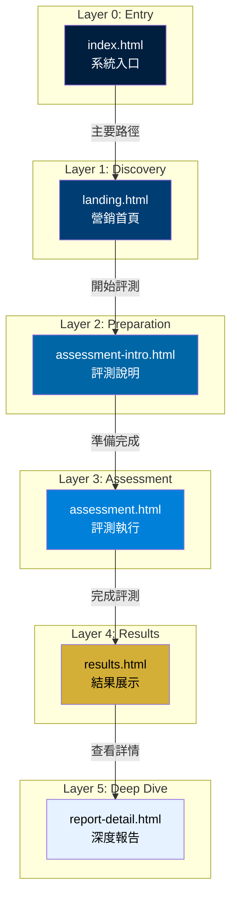
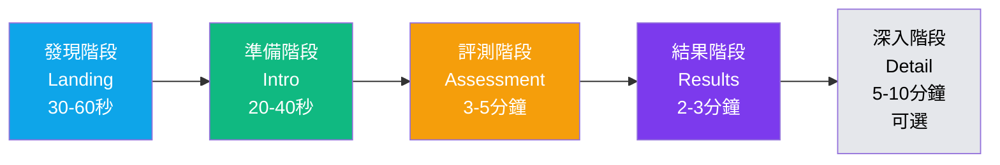
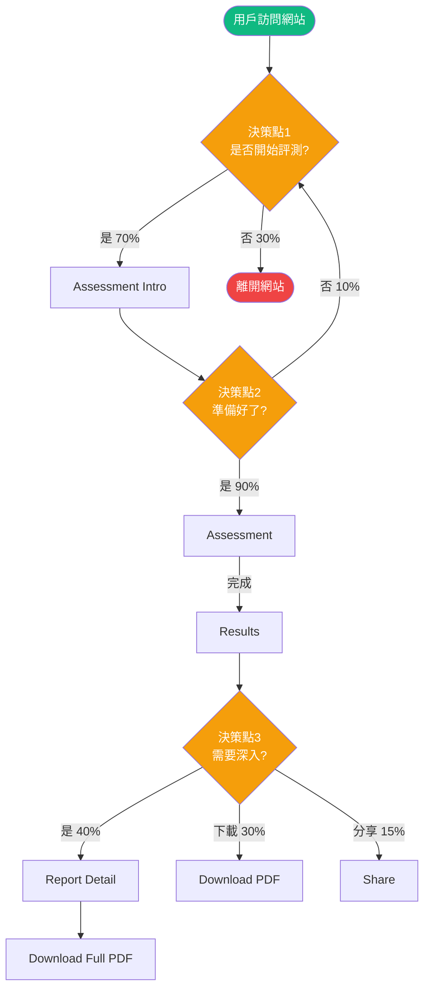
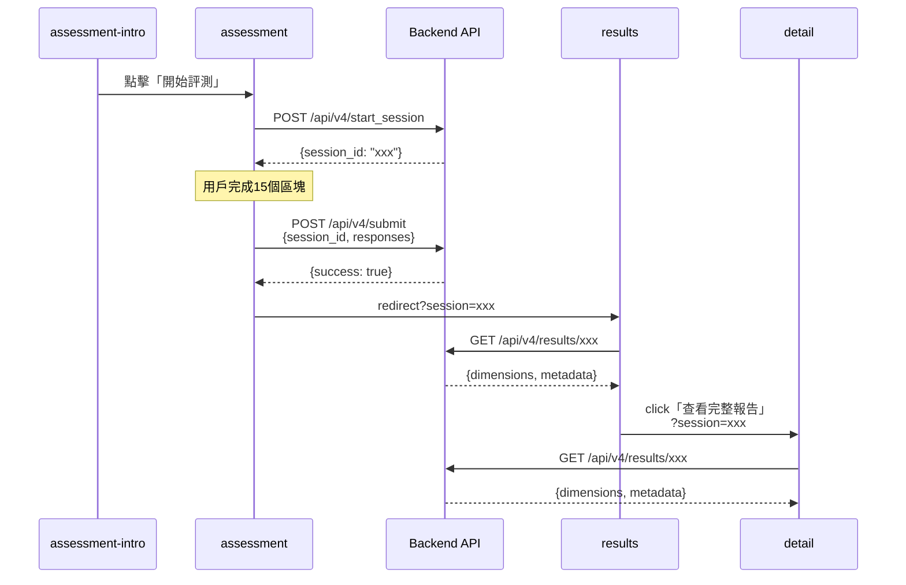

# 前端信息架構規範 (Frontend Information Architecture Specification)

---

**文件版本 (Document Version):** `v2.1-Integrated`  
**最後更新 (Last Updated):** `2025-10-03`  
**主要作者 (Lead Author):** `UX/UI Team, Frontend Architecture Team`  
**審核者 (Reviewers):** `PM, Technical Lead, Product Designer`  
**狀態 (Status):** `已批准 (Approved)`  
**相關文檔:** `[PRD](../VibeCoding_Workflow_Templates/02_project_brief_and_prd.md)`, `[Frontend Architecture](../../VibeCoding_Workflow_Templates/12_frontend_architecture_specification.md)`

---

## 目錄 (Table of Contents)

- [1. 文檔目的與範圍](#1-文檔目的與範圍)
- [2. 核心設計原則](#2-核心設計原則)
- [3. 資訊架構總覽](#3-資訊架構總覽)
- [4. 核心用戶旅程](#4-核心用戶旅程)
- [5. 網站地圖與導航結構](#5-網站地圖與導航結構)
- [6. 頁面詳細規格](#6-頁面詳細規格)
- [7. 組件連結與導航系統](#7-組件連結與導航系統)
- [8. 數據流與狀態管理](#8-數據流與狀態管理)
- [9. URL 結構與路由規範](#9-url-結構與路由規範)
- [10. 實施檢查清單與驗收標準](#10-實施檢查清單與驗收標準)
- [11. 附錄](#11-附錄)

---

## 1. 文檔目的與範圍

### 1.1 目的 (Purpose)

本文檔旨在提供優勢評測系統前端的完整信息架構規範，作為前端開發、設計與測試的**單一事實來源 (SSOT)**。

**核心目標：**
- ✅ 定義清晰的用戶旅程與頁面職責
- ✅ 規範導航結構與URL設計
- ✅ 統一前端數據流與狀態管理策略
- ✅ 提供可執行的實施檢查清單

### 1.2 適用範圍 (Scope)

| 適用範圍 | 說明 |
|:---|:---|
| **包含 (In Scope)** | - 所有前端頁面的信息架構<br/>- 用戶旅程與導航設計<br/>- URL結構與路由規範<br/>- 頁面間數據傳遞<br/>- Session管理策略 |
| **不包含 (Out of Scope)** | - 視覺設計細節（參考 UI/UX Spec）<br/>- 組件級別實現（參考 Component Library）<br/>- 後端 API 設計（參考 API Design Spec） |

### 1.3 角色與職責 (RACI)

| 角色 | 職責 | 責任類型 |
|:---|:---|:---|
| **PM** | 定義用戶需求與核心旅程 | R/A |
| **UX Designer** | 設計信息架構與導航流程 | R/A |
| **Frontend Lead** | 審核技術可行性與實現方案 | A |
| **Frontend DEV** | 實現頁面與導航邏輯 | R |
| **QA** | 驗證用戶流程與導航正確性 | C |

---

## 2. 核心設計原則

### 2.1 設計哲學

**核心價值主張：**
> 「用科學方法發現你的天賦DNA，獲得專業優勢報告」

**第一性原理推演：**
```
商業目標：提供專業天賦評測報告
    ↓
用戶需求：了解自己的優勢組合
    ↓
設計策略：最短路徑從評測到報告
    ↓
架構決策：6頁精簡流程（1入口 + 5核心）
```

### 2.2 資訊架構原則

#### 2.2.1 簡化原則 (Simplification)

- ✅ **保留**：評測核心流程與報告呈現
- ❌ **移除**：所有行動建議、follow-up、歷史記錄功能
- 🎯 **專注**：一次性完整的天賦報告產出

#### 2.2.2 認知負荷優化

基於 **Hick's Law** 和 **認知負荷理論**：
- **決策點數量**：從原本 8 個減少到 3 個（-63%）
- **每頁專注度**：每個頁面只有 1 個主要目標
- **資訊分層**：先總覽（results）再深入（report-detail，可選）

#### 2.2.3 扁平化架構

- 所有頁面 URL 深度都是 Level 1（無子目錄）
- 導航深度最深為 4 次點擊
- 核心流程可達性 > 85%

---

## 3. 資訊架構總覽

### 3.1 系統層次結構



### 3.2 頁面總覽矩陣

| # | 頁面檔名 | 頁面名稱 | 主要職責 | 用戶目標 | 預期停留時間 | 導航深度 |
|:--|:---------|:---------|:---------|:---------|:-------------|:---------|
| 0 | `index.html` | 入口頁 | 提供系統入口 | 進入評測系統 | 5-10秒 | Level 0 |
| 1 | `landing.html` | 營銷首頁 | 建立信任、激發興趣 | 決定是否評測 | 30-60秒 | Level 1 |
| 2 | `assessment-intro.html` | 評測說明頁 | 設定期待、降低焦慮 | 了解流程並準備 | 20-40秒 | Level 2 |
| 3 | `assessment.html` | 評測執行頁 | 收集評測數據 | 完成評測 | 3-5分鐘 | Level 3 |
| 4 | `results.html` | 結果展示頁 | 呈現核心結果 | 理解自己優勢 | 2-3分鐘 | Level 4 |
| 5 | `report-detail.html` | 深度報告頁 | 提供完整分析 | 深入理解與下載 | 5-10分鐘 | Level 5 |

**總計：** 6 頁（1 入口 + 5 核心流程）

---

## 4. 核心用戶旅程

### 4.1 線性旅程設計



### 4.2 用戶旅程映射表

| 階段 | 頁面 | 用戶心理狀態 | 設計目標 | 主要CTA | 預期停留時間 | 轉換率目標 |
|:-----|:-----|:-------------|:---------|:--------|:-------------|:-----------|
| **發現** | landing.html | 好奇、觀望 | 建立信任、激發興趣 | 「開始評測」 | 30-60秒 | 85% |
| **準備** | assessment-intro.html | 期待、略緊張 | 設定預期、降低焦慮 | 「我準備好了」 | 20-40秒 | 90% |
| **評測** | assessment.html | 專注、投入 | 流暢體驗、持續參與 | 自動進入下一題 | 3-5分鐘 | 80% |
| **結果** | results.html | 興奮、期待 | 價值呈現、滿足感 | 「查看完整報告」 | 2-3分鐘 | 40% |
| **深入** | report-detail.html | 求知、深究 | 專業深度、完整性 | 「下載PDF」 | 5-10分鐘 | 60% |

### 4.3 決策點分析

**用戶在整個流程中的 3 個主要決策點：**



**總決策點：** 3 個（較 V1.0 的 8 個大幅減少 -63%）

---

## 5. 網站地圖與導航結構

### 5.1 完整網站地圖

```
優勢評測系統 (/)
│
├─ 0. index.html [入口層]
│  └─ → landing.html (主要路徑)
│
├─ 1. landing.html [發現層]
│  ├─ #methodology (錨點：科學方法)
│  ├─ #process (錨點：評測流程)
│  ├─ #insights (錨點：案例洞察)
│  ├─ #faq (錨點：常見問題)
│  └─ → assessment-intro.html (主CTA)
│
├─ 2. assessment-intro.html [準備層]
│  ├─ ← landing.html (返回)
│  └─ → assessment.html (開始評測)
│
├─ 3. assessment.html [評測層]
│  ├─ ← landing.html (中斷，需確認)
│  └─ → results.html?session={id} (完成)
│
├─ 4. results.html [結果層]
│  ├─ Query Params: ?session={sessionId} (必須)
│  ├─ → report-detail.html?session={id} (查看完整報告)
│  ├─ → [分享對話框] (分享功能)
│  ├─ → [PDF下載] (下載功能)
│  └─ → landing.html (重新測試)
│
└─ 5. report-detail.html [深度層]
   ├─ Query Params: ?session={sessionId} (必須)
   ├─ ← results.html?session={id} (返回結果)
   ├─ → [完整PDF下載]
   ├─ → [分享報告]
   └─ → landing.html (重新測試)
```

### 5.2 導航連結矩陣

| 來源頁面 \ 目標頁面 | Index | Landing | Intro | Assessment | Results | Detail |
|:-------------------|:------|:--------|:------|:-----------|:--------|:-------|
| **Index** | - | ✅ 主要 | ⚠️ 跳過 | ❌ | ❌ | ❌ |
| **Landing** | ❌ | - | ✅ 主CTA | ⚠️ 跳過 | ❌ | ❌ |
| **Intro** | ❌ | ✅ 返回 | - | ✅ 開始 | ❌ | ❌ |
| **Assessment** | ❌ | ⚠️ 中斷 | ❌ | - | ✅ 完成 | ❌ |
| **Results** | ❌ | ✅ 重測 | ❌ | ❌ | - | ✅ 深入 |
| **Detail** | ❌ | ✅ 重測 | ❌ | ❌ | ✅ 返回 | - |

**圖例：**
- ✅ 推薦路徑（直接可達）
- ⚠️ 需確認路徑（有對話框或驗證）
- ❌ 不存在路徑（不應該連結）

---

## 6. 頁面詳細規格

### 6.0 Index Page（入口頁）

#### 基本信息

| 屬性 | 值 |
|:-----|:---|
| **檔名** | `index.html` |
| **URL** | `/` 或 `/index.html` |
| **頁面類型** | 入口選擇頁 |
| **導航深度** | Level 0 |
| **SEO優先級** | 低（通常直接跳轉） |

#### 職責與目標

| 項目 | 內容 |
|:-----|:-----|
| **主要任務** | 提供系統入口 |
| **次要任務** | 品牌展示 |
| **用戶目標** | 快速進入評測系統 |

#### 關鍵組件

```html
<page-structure>
  <brand>
    <logo>優勢評測系統</logo>
    <tagline>發現你的天賦DNA</tagline>
  </brand>
  
  <entry-card>
    <icon>🧬</icon>
    <title>開始專業評測</title>
    <description>3分鐘科學評測，獲得專業優勢報告</description>
    <cta-primary href="landing.html">進入系統</cta-primary>
  </entry-card>
  
  <quick-links>
    <link href="landing.html#methodology">科學方法</link>
    <link href="landing.html#insights">成功案例</link>
  </quick-links>
  
  <version-info>v4.1 • Thurstonian IRT</version-info>
</page-structure>
```

#### 導航出口

```javascript
{
  primary: 'landing.html',
  quickLinks: [
    'landing.html#methodology',
    'landing.html#insights'
  ]
}
```

#### 驗收標準 (DoD)

- [ ] 品牌 Logo 和標題清晰可見
- [ ] 主要入口卡片視覺突出
- [ ] 點擊進入按鈕正確跳轉到 landing.html
- [ ] 快速連結錨點導航正常
- [ ] 版本資訊正確顯示
- [ ] 頁面載入時間 < 1秒

---

### 6.1 Landing Page（營銷首頁）

#### 基本信息

| 屬性 | 值 |
|:-----|:---|
| **檔名** | `landing.html` |
| **URL** | `/landing.html` |
| **頁面類型** | 營銷轉換頁 |
| **導航深度** | Level 1 |
| **SEO優先級** | ⭐⭐⭐⭐⭐ 高（主要入口） |

#### 職責與目標

| 項目 | 內容 |
|:-----|:-----|
| **主要任務** | 建立信任，激發評測興趣 |
| **次要任務** | 說明科學依據，展示價值 |
| **用戶目標** | 決定是否開始評測 |
| **轉換目標** | 85% 點擊「開始評測」CTA |

#### AIDA 模型映射

| AIDA階段 | 對應區塊 | 設計策略 |
|:---------|:---------|:---------|
| **Attention** | 英雄區塊 | 視覺衝擊、價值主張 |
| **Interest** | 方法論展示 | 科學背書、3大特色 |
| **Desire** | 案例洞察 | 社會認同、成功案例 |
| **Action** | CTA按鈕 | 行動號召、信任指標 |

#### 關鍵組件結構

```html
<page-structure>
  <!-- 1. 專業頂部導航 -->
  <nav class="top-navigation">
    <logo>優勢評測系統</logo>
    <menu>
      <item href="#methodology">評測介紹</item>
      <item href="#process">科學方法</item>
      <item href="#faq">常見問題</item>
    </menu>
    <cta-button href="assessment-intro.html">開始評測</cta-button>
  </nav>

  <!-- 2. 英雄區塊 -->
  <section class="hero">
    <h1>發現你的天賦DNA組合</h1>
    <h2>3分鐘科學評測，獲得專業優勢報告</h2>
    <cta-primary href="assessment-intro.html">開始免費評測</cta-primary>
    <trust-badges>
      <badge>100萬+用戶</badge>
      <badge>95%準確度</badge>
      <badge>3分鐘完成</badge>
    </trust-badges>
  </section>

  <!-- 3. 方法論展示（3卡片） -->
  <section id="methodology" class="value-proposition">
    <card>
      <icon>🧬</icon>
      <title>科學化評測</title>
      <desc>基於Thurstonian IRT與常模百分位</desc>
    </card>
    <card>
      <icon>📊</icon>
      <title>專業報告</title>
      <desc>DNA雙螺旋視覺化12維度優勢</desc>
    </card>
    <card>
      <icon>🎯</icon>
      <title>精準洞察</title>
      <desc>三層分級系統，明確主導/支援才幹</desc>
    </card>
  </section>

  <!-- 4. 評測流程時間軸（4步驟） -->
  <section id="process" class="process-timeline">
    <step number="1">填寫評測問卷（3-5分鐘）</step>
    <step number="2">AI演算法分析</step>
    <step number="3">生成個人化報告</step>
    <step number="4">下載專屬報告</step>
  </section>

  <!-- 5. 案例洞察輪播 -->
  <section id="insights" class="testimonials">
    <carousel>
      <testimonial>
        <quote>「找到了最適合的職業方向...」</quote>
        <author>產品經理 - 張小姐</author>
      </testimonial>
      <!-- 更多見證... -->
    </carousel>
  </section>

  <!-- 6. 常見問題 -->
  <section id="faq" class="faq">
    <accordion>
      <item question="評測需要多久時間？">
        約3-5分鐘即可完成...
      </item>
      <!-- 更多FAQ... -->
    </accordion>
  </section>

  <!-- 7. 最終CTA區塊 -->
  <section class="cta-final">
    <h3>準備好發現你的優勢了嗎？</h3>
    <cta-primary href="assessment-intro.html">立即開始評測</cta-primary>
  </section>
</page-structure>
```

#### 導航出口

```javascript
{
  primary: 'assessment-intro.html',
  anchors: [
    '#methodology',
    '#process',
    '#insights',
    '#faq'
  ]
}
```

#### 關鍵指標 (KPIs)

| 指標 | 目標值 | 衡量方式 |
|:-----|:-------|:---------|
| **轉換率** | ≥ 85% | 點擊「開始評測」CTA 的比例 |
| **停留時間** | 30-60秒 | Google Analytics 平均停留時間 |
| **跳出率** | < 30% | 離開率 |
| **錨點點擊率** | ≥ 40% | 至少點擊一個錨點導航 |

#### 驗收標準 (DoD)

- [ ] 所有7個核心區塊已實現
- [ ] 英雄區塊視覺衝擊力強
- [ ] 3個價值卡片對齊居中
- [ ] 錨點平滑滾動正常
- [ ] CTA按鈕視覺突出（主色調）
- [ ] 信任指標數據準確
- [ ] 移動端響應式正常
- [ ] SEO meta tags 完整

---

### 6.2 Assessment Intro（評測說明頁）

#### 基本信息

| 屬性 | 值 |
|:-----|:---|
| **檔名** | `assessment-intro.html` |
| **URL** | `/assessment-intro.html` |
| **URL參數** | `?source=landing`（可選） |
| **頁面類型** | 準備與指南頁 |
| **導航深度** | Level 2 |
| **SEO優先級** | ⭐⭐⭐ 中 |

#### 職責與目標

| 項目 | 內容 |
|:-----|:-----|
| **主要任務** | 設定正確期待，降低評測焦慮 |
| **次要任務** | 提供評測指南 |
| **用戶目標** | 了解流程並做好準備 |
| **轉換目標** | 90% 點擊「開始評測」 |

#### 心理學原理應用

| 原理 | 應用方式 | 預期效果 |
|:-----|:---------|:---------|
| **降低認知負荷** | 分塊呈現資訊（3+4結構） | 易於理解 |
| **減少焦慮** | 明確說明「無對錯」 | 提升完成率 |
| **建立信任** | 展示自動保存功能 | 安心作答 |

#### 關鍵組件結構

```html
<page-structure>
  <!-- 1. 麵包屑導航 -->
  <breadcrumb>
    <link href="landing.html">首頁</link>
    <separator>></separator>
    <span class="current">評測說明</span>
  </breadcrumb>

  <!-- 2. 頁面標題區 -->
  <header class="page-header">
    <label-en>Assessment Preparation</label-en>
    <title>評測流程說明</title>
    <subtitle>確保最佳測試體驗</subtitle>
  </header>

  <!-- 3. 評測概覽（3卡片） -->
  <section class="assessment-overview">
    <info-card>
      <icon>⏱️</icon>
      <label>評測時長</label>
      <value>約3-5分鐘</value>
    </info-card>
    <info-card>
      <icon>📝</icon>
      <label>題目數量</label>
      <value>15個選擇區塊</value>
    </info-card>
    <info-card>
      <icon>✅</icon>
      <label>評測方式</label>
      <value>四選二強迫選擇</value>
    </info-card>
  </section>

  <!-- 4. 評測指南（4項，2x2網格） -->
  <section class="guidelines">
    <guideline>
      <icon>✅</icon>
      <title>沒有對錯答案</title>
      <desc>所有答案都是您真實想法的反映</desc>
    </guideline>
    <guideline>
      <icon>✅</icon>
      <title>憑直覺選擇</title>
      <desc>不必過度思考，第一反應往往最準確</desc>
    </guideline>
    <guideline>
      <icon>✅</icon>
      <title>確保環境安靜</title>
      <desc>選擇不受打擾的環境以確保專注</desc>
    </guideline>
    <guideline>
      <icon>✅</icon>
      <title>進度自動保存</title>
      <desc>您可以隨時暫停，稍後繼續</desc>
    </guideline>
  </section>

  <!-- 5. 開始評測按鈕 -->
  <section class="cta-section">
    <button class="btn-primary" href="assessment.html">
      開始評測
    </button>
    <link class="link-secondary" href="landing.html">
      返回首頁
    </link>
  </section>
</page-structure>
```

#### 導航出口

```javascript
{
  primary: 'assessment.html',
  back: 'landing.html'
}
```

#### 關鍵指標 (KPIs)

| 指標 | 目標值 | 衡量方式 |
|:-----|:-------|:---------|
| **轉換率** | ≥ 90% | 點擊「開始評測」的比例 |
| **停留時間** | 20-40秒 | 平均閱讀時間 |
| **返回率** | < 10% | 點擊返回首頁的比例 |

#### 驗收標準 (DoD)

- [ ] 麵包屑導航顯示正確
- [ ] 3個概覽卡片對齊且數據準確
- [ ] 4個指南項使用2x2網格佈局
- [ ] 開始評測按鈕視覺突出
- [ ] 返回連結功能正常
- [ ] Icon 顯示正確
- [ ] 移動端佈局調整為單列

---

### 6.3 Assessment Page（評測執行頁）

#### 基本信息

| 屬性 | 值 |
|:-----|:---|
| **檔名** | `assessment.html` |
| **URL** | `/assessment.html` |
| **URL參數** | `?resume=true`（恢復進度時） |
| **頁面類型** | 互動評測頁 |
| **導航深度** | Level 3 |
| **SEO優先級** | ⭐ 低（需session） |

#### 職責與目標

| 項目 | 內容 |
|:-----|:-----|
| **主要任務** | 收集用戶評測數據 |
| **次要任務** | 維持專注與參與度 |
| **用戶目標** | 流暢完成15題評測 |
| **完成率目標** | > 80% |

#### 選擇邏輯規則

```javascript
// 核心規則（必須執行）
const RULES = {
  rule1: '每個區塊必須選擇一個「最像」和一個「最不像」',
  rule2: '同一選項不能同時是「最像」和「最不像」',
  rule3: '每種類型只能選擇一個選項',
  rule4: '兩個都選後，800ms自動進入下一題'
};

// 驗證邏輯
function validateBlock(selections) {
  const { most, least } = selections;
  
  // Rule 1: 兩個都必須選擇
  if (!most || !least) return false;
  
  // Rule 2: 不能是同一個
  if (most === least) return false;
  
  // Rule 3 & 4: 自動處理
  return true;
}
```

#### 關鍵組件結構

```html
<page-structure>
  <!-- 1. 固定頂部進度條 -->
  <header class="assessment-header fixed-top">
    <button class="btn-exit" onclick="confirmExit()">
      <icon>✕</icon>
      離開
    </button>
    
    <progress-indicator>
      <progress-bar>
        <fill style="width: {(current/total)*100}%"></fill>
      </progress-bar>
      <text>{current} / {total}</text>
    </progress-indicator>
    
    <estimated-time>
      預計剩餘：{remaining}分鐘
    </estimated-time>
  </header>

  <!-- 2. 主評測區域 -->
  <main class="assessment-body">
    <block-container data-block-id="{blockId}">
      <!-- 題目說明 -->
      <instruction>
        請選出「最像你」和「最不像你」的描述
      </instruction>
      
      <!-- 選項網格（2x2佈局） -->
      <options-grid class="grid-2x2">
        <option-card data-dimension="{dimension}" data-option-id="{id}">
          <text>{statement_text}</text>
          <selectors>
            <button class="selector-most" type="most">
              最像
            </button>
            <button class="selector-least" type="least">
              最不像
            </button>
          </selectors>
        </option-card>
        <!-- 重複4個選項 -->
      </options-grid>
      
      <!-- 導航操作 -->
      <actions class="block-navigation">
        <button class="btn-prev" disabled={isFirst}>
          上一題
        </button>
        <block-indicator>
          {current} / {total}
        </block-indicator>
        <button class="btn-next" disabled={!bothSelected}>
          下一題
        </button>
      </actions>
    </block-container>
  </main>

  <!-- 3. 側邊提示（桌面版） -->
  <aside class="assessment-sidebar desktop-only">
    <tip>
      <icon>💡</icon>
      <title>提示</title>
      <text>憑直覺選擇，沒有對錯</text>
    </tip>
    <progress-summary>
      <item>已完成：{completed}題</item>
      <item>剩餘：{remaining}題</item>
    </progress-summary>
  </aside>
</page-structure>
```

#### 導航邏輯

```javascript
class AssessmentNavigation {
  constructor() {
    this.currentBlock = 1;
    this.totalBlocks = 15;
    this.selections = {};
  }

  // 前進邏輯
  async nextBlock() {
    if (this.currentBlock === this.totalBlocks) {
      // 完成評測
      await this.submitResponses();
      window.location.href = `results.html?session=${this.sessionId}`;
    } else {
      this.currentBlock++;
      this.renderBlock(this.currentBlock);
    }
  }

  // 返回邏輯
  prevBlock() {
    if (this.currentBlock > 1) {
      this.currentBlock--;
      this.renderBlock(this.currentBlock);
    }
  }

  // 離開確認
  confirmExit() {
    if (confirm('確定要離開嗎？進度會被保存')) {
      this.saveProgress();
      window.location.href = 'landing.html';
    }
  }

  // 自動進入下一題
  onBothSelected() {
    this.showFeedback(); // 視覺反饋
    setTimeout(() => {
      this.nextBlock();
    }, 800); // 800ms延遲
  }
}
```

#### Session管理

```javascript
class AssessmentSession {
  // 進入時：創建session
  async initSession() {
    const response = await fetch('/api/v4/start_session', {
      method: 'POST'
    });
    const data = await response.json();
    this.sessionId = data.session_id;
    localStorage.setItem('session_id', this.sessionId);
  }

  // 進行中：本地暫存
  saveProgress() {
    const state = {
      sessionId: this.sessionId,
      currentBlock: this.currentBlock,
      selections: this.selections,
      timestamp: Date.now()
    };
    localStorage.setItem('assessment_progress', JSON.stringify(state));
  }

  // 完成時：提交所有作答
  async submitResponses() {
    await fetch('/api/v4/submit', {
      method: 'POST',
      body: JSON.stringify({
        session_id: this.sessionId,
        responses: this.selections
      })
    });
  }
}
```

#### 導航出口

```javascript
{
  complete: 'results.html?session={generatedId}',
  exit: 'landing.html', // 需確認
  error: '顯示錯誤 + 重試'
}
```

#### 關鍵指標 (KPIs)

| 指標 | 目標值 | 衡量方式 |
|:-----|:-------|:---------|
| **完成率** | > 80% | 提交成功的比例 |
| **平均時長** | 3-5分鐘 | 從開始到提交的時間 |
| **中途離開率** | < 15% | 未完成即離開的比例 |
| **錯誤率** | < 5% | 選擇違反規則的次數 |

#### 驗收標準 (DoD)

- [ ] 進度條動態更新正確
- [ ] 4個選項2x2網格佈局
- [ ] 選擇邏輯規則執行正確
- [ ] 自動進入下一題（800ms延遲）
- [ ] 上一題/下一題按鈕狀態正確
- [ ] 離開確認對話框顯示
- [ ] 進度自動保存到localStorage
- [ ] 完成後正確跳轉到results頁面
- [ ] Session ID正確生成和保存
- [ ] 錯誤處理完善（網路失敗等）

---

### 6.4 Results Page（結果展示頁）

#### 基本信息

| 屬性 | 值 |
|:-----|:---|
| **檔名** | `results.html` |
| **URL** | `/results.html?session={sessionId}` |
| **URL參數** | `session`（**必須**） |
| **頁面類型** | 數據展示頁 |
| **導航深度** | Level 4 |
| **SEO優先級** | ⭐ 低（動態內容） |

#### 職責與目標

| 項目 | 內容 |
|:-----|:-----|
| **主要任務** | 呈現評測結果，展示價值 |
| **次要任務** | 引導查看詳細報告或分享 |
| **用戶目標** | 理解自己的優勢組合 |
| **深入轉換率** | 40% 點擊「查看完整報告」 |

#### 數據載入邏輯

```javascript
async function loadResults(sessionId) {
  try {
    // 1. 驗證session
    if (!sessionId || !validateSession(sessionId)) {
      throw new Error('Invalid session');
    }
    
    // 2. 從API獲取結果
    const response = await fetch(`/api/v4/results/${sessionId}`);
    const data = await response.json();
    
    // 3. 驗證數據完整性
    if (!data.dimensions || data.dimensions.length !== 12) {
      throw new Error('Invalid dimension data');
    }
    
    // 4. 計算分層
    const { byTier, sorted } = useTiered(data.dimensions);
    
    // 5. 計算職業原型
    const persona = calculatePersona(byTier.dominant);
    
    // 6. 渲染UI
    renderResults({ byTier, sorted, persona, ...data });
    
  } catch (error) {
    // 錯誤處理
    showError('無法載入結果，請重新測試');
    setTimeout(() => redirectTo('landing.html'), 3000);
  }
}

// 分層邏輯
function useTiered(dimensions) {
  const byTier = {
    dominant: dimensions.filter(d => d.percentile > 75),
    supporting: dimensions.filter(d => d.percentile >= 25 && d.percentile <= 75),
    lesser: dimensions.filter(d => d.percentile < 25)
  };
  
  const sorted = [...dimensions].sort((a, b) => b.percentile - a.percentile);
  
  return { byTier, sorted };
}
```

#### 關鍵組件結構

```html
<page-structure>
  <!-- 1. 報告標題區 -->
  <header class="results-header">
    <brand>
      <logo>優勢評測系統 v4.1</logo>
      <subtitle>Thurstonian IRT • 常模化百分位</subtitle>
    </brand>
    <actions>
      <button class="btn-share">分享報告</button>
      <button class="btn-download">下載 PDF</button>
    </actions>
  </header>

  <!-- 2. Session資訊 -->
  <section class="session-info">
    <info-item>
      <label>Session:</label>
      <value>{sessionId}</value>
    </info-item>
    <info-item>
      <label>測試時間:</label>
      <value>{timestamp}</value>
    </info-item>
    <confidence-meter value="{confidence}">
      <label>置信度:</label>
      <bar style="width: {confidence*100}%"></bar>
      <value>{Math.round(confidence*100)}%</value>
    </confidence-meter>
  </section>

  <!-- 3. KPI Dashboard（執行摘要） -->
  <section class="kpi-summary">
    <kpi-card class="dominant">
      <icon>🌟</icon>
      <label>主導才幹</label>
      <value>{dominant.length}</value>
      <desc>> 75 百分位</desc>
    </kpi-card>
    <kpi-card class="supporting">
      <icon>🔧</icon>
      <label>支援才幹</label>
      <value>{supporting.length}</value>
      <desc>25-75 百分位</desc>
    </kpi-card>
    <kpi-card class="lesser">
      <icon>📊</icon>
      <label>待管理領域</label>
      <value>{lesser.length}</value>
      <desc>< 25 百分位</desc>
    </kpi-card>
  </section>

  <!-- 4. DNA視覺化 -->
  <section class="dna-visualization">
    <title>你的優勢DNA</title>
    <subtitle>雙螺旋結構展示12維度強度</subtitle>
    <svg-helix dimensions="{sorted}">
      <!-- DNA雙螺旋SVG -->
      <!-- 12維度節點，大小編碼強度 -->
      <!-- 四領域色彩編碼 -->
    </svg-helix>
    <legend>
      <item color="#FF6B6B">執行力領域</item>
      <item color="#4ECDC4">影響力領域</item>
      <item color="#95E1D3">關係建立領域</item>
      <item color="#FFA07A">策略思維領域</item>
    </legend>
  </section>

  <!-- 5. 三層分級列表 -->
  <section class="tiered-talents">
    <column class="dominant-column">
      <title>主導才幹 (Dominant)</title>
      <desc>這些是您的核心優勢</desc>
      <talent-list>
        {byTier.dominant.map(d => (
          <talent-item>
            <badge color="{d.domain.color}">{d.domain.zh}</badge>
            <name>{d.name}</name>
            <percentile>PR {d.percentile}</percentile>
          </talent-item>
        ))}
      </talent-list>
    </column>
    
    <column class="supporting-column">
      <title>支援才幹 (Supporting)</title>
      <desc>這些是您的輔助優勢</desc>
      <talent-list>
        {byTier.supporting.map(d => (...))}
      </talent-list>
    </column>
    
    <column class="lesser-column">
      <title>待管理領域 (Lesser)</title>
      <desc>這些領域需要更多發展</desc>
      <talent-list>
        {byTier.lesser.map(d => (...))}
      </talent-list>
    </column>
  </section>

  <!-- 6. 職業原型洞察 -->
  <section class="persona-insight">
    <title>職業原型參考（Beta）</title>
    <persona-card data="{persona}">
      <icon>{persona.icon}</icon>
      <name>{persona.name}</name>
      <hint>{persona.hint}</hint>
      <suggestions>
        <item>
          <label>建議職位:</label>
          <value>{suggestedRoles.join(', ')}</value>
        </item>
        <item>
          <label>關鍵情境:</label>
          <value>{keyContexts.join(', ')}</value>
        </item>
      </suggestions>
    </persona-card>
  </section>

  <!-- 7. 方法論說明 -->
  <section class="methodology">
    <title>方法論與解讀門檻</title>
    <explanation-grid>
      <item>
        <label>Thurstonian IRT:</label>
        <desc>由強制選擇完整作答模式推估12維度潛在分數θ。</desc>
      </item>
      <item>
        <label>常模百分位:</label>
        <desc>與代表性樣本對比，支持跨人比較（Normative）。</desc>
      </item>
      <item>
        <label>分層規則:</label>
        <desc>PR>75 主導；PR 25–75 支援；PR<25 較弱。</desc>
      </item>
      <item>
        <label>置信度:</label>
        <desc>基於題項資訊量與收斂準則計算。</desc>
      </item>
    </explanation-grid>
  </section>

  <!-- 8. 行動區塊 -->
  <footer class="results-footer">
    <cta-primary href="report-detail.html?session={sessionId}">
      查看完整詳細報告
    </cta-primary>
    <cta-secondary href="landing.html">
      重新測試
    </cta-secondary>
  </footer>
</page-structure>
```

#### 導航出口

```javascript
{
  detail: 'report-detail.html?session={sessionId}',
  share: '觸發分享對話框',
  download: '生成並下載PDF',
  retest: 'landing.html'
}
```

#### 關鍵指標 (KPIs)

| 指標 | 目標值 | 衡量方式 |
|:-----|:-------|:---------|
| **停留時間** | 2-3分鐘 | 平均頁面停留時間 |
| **深入轉換率** | 40% | 點擊「查看完整報告」 |
| **分享率** | 15% | 使用分享功能 |
| **下載率** | 30% | 下載PDF |

#### 驗收標準 (DoD)

- [ ] Session驗證邏輯正確
- [ ] KPI卡片數據正確計算
- [ ] DNA視覺化渲染正常
- [ ] 三層分級列表正確分類
- [ ] 職業原型計算準確
- [ ] 方法論說明清晰
- [ ] 所有CTA按鈕功能正常
- [ ] 分享對話框彈出正確
- [ ] PDF下載功能正常
- [ ] 錯誤處理完善

---

### 6.5 Report Detail（深度報告頁）

#### 基本信息

| 屬性 | 值 |
|:-----|:---|
| **檔名** | `report-detail.html` |
| **URL** | `/report-detail.html?session={sessionId}` |
| **URL參數** | `session`（**必須**） |
| **頁面類型** | 詳細分析頁 |
| **導航深度** | Level 5 |
| **SEO優先級** | ⭐ 低（動態內容） |

#### 職責與目標

| 項目 | 內容 |
|:-----|:-----|
| **主要任務** | 提供完整專業報告 |
| **次要任務** | 鼓勵下載完整PDF |
| **用戶目標** | 深入理解優勢組合 |
| **PDF下載率** | 60% |

#### 內容深度規格

| 項目 | 規格 |
|:-----|:-----|
| **字數** | 約5000-8000字 |
| **圖表** | 12個百分位對比圖 + 1個雷達圖 |
| **表格** | 職業矩陣、信效度指標 |
| **公式** | Thurstonian IRT數學表達 |

#### 關鍵組件結構

```html
<page-structure>
  <!-- 1. 報告標題與麵包屑 -->
  <header class="report-header">
    <breadcrumb>
      <link href="landing.html">首頁</link>
      <separator>></separator>
      <link href="results.html?session={sessionId}">評測結果</link>
      <separator>></separator>
      <span class="current">完整報告</span>
    </breadcrumb>
    <title>完整優勢報告</title>
    <session-info>{sessionId} • {timestamp}</session-info>
    <actions>
      <button class="btn-back" href="results.html?session={sessionId}">
        返回結果
      </button>
      <button class="btn-download-full">
        下載完整PDF
      </button>
    </actions>
  </header>

  <!-- 2. 執行摘要（重複Results核心） -->
  <section class="report-summary">
    <!-- 重複KPI + DNA視覺化 + 分級列表 -->
    <!-- 可折疊，預設展開 -->
  </section>

  <!-- 3. 12維度深度解析（手風琴） -->
  <section class="dimension-details">
    <title>12維度深度解析</title>
    <accordion>
      {dimensions.map(dim => (
        <accordion-item key={dim.id} class="{tier-class}">
          <header>
            <badge color="{dim.domain.color}">
              {dim.domain.zh}
            </badge>
            <name>{dim.name}</name>
            <percentile-badge class="{tier}">
              PR {dim.percentile}
            </percentile-badge>
            <toggle-icon></toggle-icon>
          </header>
          
          <content>
            <!-- 維度定義 -->
            <subsection class="definition">
              <h4>維度定義</h4>
              <p>{dim.definition}</p>
            </subsection>
            
            <!-- 工作場景表現 -->
            <subsection class="workplace">
              <h4>工作場景表現</h4>
              <ul>
                {dim.workplaceExamples.map(ex => (
                  <li>{ex}</li>
                ))}
              </ul>
            </subsection>
            
            <!-- 如何發揮優勢 -->
            <subsection class="strengths-in-action">
              <h4>如何發揮優勢</h4>
              <p>{dim.strengthsInAction}</p>
            </subsection>
            
            <!-- 相似案例（名人） -->
            <subsection class="famous-examples">
              <h4>相似案例</h4>
              <ul>
                {dim.famousExamples.map(ex => (
                  <li>{ex}</li>
                ))}
              </ul>
            </subsection>
            
            <!-- 百分位對比圖 -->
            <subsection class="percentile-chart">
              <h4>常模百分位對比</h4>
              <chart-bar>
                <bar-fill style="width: {dim.percentile}%"></bar-fill>
                <marker class="you" style="left: {dim.percentile}%">
                  您
                </marker>
                <scale>
                  <tick value="0">0</tick>
                  <tick value="25">25</tick>
                  <tick value="50">50</tick>
                  <tick value="75">75</tick>
                  <tick value="100">100</tick>
                </scale>
              </chart-bar>
            </subsection>
          </content>
        </accordion-item>
      ))}
    </accordion>
  </section>

  <!-- 4. 優勢組合協同效應 -->
  <section class="synergy-analysis">
    <title>優勢組合協同效應</title>
    <subtitle>當這些優勢結合時...</subtitle>
    <synergy-grid>
      {calculateSynergies(topStrengths).map(syn => (
        <synergy-card>
          <combination>{syn.combination}</combination>
          <icon>✨</icon>
          <description>{syn.description}</description>
          <career-fit>
            <label>職業契合度:</label>
            <value>{syn.careerFit}</value>
          </career-fit>
        </synergy-card>
      ))}
    </synergy-grid>
  </section>

  <!-- 5. 職業方向參考矩陣 -->
  <section class="career-mapping">
    <title>職業方向參考矩陣</title>
    <subtitle>基於您的優勢組合</subtitle>
    <professional-table>
      <thead>
        <tr>
          <th>職業領域</th>
          <th>具體職位</th>
          <th>契合度</th>
          <th>需要優勢</th>
          <th>挑戰點</th>
        </tr>
      </thead>
      <tbody>
        {matchedCareers.map(career => (
          <tr>
            <td>{career.field}</td>
            <td>{career.title}</td>
            <td>
              <match-score value="{career.matchScore}">
                {career.matchScore}%
              </match-score>
            </td>
            <td>{career.requiredStrengths.join(', ')}</td>
            <td>{career.challenges}</td>
          </tr>
        ))}
      </tbody>
    </professional-table>
  </section>

  <!-- 6. 科學方法論詳解 -->
  <section class="methodology-deep">
    <title>科學方法論詳解</title>
    
    <subsection class="irt-theory">
      <h3>Thurstonian IRT 原理</h3>
      <p>說明強迫選擇與IRT理論...</p>
      <formula>
        <math-block>
          P(i > j | θ) = Φ(θ_i - θ_j)
        </math-block>
      </formula>
    </subsection>
    
    <subsection class="norm-building">
      <h3>常模建立過程</h3>
      <p>說明樣本收集與標準化...</p>
      <table>
        <tr>
          <th>樣本量</th>
          <td>10,000+ 有效樣本</td>
        </tr>
        <tr>
          <th>年齡範圍</th>
          <td>18-65歲</td>
        </tr>
        <tr>
          <th>職業分布</th>
          <td>覆蓋15個主要行業</td>
        </tr>
      </table>
    </subsection>
    
    <subsection class="reliability">
      <h3>信效度驗證</h3>
      <reliability-table>
        <thead>
          <tr>
            <th>指標</th>
            <th>數值</th>
            <th>說明</th>
          </tr>
        </thead>
        <tbody>
          <tr>
            <td>Cronbach's α</td>
            <td>0.89</td>
            <td>內部一致性信度</td>
          </tr>
          <tr>
            <td>Test-Retest</td>
            <td>0.85</td>
            <td>重測信度</td>
          </tr>
          <tr>
            <td>Content Validity</td>
            <td>專家評定</td>
            <td>內容效度</td>
          </tr>
        </tbody>
      </reliability-table>
    </subsection>
  </section>

  <!-- 7. 最終行動橫幅 -->
  <footer class="report-footer">
    <action-banner>
      <h3>完成您的優勢探索之旅</h3>
      <actions>
        <button class="btn-download-full">
          下載完整PDF報告
        </button>
        <button class="btn-share">
          分享報告連結
        </button>
        <button class="btn-retest" href="landing.html">
          重新測試
        </button>
      </actions>
    </action-banner>
  </footer>
</page-structure>
```

#### ❌ 已移除的元素

```html
<!-- V1.0 中已移除的內容 -->
<!-- ❌ <section class="action-plan"> -->
<!-- ❌ <section class="next-steps"> -->
<!-- ❌ <section class="progress-tracking"> -->
<!-- ❌ <button class="btn-schedule-followup"> -->
<!-- ❌ <section class="coaching-offers"> -->
<!-- ❌ <section class="premium-upgrade"> -->
<!-- ❌ <pricing-table> -->
```

#### 導航出口

```javascript
{
  back: 'results.html?session={sessionId}',
  downloadFull: '生成並下載完整PDF',
  share: '分享報告',
  retest: 'landing.html'
}
```

#### 關鍵指標 (KPIs)

| 指標 | 目標值 | 衡量方式 |
|:-----|:-------|:---------|
| **停留時間** | 5-10分鐘 | 平均頁面停留時間 |
| **滾動深度** | 平均70% | 頁面滾動百分比 |
| **PDF下載率** | 60% | 點擊下載完整PDF |
| **手風琴展開率** | > 50% | 至少展開一個維度詳情 |

#### 驗收標準 (DoD)

- [ ] 麵包屑導航功能正常
- [ ] 執行摘要可折疊
- [ ] 12個維度手風琴實現正確
- [ ] 每個維度包含5個子區塊
- [ ] 百分位對比圖渲染正確
- [ ] 優勢組合協同計算準確
- [ ] 職業矩陣表格樣式專業
- [ ] 信效度指標表格完整
- [ ] 數學公式渲染正確（MathJax）
- [ ] 完整PDF下載功能正常
- [ ] 分享功能正常
- [ ] 返回按鈕帶session參數

---

## 7. 組件連結與導航系統

### 7.1 Session參數傳遞鏈



### 7.2 導航系統實現

#### 7.2.1 全局導航管理器

```javascript
class NavigationManager {
  constructor() {
    this.history = [];
    this.currentPage = this.getCurrentPage();
    this.sessionId = this.getSessionId();
  }
  
  // 獲取當前頁面
  getCurrentPage() {
    const path = window.location.pathname;
    return path.split('/').pop().replace('.html', '');
  }
  
  // 獲取或驗證Session ID
  getSessionId() {
    const params = new URLSearchParams(window.location.search);
    const sessionId = params.get('session');
    
    if (sessionId && this.validateSession(sessionId)) {
      return sessionId;
    }
    return null;
  }
  
  // 驗證Session
  validateSession(sessionId) {
    // 檢查格式
    const pattern = /^\d{13}_[a-z0-9]{8}$/;
    if (!pattern.test(sessionId)) return false;
    
    // 檢查時效性（7天內有效）
    const timestamp = parseInt(sessionId.split('_')[0]);
    const sevenDaysAgo = Date.now() - (7 * 24 * 60 * 60 * 1000);
    return timestamp > sevenDaysAgo;
  }
  
  // 記錄導航歷史
  recordNavigation(from, to, data = {}) {
    this.history.push({
      from,
      to,
      timestamp: Date.now(),
      data
    });
    
    // 保存到localStorage（用於分析）
    localStorage.setItem('nav_history', JSON.stringify(this.history));
  }
  
  // 安全導航（帶驗證）
  safeNavigate(targetPage, requiredData = {}) {
    // 檢查必要數據
    if (['results', 'report-detail'].includes(targetPage) && !requiredData.sessionId) {
      console.error(`${targetPage} requires sessionId`);
      return this.navigateToLanding();
    }
    
    // 執行導航
    this.recordNavigation(this.currentPage, targetPage, requiredData);
    
    // 構建URL
    let url = `/${targetPage}.html`;
    if (requiredData.sessionId) {
      url += `?session=${requiredData.sessionId}`;
    }
    
    window.location.href = url;
  }
  
  // 返回Landing Page
  navigateToLanding() {
    window.location.href = '/landing.html';
  }
  
  // 智能返回
  goBack() {
    if (this.history.length > 0) {
      const lastNav = this.history[this.history.length - 1];
      window.location.href = `/${lastNav.from}.html`;
    } else {
      this.navigateToLanding();
    }
  }
}

// 全局導航管理器實例
const navManager = new NavigationManager();
```

#### 7.2.2 錨點平滑滾動

```javascript
// 平滑滾動到頁面內區塊
const anchorLinks = document.querySelectorAll('a[href^="#"]');

anchorLinks.forEach(link => {
  link.addEventListener('click', (e) => {
    e.preventDefault();
    const targetId = link.getAttribute('href').substring(1);
    const targetElement = document.getElementById(targetId);
    
    if (targetElement) {
      targetElement.scrollIntoView({
        behavior: 'smooth',
        block: 'start'
      });
      
      // 更新URL（不重新載入頁面）
      history.pushState(null, null, `#${targetId}`);
    }
  });
});
```

#### 7.2.3 麵包屑導航

```javascript
class BreadcrumbNavigation {
  constructor(containerId) {
    this.container = document.getElementById(containerId);
    this.sessionId = navManager.sessionId;
  }
  
  render(path) {
    // path 格式: ['首頁', '評測結果', '完整報告']
    const breadcrumbHTML = path.map((item, index) => {
      if (index === path.length - 1) {
        // 最後一項（當前頁）
        return `<span class="current">${item}</span>`;
      } else {
        // 可點擊項
        const href = this.getHref(index);
        return `
          <a href="${href}">${item}</a>
          <separator>></separator>
        `;
      }
    }).join('');
    
    this.container.innerHTML = breadcrumbHTML;
  }
  
  getHref(index) {
    const urlMap = {
      0: 'landing.html',
      1: `results.html?session=${this.sessionId}`,
      2: `report-detail.html?session=${this.sessionId}`
    };
    return urlMap[index] || 'landing.html';
  }
}
```

---

## 8. 數據流與狀態管理

### 8.1 評測數據流

（已在 6.3 Assessment Page 中詳細說明）

### 8.2 狀態持久化策略

```javascript
class StateManager {
  constructor() {
    this.storageKey = 'assessment_state';
    this.maxAge = 7 * 24 * 60 * 60 * 1000; // 7天
  }
  
  // 保存狀態
  saveState(state) {
    const stateWithTimestamp = {
      ...state,
      savedAt: Date.now()
    };
    localStorage.setItem(this.storageKey, JSON.stringify(stateWithTimestamp));
  }
  
  // 載入狀態
  loadState() {
    const savedData = localStorage.getItem(this.storageKey);
    if (!savedData) return null;
    
    const state = JSON.parse(savedData);
    
    // 檢查是否過期
    if (Date.now() - state.savedAt > this.maxAge) {
      this.clearState();
      return null;
    }
    
    return state;
  }
  
  // 清除狀態
  clearState() {
    localStorage.removeItem(this.storageKey);
  }
  
  // 獲取評測進度
  getProgress() {
    const state = this.loadState();
    if (!state || !state.responses) return null;
    
    return {
      currentBlock: state.currentBlock || 1,
      totalBlocks: state.totalBlocks || 15,
      percentage: Math.round((state.currentBlock / state.totalBlocks) * 100),
      canResume: true
    };
  }
}

// 全局狀態管理器
const stateManager = new StateManager();
```

### 8.3 數據流向圖

```mermaid
graph TB
    subgraph "Frontend"
        A[assessment.html]
        B[localStorage]
        C[results.html]
        D[report-detail.html]
    end
    
    subgraph "Backend API"
        E[/api/v4/start_session]
        F[/api/v4/submit]
        G[/api/v4/results/:id]
    end
    
    subgraph "File Storage"
        H[v4_sessions.json]
        I[v4_responses.json]
        J[v4_scores.json]
    end
    
    A -->|POST| E
    E -->|session_id| A
    A -->|暫存| B
    A -->|POST responses| F
    F -->|計算分數| I
    I -->|存儲| J
    
    C -->|GET ?session=xxx| G
    D -->|GET ?session=xxx| G
    G -->|讀取| J
    G -->|返回 dimensions| C
    G -->|返回 dimensions| D
    
    E -->|創建| H
    F -->|更新| H
    
    style A fill:#0080D9,color:#fff
    style C fill:#D4AF37,color:#000
    style D fill:#E6F2FF,color:#000
    style E fill:#10B981,color:#fff
    style F fill:#10B981,color:#fff
    style G fill:#10B981,color:#fff
```

---

## 9. URL 結構與路由規範

### 9.1 完整URL清單

```
站點根目錄: https://strengths-assessment.example.com/

核心頁面 URL:
├── /                                      [入口選擇]
├── /index.html                            [入口選擇]
├── /landing.html                          [營銷首頁]
├── /assessment-intro.html                 [評測說明]
├── /assessment.html                       [評測執行]
├── /results.html?session={sessionId}      [結果頁面] *必須帶session
└── /report-detail.html?session={sessionId} [詳細報告] *必須帶session

錨點導航 URL:
├── /landing.html#methodology              [科學方法]
├── /landing.html#process                  [評測流程]
├── /landing.html#insights                 [案例洞察]
└── /landing.html#faq                      [常見問題]

API 端點:
├── POST /api/v4/start_session             [創建Session]
├── POST /api/v4/submit                    [提交作答]
└── GET  /api/v4/results/{sessionId}       [獲取結果]
```

### 9.2 URL驗證與錯誤處理

```javascript
class URLValidator {
  // 驗證Results頁面URL
  static validateResultsURL() {
    const params = new URLSearchParams(window.location.search);
    const sessionId = params.get('session');
    
    if (!sessionId) {
      this.handleMissingSession();
      return false;
    }
    
    if (!navManager.validateSession(sessionId)) {
      this.handleInvalidSession();
      return false;
    }
    
    return true;
  }
  
  // 處理缺少Session
  static handleMissingSession() {
    showToast({
      type: 'error',
      message: '缺少評測Session，將返回首頁'
    });
    
    setTimeout(() => {
      window.location.href = '/landing.html';
    }, 2000);
  }
  
  // 處理無效Session
  static handleInvalidSession() {
    showToast({
      type: 'warning',
      message: 'Session已過期或無效，請重新評測'
    });
    
    setTimeout(() => {
      window.location.href = '/landing.html';
    }, 2000);
  }
}

// 在Results和Detail頁面使用
if (['results', 'report-detail'].includes(navManager.currentPage)) {
  if (!URLValidator.validateResultsURL()) {
    // 驗證失敗，已自動處理
  }
}
```

### 9.3 Session ID規範

```javascript
// Session ID 格式
const SESSION_ID_FORMAT = /^\d{13}_[a-z0-9]{8}$/;

// Session ID 生成
function generateSessionId() {
  const timestamp = Date.now();
  const random = Math.random().toString(36).substring(2, 10);
  return `${timestamp}_${random}`;
}

// 範例: "1704268800000_a1b2c3d4"
```

---

## 10. 實施檢查清單與驗收標準

### 10.1 開發階段檢查清單

#### Phase 1: 頁面結構開發（Week 1-2）

| 任務 | 負責人 | 狀態 | 驗收標準 |
|:-----|:-------|:-----|:---------|
| **0. Index Page** | Frontend DEV | ⬜ | - [ ] 入口卡片顯示正確<br/>- [ ] 跳轉功能正常 |
| **1. Landing Page** | Frontend DEV | ⬜ | - [ ] 7個核心區塊完整<br/>- [ ] 錨點導航正常<br/>- [ ] CTA視覺突出 |
| **2. Intro Page** | Frontend DEV | ⬜ | - [ ] 3+4卡片佈局正確<br/>- [ ] 開始按鈕功能正常 |
| **3. Assessment Page** | Frontend DEV | ⬜ | - [ ] 15題評測邏輯正確<br/>- [ ] 進度條動態更新<br/>- [ ] 自動進入下一題 |
| **4. Results Page** | Frontend DEV | ⬜ | - [ ] Session驗證正確<br/>- [ ] 數據分層準確<br/>- [ ] DNA視覺化渲染 |
| **5. Detail Page** | Frontend DEV | ⬜ | - [ ] 12維度手風琴<br/>- [ ] 職業矩陣表格<br/>- [ ] PDF下載功能 |

#### Phase 2: 導航與數據流（Week 3）

| 任務 | 負責人 | 狀態 | 驗收標準 |
|:-----|:-------|:-----|:---------|
| **導航系統** | Frontend DEV | ⬜ | - [ ] 全局導航管理器<br/>- [ ] Session參數傳遞<br/>- [ ] 錯誤處理完善 |
| **狀態管理** | Frontend DEV | ⬜ | - [ ] localStorage保存<br/>- [ ] 進度恢復功能<br/>- [ ] 過期檢查 |
| **API整合** | Frontend DEV | ⬜ | - [ ] 3個API端點調用正確<br/>- [ ] 錯誤處理完善 |

#### Phase 3: 交互與優化（Week 4）

| 任務 | 負責人 | 狀態 | 驗收標準 |
|:-----|:-------|:-----|:---------|
| **錨點平滑滾動** | Frontend DEV | ⬜ | - [ ] 所有錨點鏈接正常 |
| **手風琴交互** | Frontend DEV | ⬜ | - [ ] 展開/收合動畫流暢 |
| **分享功能** | Frontend DEV | ⬜ | - [ ] 分享對話框彈出<br/>- [ ] 複製連結功能 |
| **PDF下載** | Frontend DEV | ⬜ | - [ ] PDF生成正確<br/>- [ ] 下載觸發正常 |

### 10.2 質量檢查清單

#### 用戶體驗 (UX)

- [ ] 從首頁到結果頁面可在5分鐘內完成
- [ ] 所有導航路徑清晰無歧義
- [ ] 無死鏈或404錯誤
- [ ] 錯誤提示友好且可操作
- [ ] 載入狀態明確可見
- [ ] 移動端體驗流暢

#### 技術規範 (Technical)

- [ ] 所有URL符合規範
- [ ] Session驗證邏輯正確
- [ ] 狀態持久化功能正常
- [ ] API調用錯誤處理完善
- [ ] 無Console錯誤或警告
- [ ] 代碼符合ESLint規範

#### 內容完整性 (Content)

- [ ] 所有保留頁面內容完整
- [ ] 文案無錯別字
- [ ] 圖片和圖標正常顯示
- [ ] 數據視覺化渲染正確
- [ ] PDF內容完整準確

#### 性能指標 (Performance)

- [ ] LCP < 2.5s
- [ ] FID < 100ms
- [ ] CLS < 0.1
- [ ] 頁面體積 < 2MB
- [ ] API響應時間 < 500ms

#### SEO與無障礙性 (SEO & A11y)

- [ ] 所有頁面有完整meta tags
- [ ] 圖片有alt屬性
- [ ] 語義化HTML
- [ ] 鍵盤導航支持
- [ ] 螢幕閱讀器兼容

### 10.3 測試矩陣

| 測試類型 | 測試範圍 | 工具/方法 | 負責人 | 完成標準 |
|:---------|:---------|:----------|:-------|:---------|
| **單元測試** | 核心函數（驗證、計算等） | Jest | DEV | 覆蓋率 > 80% |
| **整合測試** | API調用與數據流 | Cypress | QA | 核心流程通過 |
| **E2E測試** | 完整用戶旅程 | Playwright | QA | 5個頁面流程通過 |
| **性能測試** | 頁面載入與交互 | Lighthouse | DEV | 所有指標 > 90 |
| **無障礙測試** | WCAG 2.1 AA | axe DevTools | QA | 無嚴重問題 |
| **跨瀏覽器** | Chrome, Firefox, Safari, Edge | BrowserStack | QA | 一致性 > 95% |
| **響應式測試** | Mobile, Tablet, Desktop | Chrome DevTools | QA | 三種尺寸正常 |

### 10.4 上線前最終檢查 (Go/No-Go Checklist)

#### Gate 準入條件

- [ ] 所有P0功能已完成並測試通過
- [ ] 無阻斷性Bug
- [ ] 性能指標達標
- [ ] 安全掃描通過

#### Gate 準出條件

- [ ] PM 確認功能完整性
- [ ] Frontend Lead 確認代碼品質
- [ ] QA 確認測試覆蓋
- [ ] SRE 確認部署就緒

#### 角色簽核 (RACI)

| 角色 | 責任 | 簽核狀態 |
|:-----|:-----|:---------|
| **PM** | 確認產品需求滿足 | ⬜ |
| **Frontend Lead** | 確認技術實現品質 | ⬜ |
| **QA Lead** | 確認測試覆蓋與結果 | ⬜ |
| **SRE** | 確認監控與部署準備 | ⬜ |

---

## 11. 附錄

### 11.1 與舊版本的變更對比

#### 頁面變更清單

| 頁面 | V1.0狀態 | V2.0狀態 | 變更說明 |
|:-----|:---------|:---------|:---------|
| index.html | ✅ 存在 | ✅ 保留 | 簡化：移除版本選擇 |
| landing.html | ✅ 存在 | ✅ 保留 | 功能不變 |
| assessment-intro.html | ✅ 存在 | ✅ 保留 | 簡化：移除版本選擇器 |
| assessment.html | ✅ 存在 | ✅ 保留 | 功能不變 |
| **v4_pilot_test.html** | ✅ 存在 | ❌ **移除** | 統一為單一評測路徑 |
| results.html | ✅ 存在 | ✅ 保留 | 強化：移除行動計劃CTA |
| report-detail.html | ✅ 存在 | ✅ 保留 | 精簡：移除行動建議區塊 |
| **action-plan.html** | ✅ 存在 | ❌ **移除** | 超出核心範圍 |
| **profile.html** | ✅ 存在 | ❌ **移除** | 非一次性產品需求 |

#### 簡化效果

| 指標 | V1.0 | V2.0 | 改善 |
|:-----|:-----|:-----|:-----|
| **頁面數量** | 9頁 | 6頁 | -33% |
| **決策點** | 8個 | 3個 | -63% |
| **最長路徑** | 7步 | 5步 | -29% |
| **認知負荷** | 高 | 顯著降低 | ✅ |

### 11.2 相關文檔連結

| 文檔類型 | 檔名 | 路徑 |
|:---------|:-----|:-----|
| **PRD** | project_brief_and_prd.md | `../VibeCoding_Workflow_Templates/02_project_brief_and_prd.md` |
| **前端架構** | frontend_architecture_specification.md | `../../VibeCoding_Workflow_Templates/12_frontend_architecture_specification.md` |
| **API設計** | api_design_specification.md | `../../VibeCoding_Workflow_Templates/06_api_design_specification.md` |
| **UI/UX規範** | ui_ux_specification.md | `./ui_ux_specification.md` |
| **開發計劃** | project-wbs-development-plan.md | `../project/project-wbs-development-plan.md` |

### 11.3 快速參考卡

**5秒速查：我要找某個頁面的詳細規格**

```
入口頁 → 第 6.0 節
首頁 → 第 6.1 節
說明頁 → 第 6.2 節
評測頁 → 第 6.3 節
結果頁 → 第 6.4 節
詳細頁 → 第 6.5 節
```

**5秒速查：我要查導航邏輯**

```
→ 第 5 節（網站地圖）
→ 第 7 節（導航系統）
```

**5秒速查：我要查數據流**

```
→ 第 8 節（數據流與狀態管理）
```

**5秒速查：我要查URL規範**

```
→ 第 9 節（URL結構與路由）
```

### 11.4 術語表

| 術語 | 英文 | 定義 |
|:-----|:-----|:-----|
| **信息架構** | Information Architecture (IA) | 組織、結構化和標記內容的藝術與科學 |
| **用戶旅程** | User Journey | 用戶與系統互動的完整路徑 |
| **認知負荷** | Cognitive Load | 用戶在執行任務時所需的心智努力 |
| **Session** | Session | 用戶評測會話的唯一標識 |
| **分層系統** | Tiered System | 根據百分位將維度分為三層 |
| **強迫選擇** | Forced Choice | 從多個選項中必須選擇的評測方式 |

---

**文檔維護記錄：**

| 日期 | 版本 | 作者 | 變更摘要 |
|:-----|:-----|:-----|:---------|
| 2025-10-03 | v2.1 | Frontend Team | 整合 pages-overview 與 information-architecture v2.0 |
| 2025-01-02 | v2.0 | UX Team | 簡化架構，移除行動計劃功能 |
| 2024-10-01 | v1.0 | UX Team | 初版，包含完整9頁流程 |

---

**審核簽名：**

| 角色 | 姓名 | 日期 | 簽名 |
|:-----|:-----|:-----|:-----|
| **PM** | | | ⬜ |
| **Frontend Lead** | | | ⬜ |
| **UX Designer** | | | ⬜ |

---

**END OF DOCUMENT**

