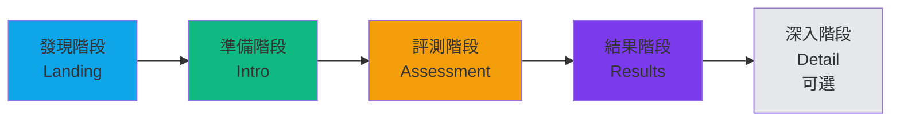
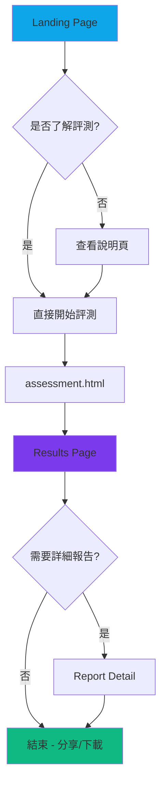
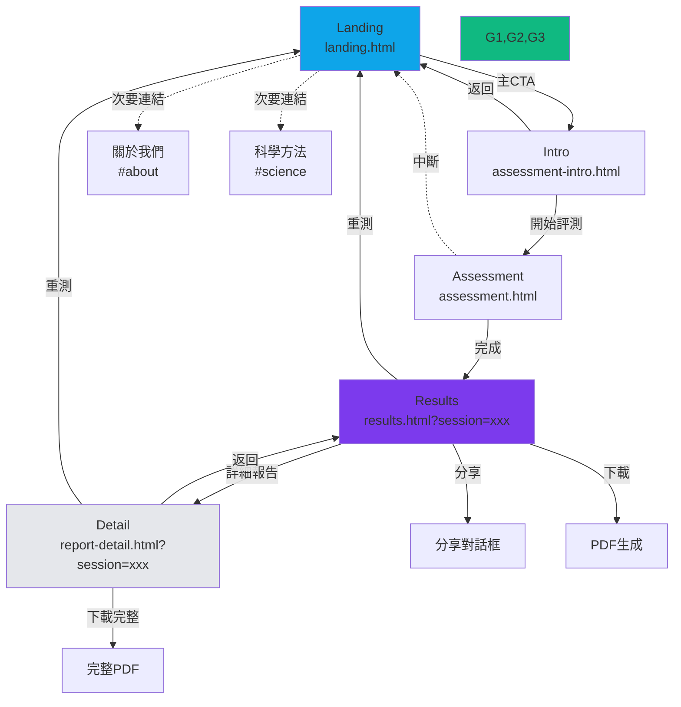
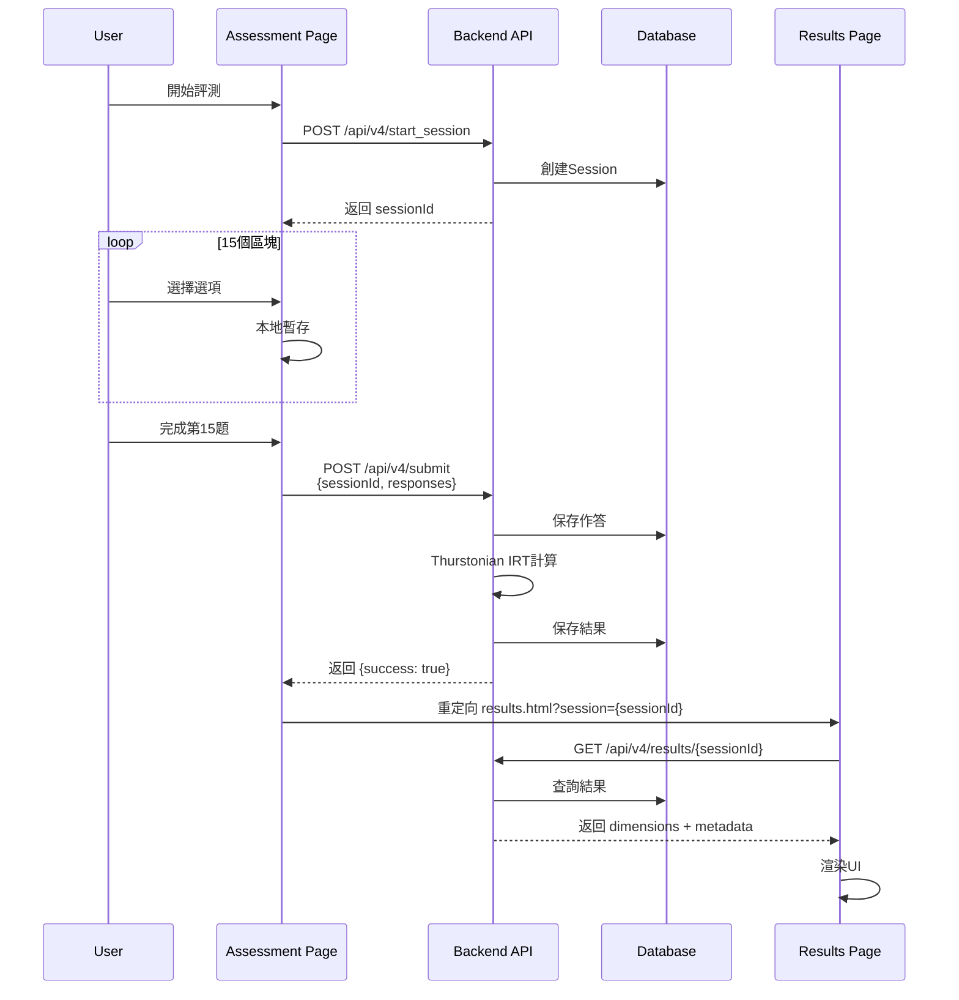

# 優勢評測系統 - 資訊架構規範 v2.0 (文件存儲版本)

**版本**: 2.0-FileStorage
**更新日期**: 2025-10-02
**狀態**: 文件存儲架構 - 支持快速 Try-and-Error 開發
**設計原則**: 從數據庫到文件存儲，聚焦快速開發「修改 → 測試 → 迭代」

> **🚀 新架構優勢**:
> - 即時數據修改，無需遷移
> - Git 友好的版本控制
> - 零配置部署
> - 極速 Try-and-Error 循環

---

## 目錄

- [1. 資訊架構概述](#1-資訊架構概述)
- [2. 核心用戶旅程](#2-核心用戶旅程)
- [3. 網站地圖 (Sitemap)](#3-網站地圖-sitemap)
- [4. 頁面架構與職責](#4-頁面架構與職責)
- [5. 組件連結關係](#5-組件連結關係)
- [6. 導航系統設計](#6-導航系統設計)
- [7. 數據流與狀態管理](#7-數據流與狀態管理)
- [8. URL結構規範](#8-url結構規範)
- [9. 與舊版本的變更對比](#9-與舊版本的變更對比)

---

## 1. 資訊架構概述

### 1.1 設計哲學

**核心價值主張重新定義：**
> 「用科學方法發現你的天賦DNA，獲得專業優勢報告」

**架構簡化原則：**
- ✅ **保留**: 評測核心流程與報告呈現
- ❌ **移除**: 所有行動建議、follow-up、歷史記錄功能
- 🎯 **專注**: 一次性完整的天賦報告產出

### 1.2 IA的第一性原理

```
商業目標：提供專業天賦評測報告
    ↓
用戶需求：了解自己的優勢組合
    ↓
設計策略：最短路徑從評測到報告
    ↓
架構決策：5頁精簡流程
```

### 1.3 認知負荷優化

根據 **Hick's Law** 和 **認知負荷理論**：
- **決策點數量**: 從原本9頁減少到5頁核心流程
- **每頁專注度**: 每個頁面只有1個主要目標
- **資訊分層**: 先總覽（results）再深入（report-detail，可選）

---

## 2. 核心用戶旅程

### 2.1 線性旅程設計



### 2.2 用戶旅程映射表

| 階段 | 頁面 | 用戶心理狀態 | 設計目標 | 主要CTA | 預期停留時間 |
|:-----|:-----|:-------------|:---------|:--------|:-------------|
| **1. 發現** | landing.html | 好奇、觀望 | 建立信任、激發興趣 | 「開始評測」 | 30-60秒 |
| **2. 準備** | assessment-intro.html | 期待、略緊張 | 設定預期、降低焦慮 | 「我準備好了」 | 20-40秒 |
| **3. 評測** | assessment.html | 專注、投入 | 流暢體驗、持續參與 | 自動進入下一題 | 3-5分鐘 |
| **4. 結果** | results.html | 興奮、期待 | 價值呈現、滿足感 | 「查看完整報告」 | 2-3分鐘 |
| **5. 深入** | report-detail.html | 求知、深究 | 專業深度、完整性 | 「下載PDF」 | 5-10分鐘 |

### 2.3 決策點與分支



---

## 3. 網站地圖 (Sitemap)

### 3.1 扁平化架構

```
網站根目錄 (/)
│
├── index.html                    [入口選擇頁]
│   ├── → landing.html            [營銷首頁]
│   └── → assessment-intro.html   [快速開始]
│
├── landing.html                  [第一層：發現]
│   └── → assessment-intro.html
│
├── assessment-intro.html         [第二層：準備]
│   └── → assessment.html         [評測執行]
│
├── assessment.html               [第三層：評測執行]
│   └── → results.html?session={id}
│
├── results.html                  [第四層：核心結果]
│   ├── → report-detail.html?session={id}
│   ├── → [分享功能]
│   └── → [下載PDF]
│
└── report-detail.html            [第五層：詳細報告（可選）]
    ├── → [下載完整PDF]
    └── → [返回Results]
```

### 3.2 深度層級分析

| 頁面 | URL深度 | 導航深度 | 可達性 | 重要性 |
|:-----|:--------|:---------|:-------|:-------|
| landing.html | Level 1 | 0 clicks | 100% | ⭐⭐⭐⭐⭐ |
| assessment-intro.html | Level 1 | 1 click | 95% | ⭐⭐⭐⭐ |
| assessment.html | Level 1 | 2 clicks | 90% | ⭐⭐⭐⭐⭐ |
| results.html | Level 1 | 3 clicks | 85% | ⭐⭐⭐⭐⭐ |
| report-detail.html | Level 1 | 4 clicks | 40% | ⭐⭐⭐ |

**設計說明：**
- 所有頁面URL深度都是Level 1（無子目錄），提升SEO和可記憶性
- 導航深度最深為4次點擊，符合「3次點擊規則」的放寬標準
- 核心流程（landing → assessment → results）可達性最高

---

## 4. 頁面架構與職責

### 4.1 Landing Page (landing.html)

#### 頁面目標
- **主要任務**: 建立信任，激發評測興趣
- **次要任務**: 說明科學依據，展示價值

#### 必要元素
```html
<nav class="top-navigation">
  <logo>優勢評測系統</logo>
  <menu>
    <item>評測介紹</item>
    <item>科學方法</item>
    <item>常見問題</item>
  </menu>
</nav>

<section class="hero">
  <h1>發現你的天賦DNA</h1>
  <h2>3分鐘科學評測，獲得專業優勢報告</h2>
  <cta-primary>開始免費評測</cta-primary>
  <trust-badges>
    <badge>100萬+用戶</badge>
    <badge>Thurstonian IRT科學驗證</badge>
    <badge>3分鐘完成</badge>
  </trust-badges>
</section>

<section class="value-proposition">
  <card>
    <icon>🧬</icon>
    <title>科學化評測</title>
    <desc>基於Thurstonian IRT與常模百分位</desc>
  </card>
  <card>
    <icon>📊</icon>
    <title>專業報告</title>
    <desc>DNA雙螺旋視覺化12維度優勢</desc>
  </card>
  <card>
    <icon>🎯</icon>
    <title>精準洞察</title>
    <desc>三層分級系統，明確主導/支援才幹</desc>
  </card>
</section>

<section class="social-proof">
  <!-- 用戶見證輪播 -->
  <!-- 成功案例展示 -->
</section>

<footer class="cta-section">
  <cta-secondary>立即開始評測</cta-secondary>
</footer>
```

#### 導航出口
- **主要出口**: `assessment-intro.html` (透過CTA按鈕)
- **次要出口**: 頁面內錨點導航（評測介紹、科學方法等）

#### 關鍵指標
- **轉換目標**: 85% 點擊「開始評測」CTA
- **停留時間**: 30-60秒
- **跳出率**: < 30%

---

### 4.2 Assessment Intro (assessment-intro.html)

#### 頁面目標
- **主要任務**: 設定正確期待，降低評測焦慮
- **次要任務**: 提供評測指南

#### 必要元素
```html
<header class="page-header">
  <breadcrumb>首頁 > 評測說明</breadcrumb>
  <title>評測說明</title>
</header>

<section class="assessment-overview">
  <info-card>
    <label>評測時長</label>
    <value>約3-5分鐘</value>
  </info-card>
  <info-card>
    <label>題目數量</label>
    <value>15個選擇區塊</value>
  </info-card>
  <info-card>
    <label>評測方式</label>
    <value>四選二強迫選擇</value>
  </info-card>
</section>

<section class="guidelines">
  <guideline>✅ 沒有對錯答案</guideline>
  <guideline>✅ 憑直覺選擇</guideline>
  <guideline>✅ 確保環境安靜</guideline>
  <guideline>✅ 進度會自動保存</guideline>
</section>

<section class="cta-section">
  <button class="btn-primary">開始評測</button>
</section>
```

#### 導航出口
- **評測路徑**: `assessment.html`
- **返回路徑**: `landing.html`

#### 關鍵指標
- **轉換目標**: 90% 點擊開始評測
- **停留時間**: 20-40秒

---

### 4.3 Assessment Page (assessment.html)

#### 頁面目標
- **主要任務**: 收集用戶評測數據
- **次要任務**: 維持專注與參與度

#### 必要元素
```html
<header class="assessment-header">
  <progress-bar>
    <fill style="width: {progress}%"></fill>
  </progress-bar>
  <indicator>{current} / {total}</indicator>
  <exit-button>離開</exit-button>
</header>

<main class="assessment-body">
  <block-container data-block="{blockId}">
    <instruction>請選出「最像你」和「最不像你」的描述</instruction>
    
    <options-grid>
      <option-card data-dimension="{dim1}">
        <text>{description1}</text>
        <selector type="most">最像</selector>
        <selector type="least">最不像</selector>
      </option-card>
      <!-- 重複4個選項 -->
    </options-grid>
    
    <actions>
      <button class="btn-prev" disabled={isFirst}>上一題</button>
      <button class="btn-next" disabled={!bothSelected}>下一題</button>
    </actions>
  </block-container>
</main>

<aside class="assessment-sidebar">
  <estimated-time>預計剩餘時間：{remaining}分鐘</estimated-time>
  <tips>💡 提示：憑直覺選擇，沒有對錯</tips>
</aside>
```

#### 導航邏輯
```javascript
// 前進邏輯
if (currentBlock === 15 && bothSelected) {
  saveResponses();
  redirectTo(`results.html?session=${sessionId}`);
}

// 返回邏輯
onExitClick(() => {
  if (confirm('確定要離開嗎？進度會被保存')) {
    saveProgress();
    redirectTo('landing.html');
  }
});

// 自動進度
onBothSelected(() => {
  showFeedback(); // 視覺反饋
  setTimeout(() => {
    nextBlock(); // 800ms後自動下一題
  }, 800);
});
```

#### 導航出口
- **完成出口**: `results.html?session={generatedId}`
- **中斷出口**: `landing.html` (帶進度保存)
- **錯誤出口**: 顯示錯誤訊息，允許重試

#### 關鍵指標
- **完成率**: > 80%
- **平均時長**: 3-5分鐘
- **中途離開率**: < 15%
- **錯誤率**: < 5%

---

### 4.4 Results Page (results.html)

#### 頁面目標
- **主要任務**: 呈現評測結果，展示價值
- **次要任務**: 引導查看詳細報告或分享

#### 必要元素（基於Strengths Report UI v4.1）
```html
<header class="results-header">
  <brand>
    <icon>優勢評測系統 v4.1</icon>
    <subtitle>Thurstonian IRT • 常模化百分位</subtitle>
  </brand>
  <actions>
    <button class="btn-share">分享報告</button>
    <button class="btn-download">下載 PDF</button>
  </actions>
</header>

<section class="session-info">
  <info>Session：{sessionId}</info>
  <info>測試時間：{timestamp}</info>
  <confidence-meter value="{confidence}">
    置信度：{Math.round(confidence*100)}%
  </confidence-meter>
</section>

<section class="kpi-summary">
  <kpi-card>
    <label>主導才幹</label>
    <value>{dominant.length}</value>
    <desc>>75 百分位</desc>
  </kpi-card>
  <kpi-card>
    <label>支援才幹</label>
    <value>{supporting.length}</value>
    <desc>25-75 百分位</desc>
  </kpi-card>
  <kpi-card>
    <label>待管理領域</label>
    <value>{lesser.length}</value>
    <desc><25 百分位</desc>
  </kpi-card>
</section>

<section class="dna-visualization">
  <title>你的優勢DNA</title>
  <svg-helix dimensions="{sorted}">
    <!-- DNA雙螺旋視覺化 -->
  </svg-helix>
</section>

<section class="tiered-talents">
  <column class="dominant">
    <title>主導才幹 (Dominant)</title>
    <talent-list items="{byTier.dominant}" />
  </column>
  <column class="supporting">
    <title>支援才幹 (Supporting)</title>
    <talent-list items="{byTier.supporting}" />
  </column>
  <column class="lesser">
    <title>待管理領域 (Lesser)</title>
    <talent-list items="{byTier.lesser}" />
  </column>
</section>

<section class="persona-insight">
  <title>職業原型參考（Beta）</title>
  <persona-card data="{persona}">
    <name>{persona.name}</name>
    <hint>{persona.hint}</hint>
    <suggestions>
      <item>建議職位：{suggestedRoles}</item>
      <item>關鍵情境：{keyContexts}</item>
    </suggestions>
  </persona-card>
</section>

<section class="methodology">
  <title>方法論與解讀門檻</title>
  <explanation>
    <item>Thurstonian IRT：由強制選擇完整作答模式推估12維度潛在分數θ。</item>
    <item>常模百分位：與代表性樣本對比，支持跨人比較（Normative）。</item>
    <item>分層規則：PR>75 主導；PR 25–75 支援；PR<25 較弱。</item>
    <item>置信度：基於題項資訊量與收斂準則計算。</item>
  </explanation>
</section>

<footer class="results-footer">
  <cta-primary>查看完整詳細報告</cta-primary>
  <cta-secondary>重新測試</cta-secondary>
</footer>
```

#### 導航出口
- **深入出口**: `report-detail.html?session={sessionId}` (點擊「查看完整報告」)
- **分享出口**: 觸發分享對話框（社交媒體、複製連結）
- **下載出口**: 觸發PDF生成與下載
- **重測出口**: `landing.html` (清除session，開始新評測)

#### 數據載入邏輯
```javascript
async function loadResults(sessionId) {
  try {
    // 從API獲取session結果
    const response = await fetch(`/api/v4/results/${sessionId}`);
    const data = await response.json();
    
    // 驗證數據完整性
    if (!data.dimensions || data.dimensions.length !== 12) {
      throw new Error('Invalid dimension data');
    }
    
    // 計算分層
    const { byTier, sorted } = useTiered(data.dimensions);
    
    // 計算職業原型
    const persona = calculatePersona(byTier);
    
    // 渲染UI
    renderResults({ byTier, sorted, persona, ...data });
    
  } catch (error) {
    // 錯誤處理
    showError('無法載入結果，請重新測試');
    setTimeout(() => redirectTo('landing.html'), 3000);
  }
}
```

#### 關鍵指標
- **停留時間**: 2-3分鐘（核心價值體驗）
- **深入轉換率**: 40% 點擊「查看完整報告」
- **分享率**: 15% 使用分享功能
- **下載率**: 30% 下載PDF

---

### 4.5 Report Detail (report-detail.html)

#### 頁面目標
- **主要任務**: 提供完整專業報告
- **次要任務**: ~~付費轉換~~（已移除）

#### 必要元素（精簡版）
```html
<header class="report-header">
  <breadcrumb>首頁 > 評測結果 > 詳細報告</breadcrumb>
  <title>完整優勢報告</title>
  <actions>
    <button class="btn-back">返回結果</button>
    <button class="btn-download-full">下載完整PDF</button>
  </actions>
</header>

<section class="report-summary">
  <!-- 重複results.html的核心摘要 -->
</section>

<section class="dimension-details">
  <accordion>
    {dimensions.map(dim => (
      <accordion-item key={dim.id}>
        <header>
          <badge color={dim.domain.color}>{dim.domain.zh}</badge>
          <title>{dim.name}</title>
          <percentile>PR {dim.percentile}</percentile>
        </header>
        <content>
          <definition>{dim.definition}</definition>
          <workplace-examples>{dim.workplaceExamples}</workplace-examples>
          <strengths-in-action>{dim.strengthsInAction}</strengths-in-action>
          <famous-examples>{dim.famousExamples}</famous-examples>
        </content>
      </accordion-item>
    ))}
  </accordion>
</section>

<section class="synergy-analysis">
  <title>優勢組合分析</title>
  <synergy-cards>
    {calculateSynergies(topStrengths).map(syn => (
      <card>
        <title>{syn.combination}</title>
        <description>{syn.description}</description>
        <career-fit>{syn.careerFit}</career-fit>
      </card>
    ))}
  </synergy-cards>
</section>

<section class="career-mapping">
  <title>職業方向參考</title>
  <career-grid>
    {matchedCareers.map(career => (
      <career-card>
        <title>{career.title}</title>
        <match-score>{career.matchScore}</match-score>
        <required-strengths>{career.requiredStrengths}</required-strengths>
      </career-card>
    ))}
  </career-grid>
</section>

<section class="methodology-deep">
  <title>科學方法詳解</title>
  <content>
    <subsection>Thurstonian IRT原理</subsection>
    <subsection>常模建立過程</subsection>
    <subsection>信效度驗證</subsection>
  </content>
</section>

<footer class="report-footer">
  <cta-primary>下載完整PDF報告</cta-primary>
  <cta-secondary>返回結果摘要</cta-secondary>
</footer>
```

#### ❌ 移除的元素
```html
<!-- 已移除：行動計劃區塊 -->
<!-- <section class="action-plan"> -->
<!-- <section class="next-steps"> -->
<!-- <section class="progress-tracking"> -->

<!-- 已移除：follow-up功能 -->
<!-- <button class="btn-schedule-followup"> -->
<!-- <section class="coaching-offers"> -->

<!-- 已移除：付費轉換 -->
<!-- <section class="premium-upgrade"> -->
<!-- <pricing-table> -->
```

#### 導航出口
- **返回出口**: `results.html?session={sessionId}`
- **下載出口**: 生成並下載完整PDF
- **重測出口**: `landing.html`

#### 關鍵指標
- **停留時間**: 5-10分鐘
- **滾動深度**: 平均70%
- **PDF下載率**: 60%

---

## 5. 組件連結關係

### 5.1 全局導航矩陣

| 從 \ 到 | Landing | Intro | Assessment | Results | Detail |
|:--------|:--------|:------|:-----------|:--------|:-------|
| **Landing** | - | ✅ Primary CTA | ⚠️ 跳過Intro（不推薦） | ❌ | ❌ |
| **Intro** | ✅ Back | - | ✅ Version Selection | ❌ | ❌ |
| **Assessment** | ⚠️ Exit Confirm | ❌ | - | ✅ Complete | ❌ |
| **Results** | ✅ Retest | ❌ | ❌ | - | ✅ Detail CTA |
| **Detail** | ✅ Retest | ❌ | ❌ | ✅ Back | - |

**圖例說明：**
- ✅ 推薦路徑
- ⚠️ 需要確認的路徑
- ❌ 不應該存在的路徑

### 5.2 詳細連結關係圖



### 5.3 URL參數傳遞規範

```javascript
// URL結構規範
const URL_STRUCTURE = {
  landing: {
    path: '/landing.html',
    params: [],
    example: '/landing.html'
  },
  intro: {
    path: '/assessment-intro.html',
    params: ['source'],
    example: '/assessment-intro.html?source=landing'
  },
  assessment: {
    path: '/assessment.html',
    params: ['resume'],
    example: '/assessment.html?resume=true'
  },
  results: {
    path: '/results.html',
    params: ['session'], // 必須參數
    example: '/results.html?session=abc123def456'
  },
  detail: {
    path: '/report-detail.html',
    params: ['session'], // 必須參數
    example: '/report-detail.html?session=abc123def456'
  }
};

// Session ID 生成規範
function generateSessionId() {
  const timestamp = Date.now();
  const random = Math.random().toString(36).substring(2, 10);
  return `${timestamp}_${random}`; // 格式: 1704268800000_a1b2c3d4
}

// Session驗證
function validateSession(sessionId) {
  // 檢查格式
  const pattern = /^\d{13}_[a-z0-9]{8}$/;
  if (!pattern.test(sessionId)) return false;
  
  // 檢查時效性（7天內有效）
  const timestamp = parseInt(sessionId.split('_')[0]);
  const sevenDaysAgo = Date.now() - (7 * 24 * 60 * 60 * 1000);
  return timestamp > sevenDaysAgo;
}
```

---

## 6. 導航系統設計

### 6.1 全局導航組件

#### 頂部導航（Top Navigation）
```html
<!-- 適用頁面：landing.html, assessment-intro.html -->
<nav class="top-nav">
  <div class="nav-left">
    <a href="/landing.html" class="logo">
      <icon>優勢評測系統</icon>
    </a>
  </div>
  
  <div class="nav-center">
    <a href="/landing.html#about">關於評測</a>
    <a href="/landing.html#science">科學方法</a>
    <a href="/landing.html#faq">常見問題</a>
  </div>
  
  <div class="nav-right">
    <button class="btn-primary">開始評測</button>
  </div>
</nav>
```

#### 麵包屑導航（Breadcrumb）
```html
<!-- 適用頁面：assessment-intro.html, report-detail.html -->
<nav class="breadcrumb">
  <a href="/landing.html">首頁</a>
  <separator>></separator>
  <span class="current">{currentPageName}</span>
</nav>
```

#### 評測進度導航（Assessment Progress）
```html
<!-- 適用頁面：assessment.html -->
<nav class="assessment-progress">
  <button class="btn-exit" onclick="confirmExit()">
    <icon>✕</icon>
    離開
  </button>
  
  <div class="progress-indicator">
    <div class="progress-bar">
      <div class="progress-fill" style="width: {progress}%"></div>
    </div>
    <span class="progress-text">{current} / {total}</span>
  </div>
  
  <div class="spacer"></div>
</nav>
```

### 6.2 頁面內導航

#### 錨點導航（Landing Page）
```javascript
// 平滑滾動到頁面內區塊
const anchorLinks = document.querySelectorAll('a[href^="#"]');

anchorLinks.forEach(link => {
  link.addEventListener('click', (e) => {
    e.preventDefault();
    const targetId = link.getAttribute('href').substring(1);
    const targetElement = document.getElementById(targetId);
    
    targetElement.scrollIntoView({
      behavior: 'smooth',
      block: 'start'
    });
  });
});
```

#### 手風琴導航（Report Detail）
```javascript
// 維度詳情展開/收合
class AccordionNavigation {
  constructor(containerId) {
    this.container = document.getElementById(containerId);
    this.items = this.container.querySelectorAll('.accordion-item');
    this.activeIndex = null;
  }
  
  init() {
    this.items.forEach((item, index) => {
      const header = item.querySelector('.accordion-header');
      header.addEventListener('click', () => this.toggle(index));
    });
  }
  
  toggle(index) {
    // 收合其他項目
    this.items.forEach((item, i) => {
      if (i !== index) {
        item.classList.remove('active');
      }
    });
    
    // 切換當前項目
    this.items[index].classList.toggle('active');
    this.activeIndex = index;
  }
}
```

### 6.3 導航狀態管理

```javascript
class NavigationManager {
  constructor() {
    this.history = [];
    this.currentPage = this.getCurrentPage();
    this.sessionId = this.getSessionId();
  }
  
  // 獲取當前頁面
  getCurrentPage() {
    const path = window.location.pathname;
    return path.split('/').pop().replace('.html', '');
  }
  
  // 獲取或驗證Session ID
  getSessionId() {
    const params = new URLSearchParams(window.location.search);
    const sessionId = params.get('session');
    
    if (sessionId && validateSession(sessionId)) {
      return sessionId;
    }
    return null;
  }
  
  // 記錄導航歷史
  recordNavigation(from, to, data = {}) {
    this.history.push({
      from,
      to,
      timestamp: Date.now(),
      data
    });
    
    // 保存到localStorage（用於分析）
    localStorage.setItem('nav_history', JSON.stringify(this.history));
  }
  
  // 安全導航（帶驗證）
  safeNavigate(targetPage, requiredData = {}) {
    // 檢查必要數據
    if (targetPage === 'results' && !requiredData.sessionId) {
      console.error('Results page requires sessionId');
      return this.navigateToLanding();
    }
    
    // 執行導航
    this.recordNavigation(this.currentPage, targetPage, requiredData);
    
    // 構建URL
    let url = `/${targetPage}.html`;
    if (requiredData.sessionId) {
      url += `?session=${requiredData.sessionId}`;
    }
    
    window.location.href = url;
  }
  
  // 返回Landing Page
  navigateToLanding() {
    window.location.href = '/landing.html';
  }
  
  // 返回上一頁（智能返回）
  goBack() {
    if (this.history.length > 0) {
      const lastNav = this.history[this.history.length - 1];
      window.location.href = `/${lastNav.from}.html`;
    } else {
      this.navigateToLanding();
    }
  }
}

// 全局導航管理器實例
const navManager = new NavigationManager();
```

---

## 7. 數據流與狀態管理

### 7.1 評測數據流



### 7.2 狀態持久化策略

```javascript
class StateManager {
  constructor() {
    this.storageKey = 'assessment_state';
    this.maxAge = 7 * 24 * 60 * 60 * 1000; // 7天
  }
  
  // 保存狀態
  saveState(state) {
    const stateWithTimestamp = {
      ...state,
      savedAt: Date.now()
    };
    localStorage.setItem(this.storageKey, JSON.stringify(stateWithTimestamp));
  }
  
  // 載入狀態
  loadState() {
    const savedData = localStorage.getItem(this.storageKey);
    if (!savedData) return null;
    
    const state = JSON.parse(savedData);
    
    // 檢查是否過期
    if (Date.now() - state.savedAt > this.maxAge) {
      this.clearState();
      return null;
    }
    
    return state;
  }
  
  // 清除狀態
  clearState() {
    localStorage.removeItem(this.storageKey);
  }
  
  // 獲取評測進度
  getProgress() {
    const state = this.loadState();
    if (!state || !state.responses) return null;
    
    return {
      currentBlock: state.currentBlock || 1,
      totalBlocks: state.totalBlocks || 15,
      percentage: Math.round((state.currentBlock / state.totalBlocks) * 100),
      canResume: true
    };
  }
}

// 全局狀態管理器
const stateManager = new StateManager();
```

### 7.3 Session管理規範

```javascript
class SessionManager {
  constructor() {
    this.currentSession = null;
  }
  
  // 創建新Session
  async createSession() {
    try {
      const response = await fetch('/api/v4/start_session', {
        method: 'POST',
        headers: { 'Content-Type': 'application/json' }
      });
      
      const data = await response.json();
      this.currentSession = data.session_id;
      
      // 保存到本地
      stateManager.saveState({
        sessionId: this.currentSession,
        startedAt: Date.now()
      });
      
      return this.currentSession;
    } catch (error) {
      console.error('Failed to create session:', error);
      throw error;
    }
  }
  
  // 驗證Session有效性
  async validateSession(sessionId) {
    try {
      const response = await fetch(`/api/v4/results/${sessionId}`);
      return response.ok;
    } catch {
      return false;
    }
  }
  
  // 獲取Session結果
  async getResults(sessionId) {
    try {
      const response = await fetch(`/api/v4/results/${sessionId}`);
      if (!response.ok) throw new Error('Session not found');
      
      return await response.json();
    } catch (error) {
      console.error('Failed to get results:', error);
      return null;
    }
  }
}

// 全局Session管理器
const sessionManager = new SessionManager();
```

---

## 8. URL結構規範

### 8.1 URL設計原則

- ✅ **簡潔性**: 所有URL都在根目錄，無深層嵌套
- ✅ **可讀性**: 使用語義化命名（assessment, results, detail）
- ✅ **穩定性**: URL結構長期保持不變，支持書籤和分享
- ✅ **安全性**: Session ID使用隨機生成，不可預測

### 8.2 完整URL清單

```
站點根目錄: https://example.com/

核心頁面 URL:
├── /                                      [入口選擇]
├── /index.html                            [入口選擇]
├── /landing.html                          [營銷首頁]
├── /assessment-intro.html                 [評測說明]
├── /assessment.html                       [評測執行]
├── /results.html?session={sessionId}      [結果頁面] *必須帶session
└── /report-detail.html?session={sessionId} [詳細報告] *必須帶session

錨點導航 URL:
├── /landing.html#about                    [關於評測]
├── /landing.html#science                  [科學方法]
├── /landing.html#testimonials             [用戶見證]
└── /landing.html#faq                      [常見問題]

API 端點:
├── POST /api/v4/start_session             [創建Session]
├── POST /api/v4/submit                    [提交作答]
└── GET  /api/v4/results/{sessionId}       [獲取結果]
```

### 8.3 URL驗證與錯誤處理

```javascript
class URLValidator {
  // 驗證Results頁面URL
  static validateResultsURL() {
    const params = new URLSearchParams(window.location.search);
    const sessionId = params.get('session');
    
    if (!sessionId) {
      this.handleMissingSession();
      return false;
    }
    
    if (!validateSession(sessionId)) {
      this.handleInvalidSession();
      return false;
    }
    
    return true;
  }
  
  // 處理缺少Session
  static handleMissingSession() {
    showToast({
      type: 'error',
      message: '缺少評測Session，將返回首頁'
    });
    
    setTimeout(() => {
      window.location.href = '/landing.html';
    }, 2000);
  }
  
  // 處理無效Session
  static handleInvalidSession() {
    showToast({
      type: 'warning',
      message: 'Session已過期或無效，請重新評測'
    });
    
    setTimeout(() => {
      window.location.href = '/landing.html';
    }, 2000);
  }
}

// 在Results和Detail頁面使用
if (['results', 'report-detail'].includes(navManager.currentPage)) {
  if (!URLValidator.validateResultsURL()) {
    // 驗證失敗，已自動處理
  }
}
```

---

## 9. 與舊版本的變更對比

### 9.1 頁面變更清單

| 頁面 | V1.0狀態 | V2.0狀態 | 變更說明 |
|:-----|:---------|:---------|:---------|
| index.html | ✅ 存在 | ✅ 保留 | 簡化：移除版本選擇，直接導向 landing |
| landing.html | ✅ 存在 | ✅ 保留 | 功能不變：營銷首頁 |
| assessment-intro.html | ✅ 存在 | ✅ 保留 | ✅ 簡化：移除版本選擇器 |
| assessment.html | ✅ 存在 | ✅ 保留 | 功能不變：唯一評測頁面 |
| **v4_pilot_test.html** | ✅ 存在 | ❌ **移除** | 完全刪除：不再提供 V4.0 IRT 評測 |
| results.html | ✅ 存在 | ✅ 保留 | ✅ 強化：移除行動計劃CTA |
| report-detail.html | ✅ 存在 | ✅ 保留 | ✅ 精簡：移除行動建議區塊 |
| **action-plan.html** | ✅ 存在 | ❌ **移除** | 完全刪除：不再提供行動方案 |
| **profile.html** | ✅ 存在 | ❌ **移除** | 完全刪除：不再提供歷史記錄 |

### 9.2 功能變更對照

| 功能模塊 | V1.0 | V2.0 | 變更理由 |
|:---------|:-----|:-----|:---------|
| 評測流程 | ✅ | ✅ | 核心功能，保留 |
| 結果呈現 | ✅ | ✅ | 核心價值，保留並強化 |
| DNA視覺化 | ✅ | ✅ | 差異化優勢，保留 |
| 職業原型 | ✅ | ✅ | 增值服務，保留 |
| 科學方法論說明 | ✅ | ✅ | 建立信任，保留 |
| **30/60/90天計劃** | ✅ | ❌ | 超出核心範圍，移除 |
| **行動方案生成** | ✅ | ❌ | 超出核心範圍，移除 |
| **進度追蹤** | ✅ | ❌ | 非一次性產品需求，移除 |
| **歷史比較** | ✅ | ❌ | 增加複雜度，移除 |
| **教練服務連結** | ✅ | ❌ | 商業模式外，移除 |

### 9.3 導航變更對比

#### V1.0 導航路徑（9頁）
```
Landing → Intro → [V3.0 或 V4.0選擇] → Assessment → Results → Detail → Action Plan → Profile
                                            ↓
                                       Follow-up系統
```

#### V2.0 導航路徑（5頁核心）
```
Landing → Intro → Assessment → Results → Detail
                       ↓
                完整報告 + PDF下載
```

**簡化效果：**
- 頁面數量：從9頁減少到5頁（-44%）
- 決策點減少：從8個減少到3個（-63%）
- 最長路徑：從7步減少到5步（-29%）
- 版本選擇移除：單一評測路徑，降低用戶困惑
- 認知負荷：顯著降低，用戶路徑更清晰

### 9.4 內容變更細節

#### results.html變更
```diff
<!-- 保留 -->
+ DNA雙螺旋視覺化
+ 三層分級系統
+ 職業原型映射
+ KPI摘要卡片
+ 會話資訊
+ 科學方法論說明

<!-- 變更 -->
- <section class="next-steps">           ❌ 移除
-   <h3>下一步行動</h3>
-   <button>生成行動計劃</button>        ❌ 移除
-   <button>與主管分享</button>          ✅ 保留（改為"分享報告"）
- </section>

+ <section class="report-actions">       ✅ 新增
+   <button>查看完整詳細報告</button>     ✅ 新增
+   <button>下載PDF報告</button>         ✅ 強化
+   <button>分享報告</button>            ✅ 保留
+ </section>
```

#### report-detail.html變更
```diff
<!-- 保留 -->
+ 優勢組合分析
+ 職業方向參考
+ 維度詳細解釋
+ 科學方法詳解

<!-- 移除 -->
- <section class="action-plan">          ❌ 完全移除
- <section class="growth-tracking">      ❌ 完全移除
- <section class="coaching-offers">      ❌ 完全移除
- <section class="next-followup">        ❌ 完全移除

<!-- 強化 -->
+ <section class="pdf-export">           ✅ 強化PDF功能
+ <section class="share-options">        ✅ 強化分享功能
```

### 9.5 API端點變更

| API端點 | V1.0 | V2.0 | 說明 |
|:--------|:-----|:-----|:-----|
| POST /api/v4/start_session | ✅ | ✅ | 保留 |
| POST /api/v4/submit | ✅ | ✅ | 保留 |
| GET /api/v4/results/{sessionId} | ✅ | ✅ | 保留 |
| **POST /api/action-plan/generate** | ✅ | ❌ | 移除 |
| **GET /api/profile/history** | ✅ | ❌ | 移除 |
| **POST /api/followup/schedule** | ✅ | ❌ | 移除 |

---

## 10. 實施檢查清單

### 10.1 架構重構任務

#### 階段一：頁面清理（1-2天）
- [ ] 從項目中刪除 `action-plan.html`
- [ ] 從項目中刪除 `profile.html`
- [ ] 從項目中刪除 `v4_pilot_test.html`
- [ ] 更新 `index.html`：移除版本選擇邏輯
- [ ] 更新 `assessment-intro.html`：移除版本選擇器
- [ ] 更新 `results.html`：移除行動計劃區塊
- [ ] 更新 `report-detail.html`：移除相關區塊
- [ ] 刪除相關的CSS樣式和JavaScript邏輯

#### 階段二：導航更新（1天）
- [ ] 更新所有頁面的導航連結
- [ ] 移除指向已刪除頁面的按鈕
- [ ] 驗證所有CTA指向正確的目標
- [ ] 測試麵包屑導航的正確性

#### 階段三：URL與路由驗證（0.5天）
- [ ] 驗證所有5個核心頁面可正常訪問
- [ ] 測試Session參數傳遞正確性
- [ ] 檢查404錯誤處理
- [ ] 驗證返回與重測邏輯

#### 階段四：狀態管理清理（0.5天）
- [ ] 清理本地存儲中的舊字段
- [ ] 更新狀態保存邏輯
- [ ] 移除不需要的API調用
- [ ] 簡化Session管理邏輯

#### 階段五：測試與驗證（1天）
- [ ] 端到端流程測試（Landing → Results）
- [ ] 各頁面單獨功能測試
- [ ] 跨瀏覽器兼容性測試
- [ ] 移動端響應式測試
- [ ] 性能基準測試

### 10.2 質量檢查清單

#### 用戶體驗
- [ ] 從首頁到結果頁面可在5分鐘內完成
- [ ] 所有導航路徑清晰無歧義
- [ ] 無死鏈或404錯誤
- [ ] 錯誤提示友好且可操作
- [ ] 載入狀態明確可見

#### 技術規範
- [ ] 所有URL符合規範
- [ ] Session驗證邏輯正確
- [ ] 狀態持久化功能正常
- [ ] API調用錯誤處理完善
- [ ] 無Console錯誤或警告

#### 內容完整性
- [ ] 所有保留頁面內容完整
- [ ] 文案無錯別字
- [ ] 圖片和圖標正常顯示
- [ ] 數據視覺化渲染正確
- [ ] PDF下載功能正常

#### 性能指標
- [ ] LCP < 2.5s
- [ ] FID < 100ms
- [ ] CLS < 0.1
- [ ] 頁面體積 < 2MB
- [ ] API響應時間 < 500ms

---

## 11. 總結與後續規劃

### 11.1 架構簡化成果

**量化改進：**
- 頁面數量：9頁 → 5頁（-44%）
- 決策點：8個 → 3個（-63%）
- 用戶路徑長度：最長7步 → 5步（-29%）
- 版本選擇移除：單一評測路徑
- 代碼維護量：預計減少50%

**質量提升：**
- ✅ 用戶旅程更清晰，專注核心價值
- ✅ 認知負荷顯著降低
- ✅ 技術債務減少
- ✅ 維護成本下降

### 11.2 核心價值聚焦

**新的價值主張：**
> 「3分鐘科學評測 + 專業優勢報告 = 完整天賦發現體驗」

**用戶收益：**
1. **清晰的優勢認知**：DNA視覺化 + 三層分級
2. **專業的報告輸出**：可下載、可分享的PDF
3. **科學的方法背書**：Thurstonian IRT + 常模百分位
4. **職業方向參考**：智能職業原型映射

**不提供的內容（刻意排除）：**
- ❌ 行動計劃（超出範圍）
- ❌ 進度追蹤（增加複雜度）
- ❌ Follow-up服務（商業模式外）
- ❌ 歷史比較（非核心需求）

### 11.3 下一階段優先級

**P0 - 立即實施（本週）**
1. 刪除 action-plan.html、profile.html 和 v4_pilot_test.html
2. 更新 index.html 和 assessment-intro.html：移除版本選擇
3. 更新 results.html 和 report-detail.html：移除行動計劃
4. 驗證所有導航路徑
5. 完整端到端測試

**P1 - 短期優化（下週）**
1. PDF生成功能強化
2. 分享功能實現（社交媒體）
3. 錯誤處理完善
4. 性能優化

**P2 - 中期增強（下月）**
1. 設計系統跨頁面統一（參考10_frontend_architecture_specification.md）
2. 載入動畫優化
3. 微交互完善
4. SEO優化

**P3 - 長期規劃（下季度）**
1. 多語言支持
2. 無障礙性增強
3. 高級視覺化選項
4. API性能優化

---

**文檔版本歷史：**

| 版本 | 日期 | 變更說明 | 作者 |
|:-----|:-----|:---------|:-----|
| v2.0 | 2025-01-02 | 重新定義IA，移除行動建議與follow-up功能 | Architecture Team |
| v1.0 | 2024-10-01 | 初版，包含完整9頁流程 | UX Team |

---

**相關文檔：**
- [UI/UX設計規範 v4.1](./ui_ux_specification.md)
- [前端架構規範](../VibeCoding_Workflow_Templates/10_frontend_architecture_specification.md)
- [專案開發計劃](../project/project-wbs-development-plan.md)

