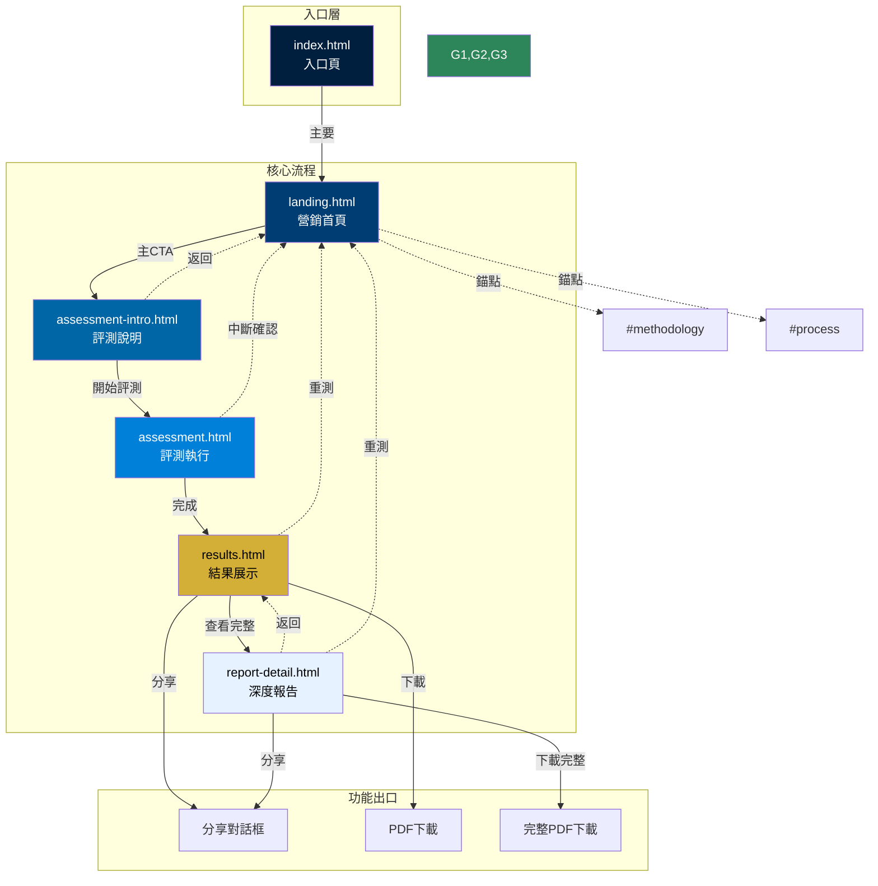
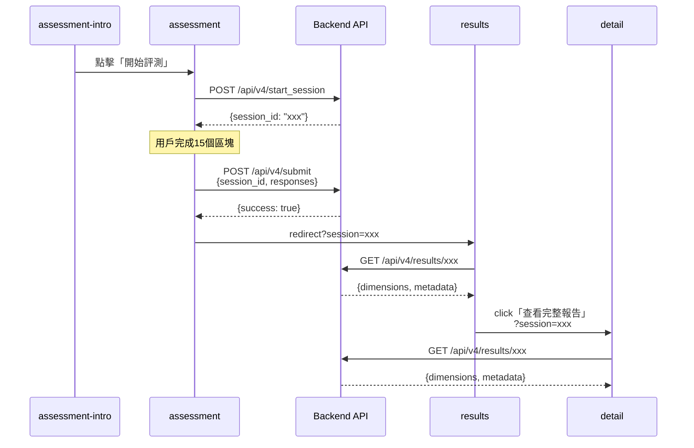
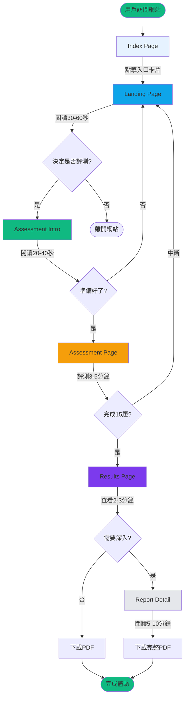

# 優勢評測系統 - 完整頁面總覽與網站地圖

**版本**: 2.0  
**更新日期**: 2025-01-02  
**狀態**: 精簡核心流程（5頁）+ 入口頁  
**對應文檔**: Information Architecture v2.0、Frontend Architecture (McKinsey Style)

---

## 目錄

- [1. 頁面總覽](#1-頁面總覽)
- [2. 完整網站地圖](#2-完整網站地圖)
- [3. 頁面詳細規格](#3-頁面詳細規格)
- [4. 組件連結矩陣](#4-組件連結矩陣)
- [5. 用戶流程圖](#5-用戶流程圖)

---

## 1. 頁面總覽

### 1.1 核心頁面清單（6頁）

| # | 頁面檔名 | 頁面名稱 | 主要職責 | 用戶目標 | 預期停留時間 |
|:--|:---------|:---------|:---------|:---------|:-------------|
| 0 | `index.html` | 入口頁 | 提供系統入口 | 進入評測系統 | 5-10秒 |
| 1 | `landing.html` | 營銷首頁 | 建立信任、激發興趣 | 決定是否評測 | 30-60秒 |
| 2 | `assessment-intro.html` | 評測說明頁 | 設定期待、降低焦慮 | 了解流程並準備 | 20-40秒 |
| 3 | `assessment.html` | 評測執行頁 | 收集評測數據 | 完成評測 | 3-5分鐘 |
| 4 | `results.html` | 結果展示頁 | 呈現核心結果 | 理解自己優勢 | 2-3分鐘 |
| 5 | `report-detail.html` | 深度報告頁 | 提供完整分析 | 深入理解與下載 | 5-10分鐘 |

**總計頁面數：** 6頁（含入口）  
**核心評測流程：** 5頁（不含入口）  
**最短完成路徑：** Landing → Intro → Assessment → Results（~4-7分鐘）  
**完整體驗路徑：** Landing → Intro → Assessment → Results → Detail（~10-15分鐘）

### 1.2 已移除頁面（3頁）

| 頁面檔名 | 原本職責 | 移除原因 | 替代方案 |
|:---------|:---------|:---------|:---------|
| `v4_pilot_test.html` | V4.0 IRT評測 | 簡化單一評測路徑 | 統一使用 assessment.html |
| `action-plan.html` | 行動方案生成 | 超出核心範圍 | results/detail 頁面提供職業建議即可 |
| `profile.html` | 個人歷史記錄 | 非一次性產品需求 | 不提供（專注報告產出） |

---

## 2. 完整網站地圖

### 2.1 階層式網站地圖

```
優勢評測系統 (/)
│
├─ 0. index.html [入口層]
│  └─ → landing.html (主要路徑)
│
├─ 1. landing.html [發現層]
│  ├─ #methodology (錨點：科學方法)
│  ├─ #process (錨點：評測流程)
│  ├─ #insights (錨點：案例洞察)
│  ├─ #faq (錨點：常見問題)
│  └─ → assessment-intro.html (主CTA)
│
├─ 2. assessment-intro.html [準備層]
│  ├─ ← landing.html (返回)
│  └─ → assessment.html (開始評測)
│
├─ 3. assessment.html [評測層]
│  ├─ ← landing.html (中斷，需確認)
│  └─ → results.html?session={id} (完成)
│
├─ 4. results.html [結果層]
│  ├─ Query Params: ?session={sessionId} (必須)
│  ├─ → report-detail.html?session={id} (查看完整報告)
│  ├─ → [分享對話框] (分享功能)
│  ├─ → [PDF下載] (下載功能)
│  └─ → landing.html (重新測試)
│
└─ 5. report-detail.html [深度層]
   ├─ Query Params: ?session={sessionId} (必須)
   ├─ ← results.html?session={id} (返回結果)
   ├─ → [完整PDF下載]
   ├─ → [分享報告]
   └─ → landing.html (重新測試)
```

### 2.2 視覺化網站地圖



---

## 3. 頁面詳細規格

### 3.0 Index Page（入口頁）

| 屬性 | 值 |
|:-----|:---|
| **檔名** | `index.html` |
| **URL** | `/` 或 `/index.html` |
| **頁面類型** | 入口選擇頁 |
| **主要元素** | 品牌標識、入口卡片、快速連結 |
| **導航深度** | Level 0 |
| **SEO優先級** | 低（通常直接跳轉） |

**關鍵組件：**
- 品牌 Logo + 標題
- 主要入口卡片（進入評測系統）
- 快速連結（方法論、案例）
- 版本資訊顯示

**導航出口：**
```javascript
{
  primary: 'landing.html',
  quickLinks: [
    'landing.html#methodology',
    'landing.html#insights'
  ]
}
```

**參考文檔：**
- Frontend Architecture (McKinsey Style) - Section 4.0

---

### 3.1 Landing Page（營銷首頁）

| 屬性 | 值 |
|:-----|:---|
| **檔名** | `landing.html` |
| **URL** | `/landing.html` |
| **頁面類型** | 營銷轉換頁 |
| **主要元素** | 英雄區塊、方法論、案例、CTA |
| **導航深度** | Level 1（從 index 進入） |
| **SEO優先級** | 高（主要入口） |

**關鍵組件：**
1. 專業頂部導航
2. 英雄區塊（Hero Section）
   - 主標題：「發現您的天賦DNA組合」
   - 副標題：科學方法說明
   - 主CTA：「開始專業評測」
   - 信任指標：100萬+用戶、95%準確度、3分鐘
3. 方法論展示（3卡片）
   - Thurstonian IRT
   - 常模百分位
   - 信效度驗證
4. 評測流程時間軸（4步驟）
5. 案例洞察輪播
6. 最終CTA區塊

**導航出口：**
```javascript
{
  primary: 'assessment-intro.html',
  anchors: [
    '#methodology',
    '#process',
    '#insights',
    '#faq'
  ]
}
```

**AIDA對應：**
- Attention：英雄區塊視覺衝擊
- Interest：方法論與流程展示
- Desire：案例洞察與社會認同
- Action：CTA按鈕

**參考文檔：**
- Information Architecture v2.0 - Section 4.1
- Frontend Architecture (McKinsey Style) - Section 4.1

---

### 3.2 Assessment Intro（評測說明頁）

| 屬性 | 值 |
|:-----|:---|
| **檔名** | `assessment-intro.html` |
| **URL** | `/assessment-intro.html` |
| **URL參數** | `?source=landing`（可選） |
| **頁面類型** | 準備與指南頁 |
| **主要元素** | 評測概覽、指南、開始按鈕 |
| **導航深度** | Level 2 |
| **SEO優先級** | 中 |

**關鍵組件：**
1. 麵包屑導航（首頁 > 評測說明）
2. 頁面標題區
   - 英文標籤：Assessment Preparation
   - 中文標題：評測流程說明
   - 副標題：確保最佳測試體驗
3. 評測概覽（3卡片）
   - 評測時長：3-5分鐘
   - 題目數量：15區塊
   - 評測方式：四選二強迫選擇
4. 評測指南（4項，2x2網格）
   - ✅ 沒有對錯答案
   - ✅ 憑直覺選擇
   - ✅ 確保環境安靜
   - ✅ 進度自動保存
5. 開始評測按鈕

**導航出口：**
```javascript
{
  primary: 'assessment.html',
  back: 'landing.html'
}
```

**心理學原理：**
- 降低認知負荷：分塊呈現資訊
- 減少焦慮：明確說明「無對錯」
- 建立信任：展示自動保存功能

**參考文檔：**
- Information Architecture v2.0 - Section 4.2
- Frontend Architecture (McKinsey Style) - Section 4.3

---

### 3.3 Assessment Page（評測執行頁）

| 屬性 | 值 |
|:-----|:---|
| **檔名** | `assessment.html` |
| **URL** | `/assessment.html` |
| **URL參數** | `?resume=true`（恢復進度時） |
| **頁面類型** | 互動評測頁 |
| **主要元素** | 進度條、選項網格、自動進入 |
| **導航深度** | Level 3 |
| **SEO優先級** | 低（需session） |

**關鍵組件：**
1. 固定頂部進度條
   - 左：離開按鈕
   - 中：進度條 + 區塊指示器（3/15）
   - 右：預估剩餘時間
2. 主評測區域
   - 題目說明（選出最像/最不像）
   - 選項網格（2x2佈局）
   - 每個選項：描述文字 + 兩個選擇器按鈕
3. 導航操作
   - 上一題按鈕（首題禁用）
   - 區塊指示器
   - 下一題按鈕（未完成禁用）
4. 側邊提示（桌面版）

**選擇邏輯：**
```javascript
規則1: 每個區塊必須選擇一個「最像」和一個「最不像」
規則2: 同一選項不能同時是「最像」和「最不像」
規則3: 每種類型只能選擇一個選項
規則4: 兩個都選後，800ms自動進入下一題
```

**導航出口：**
```javascript
{
  complete: 'results.html?session={generatedId}',
  exit: 'landing.html', // 需確認
  error: '顯示錯誤 + 重試'
}
```

**Session管理：**
- 進入時：`POST /api/v4/start_session` 創建session
- 進行中：本地localStorage暫存
- 完成時：`POST /api/v4/submit` 提交所有作答

**參考文檔：**
- Information Architecture v2.0 - Section 4.3
- Frontend Architecture (McKinsey Style) - Section 4.4

---

### 3.4 Results Page（結果展示頁）

| 屬性 | 值 |
|:-----|:---|
| **檔名** | `results.html` |
| **URL** | `/results.html?session={sessionId}` |
| **URL參數** | `session`（**必須**） |
| **頁面類型** | 數據展示頁 |
| **主要元素** | KPI儀表板、DNA視覺化、分級列表 |
| **導航深度** | Level 4 |
| **SEO優先級** | 低（動態內容） |

**關鍵組件：**
1. 報告標題區
   - 品牌標識 + 版本號
   - Session ID + 測試時間 + 置信度
   - 操作按鈕（分享、下載PDF）
2. 執行摘要（Executive Summary）
   - KPI Dashboard（3個卡片）
     - 主導才幹：>75百分位
     - 支援才幹：25-75百分位
     - 待管理領域：<25百分位
3. DNA視覺化
   - SVG雙螺旋結構
   - 12維度節點（大小編碼強度）
   - 四領域色彩編碼
   - 圖例說明
4. 三層分級列表
   - 主導才幹列表（綠色）
   - 支援才幹列表（藍色）
   - 待管理領域列表（灰色）
5. 職業原型洞察
   - 原型名稱（如「系統建構者」）
   - 建議職位
   - 關鍵情境
6. 方法論說明
   - Thurstonian IRT簡述
   - 常模百分位解釋
   - 分層規則
   - 置信度計算

**導航出口：**
```javascript
{
  detail: 'report-detail.html?session={sessionId}',
  share: '觸發分享對話框',
  download: '生成並下載PDF',
  retest: 'landing.html'
}
```

**數據載入：**
```javascript
// 進入時驗證session
if (!sessionId || !validateSession(sessionId)) {
  redirect('landing.html');
}

// 載入結果
const data = await fetch(`/api/v4/results/${sessionId}`);

// 計算分層
const { byTier, sorted } = useTiered(data.dimensions);

// 計算職業原型
const persona = calculatePersona(byTier.dominant);
```

**參考文檔：**
- Information Architecture v2.0 - Section 4.4
- Frontend Architecture (McKinsey Style) - Section 4.2

---

### 3.5 Report Detail（深度報告頁）

| 屬性 | 值 |
|:-----|:---|
| **檔名** | `report-detail.html` |
| **URL** | `/report-detail.html?session={sessionId}` |
| **URL參數** | `session`（**必須**） |
| **頁面類型** | 詳細分析頁 |
| **主要元素** | 手風琴、表格、方法論詳解 |
| **導航深度** | Level 5 |
| **SEO優先級** | 低（動態內容） |

**關鍵組件：**
1. 報告標題與麵包屑
   - 首頁 > 評測結果 > 完整報告
   - Session資訊
   - 操作按鈕（返回、下載）
2. 執行摘要（重複Results核心）
3. 12維度深度解析（手風琴）
   - 每個維度包含：
     - 維度定義
     - 工作場景表現
     - 如何發揮優勢
     - 相似案例（名人）
     - 百分位對比圖
4. 優勢組合協同效應
   - 組合名稱
   - 協同描述
   - 職業契合度
5. 職業方向參考矩陣（專業表格）
   - 列：職業領域、具體職位、契合度、需要優勢、挑戰點
6. 科學方法論詳解
   - Thurstonian IRT原理 + 公式
   - 常模百分位說明
   - 信效度指標表格
7. 最終行動橫幅
   - 下載完整PDF
   - 分享報告連結

**導航出口：**
```javascript
{
  back: 'results.html?session={sessionId}',
  downloadFull: '生成完整PDF',
  share: '分享報告',
  retest: 'landing.html'
}
```

**內容深度：**
- 字數：約5000-8000字
- 圖表：12個百分位對比圖 + 1個雷達圖
- 表格：職業矩陣、信效度指標
- 公式：Thurstonian IRT數學表達

**參考文檔：**
- Information Architecture v2.0 - Section 4.5
- Frontend Architecture (McKinsey Style) - Section 4.5

---

## 4. 組件連結矩陣

### 4.1 完整連結關係表

| 來源頁面 \ 目標頁面 | Index | Landing | Intro | Assessment | Results | Detail |
|:-------------------|:------|:--------|:------|:-----------|:--------|:-------|
| **Index** | - | ✅ 主要 | ⚠️ 跳過 | ❌ | ❌ | ❌ |
| **Landing** | ❌ | - | ✅ 主CTA | ⚠️ 跳過 | ❌ | ❌ |
| **Intro** | ❌ | ✅ 返回 | - | ✅ 開始 | ❌ | ❌ |
| **Assessment** | ❌ | ⚠️ 中斷 | ❌ | - | ✅ 完成 | ❌ |
| **Results** | ❌ | ✅ 重測 | ❌ | ❌ | - | ✅ 深入 |
| **Detail** | ❌ | ✅ 重測 | ❌ | ❌ | ✅ 返回 | - |

**圖例：**
- ✅ 推薦路徑（直接可達）
- ⚠️ 需確認路徑（有對話框或驗證）
- ❌ 不存在路徑（不應該連結）

### 4.2 錨點導航清單

| 頁面 | 錨點ID | 錨點名稱 | 對應內容 |
|:-----|:-------|:---------|:---------|
| landing.html | `#methodology` | 科學方法 | 方法論展示區塊 |
| landing.html | `#process` | 評測流程 | 四步驟時間軸 |
| landing.html | `#insights` | 案例洞察 | 成功案例輪播 |
| landing.html | `#faq` | 常見問題 | FAQ手風琴 |

### 4.3 Session參數傳遞鏈



---

## 5. 用戶流程圖

### 5.1 主要用戶流程（Happy Path）



### 5.2 流程時間估算

| 路徑類型 | 頁面順序 | 預估時間 | 轉換率預期 |
|:---------|:---------|:---------|:-----------|
| **最短路徑** | Landing → Intro → Assessment → Results | 4-7分鐘 | 60% |
| **標準路徑** | 同上 + 查看Results詳細 | 6-10分鐘 | 80% |
| **完整路徑** | 同上 + Report Detail | 11-20分鐘 | 40% |
| **快速路徑** | Index → Landing → Assessment（跳過Intro） | 3-6分鐘 | 15%（不推薦） |

### 5.3 決策點分析

**用戶在整個流程中的決策點：**

1. **Index → Landing**（決策難度：極低）
   - 選擇：進入 or 離開
   - 預期：95%進入

2. **Landing → Intro**（決策難度：中）
   - 選擇：開始評測 or 繼續了解 or 離開
   - 預期：70%開始

3. **Intro → Assessment**（決策難度：低）
   - 選擇：開始 or 返回
   - 預期：90%開始

4. **Assessment完成 → Results**（自動，無決策）

5. **Results → Detail**（決策難度：中）
   - 選擇：查看完整報告 or 下載摘要 or 分享
   - 預期：40%深入

**總決策點：** 3個主要決策點（較V1.0的8個大幅減少）

---

## 6. URL與路由完整規範

### 6.1 靜態頁面URL

```
根目錄: https://strengths-system.com/

靜態頁面（無參數）:
├── /
├── /index.html
├── /landing.html
└── /assessment-intro.html

動態頁面（可選參數）:
└── /assessment.html
    └── ?resume=true (恢復進度時)

動態頁面（必須參數）:
├── /results.html?session={sessionId}
└── /report-detail.html?session={sessionId}
```

### 6.2 完整路由表

| 路由路徑 | 類型 | 參數 | 驗證要求 | 錯誤處理 |
|:---------|:-----|:-----|:---------|:---------|
| `/` | 靜態 | 無 | 無 | - |
| `/index.html` | 靜態 | 無 | 無 | - |
| `/landing.html` | 靜態 | 無 | 無 | - |
| `/assessment-intro.html` | 靜態 | `source`（可選） | 無 | - |
| `/assessment.html` | 半動態 | `resume`（可選） | 檢查localStorage | 如無進度，從頭開始 |
| `/results.html` | 動態 | `session`（**必須**） | ✅ Session格式<br/>✅ Session有效期 | 重定向到 landing.html |
| `/report-detail.html` | 動態 | `session`（**必須**） | ✅ Session格式<br/>✅ Session有效期 | 重定向到 landing.html |

### 6.3 Session ID規範

**格式定義：**
```javascript
sessionId = `${timestamp}_${random8chars}`
範例: "1704268800000_a1b2c3d4"
```

**驗證邏輯：**
```javascript
function validateSession(sessionId) {
  // 1. 格式驗證
  const pattern = /^\d{13}_[a-z0-9]{8}$/;
  if (!pattern.test(sessionId)) return false;
  
  // 2. 時效性驗證（7天）
  const timestamp = parseInt(sessionId.split('_')[0]);
  const sevenDaysAgo = Date.now() - (7 * 24 * 60 * 60 * 1000);
  if (timestamp < sevenDaysAgo) return false;
  
  // 3. 服務器驗證（可選，異步）
  // const exists = await checkSessionExists(sessionId);
  
  return true;
}
```

---

## 7. 跨頁面設計一致性

### 7.1 統一設計元素

**所有頁面共享：**
| 元素 | 規範 | 應用頁面 |
|:-----|:-----|:---------|
| **Logo** | 80x80px，左上角 | 除assessment外所有頁面 |
| **主色調** | McKinsey藍 (#0066A6) | 所有頁面 |
| **按鈕樣式** | 2px圓角、大寫文字 | 所有頁面 |
| **卡片樣式** | 4px圓角、白底灰邊 | Landing, Intro, Results, Detail |
| **字體堆疊** | Noto Sans TC + Interstate | 所有頁面 |
| **間距基礎** | 8pt網格系統 | 所有頁面 |

### 7.2 頁面特定設計

| 頁面 | 獨特設計元素 | 設計原因 |
|:-----|:-------------|:---------|
| **Index** | 全屏漸層背景 | 強烈第一印象 |
| **Landing** | 英雄區塊、時間軸 | 營銷轉換優化 |
| **Intro** | 2x2指南網格 | 易掃描理解 |
| **Assessment** | 固定頂部進度條 | 持續進度可視 |
| **Results** | DNA雙螺旋SVG | 核心差異化視覺 |
| **Detail** | 手風琴、專業表格 | 深度內容組織 |

---

## 8. 開發與實施檢查清單

### 8.1 頁面開發狀態

| 頁面 | HTML結構 | CSS樣式 | JavaScript | API整合 | 測試 | 狀態 |
|:-----|:---------|:--------|:-----------|:--------|:-----|:-----|
| index.html | ⬜ 待開發 | ⬜ 待開發 | ⬜ 待開發 | ⬜ 不需要 | ⬜ | 📝 規劃中 |
| landing.html | ⬜ 需更新 | ⬜ 需更新 | ⬜ 需更新 | ⬜ 不需要 | ⬜ | 🔄 重構中 |
| assessment-intro.html | ⬜ 需更新 | ⬜ 需更新 | ⬜ 需簡化 | ⬜ 不需要 | ⬜ | 🔄 重構中 |
| assessment.html | ⬜ 基本完成 | ⬜ 需美化 | ⬜ 基本完成 | ✅ 完成 | ⬜ | 🟡 優化中 |
| results.html | ✅ 完成 | ✅ 完成 | ✅ 完成 | ✅ 完成 | ⬜ | 🟢 已完成 |
| report-detail.html | ⬜ 需內容 | ⬜ 需完善 | ⬜ 需完善 | ✅ API準備 | ⬜ | 📝 開發中 |

### 8.2 組件開發狀態

| 組件 | 設計完成 | 開發完成 | 文檔完成 | 適用頁面 |
|:-----|:---------|:---------|:---------|:---------|
| **按鈕系統** | ✅ | ⬜ | ✅ | All |
| **卡片系統** | ✅ | ⬜ | ✅ | Landing, Intro, Results |
| **表格系統** | ✅ | ⬜ | ✅ | Results, Detail |
| **徽章系統** | ✅ | ✅ | ✅ | Results, Detail |
| **進度條** | ✅ | ✅ | ✅ | Assessment |
| **DNA視覺化** | ✅ | ✅ | ✅ | Results |
| **手風琴** | ✅ | ⬜ | ✅ | Detail |
| **Toast通知** | ✅ | ⬜ | ✅ | Assessment, Results |

### 8.3 導航功能狀態

| 導航功能 | 邏輯設計 | 實現狀態 | 測試狀態 |
|:---------|:---------|:---------|:---------|
| **主要流程導航** | ✅ | ⬜ | ⬜ |
| **麵包屑導航** | ✅ | ⬜ | ⬜ |
| **錨點平滑滾動** | ✅ | ⬜ | ⬜ |
| **Session驗證** | ✅ | ✅ | ⬜ |
| **進度保存** | ✅ | ✅ | ⬜ |
| **錯誤重定向** | ✅ | ✅ | ⬜ |

---

## 9. 快速參考

### 9.1 5秒速查表

**我要找某個頁面的設計規範：**
```
入口頁 → information-architecture-v2.md (簡述) + frontend-mckinsey.md § 4.0
首頁 → information-architecture-v2.md § 4.1 + frontend-mckinsey.md § 4.1
說明頁 → information-architecture-v2.md § 4.2 + frontend-mckinsey.md § 4.3
評測頁 → information-architecture-v2.md § 4.3 + frontend-mckinsey.md § 4.4
結果頁 → information-architecture-v2.md § 4.4 + frontend-mckinsey.md § 4.2
詳細頁 → information-architecture-v2.md § 4.5 + frontend-mckinsey.md § 4.5
```

**我要查導航邏輯：**
```
→ information-architecture-v2.md § 5 & § 6
```

**我要查視覺設計規範：**
```
→ frontend-architecture-mckinsey-style.md § 2 & § 3
```

**我要查組件庫：**
```
→ frontend-architecture-mckinsey-style.md § 3
```

### 9.2 開發工作流程

```
1. 閱讀 Information Architecture v2.0
   ↓ 理解用戶流程與頁面職責
   
2. 閱讀 Frontend Architecture (McKinsey)
   ↓ 理解視覺設計與組件規範
   
3. 查看 architecture-consistency-check.md
   ↓ 確認兩文檔一致性
   
4. 開始開發
   ↓ 參考 pages-overview-and-sitemap.md（本文檔）
   
5. 完成後驗證
   ↓ 對照檢查清單
```

---

## 10. 總結

### 10.1 架構完整性

✅ **6個頁面全部有詳細設計規範**
- Index：入口頁 ✅
- Landing：營銷首頁 ✅
- Intro：評測說明 ✅
- Assessment：評測執行 ✅
- Results：結果展示 ✅
- Detail：深度報告 ✅

✅ **導航邏輯完全一致**
- 兩份文檔的流程圖已對齊
- URL結構統一
- Session管理一致

✅ **移除頁面清理完成**
- v4_pilot_test.html ❌
- action-plan.html ❌
- profile.html ❌

### 10.2 核心價值聚焦

**簡化後的核心流程：**
```
發現興趣 → 了解流程 → 完成評測 → 獲得報告 → 深入分析
(Landing) → (Intro) → (Assessment) → (Results) → (Detail)
   30秒  →  20秒  →   3-5分鐘  →   2分鐘  →  5-10分鐘
```

**用戶獲得的價值：**
1. 專業級優勢報告（DNA視覺化）
2. 科學方法背書（Thurstonian IRT）
3. 職業方向參考
4. 可下載PDF
5. 可分享連結

**不提供的內容（刻意排除）：**
- ❌ 行動計劃（超出範圍）
- ❌ 進度追蹤（增加複雜度）
- ❌ 多次評測對比（非核心需求）
- ❌ V4.0版本選擇（降低認知負荷）

---

**維護說明：**
- 本文檔作為跨文檔的快速參考索引
- 任何頁面變更需同步更新此文檔
- 與 architecture-consistency-check.md 配合使用

**相關文檔：**
- [Information Architecture v2.0](./information-architecture-v2.md)
- [Frontend Architecture (McKinsey Style)](./frontend-architecture-mckinsey-style.md)
- [Architecture Consistency Check](./architecture-consistency-check.md)
- [UI/UX Specification v4.1](./ui_ux_specification.md)

