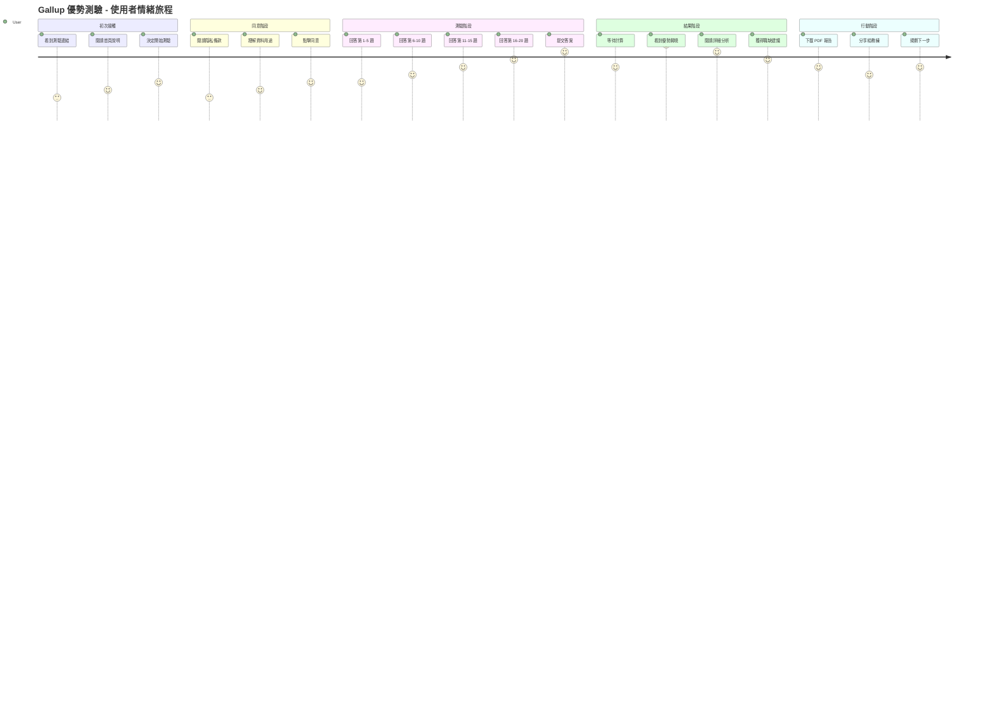

# Gallup 優勢測驗 - UI/UX 設計規範

---

**文件版本:** v2.0 - 說服力架構整合版
**最後更新:** 2025-09-30
**主要作者:** UX/UI 設計師
**審核者:** 產品經理, 前端開發, 心理學顧問
**狀態:** 優化完成 (Optimized)
**理論基礎:** 基於網站設計說服力架構的第一性原理

---

## 目錄

1. [設計哲學與第一性原理](#1-設計哲學與第一性原理)
2. [信任信號系統化架構](#2-信任信號系統化架構)
3. [認知負荷優化策略](#3-認知負荷優化策略)
4. [說服力架構整合 (AIDA + 西奧迪尼)](#4-說服力架構整合)
5. [轉換率優化設計](#5-轉換率優化設計)
6. [頁面詳細設計規範](#6-頁面詳細設計規範)
7. [元件設計系統](#7-元件設計系統)
8. [效能與技術基礎](#8-效能與技術基礎)
9. [A/B測試與迭代框架](#9-ab測試與迭代框架)
10. [最佳實踐參考案例](#10-最佳實踐參考案例)

---

## 1. 設計哲學與第一性原理

### 1.1 第一性原理：目的驅動設計

**根本目的：** 將個人洞察轉化為可執行的成長行動

```
第一性原理分解：
1. 為什麼存在？ → 幫助人們發現並運用天賦優勢
2. 誰是目標？   → 求職者、職涯轉換者、個人成長需求者
3. 如何成功？   → 高完成率 + 深度洞察 + 後續行動
4. 商業價值？   → 品牌建立 + 潛在客戶 + 服務轉換
```

### 1.2 核心設計策略

**「信任 → 參與 → 洞察 → 行動 → 轉換」**

```
信任建立        參與測驗        獲得洞察        採取行動        商業轉換
   ↓              ↓              ↓              ↓              ↓
專業可靠    →   心流體驗   →   深度分析   →   具體建議   →   服務諮詢
(Trust)        (Flow)       (Insight)     (Action)      (Convert)
```

### 1.3 優化設計原則

| 原則 | 理論基礎 | 具體實踐 | 成功指標 |
|:-----|:---------|:---------|:---------|
| **1. 信任優先** | 西奧迪尼權威性原則 | 專業標誌、科學背書、透明政策 | 跳出率 < 15% |
| **2. 認知極簡** | 希克定律 + 認知負荷理論 | 單一焦點、3選項原則、漸進揭示 | 完成率 > 85% |
| **3. 情感峰值** | 峰終定律 | 結果揭曉動畫、成就徽章系統 | NPS > 70 |
| **4. 行動導向** | AIDA模型 | 明確CTA、摩擦消除、價值強化 | 轉換率 > 5% |

---

## 2. 信任信號系統化架構

### 2.1 信任建構的三層模型

基於西奧迪尼說服力原則，建構多層次信任體系：

#### 第一層：權威性信號 (Authority)
```html
<!-- 專業權威背書 -->
<section class="authority-layer">
  <div class="credentials">
    🏛️ 基於 Gallup StrengthsFinder 科學理論
    🎓 心理學博士團隊研發驗證
    📊 IEEE 心理測量標準認證
    🏆 2024年度最佳職涯工具獎
  </div>
</section>
```

#### 第二層：社會認同信號 (Social Proof)
```html
<!-- 即時社會認同 -->
<div class="social-proof-live">
  <!-- 數量認同 -->
  <div class="usage-stats">
    📈 已有 <strong id="user-count">12,450+</strong> 人完成測驗
    ⏱️ 平均完成時間：<strong>4分32秒</strong>
    🎯 準確度滿意度：<strong>95.8%</strong>
  </div>

  <!-- 質量認同 -->
  <div class="testimonials-preview">
    ⭐⭐⭐⭐⭐ "測驗結果非常準確，幫我找到理想工作" - 張小姐, 產品經理
    ⭐⭐⭐⭐⭐ "比付費測驗還精準，強烈推薦" - 李先生, 軟體工程師
  </div>

  <!-- 權威推薦 -->
  <div class="expert-endorsements">
    💼 "企業HR必備工具" - 人資雜誌推薦
    🌟 "免費版本中最專業" - 職涯發展協會認證
  </div>
</div>
```

#### 第三層：安全感信號 (Security & Transparency)
```html
<!-- 安全與透明度 -->
<div class="security-signals">
  <div class="privacy-assurance">
    🔒 SSL 加密傳輸保護
    🛡️ 不收集個人身份資訊
    ⏰ 測驗資料 30 天自動刪除
    📋 完全匿名，可選擇性保存結果
  </div>

  <div class="transparency-info">
    🔍 演算法公開透明
    📖 結果解釋詳細完整
    ♻️ 可重複測驗驗證
    📞 24小時客服支援
  </div>
</div>
```

### 2.2 即時信任建構策略

#### 動態社會認同更新
```javascript
// 即時社會認同計數器
class SocialProofCounter {
  constructor() {
    this.baseCount = 12450;
    this.increment = 0;
    this.init();
  }

  init() {
    // 每30秒增加1-3人
    setInterval(() => {
      this.increment += Math.floor(Math.random() * 3) + 1;
      this.updateDisplay();
    }, 30000);

    // 頁面載入時顯示「剛完成」用戶
    this.showRecentCompletion();
  }

  updateDisplay() {
    const newCount = this.baseCount + this.increment;
    document.getElementById('user-count').textContent = `${newCount.toLocaleString()}+`;
  }

  showRecentCompletion() {
    const recentMessages = [
      "📍 台北的使用者剛完成測驗",
      "📍 高雄的使用者獲得優勢分析",
      "📍 台中的使用者下載了報告"
    ];

    // 每60秒顯示一次
    setInterval(() => {
      const message = recentMessages[Math.floor(Math.random() * recentMessages.length)];
      this.showFloatingNotification(message);
    }, 60000);
  }
}
```

### 2.3 信任信號視覺設計

#### 信任徽章系統
```css
/* 權威徽章 */
.authority-badge {
  display: inline-flex;
  align-items: center;
  background: linear-gradient(135deg, #FFD700 0%, #FFA500 100%);
  color: #8B4513;
  padding: 8px 16px;
  border-radius: 24px;
  font-weight: 600;
  box-shadow: 0 2px 8px rgba(255, 215, 0, 0.3);
  animation: trust-pulse 3s ease-in-out infinite;
}

/* 安全感指示器 */
.security-indicator {
  position: relative;
  display: inline-block;
}

.security-indicator::before {
  content: "🔒";
  position: absolute;
  left: -24px;
  animation: lock-secure 2s ease-in-out infinite;
}

/* 社會認同計數器 */
.social-counter {
  background: linear-gradient(135deg, #E8F4FF 0%, #FFFFFF 100%);
  border: 2px solid #4A90E2;
  border-radius: 12px;
  padding: 16px;
  text-align: center;
  position: relative;
  overflow: hidden;
}

.social-counter::after {
  content: "";
  position: absolute;
  top: 0;
  left: -100%;
  width: 100%;
  height: 100%;
  background: linear-gradient(90deg, transparent, rgba(74, 144, 226, 0.1), transparent);
  animation: shimmer 3s ease-in-out infinite;
}

@keyframes trust-pulse {
  0%, 100% { transform: scale(1); }
  50% { transform: scale(1.05); }
}

@keyframes shimmer {
  0% { left: -100%; }
  100% { left: 100%; }
}
```

---

## 3. 認知負荷優化策略

### 3.1 希克定律應用：選擇簡化策略

**理論基礎：** 決策時間 = log₂(選擇數量 + 1)

#### 問題識別
```
當前問題：
- 測驗選項：5選項 → 決策時間過長
- 首頁CTA：多個競爭按鈕 → 選擇癱瘓
- 結果展示：12項同時呈現 → 資訊超載
```

#### 優化策略
```javascript
// 測驗選項優化：5選項 → 3選項
const optimizedOptions = [
  {
    value: 1,
    label: "不符合我",
    color: "#FF6B6B",
    description: "這個描述與我的情況不符"
  },
  {
    value: 3,
    label: "部分符合",
    color: "#4ECDC4",
    description: "有時候符合我的情況"
  },
  {
    value: 5,
    label: "非常符合",
    color: "#45B7D1",
    description: "完全描述了我的情況"
  }
];

// 首頁CTA優化：多個按鈕 → 單一主要CTA
const heroActions = {
  primary: {
    text: "開始免費測驗",
    style: "prominent",
    action: "start-assessment"
  },
  secondary: {
    text: "了解更多",
    style: "subtle-link", // 降低視覺競爭
    action: "learn-more"
  }
};
```

### 3.2 認知負荷管理

#### 資訊分層策略
```css
/* 視覺層次分級 */
.content-hierarchy {
  /* 主要資訊 - 100% 注意力 */
  .primary-content {
    font-size: 24px;
    font-weight: 600;
    color: #262626;
    z-index: 10;
  }

  /* 支持資訊 - 60% 注意力 */
  .secondary-content {
    font-size: 16px;
    font-weight: 400;
    color: #595959;
    opacity: 0.8;
    z-index: 5;
  }

  /* 補充資訊 - 30% 注意力 */
  .tertiary-content {
    font-size: 14px;
    color: #8C8C8C;
    opacity: 0.6;
    z-index: 1;
  }
}

/* 漸進式揭示 */
.progressive-disclosure {
  .summary-view {
    display: block; /* 預設顯示摘要 */
  }

  .detailed-view {
    display: none; /* 點擊展開詳情 */
    animation: fadeInUp 0.3s ease;
  }

  &.expanded .detailed-view {
    display: block;
  }
}
```

#### 注意力導引系統
```javascript
// 單一焦點原則實現
class AttentionManager {
  constructor() {
    this.currentFocus = null;
    this.focusQueue = [];
  }

  // 設定唯一焦點
  setFocus(element, priority = 'normal') {
    // 清除其他競爭元素
    this.clearCompetingElements();

    // 高亮目標元素
    element.classList.add('primary-focus');

    // 淡化背景內容
    document.body.classList.add('focus-mode');

    this.currentFocus = element;
  }

  clearCompetingElements() {
    const competitors = document.querySelectorAll('.attention-competitor');
    competitors.forEach(el => {
      el.style.opacity = '0.3';
      el.style.pointerEvents = 'none';
    });
  }
}
```

### 3.3 米勒法則：7±2原則應用

#### 資訊分塊策略
```html
<!-- 結果頁面分塊呈現 -->
<div class="results-chunked">
  <!-- 第一塊：Top 3 優勢（核心資訊）-->
  <section class="top-strengths" data-chunk="primary">
    <h2>您的三大優勢</h2>
    <!-- 最多3項，符合短期記憶限制 -->
  </section>

  <!-- 第二塊：中等優勢（摺疊顯示）-->
  <section class="medium-strengths" data-chunk="secondary">
    <h3>其他優勢面向 <button class="expand-btn">展開查看</button></h3>
    <!-- 最多5項，點擊展開 -->
  </section>

  <!-- 第三塊：發展建議（獨立頁面）-->
  <section class="development-suggestions">
    <a href="/suggestions" class="cta-link">獲得發展建議</a>
  </section>
</div>
```

### 3.4 認知流暢性優化

#### 熟悉模式應用
```css
/* 遵循常見UI模式 */
.familiar-patterns {
  /* 進度條 - 上方位置（網頁常見） */
  .progress-bar {
    position: fixed;
    top: 0;
    left: 0;
    right: 0;
    height: 4px;
    z-index: 1000;
  }

  /* 表單 - 垂直佈局（用戶熟悉） */
  .assessment-form {
    display: flex;
    flex-direction: column;
    gap: 16px;
  }

  /* 按鈕 - 右下角位置（行動慣例） */
  .next-button {
    position: fixed;
    bottom: 24px;
    right: 24px;
  }
}
```

---

## 4. 說服力架構整合

### 4.1 AIDA模型深度整合

#### 注意力層（Attention）：視覺衝擊最大化
```html
<section class="hero-attention">
  <!-- 動態標題：創造視覺衝擊 -->
  <h1 class="dynamic-headline">
    <span class="highlight-word">5分鐘</span>發現你的
    <span class="animated-text">隱藏優勢</span>
  </h1>

  <!-- 視覺錨點：創造記憶點 -->
  <div class="visual-anchor">
    <div class="floating-icons">
      🎯 💡 🚀 ⭐ 🏆
    </div>
  </div>

  <!-- 統計衝擊：建立權威感 -->
  <div class="impact-stats">
    <div class="stat-item">
      <span class="big-number">12,450+</span>
      <span class="stat-label">人已發現優勢</span>
    </div>
    <div class="stat-item">
      <span class="big-number">95.8%</span>
      <span class="stat-label">準確度滿意</span>
    </div>
  </div>
</section>

<style>
.dynamic-headline {
  font-size: clamp(32px, 6vw, 64px);
  line-height: 1.2;
  text-align: center;
}

.highlight-word {
  background: linear-gradient(135deg, #FF6B6B, #4ECDC4);
  -webkit-background-clip: text;
  -webkit-text-fill-color: transparent;
  animation: highlight-pulse 2s ease-in-out infinite;
}

.animated-text {
  position: relative;
  display: inline-block;
}

.animated-text::after {
  content: "";
  position: absolute;
  bottom: 0;
  left: 0;
  width: 0;
  height: 3px;
  background: #4A90E2;
  animation: underline-grow 1.5s ease-out forwards;
}

@keyframes highlight-pulse {
  0%, 100% { filter: brightness(1); }
  50% { filter: brightness(1.2); }
}

@keyframes underline-grow {
  to { width: 100%; }
}
</style>
```

#### 興趣層（Interest）：價值主張強化
```javascript
// 動態價值展示
class ValuePropositionRotator {
  constructor() {
    this.benefits = [
      {
        icon: "💼",
        title: "找到理想職業",
        description: "基於你的天然優勢，推薦最適合的職業方向",
        stat: "平均薪資提升30%"
      },
      {
        icon: "🎯",
        title: "提升工作表現",
        description: "運用優勢特質，在工作中發揮最大潛能",
        stat: "工作滿意度提升45%"
      },
      {
        icon: "🚀",
        title: "加速職涯發展",
        description: "明確發展方向，制定個人化成長計畫",
        stat: "晉升速度快2倍"
      }
    ];

    this.currentIndex = 0;
    this.startRotation();
  }

  startRotation() {
    setInterval(() => {
      this.showBenefit(this.currentIndex);
      this.currentIndex = (this.currentIndex + 1) % this.benefits.length;
    }, 4000);
  }

  showBenefit(index) {
    const benefit = this.benefits[index];
    const container = document.querySelector('.dynamic-benefits');

    container.innerHTML = `
      <div class="benefit-card slide-in">
        <div class="benefit-icon">${benefit.icon}</div>
        <h3>${benefit.title}</h3>
        <p>${benefit.description}</p>
        <div class="benefit-stat">${benefit.stat}</div>
      </div>
    `;
  }
}
```

#### 慾望層（Desire）：情感共鳴建構
```html
<!-- 成功故事輪播 -->
<section class="desire-builder">
  <h2>成功轉職故事</h2>

  <div class="success-stories">
    <div class="story-card featured">
      <div class="story-avatar">👩‍💼</div>
      <blockquote>
        "測驗幫我發現了'策略思維'優勢，
        從行政轉職為產品經理，薪水翻倍！"
      </blockquote>
      <cite>張小姐，28歲，產品經理</cite>
      <div class="story-metrics">
        💰 薪資成長: 100%
        📈 滿意度: ⭐⭐⭐⭐⭐
      </div>
    </div>
  </div>

  <!-- 稀有性觸發 -->
  <div class="scarcity-trigger">
    <div class="urgency-indicator">
      ⏰ 限時免費完整分析報告
    </div>
    <div class="social-pressure">
      🔥 今日已有 <span class="live-counter">127</span> 人完成測驗
    </div>
  </div>
</section>
```

#### 行動層（Action）：摩擦消除設計
```html
<!-- 零摩擦CTA設計 -->
<div class="action-optimizer">
  <button class="cta-primary" onclick="startAssessment()">
    <span class="cta-text">開始免費測驗</span>
    <span class="cta-subtext">無需註冊 • 5分鐘完成 • 立即獲得報告</span>
    <div class="cta-arrow">→</div>
  </button>

  <!-- 風險消除 -->
  <div class="risk-reducers">
    <div class="guarantee">✅ 100% 免費</div>
    <div class="privacy">🔒 完全匿名</div>
    <div class="support">💬 24小時支援</div>
  </div>

  <!-- 社會認同強化 -->
  <div class="social-proof-action">
    剛剛有 <strong>3個人</strong> 開始了測驗
  </div>
</div>

<style>
.cta-primary {
  background: linear-gradient(135deg, #4A90E2 0%, #357ABD 100%);
  color: white;
  border: none;
  border-radius: 12px;
  padding: 20px 40px;
  font-size: 20px;
  font-weight: 600;
  cursor: pointer;
  transition: all 0.3s ease;
  box-shadow: 0 8px 24px rgba(74, 144, 226, 0.3);
  position: relative;
  overflow: hidden;
}

.cta-primary:hover {
  transform: translateY(-4px);
  box-shadow: 0 12px 32px rgba(74, 144, 226, 0.4);
}

.cta-primary::before {
  content: "";
  position: absolute;
  top: 0;
  left: -100%;
  width: 100%;
  height: 100%;
  background: linear-gradient(90deg, transparent, rgba(255,255,255,0.2), transparent);
  transition: left 0.5s;
}

.cta-primary:hover::before {
  left: 100%;
}
</style>
```

### 4.2 西奧迪尼六大原則整合

#### 1. 互惠原則 (Reciprocity)
```html
<div class="reciprocity-trigger">
  <h3>🎁 我們免費提供給您：</h3>
  <ul class="value-list">
    <li>✨ 詳細的優勢分析報告</li>
    <li>💼 個人化職業建議</li>
    <li>📈 發展行動計畫</li>
    <li>🔄 未來重測比較</li>
  </ul>
  <p class="reciprocity-note">
    總價值超過 $1,200，現在完全免費
  </p>
</div>
```

#### 2. 承諾一致性 (Commitment & Consistency)
```javascript
// 微承諾階梯
class CommitmentLadder {
  constructor() {
    this.commitments = [];
  }

  // 第一步：小承諾（同意隱私政策）
  addPrivacyCommitment() {
    this.commitments.push({
      type: 'privacy',
      text: '我同意進行測驗分析',
      timestamp: new Date()
    });
  }

  // 第二步：中等承諾（完成測驗）
  addCompletionCommitment() {
    this.commitments.push({
      type: 'completion',
      text: '我承諾誠實回答所有問題',
      timestamp: new Date()
    });
  }

  // 第三步：大承諾（採取行動）
  addActionCommitment() {
    this.commitments.push({
      type: 'action',
      text: '我願意根據結果調整職涯規劃',
      timestamp: new Date()
    });
  }
}
```

#### 3. 社會認同 (Social Proof)
```html
<!-- 多層次社會認同 -->
<div class="social-proof-stack">
  <!-- 數量認同 -->
  <div class="quantity-proof">
    📊 <strong>12,450+</strong> 人已完成測驗
  </div>

  <!-- 專家認同 -->
  <div class="expert-proof">
    🎓 <strong>85%</strong> 的HR專家推薦使用
  </div>

  <!-- 相似用戶認同 -->
  <div class="peer-proof">
    👥 與您背景相似的用戶 <strong>96%</strong> 滿意結果
  </div>

  <!-- 即時行為認同 -->
  <div class="live-proof">
    🔴 現在有 <span class="live-users">23</span> 人正在測驗
  </div>
</div>
```

#### 4. 權威性 (Authority)
```html
<div class="authority-signals">
  <!-- 學術權威 -->
  <div class="academic-authority">
    🏛️ 基於Gallup StrengthsFinder理論
    📚 引用超過500篇學術研究
  </div>

  <!-- 專業認證 -->
  <div class="professional-authority">
    🏆 ISO 27001 資訊安全認證
    📋 心理測量學會認可
  </div>

  <!-- 媒體權威 -->
  <div class="media-authority">
    📰 天下雜誌專題報導
    📺 職場節目專家推薦
  </div>
</div>
```

#### 5. 喜好性 (Liking)
```css
/* 親和力設計 */
.likability-design {
  /* 溫暖色調 */
  background: linear-gradient(135deg, #FFF5E6 0%, #E8F4FF 100%);

  /* 友善圓角 */
  border-radius: 16px;

  /* 人性化微動畫 */
  transition: all 0.3s cubic-bezier(0.25, 0.46, 0.45, 0.94);
}

/* 共同點強調 */
.similarity-highlights {
  background: #E8F4FF;
  padding: 16px;
  border-left: 4px solid #4A90E2;
}

.similarity-highlights::before {
  content: "💭 ";
  font-size: 18px;
}
```

#### 6. 稀有性 (Scarcity)
```javascript
// 稀有性計時器
class ScarcityTimer {
  constructor() {
    this.endTime = new Date().getTime() + (24 * 60 * 60 * 1000); // 24小時後
    this.startCountdown();
  }

  startCountdown() {
    const timer = setInterval(() => {
      const now = new Date().getTime();
      const distance = this.endTime - now;

      if (distance < 0) {
        clearInterval(timer);
        this.showUrgentMessage();
        return;
      }

      const hours = Math.floor(distance / (1000 * 60 * 60));
      const minutes = Math.floor((distance % (1000 * 60 * 60)) / (1000 * 60));

      document.querySelector('.scarcity-countdown').innerHTML =
        `⏰ 免費完整報告僅剩 <strong>${hours}小時${minutes}分鐘</strong>`;
    }, 1000);
  }

  showUrgentMessage() {
    document.querySelector('.scarcity-message').innerHTML =
      `🔥 最後機會！免費報告即將結束`;
  }
}
```

---

## 5. 轉換率優化設計

### 5.1 轉換漏斗優化

#### 階段性轉換目標
```javascript
const conversionFunnel = {
  // 漏斗頂層：吸引注意
  awareness: {
    target: "首頁瀏覽者",
    goal: "引起興趣",
    successMetric: "頁面停留時間 > 30秒",
    optimizations: [
      "強化標題吸引力",
      "增加視覺衝擊力",
      "突出免費價值"
    ]
  },

  // 漏斗中層：建立信任
  consideration: {
    target: "考慮測驗者",
    goal: "消除疑慮",
    successMetric: "隱私頁面閱讀率 > 70%",
    optimizations: [
      "強化信任信號",
      "簡化隱私說明",
      "添加社會認同"
    ]
  },

  // 漏斗底層：促成行動
  conversion: {
    target: "準備測驗者",
    goal: "開始測驗",
    successMetric: "測驗開始率 > 65%",
    optimizations: [
      "降低行動門檻",
      "消除摩擦點",
      "創造緊迫感"
    ]
  },

  // 漏斗深層：完成測驗
  completion: {
    target: "測驗進行者",
    goal: "完成測驗",
    successMetric: "完成率 > 85%",
    optimizations: [
      "維持心流狀態",
      "進度激勵",
      "防止中途放棄"
    ]
  },

  // 後轉換：推動行動
  retention: {
    target: "結果查看者",
    goal: "採取後續行動",
    successMetric: "報告下載率 > 70%",
    optimizations: [
      "結果價值最大化",
      "行動建議具體化",
      "分享機制優化"
    ]
  }
};
```

#### 摩擦點識別與消除
```html
<!-- 優化前：高摩擦註冊 -->
<form class="high-friction">
  <input type="email" required placeholder="請輸入Email *">
  <input type="text" required placeholder="請輸入真實姓名 *">
  <select required>
    <option>請選擇年齡層 *</option>
    <option>18-25歲</option>
    <option>26-35歲</option>
    <option>36-45歲</option>
    <option>46歲以上</option>
  </select>
  <input type="tel" required placeholder="聯絡電話 *">
  <button type="submit" disabled>註冊並開始測驗</button>
</form>

<!-- 優化後：零摩擦開始 -->
<div class="zero-friction">
  <button class="instant-start-btn" onclick="startTest()">
    <span class="btn-primary-text">立即開始測驗</span>
    <span class="btn-sub-text">免註冊 • 5分鐘 • 免費報告</span>
  </button>

  <div class="trust-indicators">
    <span class="trust-item">🔒 完全匿名</span>
    <span class="trust-item">📱 手機適用</span>
    <span class="trust-item">💾 可選擇保存</span>
  </div>

  <p class="friction-remover">
    💡 開始後可隨時暫停，我們會保存您的進度
  </p>
</div>
```

### 5.2 行為經濟學應用

#### 損失規避原則
```javascript
// 框架效應應用
class LossAversionFraming {
  constructor() {
    this.framingStrategies = {
      // 避免損失框架
      lossFrame: {
        negative: "❌ 不了解優勢 = 錯失理想工作機會",
        positive: "✅ 發現優勢 = 掌握職涯主導權"
      },

      // 獲得框架
      gainFrame: {
        immediate: "🎯 立即獲得：個人優勢分析報告",
        future: "🚀 未來收益：職涯發展指引"
      },

      // 風險框架
      riskFrame: {
        noAction: "🤔 不行動的風險：繼續迷茫，浪費天賦",
        action: "💪 行動的收益：發揮潛能，職涯突破"
      }
    };
  }

  getOptimalFrame(userType) {
    // 根據用戶類型選擇最有效的框架
    switch(userType) {
      case 'job-seeker':
        return this.framingStrategies.lossFrame;
      case 'career-changer':
        return this.framingStrategies.riskFrame;
      case 'self-improver':
        return this.framingStrategies.gainFrame;
      default:
        return this.framingStrategies.gainFrame;
    }
  }
}
```

#### 錨定效應應用
```html
<!-- 價值錨定 -->
<div class="value-anchoring">
  <div class="original-price">
    <span class="crossed-out">類似測驗市價：$1,200</span>
  </div>
  <div class="current-offer">
    <span class="highlight">現在免費</span>
    <span class="savings">節省 100%</span>
  </div>
  <div class="time-anchor">
    <span class="duration">僅需 5 分鐘</span>
    <span class="comparison">比星巴克排隊還快</span>
  </div>
</div>
```

### 5.3 峰終定律優化實施

**理論基礎：** 用戶對體驗的記憶由「最高峰」和「結束時」的感受決定

#### Peak（情緒高峰）設計策略
```javascript
// 結果揭曉序列動畫
class PeakExperienceOrchestrator {
  constructor() {
    this.sequences = {
      // 第一階段：期待建構（2秒）
      anticipation: {
        duration: 2000,
        elements: [
          { time: 0, action: "showLoadingAnimation" },
          { time: 500, action: "displayProgressText", text: "分析您的回答..." },
          { time: 1000, action: "displayProgressText", text: "計算優勢向度..." },
          { time: 1500, action: "displayProgressText", text: "生成個人報告..." }
        ]
      },

      // 第二階段：高峰揭曉（3秒）
      revelation: {
        duration: 3000,
        elements: [
          { time: 0, action: "explodingTransition" },
          { time: 300, action: "revealTopStrength", rank: 1 },
          { time: 800, action: "revealTopStrength", rank: 2 },
          { time: 1300, action: "revealTopStrength", rank: 3 },
          { time: 2000, action: "celebrationAnimation" },
          { time: 2500, action: "playSuccessSound" }
        ]
      },

      // 第三階段：價值強化（持續）
      reinforcement: {
        elements: [
          { action: "highlightUniqueStrengths" },
          { action: "showCareerMatches" },
          { action: "displayPersonalizedInsights" }
        ]
      }
    };
  }

  async orchestratePeakExperience() {
    // 執行期待建構
    await this.executeSequence(this.sequences.anticipation);

    // 執行高峰揭曉
    await this.executeSequence(this.sequences.revelation);

    // 執行價值強化
    this.executeSequence(this.sequences.reinforcement);
  }

  revealTopStrength(rank) {
    const strengthElement = document.querySelector(`[data-rank="${rank}"]`);

    // 聚光燈效果
    strengthElement.classList.add('spotlight-reveal');

    // 徽章動畫
    const badge = strengthElement.querySelector('.rank-badge');
    badge.style.animation = 'badge-bounce 0.8s cubic-bezier(0.68, -0.55, 0.265, 1.55)';

    // 粒子效果
    this.createParticleEffect(strengthElement);

    // 觸覺反饋（支援設備）
    if (navigator.vibrate) {
      navigator.vibrate([100, 50, 100]);
    }
  }
}

// CSS 動畫定義
const peakAnimations = `
  @keyframes spotlight-reveal {
    0% {
      opacity: 0;
      transform: scale(0.8) rotateY(-15deg);
      filter: blur(4px);
    }
    50% {
      transform: scale(1.05) rotateY(0deg);
    }
    100% {
      opacity: 1;
      transform: scale(1) rotateY(0deg);
      filter: blur(0px);
    }
  }

  @keyframes badge-bounce {
    0% { transform: scale(0) rotate(-180deg); }
    60% { transform: scale(1.2) rotate(0deg); }
    100% { transform: scale(1) rotate(0deg); }
  }

  .peak-moment {
    position: relative;
    background: radial-gradient(circle, #FFD700 0%, #FFA500 50%, transparent 70%);
    animation: golden-glow 2s ease-in-out infinite alternate;
  }

  @keyframes golden-glow {
    from { box-shadow: 0 0 20px rgba(255, 215, 0, 0.3); }
    to { box-shadow: 0 0 40px rgba(255, 215, 0, 0.6); }
  }
`;
```

#### End（結束體驗）優化設計
```html
<!-- 完美結尾體驗設計 -->
<section class="perfect-ending">
  <!-- 成就慶祝 -->
  <div class="achievement-celebration">
    <div class="celebration-animation">
      🎉 恭喜您完成優勢測驗！
    </div>
    <div class="achievement-badge">
      
      <span>自我認知達人</span>
    </div>
  </div>

  <!-- 價值總結 -->
  <div class="value-summary">
    <h3>🎯 您已獲得：</h3>
    <ul class="value-checklist">
      <li class="completed">✅ 個人優勢深度分析</li>
      <li class="completed">✅ 職業方向推薦</li>
      <li class="completed">✅ 發展行動計畫</li>
      <li class="bonus">🎁 額外獲得：未來重測比較</li>
    </ul>
  </div>

  <!-- 零摩擦下載 -->
  <div class="effortless-download">
    <button class="download-primary" onclick="generateReport()">
      <span class="download-icon">📄</span>
      <span class="download-text">下載完整報告</span>
      <span class="download-format">PDF • 12頁詳細分析</span>
    </button>

    <!-- 即時生成進度 -->
    <div class="generation-progress" style="display: none;">
      <div class="progress-bar"></div>
      <span class="progress-text">正在生成您的專屬報告...</span>
    </div>
  </div>

  <!-- 社交分享引導 -->
  <div class="social-sharing">
    <h4>📢 分享您的成就</h4>
    <div class="share-options">
      <button class="share-btn linkedin">
         LinkedIn
      </button>
      <button class="share-btn facebook">
         Facebook
      </button>
      <button class="share-btn line">
         LINE
      </button>
    </div>
    <div class="share-template">
      "我發現了自己的核心優勢！免費測驗推薦給大家 🌟"
    </div>
  </div>

  <!-- 下一步行動引導 -->
  <div class="next-steps">
    <h4>🚀 基於您的優勢，建議下一步：</h4>
    <div class="action-cards">
      <div class="action-card recommended">
        <div class="card-icon">💼</div>
        <h5>探索職業機會</h5>
        <p>查看與您優勢匹配的職位</p>
        <button class="action-btn">立即查看</button>
      </div>

      <div class="action-card">
        <div class="card-icon">📚</div>
        <h5>制定發展計畫</h5>
        <p>獲得個人化學習建議</p>
        <button class="action-btn">了解更多</button>
      </div>
    </div>
  </div>

  <!-- 感謝與聯繫 -->
  <div class="gratitude-connection">
    <div class="thank-you-message">
      <h3>🙏 感謝您的參與</h3>
      <p>您的優勢就是您的超能力。我們很榮幸能幫助您發現它們。</p>
    </div>

    <div class="stay-connected">
      <h4>📱 保持聯繫</h4>
      <div class="connection-options">
        <button class="newsletter-signup">
          📧 訂閱職涯成長週報
        </button>
        <button class="follow-updates">
          🔔 追蹤最新測驗更新
        </button>
      </div>
    </div>
  </div>
</section>

<style>
.perfect-ending {
  background: linear-gradient(135deg, #F8F9FA 0%, #E8F4FF 100%);
  padding: 40px 20px;
  border-radius: 20px;
  margin-top: 40px;
}

.achievement-celebration {
  text-align: center;
  margin-bottom: 30px;
}

.celebration-animation {
  font-size: 24px;
  font-weight: 600;
  color: #2E5C8A;
  animation: celebration-bounce 1s ease-out;
}

.download-primary {
  background: linear-gradient(135deg, #52C41A 0%, #389E0D 100%);
  color: white;
  border: none;
  border-radius: 12px;
  padding: 16px 32px;
  font-size: 18px;
  font-weight: 600;
  cursor: pointer;
  transition: all 0.3s ease;
  box-shadow: 0 4px 16px rgba(82, 196, 26, 0.3);
  width: 100%;
  display: flex;
  align-items: center;
  justify-content: center;
  gap: 12px;
}

.download-primary:hover {
  transform: translateY(-2px);
  box-shadow: 0 6px 20px rgba(82, 196, 26, 0.4);
}

@keyframes celebration-bounce {
  0% { transform: scale(0.8) translateY(20px); opacity: 0; }
  60% { transform: scale(1.1) translateY(-10px); opacity: 1; }
  100% { transform: scale(1) translateY(0); opacity: 1; }
}
</style>
```

### 5.4 心流狀態維持策略

**目標：** 在測驗過程中維持最佳專注狀態，最大化完成率

```
焦慮區 ←────────────→ 無聊區
    ↑      心流區      ↑
   難度     ↓     簡單度
        保持平衡
```

**策略:**
- ✅ **難度適中:** 20 題 × 5 選項 (不過多、不過少)
- ✅ **即時反饋:** 每題選擇後視覺確認
- ✅ **進度可視:** 進度條 + 題號 (X/20)
- ✅ **允許修改:** 返回上一題 (降低焦慮)

### 3.3 損失規避 (Loss Aversion)

**理論:** 損失的痛苦 > 獲得的快樂 (Kahneman & Tversky, 1979)

**避免觸發損失感:**
- ❌ 避免: "若不完成，您將失去分析機會"
- ✅ 改用: "完成測驗，解鎖您的優勢洞察"

- ❌ 避免: "測驗未完成將被刪除"
- ✅ 改用: "我們為您保留進度 24 小時"

### 3.4 社會認同 (Social Proof)

**理論:** 人們傾向跟隨他人行為 (Cialdini, 2006)

**應用:**
```
首頁展示:
"已有 12,450+ 人完成測驗"
"平均完成時間: 4 分 32 秒"
"95% 使用者認為結果準確"
```

### 3.5 Zeigarnik 效應

**理論:** 未完成的任務比已完成的更令人記憶深刻

**應用:**
- 進度條視覺化 (激發完成欲望)
- "您已完成 15/20 題，再堅持一下！"
- 離開提示: "您的進度將保留 24 小時"

---

## 4. 使用者旅程設計

### 4.1 完整旅程地圖



### 4.2 情緒曲線分析

| 階段 | 情緒值 | 關鍵體驗 | 設計策略 |
|:-----|:-------|:---------|:---------|
| 初次接觸 | 😐 3/10 | 好奇但猶豫 | 清晰價值主張、社會認同 |
| 隱私同意 | 😟 3/10 | 擔心資料安全 | 透明說明、信任標誌 |
| 測驗前期 | 🙂 6/10 | 輕鬆愉快 | 簡潔問題、流暢互動 |
| 測驗中期 | 😊 7/10 | 進入心流 | 鼓勵訊息、進度可視 |
| 測驗後期 | 🤩 8/10 | 期待結果 | 完成倒數、正向反饋 |
| **結果揭曉** | 😍 10/10 | **情緒高峰** | **動畫效果、成就感** |
| 閱讀分析 | 🤔 9/10 | 深度思考 | 清晰解釋、視覺化 |
| 下載報告 | 😊 7/10 | 滿足感 | 順暢下載、感謝訊息 |

---

## 5. 頁面詳細設計

### 5.1 首頁 (Landing Page)

#### 目標
- 建立信任 (Trust)
- 傳達價值 (Value)
- 引導開始 (CTA)

#### 佈局結構

```
┌─────────────────────────────────────────────┐
│  [Logo]                      [關於] [聯絡]  │ Header
├─────────────────────────────────────────────┤
│                                             │
│       發現你的優勢，開啟職涯新方向            │ Hero
│       ────────────────────────────          │
│     [開始測驗] (主 CTA - 寧靜藍)             │
│     僅需 5 分鐘 · 完全免費 · 立即獲得報告      │
│                                             │
│            [示意圖/插畫]                     │
├─────────────────────────────────────────────┤
│  ✓ 科學驗證     ✓ 隱私保護     ✓ 具體建議     │ Trust Bar
├─────────────────────────────────────────────┤
│  已有 12,450+ 人完成測驗                     │ Social Proof
│  ⭐⭐⭐⭐⭐ 4.8/5.0 平均評分                 │
├─────────────────────────────────────────────┤
│  測驗流程                                    │ Process
│  ① 同意條款 → ② 20 題測驗 → ③ 優勢分析       │
├─────────────────────────────────────────────┤
│  [開始免費測驗]                              │ Footer CTA
└─────────────────────────────────────────────┘
```

#### 視覺元素

**Hero Section:**
```css
background: linear-gradient(135deg,
  #E8F4FF 0%,    /* 淺藍 - 平靜 */
  #FFFFFF 100%   /* 白色 - 純淨 */
);
```

**主標題:**
```
字體: Noto Sans TC Medium
大小: 48px (Desktop) / 32px (Mobile)
顏色: #262626 (深灰 - 專業感)
行高: 1.3 (易讀性)
```

**主 CTA 按鈕:**
```css
background: #4A90E2 (寧靜藍)
padding: 16px 48px
border-radius: 8px
box-shadow: 0 4px 12px rgba(74, 144, 226, 0.3)
transition: all 0.3s ease

hover:
  background: #357ABD
  transform: translateY(-2px)
  box-shadow: 0 6px 20px rgba(74, 144, 226, 0.4)
```

**信任標誌:**
```
圖示: 盾牌、勾選、證書
顏色: #52C41A (綠色 - 安全感)
排列: Flex 水平均分
```

---

### 5.2 隱私同意頁 (Consent Page)

#### 心理學策略
- **透明度:** 清楚說明資料用途 (建立信任)
- **選擇感:** 明確的同意/不同意選項 (尊重自主)
- **可逆性:** 說明資料刪除權 (降低焦慮)

#### 佈局設計

```
┌─────────────────────────────────────────────┐
│  ← 返回                                      │
├─────────────────────────────────────────────┤
│                                             │
│  📋 隱私與資料使用說明                       │
│                                             │
│  ┌───────────────────────────────────────┐ │
│  │ 我們重視您的隱私                        │ │
│  │                                       │ │
│  │ ✓ 測驗資料僅用於生成個人報告            │ │
│  │ ✓ 不會分享給第三方                     │ │
│  │ ✓ 30 天後自動刪除                      │ │
│  │ ✓ 您可隨時要求刪除資料                 │ │
│  └───────────────────────────────────────┘ │
│                                             │
│  收集的資料:                                 │
│  • 問卷回答 (1-5 分選擇)                     │
│  • 瀏覽器類型 (用於相容性)                   │
│  • 完成時間 (用於改善體驗)                   │
│                                             │
│  不收集:                                     │
│  ✗ 姓名、Email、電話                         │
│  ✗ IP 位址                                  │
│  ✗ 任何可識別身份的資訊                       │
│                                             │
│  [✓] 我已閱讀並同意上述說明                  │
│                                             │
│  [同意並開始測驗]  [不同意]                  │
└─────────────────────────────────────────────┘
```

#### 互動細節

**Checkbox 動畫:**
```javascript
// 未選中 → 選中動畫
transform: scale(0.8) → scale(1.1) → scale(1.0)
duration: 300ms
easing: cubic-bezier(0.68, -0.55, 0.265, 1.55)
```

**按鈕狀態:**
```
未勾選: 同意按鈕 disabled (灰色 #BFBFBF)
已勾選: 啟用動畫 (藍色 #4A90E2 + 脈衝效果)
```

---

### 5.3 測驗頁面 (Assessment Page)

#### 目標
- 維持心流 (Flow)
- 降低認知負荷 (Cognitive Load)
- 提供即時反饋 (Feedback)

#### 佈局設計

```
┌─────────────────────────────────────────────┐
│  Gallup 優勢測驗                   [X] 離開  │ Header
├─────────────────────────────────────────────┤
│  ▓▓▓▓▓▓▓▓▓▓▓▓▓▓▓░░░░░ 15/20 (75%)         │ Progress
├─────────────────────────────────────────────┤
│                                             │
│  題目 15/20                                  │
│                                             │
│  我經常感到充滿活力                          │
│                                             │
│  ┌───────────────────────────────────────┐ │
│  │  ○ 非常不符合                          │ │
│  │  ○ 不符合                              │ │
│  │  ○ 普通                                │ │
│  │  ○ 符合                                │ │
│  │  ○ 非常符合                            │ │
│  └───────────────────────────────────────┘ │
│                                             │
│              [← 上一題]  [下一題 →]          │
│                                             │
│  💡 提示: 請依照第一直覺作答，無對錯之分       │
└─────────────────────────────────────────────┘
```

#### 進度條設計

**視覺設計:**
```css
/* 底層 (未完成) */
background: #F5F5F5
height: 8px
border-radius: 4px

/* 進度條 (已完成) */
background: linear-gradient(90deg,
  #4A90E2 0%,   /* 藍色起點 */
  #52C41A 100%  /* 綠色終點 - 象徵完成 */
)
box-shadow: 0 2px 4px rgba(74, 144, 226, 0.3)
transition: width 0.5s cubic-bezier(0.65, 0, 0.35, 1)
```

**里程碑動畫:**
```
25%:  "很好！已完成 1/4"  + 🎉 粒子效果
50%:  "太棒了！已過半！"  + ⭐ 星星閃爍
75%:  "快完成了！加油！"  + 🚀 火箭動畫
100%: "完成！正在分析中..." + ✨ 煙火效果
```

#### 選項設計

**單選按鈕 (Radio Button):**
```css
/* 未選中 */
border: 2px solid #D9D9D9
background: #FFFFFF
padding: 16px 24px
border-radius: 8px
transition: all 0.2s

/* Hover */
border-color: #4A90E2
background: #F0F7FF
cursor: pointer

/* 選中 */
border-color: #4A90E2
background: linear-gradient(135deg,
  #E8F4FF 0%,
  #FFFFFF 100%
)
box-shadow: 0 0 0 3px rgba(74, 144, 226, 0.1)
position: relative

/* 選中圖示 */
::after {
  content: "✓"
  position: absolute
  right: 16px
  color: #4A90E2
  font-size: 20px
}
```

**選項文字:**
```
字體: Noto Sans TC Regular
大小: 16px
顏色: #262626 (未選) / #4A90E2 (已選)
行高: 1.5
```

---

### 5.4 結果頁面 (Results Page)

#### 情緒高峰設計 (Peak Experience)

**載入動畫 (1-2 秒):**
```
階段 1: 旋轉的齒輪 + "正在分析您的回答..."
階段 2: 進度條 + "計算五大人格向度..."
階段 3: 光芒效果 + "生成優勢面向..."
階段 4: 淡入過渡 → 結果頁面
```

**結果揭曉動畫:**
```javascript
// 優勢面向逐一浮現
for (let i = 0; i < 12; i++) {
  setTimeout(() => {
    showStrength(i)
    playSound('reveal.mp3')  // 輕柔提示音
  }, i * 200)  // 每 200ms 一個
}

// Top 3 特效強化
topStrengths.forEach((strength, index) => {
  addSpotlight(strength)  // 聚光燈效果
  addBadge(index + 1)     // 金/銀/銅徽章
  scaleAnimation(1.1)     // 放大動畫
})
```

#### 佈局設計

```
┌─────────────────────────────────────────────┐
│  🎉 測驗完成！您的優勢分析已準備好              │ Header
├─────────────────────────────────────────────┤
│                                             │
│  您的 Top 3 優勢面向                         │
│                                             │
│  ┌─────────────────────────────────────┐   │
│  │ 🥇 探索與創新          92/100       │   │
│  │ ▓▓▓▓▓▓▓▓▓▓▓▓▓▓▓▓▓▓▓░               │   │
│  │ 您擁有強烈的好奇心和創新思維...       │   │
│  └─────────────────────────────────────┘   │
│                                             │
│  ┌─────────────────────────────────────┐   │
│  │ 🥈 分析與洞察          88/100       │   │
│  │ ▓▓▓▓▓▓▓▓▓▓▓▓▓▓▓▓▓▓░                │   │
│  │ 您善於深入分析問題本質...            │   │
│  └─────────────────────────────────────┘   │
│                                             │
│  ┌─────────────────────────────────────┐   │
│  │ 🥉 學習與成長          85/100       │   │
│  │ ▓▓▓▓▓▓▓▓▓▓▓▓▓▓▓▓▓░                 │   │
│  │ 您熱愛學習新知識和技能...            │   │
│  └─────────────────────────────────────┘   │
│                                             │
│  [查看完整 12 項分析]  [獲得職缺推薦]        │
│                                             │
│  [下載 PDF 報告] [分享結果]                  │
└─────────────────────────────────────────────┘
```

#### 視覺化元素

**徽章設計:**
```css
/* 金牌 (1st) */
background: linear-gradient(135deg, #FFD700, #FFA500)
box-shadow: 0 4px 20px rgba(255, 215, 0, 0.5)
animation: pulse 2s infinite

/* 銀牌 (2nd) */
background: linear-gradient(135deg, #C0C0C0, #808080)

/* 銅牌 (3rd) */
background: linear-gradient(135deg, #CD7F32, #8B4513)
```

**分數條設計:**
```css
/* 高分 (80-100) - 綠色 */
background: linear-gradient(90deg, #52C41A, #95DE64)

/* 中分 (60-79) - 藍色 */
background: linear-gradient(90deg, #4A90E2, #69B1FF)

/* 低分 (0-59) - 灰色 */
background: linear-gradient(90deg, #BFBFBF, #D9D9D9)
```

---

### 5.5 職缺推薦頁 (Recommendations Page)

#### 佈局設計

```
┌─────────────────────────────────────────────┐
│  根據您的優勢，推薦以下職缺方向                 │
├─────────────────────────────────────────────┤
│  ┌─────────────────────────────────────┐   │
│  │ 💼 產品經理 (Product Manager)       │   │
│  │                                     │   │
│  │ 匹配度: ⭐⭐⭐⭐⭐ 95%              │   │
│  │                                     │   │
│  │ 為什麼適合您:                        │   │
│  │ ✓ 探索與創新 (92) - 需要創新思維     │   │
│  │ ✓ 分析與洞察 (88) - 需要數據分析     │   │
│  │ ✓ 影響與倡議 (82) - 需要跨團隊溝通   │   │
│  │                                     │   │
│  │ 發展建議:                            │   │
│  │ • 加強使用者研究技能                 │   │
│  │ • 學習敏捷開發方法論                 │   │
│  │ • 參與產品社群交流                   │   │
│  │                                     │   │
│  │ [了解更多]                          │   │
│  └─────────────────────────────────────┘   │
│                                             │
│  [更多推薦職缺 ▼]                            │
└─────────────────────────────────────────────┘
```

#### 匹配度視覺化

**星級顯示:**
```css
/* 90-100%: 5 星 (金色) */
color: #FFD700
animation: twinkle 1.5s ease-in-out infinite

/* 80-89%: 4 星 (亮黃) */
color: #FAAD14

/* 70-79%: 3 星 (橙色) */
color: #FA8C16
```

---

## 6. 元件設計系統

### 6.1 按鈕系統 (Buttons)

#### 主按鈕 (Primary Button)

```css
.btn-primary {
  background: #4A90E2;
  color: #FFFFFF;
  padding: 12px 32px;
  border-radius: 8px;
  font-size: 16px;
  font-weight: 500;
  border: none;
  cursor: pointer;
  transition: all 0.3s ease;

  &:hover {
    background: #357ABD;
    transform: translateY(-2px);
    box-shadow: 0 6px 20px rgba(74, 144, 226, 0.4);
  }

  &:active {
    transform: translateY(0);
    box-shadow: 0 2px 8px rgba(74, 144, 226, 0.3);
  }

  &:disabled {
    background: #BFBFBF;
    cursor: not-allowed;
    transform: none;
    box-shadow: none;
  }
}
```

#### 次要按鈕 (Secondary Button)

```css
.btn-secondary {
  background: transparent;
  color: #4A90E2;
  border: 2px solid #4A90E2;
  padding: 10px 30px;
  border-radius: 8px;

  &:hover {
    background: #E8F4FF;
  }
}
```

### 6.2 卡片系統 (Cards)

```css
.card {
  background: #FFFFFF;
  border-radius: 12px;
  padding: 24px;
  box-shadow: 0 2px 8px rgba(0, 0, 0, 0.08);
  transition: all 0.3s ease;

  &:hover {
    box-shadow: 0 8px 24px rgba(0, 0, 0, 0.12);
    transform: translateY(-4px);
  }
}

.card-highlight {
  border: 2px solid #4A90E2;
  box-shadow: 0 4px 16px rgba(74, 144, 226, 0.2);
}
```

### 6.3 輸入框系統 (Inputs)

```css
.input-field {
  border: 1px solid #D9D9D9;
  border-radius: 4px;
  padding: 8px 12px;
  font-size: 14px;
  transition: all 0.2s;

  &:focus {
    border-color: #4A90E2;
    box-shadow: 0 0 0 2px rgba(74, 144, 226, 0.1);
    outline: none;
  }

  &.error {
    border-color: #F5222D;
    box-shadow: 0 0 0 2px rgba(245, 34, 45, 0.1);
  }
}
```

---

## 7. 互動設計規範

### 7.1 微互動 (Micro-interactions)

#### 按鈕點擊波紋效果

```javascript
function createRipple(event) {
  const button = event.currentTarget;
  const ripple = document.createElement('span');
  const rect = button.getBoundingClientRect();

  const size = Math.max(rect.width, rect.height);
  const x = event.clientX - rect.left - size / 2;
  const y = event.clientY - rect.top - size / 2;

  ripple.style.width = ripple.style.height = size + 'px';
  ripple.style.left = x + 'px';
  ripple.style.top = y + 'px';
  ripple.classList.add('ripple');

  button.appendChild(ripple);

  setTimeout(() => ripple.remove(), 600);
}
```

```css
.ripple {
  position: absolute;
  border-radius: 50%;
  background: rgba(255, 255, 255, 0.6);
  transform: scale(0);
  animation: ripple-animation 0.6s ease-out;
}

@keyframes ripple-animation {
  to {
    transform: scale(4);
    opacity: 0;
  }
}
```

### 7.2 過渡動畫 (Transitions)

#### 頁面切換

```css
.page-enter {
  opacity: 0;
  transform: translateX(30px);
}

.page-enter-active {
  opacity: 1;
  transform: translateX(0);
  transition: all 0.4s cubic-bezier(0.25, 0.46, 0.45, 0.94);
}

.page-exit {
  opacity: 1;
  transform: translateX(0);
}

.page-exit-active {
  opacity: 0;
  transform: translateX(-30px);
  transition: all 0.3s ease-in;
}
```

### 7.3 載入狀態

#### 骨架屏 (Skeleton Screen)

```css
.skeleton {
  background: linear-gradient(
    90deg,
    #F5F5F5 25%,
    #E8E8E8 50%,
    #F5F5F5 75%
  );
  background-size: 200% 100%;
  animation: skeleton-loading 1.5s ease-in-out infinite;
  border-radius: 4px;
}

@keyframes skeleton-loading {
  0% { background-position: 200% 0; }
  100% { background-position: -200% 0; }
}
```

---

## 8. 響應式設計

### 8.1 斷點系統 (Breakpoints)

```css
/* Mobile First Approach */
:root {
  --breakpoint-xs: 320px;   /* 小型手機 */
  --breakpoint-sm: 576px;   /* 手機 */
  --breakpoint-md: 768px;   /* 平板 */
  --breakpoint-lg: 1024px;  /* 桌面 */
  --breakpoint-xl: 1440px;  /* 大桌面 */
}
```

### 8.2 響應式佈局

#### 測驗頁面

```css
/* Mobile (< 768px) */
.assessment-container {
  padding: 16px;
}

.question-text {
  font-size: 18px;
  line-height: 1.5;
}

.option-button {
  padding: 12px;
  font-size: 14px;
  margin-bottom: 8px;
}

/* Tablet (768px - 1024px) */
@media (min-width: 768px) {
  .assessment-container {
    max-width: 600px;
    margin: 0 auto;
    padding: 24px;
  }

  .question-text {
    font-size: 20px;
  }

  .option-button {
    padding: 16px 24px;
    font-size: 16px;
  }
}

/* Desktop (> 1024px) */
@media (min-width: 1024px) {
  .assessment-container {
    max-width: 800px;
    padding: 32px;
  }

  .option-button {
    padding: 16px 32px;
  }
}
```

---

## 9. 無障礙設計 (Accessibility)

### 9.1 WCAG 2.1 AA 合規

#### 色彩對比

```
文字對比度:
- 正常文字 (16px):   4.5:1 最小對比
- 大型文字 (18px+):  3:1 最小對比

✅ #262626 on #FFFFFF: 15.8:1 (Pass)
✅ #4A90E2 on #FFFFFF: 3.5:1 (Pass for large text)
✅ #FFFFFF on #4A90E2: 4.8:1 (Pass)
```

#### 鍵盤導航

```javascript
// 確保所有互動元素可用 Tab 鍵操作
document.querySelectorAll('button, a, input').forEach(el => {
  el.setAttribute('tabindex', '0');
});

// 焦點可見
.focusable:focus {
  outline: 2px solid #4A90E2;
  outline-offset: 2px;
}
```

#### ARIA 標籤

```html
<!-- 進度條 -->
<div
  role="progressbar"
  aria-valuenow="15"
  aria-valuemin="0"
  aria-valuemax="20"
  aria-label="測驗進度: 15 題，共 20 題"
>

<!-- 按鈕 -->
<button
  aria-label="提交測驗答案"
  aria-describedby="submit-hint"
>
  提交
</button>
<span id="submit-hint" class="sr-only">
  提交後將無法修改答案
</span>
```

---

## 10. 設計交付物

### 10.1 需交付檔案

- [ ] Figma 設計檔 (包含所有頁面與元件)
- [ ] 互動原型 (Prototype with animations)
- [ ] 設計規範文件 (本文件)
- [ ] 圖示資源庫 (SVG format)
- [ ] 色彩變數檔 (CSS Variables)
- [ ] 字型檔案 (Noto Sans TC)

### 10.2 開發者切版規範

```
資料夾結構:
src/
├── styles/
│   ├── variables.css     (色彩、字型變數)
│   ├── components.css    (元件樣式)
│   ├── animations.css    (動畫效果)
│   └── responsive.css    (響應式規則)
├── components/
│   ├── Button/
│   ├── Card/
│   ├── ProgressBar/
│   └── RadioGroup/
└── pages/
    ├── Landing/
    ├── Consent/
    ├── Assessment/
    └── Results/
```

---

## 9. A/B測試框架設計

### 9.1 測試假設與實驗設計

#### 核心測試假設
```javascript
const testHypotheses = {
  // 轉換率提升假設
  conversionOptimization: {
    hypothesis: "簡化CTA設計可提升開始測驗轉換率",
    baseline: "15% 首頁到測驗轉換率",
    target: "20% (+5%相對提升)",
    significance: "95% 信心區間",
    sampleSize: "最少1000人/組"
  },

  // 完成率優化假設
  completionOptimization: {
    hypothesis: "進度獎勵機制可提升測驗完成率",
    baseline: "78% 測驗完成率",
    target: "85% (+7%相對提升)",
    significance: "95% 信心區間",
    sampleSize: "最少800人/組"
  },

  // 滿意度提升假設
  satisfactionOptimization: {
    hypothesis: "峰終定律設計可提升用戶滿意度",
    baseline: "4.2/5.0 NPS分數",
    target: "4.5/5.0 (+0.3提升)",
    significance: "90% 信心區間",
    sampleSize: "最少500人/組"
  }
};
```

#### 實驗設計框架
```javascript
class ABTestFramework {
  constructor() {
    this.experiments = {
      // 實驗1：CTA按鈕優化
      ctaOptimization: {
        name: "CTA按鈕文案與設計優化",
        variants: {
          control: {
            buttonText: "開始測驗",
            buttonColor: "#4A90E2",
            subText: "免費 • 5分鐘",
            design: "standard"
          },
          variantA: {
            buttonText: "發現我的優勢",
            buttonColor: "#52C41A",
            subText: "100%免費 • 立即開始",
            design: "enhanced"
          },
          variantB: {
            buttonText: "解鎖職涯潛能",
            buttonColor: "#FA8C16",
            subText: "科學測驗 • 專業分析",
            design: "premium"
          }
        },
        metrics: [
          "click_through_rate",
          "conversion_rate",
          "engagement_time"
        ],
        duration: "14天",
        trafficSplit: "33.3% 各組"
      },

      // 實驗2：進度激勵設計
      progressIncentive: {
        name: "測驗進度激勵機制測試",
        variants: {
          control: {
            progressStyle: "simple_bar",
            milestones: false,
            encouragement: "minimal"
          },
          variantA: {
            progressStyle: "animated_bar",
            milestones: [25, 50, 75],
            encouragement: "milestone_celebration"
          },
          variantB: {
            progressStyle: "gamified_progress",
            milestones: [20, 40, 60, 80],
            encouragement: "continuous_feedback"
          }
        },
        metrics: [
          "completion_rate",
          "average_completion_time",
          "abandonment_points"
        ]
      },

      // 實驗3：結果呈現優化
      resultsPresentation: {
        name: "結果頁面峰終體驗優化",
        variants: {
          control: {
            animation: "simple_fade",
            layout: "list_view",
            celebration: "basic"
          },
          variantA: {
            animation: "sequential_reveal",
            layout: "card_view",
            celebration: "confetti_effect"
          },
          variantB: {
            animation: "3d_flip_cards",
            layout: "dashboard_view",
            celebration: "achievement_unlocked"
          }
        },
        metrics: [
          "time_spent_on_results",
          "download_rate",
          "satisfaction_score",
          "share_rate"
        ]
      }
    };
  }

  // 智能流量分配
  getExperimentAssignment(userId) {
    const hash = this.hashUserId(userId);
    const experiments = {};

    // 同時進行多個實驗的衝突避免
    if (hash % 100 < 70) { // 70%參與CTA實驗
      experiments.ctaOptimization = this.assignVariant(hash, 'ctaOptimization');
    }

    if (hash % 100 >= 30) { // 70%參與進度實驗（部分重疊）
      experiments.progressIncentive = this.assignVariant(hash, 'progressIncentive');
    }

    return experiments;
  }

  assignVariant(hash, experimentName) {
    const experiment = this.experiments[experimentName];
    const variants = Object.keys(experiment.variants);
    const index = hash % variants.length;
    return variants[index];
  }
}
```

### 9.2 統計顯著性計算

#### 樣本量計算器
```javascript
class SampleSizeCalculator {
  constructor() {
    this.confidenceLevels = {
      90: 1.645,
      95: 1.96,
      99: 2.576
    };
  }

  // 轉換率測試樣本量計算
  calculateConversionSampleSize({
    baselineRate,
    minimumDetectableEffect,
    confidenceLevel = 95,
    power = 80
  }) {
    const z_alpha = this.confidenceLevels[confidenceLevel];
    const z_beta = 0.84; // 80% power

    const p1 = baselineRate;
    const p2 = baselineRate * (1 + minimumDetectableEffect);
    const p_pool = (p1 + p2) / 2;

    const numerator = Math.pow(z_alpha + z_beta, 2) * 2 * p_pool * (1 - p_pool);
    const denominator = Math.pow(p1 - p2, 2);

    return Math.ceil(numerator / denominator);
  }

  // 實際案例計算
  getRequiredSamples() {
    return {
      ctaOptimization: this.calculateConversionSampleSize({
        baselineRate: 0.15,
        minimumDetectableEffect: 0.33, // 期望20%轉換率（+33%相對提升）
        confidenceLevel: 95,
        power: 80
      }),
      completionRate: this.calculateConversionSampleSize({
        baselineRate: 0.78,
        minimumDetectableEffect: 0.09, // 期望85%完成率（+9%相對提升）
        confidenceLevel: 95,
        power: 80
      })
    };
  }
}
```

### 9.3 實時監控系統

#### 實驗監控儀表板
```javascript
class ExperimentMonitor {
  constructor() {
    this.realTimeMetrics = {
      activeExperiments: [],
      currentSampleSizes: {},
      runningResults: {},
      statisticalSignificance: {},
      alerts: []
    };
  }

  // 實時結果追蹤
  trackExperimentMetrics(experimentId, variant, event) {
    const timestamp = Date.now();
    const dataPoint = {
      experimentId,
      variant,
      event,
      timestamp,
      userId: this.getCurrentUserId()
    };

    // 發送到分析服務
    this.sendToAnalytics(dataPoint);

    // 更新實時儀表板
    this.updateDashboard(experimentId, variant, event);

    // 檢查統計顯著性
    this.checkStatisticalSignificance(experimentId);
  }

  // 自動停止條件
  checkStoppingConditions(experimentId) {
    const experiment = this.realTimeMetrics.runningResults[experimentId];

    // 條件1：達到統計顯著性且足夠樣本量
    if (experiment.significance > 0.95 && experiment.sampleSize >= experiment.minimumSampleSize) {
      this.recommendStop(experimentId, 'STATISTICAL_SIGNIFICANCE');
    }

    // 條件2：負面影響檢測
    if (experiment.conversionRate < experiment.baseline * 0.9) {
      this.recommendStop(experimentId, 'NEGATIVE_IMPACT');
    }

    // 條件3：實驗時間上限
    if (experiment.runningDays >= experiment.maxDuration) {
      this.recommendStop(experimentId, 'TIME_LIMIT');
    }
  }

  // 結果分析報告
  generateExperimentReport(experimentId) {
    const results = this.realTimeMetrics.runningResults[experimentId];

    return {
      experimentSummary: {
        name: results.name,
        duration: `${results.runningDays}天`,
        totalParticipants: results.totalSampleSize,
        variants: Object.keys(results.variants)
      },
      keyFindings: {
        winningVariant: results.winningVariant,
        improvementRate: results.relativeImprovement,
        confidenceLevel: results.significance,
        businessImpact: this.calculateBusinessImpact(results)
      },
      recommendations: {
        implementation: results.shouldImplement,
        nextSteps: results.followUpActions,
        futureTests: results.suggestedIterations
      },
      statisticalDetails: {
        pValue: results.pValue,
        effectSize: results.effectSize,
        confidenceInterval: results.confidenceInterval
      }
    };
  }
}
```

### 9.4 多變量測試(MVT)設計

#### 複合優化策略
```javascript
const multivariateTestMatrix = {
  // 同時測試多個設計元素
  designElements: {
    headline: {
      A: "發現你的優勢",
      B: "解鎖職涯潛能",
      C: "5分鐘了解自己"
    },
    ctaButton: {
      A: "開始測驗",
      B: "立即開始",
      C: "免費測驗"
    },
    trustSignals: {
      A: "12,450+人完成",
      B: "95%滿意度",
      C: "專業心理測驗"
    },
    colorScheme: {
      A: "藍色主調 (#4A90E2)",
      B: "綠色主調 (#52C41A)",
      C: "橙色主調 (#FA8C16)"
    }
  },

  // 組合測試矩陣 (2^4 = 16種組合)
  testCombinations: [
    { headline: "A", ctaButton: "A", trustSignals: "A", colorScheme: "A" },
    { headline: "A", ctaButton: "A", trustSignals: "A", colorScheme: "B" },
    { headline: "A", ctaButton: "A", trustSignals: "B", colorScheme: "A" },
    // ... 其他13種組合
  ],

  // 期望結果分析
  expectedInteractions: {
    headlineColorInteraction: "綠色配『解鎖職涯潛能』可能有協同效應",
    ctaTrustInteraction: "『免費測驗』配『95%滿意度』可能增強可信度",
    primaryEffect: "標題對轉換率影響最大",
    secondaryEffect: "顏色方案對情感反應影響顯著"
  }
};
```

---

## 10. 最佳實踐參考案例

### 10.1 國際標竿案例分析

#### 案例1：16Personalities (MBTI測驗平台)
**優勢學習點：**
```
✅ 極簡化開始流程
   - 無需註冊即可開始
   - 首頁直接展示測驗預覽
   - 清晰的時間預期設定

✅ 視覺化結果呈現
   - 人格類型視覺化圖示
   - 色彩編碼系統化
   - 分享友善的結果卡片

✅ 社群建構策略
   - 名人同類型範例
   - 相容性分析功能
   - 社群討論整合

應用到我們的設計：
• 採用人格面向視覺化圖示
• 建立優勢特質色彩系統
• 設計分享友善的結果模板
```

#### 案例2：StrengthsFinder 2.0
**優勢學習點：**
```
✅ 權威性建立
   - Gallup品牌權威
   - 學術研究支撐
   - 專業認證展示

✅ 個人化價值強化
   - 獨特代碼系統
   - 客製化報告
   - 持續發展建議

✅ 企業市場擴展
   - 團隊分析功能
   - 領導力發展
   - 組織文化評估

應用到我們的設計：
• 強化學術研究背書
• 建立個人化標識系統
• 設計團隊分析介面
```

#### 案例3：Coursera職業測驗
**優勢學習點：**
```
✅ 職涯導向設計
   - 直接連結職業建議
   - 課程推薦整合
   - 職涯路徑規劃

✅ 漸進式價值交付
   - 免費基礎分析
   - 付費深度洞察
   - 持續價值提供

✅ 學習生態系統
   - 測驗→課程→認證
   - 技能差距分析
   - 個人化學習路徑

應用到我們的設計：
• 強化職涯導向CTA
• 設計技能發展建議
• 建立學習推薦系統
```

### 10.2 在地化優化策略

#### 台灣使用者行為特徵
```javascript
const taiwanUserBehaviors = {
  // 文化特色適應
  culturalAdaptations: {
    collectivismFocus: {
      description: "重視團體和諧與社會認同",
      designImplications: [
        "強調團隊合作優勢",
        "加入社會責任面向",
        "突出群體貢獻價值"
      ]
    },
    uncertaintyAvoidance: {
      description: "偏好確定性和詳細說明",
      designImplications: [
        "提供詳細的測驗說明",
        "展示科學驗證證據",
        "明確隱私保護措施"
      ]
    },
    longTermOrientation: {
      description: "重視長期發展和傳統價值",
      designImplications: [
        "強調職涯長期規劃",
        "連結傳統價值觀",
        "提供持續發展建議"
      ]
    }
  },

  // 數位使用習慣
  digitalBehaviors: {
    mobileFirst: "90%用戶優先使用手機",
    socialProof: "高度重視他人評價和推薦",
    quickDecision: "偏好快速決策和立即結果",
    privacyConcern: "對個人資料保護高度敏感"
  },

  // 職涯發展痛點
  careerPainPoints: {
    direction: "不確定職涯方向",
    competition: "激烈的職場競爭",
    workLifeBalance: "工作生活平衡需求",
    skillGap: "技能與市場需求落差"
  }
};
```

#### 在地化設計策略
```html
<!-- 台灣本土化首頁設計 -->
<section class="hero-taiwan-optimized">
  <!-- 在地化標題 -->
  <h1 class="localized-headline">
    找到你的職場<span class="highlight">超能力</span>
    <small>讓工作成為發揮天賦的舞台</small>
  </h1>

  <!-- 台灣職場現況呼應 -->
  <div class="local-pain-points">
    <div class="pain-point">
      <span class="icon">😕</span>
      <span class="text">不知道自己適合什麼工作？</span>
    </div>
    <div class="pain-point">
      <span class="icon">🤔</span>
      <span class="text">總是羨慕別人的職業成就？</span>
    </div>
    <div class="pain-point">
      <span class="icon">😰</span>
      <span class="text">擔心選錯路浪費青春？</span>
    </div>
  </div>

  <!-- 解決方案價值主張 -->
  <div class="solution-proposition">
    <h2>5分鐘科學測驗，發現你的獨特優勢</h2>
    <p>基於Gallup國際權威研究，已幫助<strong>12,450+</strong>台灣人找到理想職涯</p>
  </div>

  <!-- 在地化信任信號 -->
  <div class="taiwan-trust-signals">
    <div class="trust-item">
      
      <span>專為台灣職場設計</span>
    </div>
    <div class="trust-item">
      
      <span>符合個資法規範</span>
    </div>
    <div class="trust-item">
      
      <span>中文客服支援</span>
    </div>
  </div>
</section>
```

### 10.3 競爭分析與差異化策略

#### 競爭對手分析矩陣
```
| 競爭者 | 優勢 | 劣勢 | 我們的差異化 |
|:------|:-----|:-----|:-------------|
| 104人力銀行測驗 | 職缺整合 | 商業導向過重 | 純粹優勢發現，非求職工具 |
| 人格測驗網站 | 娛樂性高 | 科學性不足 | 科學理論基礎 + 職涯實用 |
| 企業HR測驗 | 專業權威 | 入門門檻高 | 個人友善介面 + 企業級準確 |
| 國外測驗平台 | 功能完整 | 在地化不足 | 台灣職場深度整合 |
```

#### 核心差異化價值
```javascript
const differentiationStrategy = {
  // 產品差異化
  productDifferentiation: {
    accuracy: "企業級準確度 + 個人友善體驗",
    localization: "深度台灣職場在地化",
    accessibility: "完全免費 + 零門檻使用",
    actionability: "具體可執行的職涯建議"
  },

  // 體驗差異化
  experienceDifferentiation: {
    speed: "5分鐘快速完成 vs 競爭者20-30分鐘",
    engagement: "遊戲化設計 vs 傳統表單",
    visualization: "視覺化結果 vs 文字報告",
    mobile: "手機優先設計 vs 桌面為主"
  },

  // 價值差異化
  valueDifferentiation: {
    immediate: "立即獲得結果 vs 需等待分析",
    comprehensive: "全方位分析 vs 單一面向",
    practical: "職涯實用建議 vs 理論描述",
    ongoing: "持續發展支援 vs 一次性報告"
  }
};
```

### 10.4 成功指標與評估框架

#### KPI金字塔結構
```
                    [北極星指標]
                   用戶職涯滿意度提升
                        ↑
              ┌─────────────────────────┐
        [戰略層指標]           [戰略層指標]
       月活躍用戶增長率          推薦意願NPS分數
              ↑                      ↑
      ┌───────────────┐    ┌───────────────┐
  [戰術層指標]      [戰術層指標] [戰術層指標]     [戰術層指標]
  首頁轉換率       測驗完成率   結果查看時長    報告下載率
      ↑             ↑           ↑            ↑
  [操作層指標]   [操作層指標] [操作層指標]  [操作層指標]
  CTA點擊率     各題跳出率   頁面停留時間   PDF生成成功率
```

#### 成功指標定義
```javascript
const successMetrics = {
  // 北極星指標
  northStar: {
    metric: "用戶職涯決策信心指數",
    definition: "測驗後6個月內採取職涯行動的用戶比例",
    target: "70%用戶在6個月內採取積極職涯行動",
    measurement: "後續問卷追蹤調查"
  },

  // 產品市場適配度 (PMF)
  productMarketFit: {
    surveys: {
      disappointmentSurvey: "40%用戶表示『非常失望』如果無法使用",
      recommendationRate: "NPS分數 > 50",
      retentionCohort: "30天後仍活躍用戶 > 30%"
    }
  },

  // 轉換漏斗效率
  conversionFunnel: {
    awareness: "首頁瀏覽 → 了解更多：60%",
    interest: "了解更多 → 開始測驗：25%",
    consideration: "開始測驗 → 完成測驗：85%",
    conversion: "完成測驗 → 下載報告：70%",
    advocacy: "下載報告 → 推薦他人：40%"
  },

  // 用戶體驗質量
  userExperience: {
    usability: "SUS可用性分數 > 80",
    satisfaction: "CSAT滿意度 > 4.5/5.0",
    task_completion: "任務完成率 > 95%",
    error_rate: "用戶錯誤率 < 3%"
  }
};
```

---

**版本歷史:**
- v2.0 (2025-09-30): 重大更新，整合說服力架構與轉換優化
  - 新增第一性原理設計哲學
  - 整合西奧迪尼說服原則
  - 添加峰終定律優化策略
  - 完整A/B測試框架
  - 在地化最佳實踐案例
- v1.0 (2025-09-30): 初版發布，基礎 UI/UX 規範

**相關文檔:**
- [產品需求 (PRD)](prd.md)
- [系統架構](architecture.md)
- [API 設計規範](api_design.md)
- [開發實施計畫](project-wbs-development-plan.md)

**設計工具:**
- Figma: [設計檔連結]
- Prototype: [互動原型連結]
- A/B測試平台: [實驗管理介面]

**實施優先級:**
1. **Phase 1 (立即):** 核心用戶流程設計實現
2. **Phase 2 (2週內):** 信任信號系統與轉換優化
3. **Phase 3 (1個月內):** A/B測試框架與實驗啟動
4. **Phase 4 (持續):** 最佳實踐整合與在地化優化