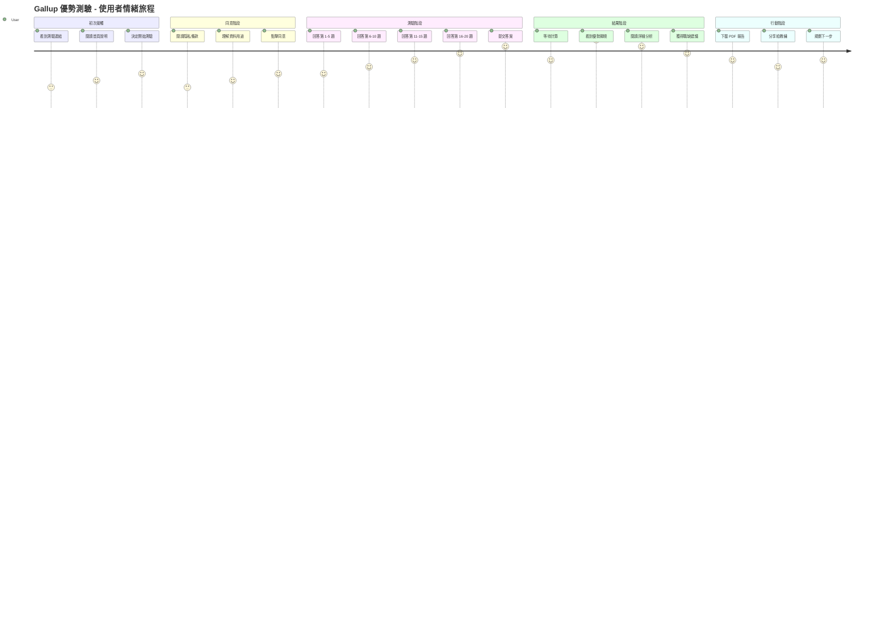

# Gallup 優勢測驗 - UI/UX 設計規範

---

**文件版本:** v1.0
**最後更新:** 2025-09-30
**主要作者:** UX/UI 設計師
**審核者:** 產品經理, 前端開發
**狀態:** 設計中 (In Design)

---

## 目錄

1. [設計哲學](#1-設計哲學)
2. [色彩心理學策略](#2-色彩心理學策略)
3. [行為心理學原則](#3-行為心理學原則)
4. [使用者旅程設計](#4-使用者旅程設計)
5. [頁面詳細設計](#5-頁面詳細設計)
6. [元件設計系統](#6-元件設計系統)
7. [互動設計規範](#7-互動設計規範)
8. [響應式設計](#8-響應式設計)

---

## 1. 設計哲學

### 1.1 核心理念

**「信任 → 參與 → 洞察 → 行動」**

```
信任建立        參與測驗        獲得洞察        採取行動
   ↓              ↓              ↓              ↓
專業可靠    →   輕鬆愉快   →   深入理解   →   具體建議
(Trust)        (Engage)      (Insight)      (Action)
```

### 1.2 設計原則

| 原則 | 說明 | 實踐 |
|:-----|:-----|:-----|
| **1. 心理安全** | 降低測驗焦慮，建立信任 | 溫和色調、清晰說明、隱私保證 |
| **2. 認知流暢** | 減少認知負荷，提升完成率 | 簡潔介面、進度可視、單一焦點 |
| **3. 情感共鳴** | 正向情緒體驗，增強記憶 | 鼓勵訊息、成就感、個人化內容 |
| **4. 行動導向** | 從洞察到行動，創造價值 | 明確 CTA、具體建議、可分享 |

---

## 2. 色彩心理學策略

### 2.1 主色調系統

#### 主色 (Primary) - 寧靜藍 #4A90E2

```
心理效應: 專業、信任、冷靜、思考
使用場景: 主要 CTA、品牌識別、導航元素
科學依據: 藍色降低心率，促進深度思考 (Küller et al., 2009)
```

**色彩變化:**
```
主色:     #4A90E2 (Medium Blue)
淺色:     #E8F4FF (Light Blue 10%)
深色:     #2E5C8A (Dark Blue)
懸停:     #357ABD (Hover State)
```

#### 輔助色 (Secondary) - 活力綠 #52C41A

```
心理效應: 成長、正向、完成、希望
使用場景: 成功狀態、完成進度、正向反饋
科學依據: 綠色與成就感、正向情緒相關 (Elliot & Maier, 2014)
```

#### 強調色 (Accent) - 溫暖橙 #FA8C16

```
心理效應: 活力、熱情、行動、創意
使用場景: 重要提示、行動按鈕、高亮訊息
科學依據: 橙色提升參與度與行動力 (Gorn et al., 2004)
```

### 2.2 語意色彩 (Semantic Colors)

| 類型 | 顏色 | Hex | 心理效應 | 使用場景 |
|:-----|:-----|:----|:---------|:---------|
| **成功** | 綠色 | #52C41A | 完成、正向、安心 | 測驗完成、儲存成功 |
| **警告** | 黃色 | #FAAD14 | 注意、謹慎、思考 | 重要提示、確認訊息 |
| **錯誤** | 紅色 | #F5222D | 錯誤、停止、重要 | 錯誤訊息、必填欄位 |
| **資訊** | 藍色 | #1890FF | 中性、說明、指引 | 提示訊息、說明文字 |

### 2.3 中性色階

```css
/* 文字層級 */
--text-primary:   #262626 (主要文字, Alpha 85%)
--text-secondary: #595959 (次要文字, Alpha 65%)
--text-disabled:  #BFBFBF (禁用文字, Alpha 25%)

/* 背景層級 */
--bg-primary:     #FFFFFF (主背景)
--bg-secondary:   #FAFAFA (次背景)
--bg-tertiary:    #F5F5F5 (三級背景)

/* 邊框 */
--border-light:   #E8E8E8
--border-base:    #D9D9D9
--border-dark:    #BFBFBF
```

---

## 3. 行為心理學原則

### 3.1 峰終定律 (Peak-End Rule)

**理論:** 人們對體驗的記憶由「最高峰」和「結束時」的感受決定 (Kahneman, 1999)

**應用:**
1. **Peak (高峰)** - 結果揭曉動畫
   - 優雅的載入動畫 (避免空白等待)
   - 優勢面向逐一揭示 (製造期待)
   - Top 3 優勢特效呈現 (成就感)

2. **End (結束)** - 報告下載與分享
   - 一鍵下載 PDF (降低摩擦)
   - 社交分享引導 (延續體驗)
   - 感謝訊息與下一步建議 (完整閉環)

### 3.2 心流理論 (Flow State)

**目標:** 維持「挑戰-技能」平衡，避免焦慮或無聊 (Csikszentmihalyi, 1990)

```
焦慮區 ←────────────→ 無聊區
    ↑      心流區      ↑
   難度     ↓     簡單度
        保持平衡
```

**策略:**
- ✅ **難度適中:** 20 題 × 5 選項 (不過多、不過少)
- ✅ **即時反饋:** 每題選擇後視覺確認
- ✅ **進度可視:** 進度條 + 題號 (X/20)
- ✅ **允許修改:** 返回上一題 (降低焦慮)

### 3.3 損失規避 (Loss Aversion)

**理論:** 損失的痛苦 > 獲得的快樂 (Kahneman & Tversky, 1979)

**避免觸發損失感:**
- ❌ 避免: "若不完成，您將失去分析機會"
- ✅ 改用: "完成測驗，解鎖您的優勢洞察"

- ❌ 避免: "測驗未完成將被刪除"
- ✅ 改用: "我們為您保留進度 24 小時"

### 3.4 社會認同 (Social Proof)

**理論:** 人們傾向跟隨他人行為 (Cialdini, 2006)

**應用:**
```
首頁展示:
"已有 12,450+ 人完成測驗"
"平均完成時間: 4 分 32 秒"
"95% 使用者認為結果準確"
```

### 3.5 Zeigarnik 效應

**理論:** 未完成的任務比已完成的更令人記憶深刻

**應用:**
- 進度條視覺化 (激發完成欲望)
- "您已完成 15/20 題，再堅持一下！"
- 離開提示: "您的進度將保留 24 小時"

---

## 4. 使用者旅程設計

### 4.1 完整旅程地圖



### 4.2 情緒曲線分析

| 階段 | 情緒值 | 關鍵體驗 | 設計策略 |
|:-----|:-------|:---------|:---------|
| 初次接觸 | 😐 3/10 | 好奇但猶豫 | 清晰價值主張、社會認同 |
| 隱私同意 | 😟 3/10 | 擔心資料安全 | 透明說明、信任標誌 |
| 測驗前期 | 🙂 6/10 | 輕鬆愉快 | 簡潔問題、流暢互動 |
| 測驗中期 | 😊 7/10 | 進入心流 | 鼓勵訊息、進度可視 |
| 測驗後期 | 🤩 8/10 | 期待結果 | 完成倒數、正向反饋 |
| **結果揭曉** | 😍 10/10 | **情緒高峰** | **動畫效果、成就感** |
| 閱讀分析 | 🤔 9/10 | 深度思考 | 清晰解釋、視覺化 |
| 下載報告 | 😊 7/10 | 滿足感 | 順暢下載、感謝訊息 |

---

## 5. 頁面詳細設計

### 5.1 首頁 (Landing Page)

#### 目標
- 建立信任 (Trust)
- 傳達價值 (Value)
- 引導開始 (CTA)

#### 佈局結構

```
┌─────────────────────────────────────────────┐
│  [Logo]                      [關於] [聯絡]  │ Header
├─────────────────────────────────────────────┤
│                                             │
│       發現你的優勢，開啟職涯新方向            │ Hero
│       ────────────────────────────          │
│     [開始測驗] (主 CTA - 寧靜藍)             │
│     僅需 5 分鐘 · 完全免費 · 立即獲得報告      │
│                                             │
│            [示意圖/插畫]                     │
├─────────────────────────────────────────────┤
│  ✓ 科學驗證     ✓ 隱私保護     ✓ 具體建議     │ Trust Bar
├─────────────────────────────────────────────┤
│  已有 12,450+ 人完成測驗                     │ Social Proof
│  ⭐⭐⭐⭐⭐ 4.8/5.0 平均評分                 │
├─────────────────────────────────────────────┤
│  測驗流程                                    │ Process
│  ① 同意條款 → ② 20 題測驗 → ③ 優勢分析       │
├─────────────────────────────────────────────┤
│  [開始免費測驗]                              │ Footer CTA
└─────────────────────────────────────────────┘
```

#### 視覺元素

**Hero Section:**
```css
background: linear-gradient(135deg,
  #E8F4FF 0%,    /* 淺藍 - 平靜 */
  #FFFFFF 100%   /* 白色 - 純淨 */
);
```

**主標題:**
```
字體: Noto Sans TC Medium
大小: 48px (Desktop) / 32px (Mobile)
顏色: #262626 (深灰 - 專業感)
行高: 1.3 (易讀性)
```

**主 CTA 按鈕:**
```css
background: #4A90E2 (寧靜藍)
padding: 16px 48px
border-radius: 8px
box-shadow: 0 4px 12px rgba(74, 144, 226, 0.3)
transition: all 0.3s ease

hover:
  background: #357ABD
  transform: translateY(-2px)
  box-shadow: 0 6px 20px rgba(74, 144, 226, 0.4)
```

**信任標誌:**
```
圖示: 盾牌、勾選、證書
顏色: #52C41A (綠色 - 安全感)
排列: Flex 水平均分
```

---

### 5.2 隱私同意頁 (Consent Page)

#### 心理學策略
- **透明度:** 清楚說明資料用途 (建立信任)
- **選擇感:** 明確的同意/不同意選項 (尊重自主)
- **可逆性:** 說明資料刪除權 (降低焦慮)

#### 佈局設計

```
┌─────────────────────────────────────────────┐
│  ← 返回                                      │
├─────────────────────────────────────────────┤
│                                             │
│  📋 隱私與資料使用說明                       │
│                                             │
│  ┌───────────────────────────────────────┐ │
│  │ 我們重視您的隱私                        │ │
│  │                                       │ │
│  │ ✓ 測驗資料僅用於生成個人報告            │ │
│  │ ✓ 不會分享給第三方                     │ │
│  │ ✓ 30 天後自動刪除                      │ │
│  │ ✓ 您可隨時要求刪除資料                 │ │
│  └───────────────────────────────────────┘ │
│                                             │
│  收集的資料:                                 │
│  • 問卷回答 (1-5 分選擇)                     │
│  • 瀏覽器類型 (用於相容性)                   │
│  • 完成時間 (用於改善體驗)                   │
│                                             │
│  不收集:                                     │
│  ✗ 姓名、Email、電話                         │
│  ✗ IP 位址                                  │
│  ✗ 任何可識別身份的資訊                       │
│                                             │
│  [✓] 我已閱讀並同意上述說明                  │
│                                             │
│  [同意並開始測驗]  [不同意]                  │
└─────────────────────────────────────────────┘
```

#### 互動細節

**Checkbox 動畫:**
```javascript
// 未選中 → 選中動畫
transform: scale(0.8) → scale(1.1) → scale(1.0)
duration: 300ms
easing: cubic-bezier(0.68, -0.55, 0.265, 1.55)
```

**按鈕狀態:**
```
未勾選: 同意按鈕 disabled (灰色 #BFBFBF)
已勾選: 啟用動畫 (藍色 #4A90E2 + 脈衝效果)
```

---

### 5.3 測驗頁面 (Assessment Page)

#### 目標
- 維持心流 (Flow)
- 降低認知負荷 (Cognitive Load)
- 提供即時反饋 (Feedback)

#### 佈局設計

```
┌─────────────────────────────────────────────┐
│  Gallup 優勢測驗                   [X] 離開  │ Header
├─────────────────────────────────────────────┤
│  ▓▓▓▓▓▓▓▓▓▓▓▓▓▓▓░░░░░ 15/20 (75%)         │ Progress
├─────────────────────────────────────────────┤
│                                             │
│  題目 15/20                                  │
│                                             │
│  我經常感到充滿活力                          │
│                                             │
│  ┌───────────────────────────────────────┐ │
│  │  ○ 非常不符合                          │ │
│  │  ○ 不符合                              │ │
│  │  ○ 普通                                │ │
│  │  ○ 符合                                │ │
│  │  ○ 非常符合                            │ │
│  └───────────────────────────────────────┘ │
│                                             │
│              [← 上一題]  [下一題 →]          │
│                                             │
│  💡 提示: 請依照第一直覺作答，無對錯之分       │
└─────────────────────────────────────────────┘
```

#### 進度條設計

**視覺設計:**
```css
/* 底層 (未完成) */
background: #F5F5F5
height: 8px
border-radius: 4px

/* 進度條 (已完成) */
background: linear-gradient(90deg,
  #4A90E2 0%,   /* 藍色起點 */
  #52C41A 100%  /* 綠色終點 - 象徵完成 */
)
box-shadow: 0 2px 4px rgba(74, 144, 226, 0.3)
transition: width 0.5s cubic-bezier(0.65, 0, 0.35, 1)
```

**里程碑動畫:**
```
25%:  "很好！已完成 1/4"  + 🎉 粒子效果
50%:  "太棒了！已過半！"  + ⭐ 星星閃爍
75%:  "快完成了！加油！"  + 🚀 火箭動畫
100%: "完成！正在分析中..." + ✨ 煙火效果
```

#### 選項設計

**單選按鈕 (Radio Button):**
```css
/* 未選中 */
border: 2px solid #D9D9D9
background: #FFFFFF
padding: 16px 24px
border-radius: 8px
transition: all 0.2s

/* Hover */
border-color: #4A90E2
background: #F0F7FF
cursor: pointer

/* 選中 */
border-color: #4A90E2
background: linear-gradient(135deg,
  #E8F4FF 0%,
  #FFFFFF 100%
)
box-shadow: 0 0 0 3px rgba(74, 144, 226, 0.1)
position: relative

/* 選中圖示 */
::after {
  content: "✓"
  position: absolute
  right: 16px
  color: #4A90E2
  font-size: 20px
}
```

**選項文字:**
```
字體: Noto Sans TC Regular
大小: 16px
顏色: #262626 (未選) / #4A90E2 (已選)
行高: 1.5
```

---

### 5.4 結果頁面 (Results Page)

#### 情緒高峰設計 (Peak Experience)

**載入動畫 (1-2 秒):**
```
階段 1: 旋轉的齒輪 + "正在分析您的回答..."
階段 2: 進度條 + "計算五大人格向度..."
階段 3: 光芒效果 + "生成優勢面向..."
階段 4: 淡入過渡 → 結果頁面
```

**結果揭曉動畫:**
```javascript
// 優勢面向逐一浮現
for (let i = 0; i < 12; i++) {
  setTimeout(() => {
    showStrength(i)
    playSound('reveal.mp3')  // 輕柔提示音
  }, i * 200)  // 每 200ms 一個
}

// Top 3 特效強化
topStrengths.forEach((strength, index) => {
  addSpotlight(strength)  // 聚光燈效果
  addBadge(index + 1)     // 金/銀/銅徽章
  scaleAnimation(1.1)     // 放大動畫
})
```

#### 佈局設計

```
┌─────────────────────────────────────────────┐
│  🎉 測驗完成！您的優勢分析已準備好              │ Header
├─────────────────────────────────────────────┤
│                                             │
│  您的 Top 3 優勢面向                         │
│                                             │
│  ┌─────────────────────────────────────┐   │
│  │ 🥇 探索與創新          92/100       │   │
│  │ ▓▓▓▓▓▓▓▓▓▓▓▓▓▓▓▓▓▓▓░               │   │
│  │ 您擁有強烈的好奇心和創新思維...       │   │
│  └─────────────────────────────────────┘   │
│                                             │
│  ┌─────────────────────────────────────┐   │
│  │ 🥈 分析與洞察          88/100       │   │
│  │ ▓▓▓▓▓▓▓▓▓▓▓▓▓▓▓▓▓▓░                │   │
│  │ 您善於深入分析問題本質...            │   │
│  └─────────────────────────────────────┘   │
│                                             │
│  ┌─────────────────────────────────────┐   │
│  │ 🥉 學習與成長          85/100       │   │
│  │ ▓▓▓▓▓▓▓▓▓▓▓▓▓▓▓▓▓░                 │   │
│  │ 您熱愛學習新知識和技能...            │   │
│  └─────────────────────────────────────┘   │
│                                             │
│  [查看完整 12 項分析]  [獲得職缺推薦]        │
│                                             │
│  [下載 PDF 報告] [分享結果]                  │
└─────────────────────────────────────────────┘
```

#### 視覺化元素

**徽章設計:**
```css
/* 金牌 (1st) */
background: linear-gradient(135deg, #FFD700, #FFA500)
box-shadow: 0 4px 20px rgba(255, 215, 0, 0.5)
animation: pulse 2s infinite

/* 銀牌 (2nd) */
background: linear-gradient(135deg, #C0C0C0, #808080)

/* 銅牌 (3rd) */
background: linear-gradient(135deg, #CD7F32, #8B4513)
```

**分數條設計:**
```css
/* 高分 (80-100) - 綠色 */
background: linear-gradient(90deg, #52C41A, #95DE64)

/* 中分 (60-79) - 藍色 */
background: linear-gradient(90deg, #4A90E2, #69B1FF)

/* 低分 (0-59) - 灰色 */
background: linear-gradient(90deg, #BFBFBF, #D9D9D9)
```

---

### 5.5 職缺推薦頁 (Recommendations Page)

#### 佈局設計

```
┌─────────────────────────────────────────────┐
│  根據您的優勢，推薦以下職缺方向                 │
├─────────────────────────────────────────────┤
│  ┌─────────────────────────────────────┐   │
│  │ 💼 產品經理 (Product Manager)       │   │
│  │                                     │   │
│  │ 匹配度: ⭐⭐⭐⭐⭐ 95%              │   │
│  │                                     │   │
│  │ 為什麼適合您:                        │   │
│  │ ✓ 探索與創新 (92) - 需要創新思維     │   │
│  │ ✓ 分析與洞察 (88) - 需要數據分析     │   │
│  │ ✓ 影響與倡議 (82) - 需要跨團隊溝通   │   │
│  │                                     │   │
│  │ 發展建議:                            │   │
│  │ • 加強使用者研究技能                 │   │
│  │ • 學習敏捷開發方法論                 │   │
│  │ • 參與產品社群交流                   │   │
│  │                                     │   │
│  │ [了解更多]                          │   │
│  └─────────────────────────────────────┘   │
│                                             │
│  [更多推薦職缺 ▼]                            │
└─────────────────────────────────────────────┘
```

#### 匹配度視覺化

**星級顯示:**
```css
/* 90-100%: 5 星 (金色) */
color: #FFD700
animation: twinkle 1.5s ease-in-out infinite

/* 80-89%: 4 星 (亮黃) */
color: #FAAD14

/* 70-79%: 3 星 (橙色) */
color: #FA8C16
```

---

## 6. 元件設計系統

### 6.1 按鈕系統 (Buttons)

#### 主按鈕 (Primary Button)

```css
.btn-primary {
  background: #4A90E2;
  color: #FFFFFF;
  padding: 12px 32px;
  border-radius: 8px;
  font-size: 16px;
  font-weight: 500;
  border: none;
  cursor: pointer;
  transition: all 0.3s ease;

  &:hover {
    background: #357ABD;
    transform: translateY(-2px);
    box-shadow: 0 6px 20px rgba(74, 144, 226, 0.4);
  }

  &:active {
    transform: translateY(0);
    box-shadow: 0 2px 8px rgba(74, 144, 226, 0.3);
  }

  &:disabled {
    background: #BFBFBF;
    cursor: not-allowed;
    transform: none;
    box-shadow: none;
  }
}
```

#### 次要按鈕 (Secondary Button)

```css
.btn-secondary {
  background: transparent;
  color: #4A90E2;
  border: 2px solid #4A90E2;
  padding: 10px 30px;
  border-radius: 8px;

  &:hover {
    background: #E8F4FF;
  }
}
```

### 6.2 卡片系統 (Cards)

```css
.card {
  background: #FFFFFF;
  border-radius: 12px;
  padding: 24px;
  box-shadow: 0 2px 8px rgba(0, 0, 0, 0.08);
  transition: all 0.3s ease;

  &:hover {
    box-shadow: 0 8px 24px rgba(0, 0, 0, 0.12);
    transform: translateY(-4px);
  }
}

.card-highlight {
  border: 2px solid #4A90E2;
  box-shadow: 0 4px 16px rgba(74, 144, 226, 0.2);
}
```

### 6.3 輸入框系統 (Inputs)

```css
.input-field {
  border: 1px solid #D9D9D9;
  border-radius: 4px;
  padding: 8px 12px;
  font-size: 14px;
  transition: all 0.2s;

  &:focus {
    border-color: #4A90E2;
    box-shadow: 0 0 0 2px rgba(74, 144, 226, 0.1);
    outline: none;
  }

  &.error {
    border-color: #F5222D;
    box-shadow: 0 0 0 2px rgba(245, 34, 45, 0.1);
  }
}
```

---

## 7. 互動設計規範

### 7.1 微互動 (Micro-interactions)

#### 按鈕點擊波紋效果

```javascript
function createRipple(event) {
  const button = event.currentTarget;
  const ripple = document.createElement('span');
  const rect = button.getBoundingClientRect();

  const size = Math.max(rect.width, rect.height);
  const x = event.clientX - rect.left - size / 2;
  const y = event.clientY - rect.top - size / 2;

  ripple.style.width = ripple.style.height = size + 'px';
  ripple.style.left = x + 'px';
  ripple.style.top = y + 'px';
  ripple.classList.add('ripple');

  button.appendChild(ripple);

  setTimeout(() => ripple.remove(), 600);
}
```

```css
.ripple {
  position: absolute;
  border-radius: 50%;
  background: rgba(255, 255, 255, 0.6);
  transform: scale(0);
  animation: ripple-animation 0.6s ease-out;
}

@keyframes ripple-animation {
  to {
    transform: scale(4);
    opacity: 0;
  }
}
```

### 7.2 過渡動畫 (Transitions)

#### 頁面切換

```css
.page-enter {
  opacity: 0;
  transform: translateX(30px);
}

.page-enter-active {
  opacity: 1;
  transform: translateX(0);
  transition: all 0.4s cubic-bezier(0.25, 0.46, 0.45, 0.94);
}

.page-exit {
  opacity: 1;
  transform: translateX(0);
}

.page-exit-active {
  opacity: 0;
  transform: translateX(-30px);
  transition: all 0.3s ease-in;
}
```

### 7.3 載入狀態

#### 骨架屏 (Skeleton Screen)

```css
.skeleton {
  background: linear-gradient(
    90deg,
    #F5F5F5 25%,
    #E8E8E8 50%,
    #F5F5F5 75%
  );
  background-size: 200% 100%;
  animation: skeleton-loading 1.5s ease-in-out infinite;
  border-radius: 4px;
}

@keyframes skeleton-loading {
  0% { background-position: 200% 0; }
  100% { background-position: -200% 0; }
}
```

---

## 8. 響應式設計

### 8.1 斷點系統 (Breakpoints)

```css
/* Mobile First Approach */
:root {
  --breakpoint-xs: 320px;   /* 小型手機 */
  --breakpoint-sm: 576px;   /* 手機 */
  --breakpoint-md: 768px;   /* 平板 */
  --breakpoint-lg: 1024px;  /* 桌面 */
  --breakpoint-xl: 1440px;  /* 大桌面 */
}
```

### 8.2 響應式佈局

#### 測驗頁面

```css
/* Mobile (< 768px) */
.assessment-container {
  padding: 16px;
}

.question-text {
  font-size: 18px;
  line-height: 1.5;
}

.option-button {
  padding: 12px;
  font-size: 14px;
  margin-bottom: 8px;
}

/* Tablet (768px - 1024px) */
@media (min-width: 768px) {
  .assessment-container {
    max-width: 600px;
    margin: 0 auto;
    padding: 24px;
  }

  .question-text {
    font-size: 20px;
  }

  .option-button {
    padding: 16px 24px;
    font-size: 16px;
  }
}

/* Desktop (> 1024px) */
@media (min-width: 1024px) {
  .assessment-container {
    max-width: 800px;
    padding: 32px;
  }

  .option-button {
    padding: 16px 32px;
  }
}
```

---

## 9. 無障礙設計 (Accessibility)

### 9.1 WCAG 2.1 AA 合規

#### 色彩對比

```
文字對比度:
- 正常文字 (16px):   4.5:1 最小對比
- 大型文字 (18px+):  3:1 最小對比

✅ #262626 on #FFFFFF: 15.8:1 (Pass)
✅ #4A90E2 on #FFFFFF: 3.5:1 (Pass for large text)
✅ #FFFFFF on #4A90E2: 4.8:1 (Pass)
```

#### 鍵盤導航

```javascript
// 確保所有互動元素可用 Tab 鍵操作
document.querySelectorAll('button, a, input').forEach(el => {
  el.setAttribute('tabindex', '0');
});

// 焦點可見
.focusable:focus {
  outline: 2px solid #4A90E2;
  outline-offset: 2px;
}
```

#### ARIA 標籤

```html
<!-- 進度條 -->
<div
  role="progressbar"
  aria-valuenow="15"
  aria-valuemin="0"
  aria-valuemax="20"
  aria-label="測驗進度: 15 題，共 20 題"
>

<!-- 按鈕 -->
<button
  aria-label="提交測驗答案"
  aria-describedby="submit-hint"
>
  提交
</button>
<span id="submit-hint" class="sr-only">
  提交後將無法修改答案
</span>
```

---

## 10. 設計交付物

### 10.1 需交付檔案

- [ ] Figma 設計檔 (包含所有頁面與元件)
- [ ] 互動原型 (Prototype with animations)
- [ ] 設計規範文件 (本文件)
- [ ] 圖示資源庫 (SVG format)
- [ ] 色彩變數檔 (CSS Variables)
- [ ] 字型檔案 (Noto Sans TC)

### 10.2 開發者切版規範

```
資料夾結構:
src/
├── styles/
│   ├── variables.css     (色彩、字型變數)
│   ├── components.css    (元件樣式)
│   ├── animations.css    (動畫效果)
│   └── responsive.css    (響應式規則)
├── components/
│   ├── Button/
│   ├── Card/
│   ├── ProgressBar/
│   └── RadioGroup/
└── pages/
    ├── Landing/
    ├── Consent/
    ├── Assessment/
    └── Results/
```

---

**版本歷史:**
- v1.0 (2025-09-30): 初版發布，完整 UI/UX 規範

**相關文檔:**
- [產品需求 (PRD)](prd.md)
- [系統架構](architecture.md)
- [API 設計規範](api_design.md)

**設計工具:**
- Figma: [設計檔連結]
- Prototype: [互動原型連結]