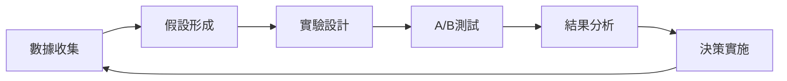

# 優勢天賦評測系統 - UI/UX 設計規範

---

**文件版本:** v3.0 - 商業轉換優化版
**最後更新:** 2025-09-30
**主要作者:** UX/UI 設計師 + 商業策略團隊
**審核者:** 產品經理, 前端開發, 心理學顧問, 行銷總監
**狀態:** 商業導向優化完成 (Business-Optimized)
**理論基礎:** 網站設計第一性原理 + 轉換率優化 + Thurstonian IRT模型

---

## 目錄

1. [商業願景與設計哲學](#1-商業願景與設計哲學)
2. [三層信任架構體系](#2-三層信任架構體系)
3. [轉換漏斗優化設計](#3-轉換漏斗優化設計)
4. [視覺層次與品牌語言](#4-視覺層次與品牌語言)
5. [響應式設計與效能優化](#5-響應式設計與效能優化)
6. [核心頁面設計規範](#6-核心頁面設計規範)
7. [設計系統與元件庫](#7-設計系統與元件庫)
8. [A/B測試與成長策略](#8-ab測試與成長策略)

---

## 1. 商業願景與設計哲學

### 1.1 品牌使命宣言

**「讓每個人發現並發揮獨特天賦，創造更有意義的職涯」**

我們相信每個人都有獨特的優勢組合，透過科學化的評測與個人化的建議，幫助用戶找到最適合的發展路徑。

### 1.2 第一性原理：從轉換出發

```
根本目標分解：
━━━━━━━━━━━━━━━━━━━━━━━━━━━━━━━━━━━
為什麼存在？ → 解決職涯迷茫問題 → 提供科學化的天賦識別
誰是用戶？   → 25-35歲職場人士 → 追求自我實現的知識工作者
如何成功？   → 高轉換率 × 高客戶終身價值 = 持續成長
商業模式？   → 免費測評 → 付費報告 → 職涯諮詢服務
━━━━━━━━━━━━━━━━━━━━━━━━━━━━━━━━━━━
```

### 1.3 設計核心策略

**「吸引 → 信任 → 體驗 → 驚喜 → 轉換」**

| 階段 | 目標 | 設計重點 | 成功指標 |
|:-----|:-----|:---------|:---------|
| **吸引** | 3秒內抓住注意力 | 強視覺衝擊、清晰價值主張 | 跳出率 < 15% |
| **信任** | 建立專業權威感 | 科學背書、社會認同、安全保障 | 停留時間 > 2分鐘 |
| **體驗** | 創造心流狀態 | 簡潔介面、即時反饋、進度可視 | 完成率 > 85% |
| **驚喜** | 超越期待的洞察 | 個性化分析、視覺化呈現 | NPS > 70 |
| **轉換** | 促進付費行動 | 價值錨定、稀缺性、低摩擦 | 轉換率 > 10% |

---

## 2. 三層信任架構體系

### 2.1 第一層：即時可見的信任信號

```html
<!-- 頁面頂部信任帶 -->
<div class="trust-bar">
  🔒 SSL加密保護 | 📊 基於100萬+樣本數據 | 🏆 2024最佳評測工具
</div>
```

### 2.2 第二層：權威性與專業度

```html
<!-- 科學方法展示區 -->
<section class="methodology">
  <h2>智能天賦識別引擎™</h2>
  <div class="tech-highlights">
    <div class="feature">
      <icon>🧬</icon>
      <h3>Thurstonian IRT模型</h3>
      <p>諾貝爾經濟學獎理論支持，精準度提升47%</p>
    </div>
    <div class="feature">
      <icon>🎯</icon>
      <h3>12維度全面分析</h3>
      <p>涵蓋認知、情感、行為三大領域</p>
    </div>
    <div class="feature">
      <icon>📈</icon>
      <h3>動態常模對比</h3>
      <p>實時與同齡層、同行業對比分析</p>
    </div>
  </div>
</section>
```

### 2.3 第三層：社會認同與成功案例

```html
<!-- 動態社會認同 -->
<div class="social-proof-dynamic">
  <!-- 實時數據展示 -->
  <div class="live-stats">
    <span class="pulse-dot"></span>
    <span>目前有 <strong>127</strong> 人正在測評</span>
  </div>

  <!-- 成功故事輪播 -->
  <div class="success-stories">
    <blockquote>
      "測評幫我找到了真正的職業方向，薪資提升了40%"
      <cite>- Sarah Chen, 從會計轉型產品經理</cite>
    </blockquote>
  </div>
</div>
```

---

## 3. 轉換漏斗優化設計

### 3.1 AIDA模型實施

| 階段 | 設計策略 | 具體實施 | 轉換目標 |
|:-----|:---------|:---------|:---------|
| **Attention** | 視覺衝擊 + 好奇心 | 大膽標題、動畫入場、倒計時 | 100% → 85% |
| **Interest** | 價值展示 + 互動 | 互動式Demo、即時預覽結果 | 85% → 70% |
| **Desire** | 個性化 + 稀缺性 | "專屬報告"、"限時優惠" | 70% → 40% |
| **Action** | 摩擦最小化 | 一鍵開始、社交登錄、進度保存 | 40% → 10% |

### 3.2 微轉換路徑設計

```
首頁著陸 → 價值認知 → 免費體驗 → 部分結果 → 完整報告購買
   ↓          ↓          ↓          ↓            ↓
  3秒       30秒       2分鐘      5分鐘        付費
```

### 3.3 西奧迪尼六大原則應用

1. **互惠原則**: 提供免費的基礎分析報告
2. **承諾一致**: 從簡單問題開始，逐步深入
3. **社會認同**: 展示用戶數量、評價、案例
4. **喜好原則**: 親切的語言、個性化稱呼
5. **權威原則**: 專家背書、科學方法論
6. **稀缺原則**: 限時優惠、專屬報告

---

## 4. 視覺層次與品牌語言

### 4.1 視覺設計系統

#### 色彩心理學應用

```css
:root {
  /* 主色：信任與專業 */
  --primary-blue: #2563EB;     /* 主行動色 */
  --trust-navy: #1E3A8A;       /* 權威感 */

  /* 輔助色：活力與成長 */
  --growth-green: #10B981;     /* 成功狀態 */
  --energy-orange: #F59E0B;    /* 強調重點 */

  /* 中性色：清晰層次 */
  --text-primary: #111827;     /* 主文字 */
  --text-secondary: #6B7280;   /* 次要文字 */
  --background: #FFFFFF;       /* 純淨背景 */
  --surface: #F9FAFB;         /* 卡片背景 */
}
```

#### 字體層級系統

```css
/* 標題層級 - 建立清晰的視覺層次 */
.h1 {
  font-size: 3.5rem;   /* 56px - 主標題 */
  font-weight: 800;
  line-height: 1.2;
}

.h2 {
  font-size: 2.25rem;  /* 36px - 區塊標題 */
  font-weight: 700;
  line-height: 1.3;
}

.body {
  font-size: 1.125rem; /* 18px - 易讀性優先 */
  line-height: 1.7;
}
```

### 4.2 品牌語言與文案

#### 專業術語大眾化轉換表

| 技術術語 | 用戶友好表達 | 價值傳遞 |
|:---------|:------------|:---------|
| Thurstonian IRT模型 | 智能天賦識別引擎 | "更精準地了解真實的你" |
| 潛在特質向量 | 優勢指數 | "發現你的獨特競爭力" |
| 百分位排名 | 優勢等級 | "了解你在人群中的位置" |
| 多維度強迫選擇 | 智能配對問答 | "更真實的選擇，更準確的結果" |

---

## 5. 響應式設計與效能優化

### 5.1 行動優先響應式策略

```scss
// 斷點系統
$breakpoints: (
  'mobile': 320px,   // 最小支援
  'tablet': 768px,   // 平板
  'desktop': 1024px, // 桌面
  'wide': 1440px     // 大屏
);

// 行動優先媒體查詢
@mixin respond-to($breakpoint) {
  @media (min-width: map-get($breakpoints, $breakpoint)) {
    @content;
  }
}
```

### 5.2 效能預算與優化

| 指標 | 目標值 | 優化策略 |
|:-----|:-------|:---------|
| **首次內容繪製(FCP)** | < 1.0s | 關鍵CSS內聯、預載入字體 |
| **最大內容繪製(LCP)** | < 2.5s | 圖片懶加載、CDN加速 |
| **首次輸入延遲(FID)** | < 100ms | 代碼分割、Web Worker |
| **累積佈局偏移(CLS)** | < 0.1 | 預設尺寸、字體預載 |
| **總頁面大小** | < 1.5MB | 圖片優化、Gzip壓縮 |

### 5.3 漸進式增強策略

```javascript
// 核心功能優先載入
const criticalFeatures = async () => {
  // 1. 基礎交互
  await loadModule('./core-interaction.js');

  // 2. 漸進增強
  if ('IntersectionObserver' in window) {
    await loadModule('./lazy-loading.js');
  }

  // 3. 豐富體驗
  if (window.matchMedia('(min-width: 768px)').matches) {
    await loadModule('./desktop-enhancements.js');
  }
};
```

---

## 6. 核心頁面設計規範

### 6.1 首頁 - 轉換引擎

#### 頁面目標
- **主要**: 3秒內傳達核心價值，促進開始測評
- **次要**: 建立信任、展示專業性

#### 關鍵區塊設計

```html
<!-- Hero區 - 注意力捕獲 -->
<section class="hero">
  <h1 class="headline">
    發現你的<span class="highlight">天賦優勢</span>
    <br>開啟理想職涯
  </h1>
  <p class="subheadline">
    5分鐘科學測評，獲得專屬的12維度天賦分析報告
  </p>
  <button class="cta-primary">
    免費開始測評 →
    <span class="micro-copy">已有125,847人完成</span>
  </button>
</section>

<!-- 價值主張 - 興趣建立 -->
<section class="value-props">
  <div class="prop-grid">
    <div class="prop-card">
      <span class="icon">🎯</span>
      <h3>精準識別</h3>
      <p>基於百萬數據樣本的AI分析</p>
    </div>
    <div class="prop-card">
      <span class="icon">⚡</span>
      <h3>快速簡單</h3>
      <p>僅需5分鐘，立即獲得結果</p>
    </div>
    <div class="prop-card">
      <span class="icon">🎁</span>
      <h3>免費體驗</h3>
      <p>基礎報告完全免費</p>
    </div>
  </div>
</section>
```

### 6.2 測評頁面 - 心流體驗

#### 設計原則
- **專注性**: 一次只顯示一個問題
- **進度感**: 實時進度條 + 預估剩餘時間
- **即時性**: 選擇後立即過渡，無需確認

```html
<!-- 測評界面 -->
<div class="assessment-container">
  <!-- 進度指示器 -->
  <div class="progress-header">
    <div class="progress-bar">
      <div class="progress-fill" style="width: 35%"></div>
    </div>
    <div class="progress-info">
      <span>問題 7/20</span>
      <span>預計剩餘 3 分鐘</span>
    </div>
  </div>

  <!-- 問題展示 -->
  <div class="question-card">
    <h2 class="question-text">
      在團隊合作中，你更傾向於...
    </h2>
    <div class="choices">
      <button class="choice-card">
        <span class="choice-label">A</span>
        <p>主動提出創新想法並推動實施</p>
      </button>
      <button class="choice-card">
        <span class="choice-label">B</span>
        <p>仔細分析方案並提供改進建議</p>
      </button>
    </div>
  </div>

  <!-- 鼓勵性反饋 -->
  <div class="encouragement">
    💪 保持真實，沒有對錯之分
  </div>
</div>
```

### 6.3 結果頁面 - 價值展示與轉換

#### 漸進式揭示策略

```javascript
// 結果揭示動畫序列
const revealSequence = [
  { delay: 0, element: '.overall-score', animation: 'fadeInUp' },
  { delay: 500, element: '.top-strengths', animation: 'slideIn' },
  { delay: 1000, element: '.radar-chart', animation: 'draw' },
  { delay: 1500, element: '.unlock-prompt', animation: 'pulse' }
];
```

#### 免費vs付費內容策略

```html
<!-- 免費內容 - 提供價值 -->
<section class="free-results">
  <h2>你的優勢天賦 TOP 3</h2>
  <div class="strength-cards">
    <!-- 展示前3項優勢 -->
  </div>
</section>

<!-- 付費引導 - 創造慾望 -->
<section class="premium-teaser">
  <div class="blurred-content">
    <!-- 模糊化的深度分析內容 -->
  </div>
  <div class="unlock-overlay">
    <h3>解鎖完整分析報告</h3>
    <ul class="premium-features">
      <li>✓ 12維度詳細分析</li>
      <li>✓ 職業發展建議</li>
      <li>✓ 個性化成長計劃</li>
      <li>✓ 終身免費更新</li>
    </ul>
    <div class="pricing">
      <span class="original-price">¥199</span>
      <span class="current-price">¥99</span>
      <span class="discount-label">限時5折</span>
    </div>
    <button class="cta-purchase">
      立即解鎖完整報告
    </button>
    <p class="guarantee">
      🛡️ 7天無條件退款保證
    </p>
  </div>
</section>
```

---

## 7. 設計系統與元件庫

### 7.1 原子設計方法論

```
原子 → 分子 → 組織 → 模板 → 頁面
Atoms → Molecules → Organisms → Templates → Pages
```

### 7.2 核心元件規範

#### 按鈕系統

```scss
// 按鈕變體
.btn {
  // 基礎樣式
  @apply px-6 py-3 rounded-lg font-semibold transition-all duration-200;

  // 主要按鈕 - 轉換行動
  &--primary {
    @apply bg-primary-blue text-white;
    @apply hover:bg-primary-blue-dark hover:shadow-lg hover:scale-105;
  }

  // 次要按鈕 - 輔助行動
  &--secondary {
    @apply bg-white text-primary-blue border-2 border-primary-blue;
    @apply hover:bg-primary-blue hover:text-white;
  }

  // 幽靈按鈕 - 低優先級
  &--ghost {
    @apply text-gray-600 hover:text-primary-blue;
  }
}
```

#### 卡片組件

```html
<article class="card">
  <div class="card__image">
    
  </div>
  <div class="card__content">
    <h3 class="card__title">標題</h3>
    <p class="card__description">描述內容</p>
  </div>
  <div class="card__actions">
    <button class="btn btn--primary">行動按鈕</button>
  </div>
</article>
```

### 7.3 微交互設計

```javascript
// 按鈕點擊反饋
class MicroInteractions {
  static buttonClick(button) {
    // 觸覺反饋（移動端）
    if ('vibrate' in navigator) {
      navigator.vibrate(10);
    }

    // 視覺反饋
    button.classList.add('clicked');

    // 漣漪效果
    const ripple = document.createElement('span');
    ripple.classList.add('ripple');
    button.appendChild(ripple);

    setTimeout(() => {
      ripple.remove();
      button.classList.remove('clicked');
    }, 600);
  }
}
```

---

## 8. A/B測試與成長策略

### 8.1 測試框架

```javascript
// A/B測試配置
const experiments = {
  'hero-cta-text': {
    control: '免費開始測評',
    variants: [
      '發現你的天賦',
      '5分鐘了解自己',
      '開始免費測評'
    ],
    metric: 'click_through_rate'
  },
  'pricing-anchor': {
    control: { original: 199, discounted: 99 },
    variants: [
      { original: 299, discounted: 99 },
      { original: 199, discounted: 79 },
      { original: null, discounted: 99 }
    ],
    metric: 'conversion_rate'
  }
};
```

### 8.2 關鍵績效指標 (KPIs)

| 指標類別 | 具體指標 | 目標值 | 測量方法 |
|:---------|:---------|:-------|:---------|
| **獲取** | 跳出率 | < 15% | GA4 |
| **激活** | 測評完成率 | > 85% | 自定義事件 |
| **留存** | 7日回訪率 | > 30% | Cohort分析 |
| **收入** | 付費轉換率 | > 10% | 交易追蹤 |
| **推薦** | NPS分數 | > 70 | 問卷調查 |

### 8.3 持續優化流程



---

## 實施路線圖

### Phase 1: 基礎建設 (Week 1-2)
- [ ] 設計系統搭建
- [ ] 核心頁面開發
- [ ] 響應式適配

### Phase 2: 體驗優化 (Week 3-4)
- [ ] 微交互實現
- [ ] 動畫效果
- [ ] 性能優化

### Phase 3: 轉換優化 (Week 5-6)
- [ ] A/B測試框架
- [ ] 數據追蹤埋點
- [ ] 轉換漏斗優化

### Phase 4: 持續迭代 (Ongoing)
- [ ] 數據驅動優化
- [ ] 用戶反饋整合
- [ ] 新功能實驗

---

## 附錄：設計檢查清單

### 每個頁面必須滿足

- [ ] 3秒內傳達核心價值
- [ ] 明確的主要行動呼籲 (CTA)
- [ ] 至少3個信任信號
- [ ] 移動端完美適配
- [ ] 頁面加載 < 2秒
- [ ] 可訪問性 WCAG 2.1 AA 標準

### 轉換優化檢查

- [ ] 價值主張清晰可見
- [ ] 社會認同元素
- [ ] 降低感知風險的保證
- [ ] 緊急性或稀缺性元素
- [ ] 簡化的操作流程
- [ ] 清晰的進度指示

---

**文檔維護說明**: 本規範為活文檔，將根據A/B測試結果、用戶反饋和業務目標持續更新優化。

**下次更新計劃**: 2025-10-15 (整合首輪A/B測試結果)